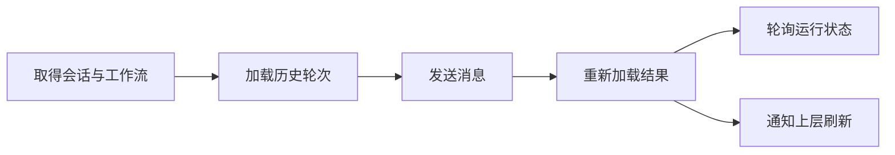

# 日常助理：交办、追踪与记忆引用入口

该页面把日常交办、事项回顾和记忆查找集中到持续会话中，通过轮询展示处理进度，支持失败重试，并允许从回答使用的证据跳回原始材料。

来源：gpt-5.6-sol 分析，gpt-5.6-sol 独立复核；模型解释仍可被原始证据纠正。

## 解决什么问题

日常助理面向“交办一件事、回顾待办、从记忆中找信息”这类连续场景。页面不是一次性问答框：它先取得固定 Web 会话及可用工作流说明，再展示该会话中保留下来的历史消息，使等待、失败和后续重试都能在同一入口继续。参考 [会话与使用入口 ↗](../../../apps/web/src/DailyAssistant.vue#L38 "支持页面面向交办、回顾和记忆查找，并在挂载时取得固定会话与工作流的说明。")

界面用状态徽标区分已处理、处理中、等待重试、失败和停止；回答引用的材料则显示为可点击来源，点击后通过 `open` 事件交给上层打开对应片段。参考 [状态与证据入口 ↗](../../../apps/web/src/DailyAssistant.vue#L61 "支持轮次状态映射、失败提示以及点击证据后向上层发送打开事件的说明。")

## 从发送到结果刷新的流程

页面挂载时并行创建或取得 `web-daily` 会话、加载工作流模板，随后读取历史轮次，并每两秒刷新一次。发送前会拒绝空文本、尚未取得会话或已有任务运行的情况；提交成功后清空输入、重新加载轮次并通知父组件刷新。参考 [发送前置条件 ↗](../../../apps/web/src/DailyAssistant.vue#L19 "支持繁忙、空输入和缺少会话时拒绝发送，以及成功后刷新数据的流程说明。")

参考 [初始化与轮询流程 ↗](../../../apps/web/src/DailyAssistant.vue#L38 "支持会话和模板并行加载、首次重载及每两秒轮询的流程图。")

同一段文本在失败后再次发送时会沿用尚未清除的随机请求标识，体现出前端对重复提交的防护意图；但服务端是否据此保证幂等，当前材料无法确认。参考 [请求标识复用 ↗](../../../apps/web/src/DailyAssistant.vue#L23 "支持相同待处理文本复用 requestId、成功后才清除该标识的描述。")

## 失败恢复与实现边界

当轮次处于 `pending` 或 `failed` 时，页面保留原消息并提供“重试这条消息”；全局繁忙期间发送与重试都会被禁止，因此界面一次只推动一个操作。普通发送失败后会尝试静默重载，以便呈现服务端可能已经保存的状态；重试失败则只显示错误。参考 [失败重试机制 ↗](../../../apps/web/src/DailyAssistant.vue#L31 "支持重试的繁忙保护、错误处理，以及仅为未完成轮次展示重试按钮的说明。")

组件卸载时会设置销毁标记并清除定时器，异步请求返回后也会避免写入已卸载页面。不过轮询请求本身没有取消，定时触发也未显式防止请求重叠；其实际影响取决于 API 延迟和服务端处理方式。参考 [卸载清理保护 ↗](../../../apps/web/src/DailyAssistant.vue#L12 "支持销毁标记、异步返回保护和定时器清理，同时界定请求未被显式取消的限制。")

当前材料没有测试文件，因此无法确认键盘操作、轮询重叠、请求幂等及父组件打开证据后的焦点恢复是否已被自动化断言覆盖。
