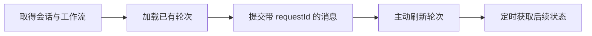

# 日常助理的对话提交与持续跟进

该页面为日常交办、事项回顾和记忆查询提供固定会话界面：初始化会话与使用说明，持续刷新处理状态，并支持失败重试和证据回看。

来源：gpt-5.6-sol 分析，gpt-5.6-sol 独立复核；模型解释仍可被原始证据纠正。

## 日常事项的统一入口

页面面向交办跟进、回顾待办和查找记忆等日常场景。用户在同一界面输入消息，查看助理给出的结果与处理状态；可展开的工作流说明用于提示适合的输入和预期输出。发送按钮会在会话尚未建立、输入为空或当前正忙时禁用。参考 [日常助理使用入口 ↗](../../../apps/web/src/DailyAssistant.vue#L48 "支持页面的使用场景、工作流提示、输入表单和发送按钮禁用条件。")

组件复用公共面板、按钮、徽章和引用控件，并通过统一的 `api` 封装访问助理接口。它承担前端交互与状态展示，不足以单独说明后端如何执行任务、保存轮次或选择证据。参考 [页面依赖与交互状态 ↗](../../../apps/web/src/DailyAssistant.vue#L2 "支持组件复用公共 UI、通过 API 访问能力并维护会话、轮次和忙碌状态。")

## 会话初始化、提交与刷新

组件挂载时并行取得固定标识为 `web-daily` 的会话和工作流说明，随后加载已有轮次，并每两秒刷新一次。卸载时会设置销毁标记并停止定时器；初始化请求返回后会检查该标记，轮次加载也只在组件未销毁时写入结果。参考 [轮次加载与销毁保护 ↗](../../../apps/web/src/DailyAssistant.vue#L14 "支持轮次加载仅在组件未销毁时写回状态的结论。") [会话初始化与轮询生命周期 ↗](../../../apps/web/src/DailyAssistant.vue#L38 "支持固定会话和工作流并行初始化、定时刷新、初始化防写回及卸载时停止轮询。")

参考 [轮次加载与销毁保护 ↗](../../../apps/web/src/DailyAssistant.vue#L14 "支持轮次加载仅在组件未销毁时写回状态的结论。") [消息提交与请求标识 ↗](../../../apps/web/src/DailyAssistant.vue#L19 "支持发送门槛、相同失败文本复用 requestId，以及成功后清理草稿和刷新轮次。")

发送前会拒绝空文本、未取得会话或忙碌状态。失败后再次发送相同文本时，客户端沿用尚未清除的 `requestId`；只有提交成功才清空草稿，并重新加载轮次、通知父组件刷新。该代码证明客户端保留了重复请求标识，但不能据此确认服务端一定执行幂等去重。参考 [消息提交与请求标识 ↗](../../../apps/web/src/DailyAssistant.vue#L19 "支持发送门槛、相同失败文本复用 requestId，以及成功后清理草稿和刷新轮次。")

## 失败恢复与证据回看

页面把轮次状态显示为“已处理”“处理中”“等待重试”“处理失败”和“已停止”等可读文案。仅 `pending` 或 `failed` 轮次会提示消息已保留并提供人工重试按钮；重试成功后重新加载轮次并通知外层刷新，失败则展示错误。参考 [轮次状态与证据入口 ↗](../../../apps/web/src/DailyAssistant.vue#L62 "支持状态文案、失败轮次提示与重试入口，以及将证据片段交给父组件打开。") [失败轮次重试 ↗](../../../apps/web/src/DailyAssistant.vue#L31 "支持重试接口调用、成功后的轮次刷新和外层通知，以及失败错误展示。")

每个轮次还可以展示后端返回的证据条目。点击引用时，组件把对应片段标识交给父组件打开；证据如何检索、筛选和校验并不在该页面中实现。参考 [轮次状态与证据入口 ↗](../../../apps/web/src/DailyAssistant.vue#L62 "支持状态文案、失败轮次提示与重试入口，以及将证据片段交给父组件打开。")
