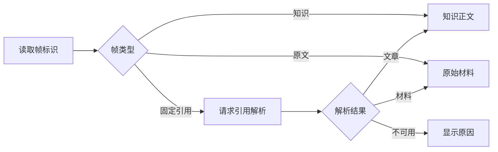

# 知识、原文与固定引用的统一阅读帧

阅读帧根据当前类型展示知识文章、原始材料或固定引用，把继续导航交还上层，并处理固定引用解析、失效目标提示与帧切换时的异步请求隔离。

来源：gpt-5.6-sol 分析，gpt-5.6-sol 独立复核；模型解释仍可被原始证据纠正。

## 在知识与证据之间连续阅读

`KnowledgeFrame` 是阅读界面的内容分发器：它接收当前帧，装配知识正文或原文视图，并把子视图产生的导航和标题更新交还上层，因此自身不维护完整阅读栈。参考 [阅读帧输入与事件 ↗](../../../apps/web/src/knowledge/KnowledgeFrame.vue#L4 "支持阅读帧装配知识和原文子视图，并把导航与加载结果交给上层的说明。")

知识正文中的可操作引用会生成固定引用帧。原文页可通过按钮直接打开已有知识解读；Markdown 内部路径会解析成材料键，代码查看器的关联引用则直接传入材料键，二者随后都先尝试打开知识文章，失败时回退到原文帧。参考 [正文引用导航 ↗](../../../apps/web/src/knowledge/KnowledgeDocument.vue#L20 "支持知识正文把可操作引用转换为固定引用帧的说明。")、[原文知识入口 ↗](../../../apps/web/src/knowledge/KnowledgeSource.vue#L38 "支持原文页面通过明确按钮直接打开已有知识解读。")、[关联材料导航 ↗](../../../apps/web/src/knowledge/KnowledgeSource.vue#L22 "支持内部路径与代码引用共用材料键导航，并在知识文章不可用时回退原文帧。")

## 固定引用的解析与目标展示

帧标识采用 JSON 保存。组件仅在 `frame.id` 变化时重新解析固定引用，并用递增序号隔离旧 ID 的异步结果；较早请求即使稍后返回，也不会覆盖新 ID 的引用或错误状态。参考 [引用请求监听 ↗](../../../apps/web/src/knowledge/KnowledgeFrame.vue#L9 "支持帧标识解析、仅监听 frame.id、仅处理 citation 类型及用序号隔离旧 ID 请求结果的说明。")

参考 [三类内容分支 ↗](../../../apps/web/src/knowledge/KnowledgeFrame.vue#L20 "支持知识、原文、固定引用以及不可用目标的实际渲染流程。")

引用视图先展示关系和引用理由，再根据 `actionable` 与 `resolved` 决定是否打开目标；文章目标复用知识正文，材料目标复用原文阅读，不可操作或未解析的目标会显示明确原因。接口层统一注入会话令牌并把失败响应转换成错误。参考 [三类内容分支 ↗](../../../apps/web/src/knowledge/KnowledgeFrame.vue#L20 "支持知识、原文、固定引用以及不可用目标的实际渲染流程。")、[知识接口处理 ↗](../../../apps/web/src/knowledge/api.ts#L3 "支持引用解析结果结构、会话令牌注入及 HTTP 失败转换机制。")

## 帧输入与切换边界

组件发出的导航帧受 `knowledge`、`citation`、`source` 联合类型约束，但接收的 `frame.kind` 仍是普通字符串。模板会把知识和原文之外的类型都送入引用分支，而请求逻辑只处理严格的 `citation`，所以未知类型可能停留在“正在解析固定引用”；解析失败或缺少字段时，也缺少显式的帧级校验。参考 [宽松的帧类型入参 ↗](../../../apps/web/src/knowledge/KnowledgeFrame.vue#L6 "支持组件输入使用普通字符串，而输出导航使用受限联合类型的边界判断。")、[引用请求监听 ↗](../../../apps/web/src/knowledge/KnowledgeFrame.vue#L9 "支持帧标识解析、仅监听 frame.id、仅处理 citation 类型及用序号隔离旧 ID 请求结果的说明。")、[三类内容分支 ↗](../../../apps/web/src/knowledge/KnowledgeFrame.vue#L20 "支持知识、原文、固定引用以及不可用目标的实际渲染流程。")

请求监听只依赖 `frame.id`。若调用方在 ID 不变时改变帧类型，监听不会重新执行；先前的引用请求仍可能写回当前状态。因此现有隔离保证仅覆盖 **ID 变化**，不能据此推断同 ID 的类型变化同样安全。参考 [引用请求监听 ↗](../../../apps/web/src/knowledge/KnowledgeFrame.vue#L9 "支持帧标识解析、仅监听 frame.id、仅处理 citation 类型及用序号隔离旧 ID 请求结果的说明。")
