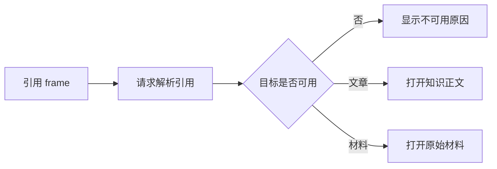

# 知识阅读框架：在正文、原文与引用之间导航

该组件是知识阅读区域的统一分发器：它解析导航帧，根据类型展示知识文章、原始材料或引用目标；切换到不同 frame.id 时，它以请求代次阻止旧引用响应覆盖当前页面，但仍依赖上层保证 frame.kind 与 frame.id 合法且一致。

来源：gpt-5.6-sol 分析，gpt-5.6-sol 独立复核；模型解释仍可被原始证据纠正。

## 统一承接三类阅读目标

`KnowledgeFrame` 解决同一阅读区域需要打开不同知识对象的问题。对于知识正文和原始材料，它从序列化的 frame 标识中取出文档键、修订、章节或材料摘要等参数，再分别交给 `KnowledgeDocument` 与 `KnowledgeSource`；子视图产生的新导航会继续转交给上层。参考 [正文与原文分发 ↗](../../../apps/web/src/knowledge/KnowledgeFrame.vue#L20 "支持组件解析 frame 参数、分别渲染知识正文和原始材料，并向上转交导航与加载事件的说明。")

共享类型把阅读目标定义为**知识正文、引用、原始材料**三类，并为它们提供统一的标识和标题。因此，该组件承担阅读目标的分发与衔接，正文排版、固定原文展示和具体内容加载仍由对应子视图负责。参考 [阅读帧类型 ↗](../../../apps/web/src/knowledge/api.ts#L5 "说明阅读框架定义的三类目标及其统一标识和标题字段。")

## 解析引用并选择阅读落点

引用 frame 会触发 `/citation` 请求。解析期间页面显示等待状态；请求失败时展示错误；成功后先呈现引用关系和引用理由，再检查目标是否可操作。不可打开的目标会显示具体原因，可打开的目标则按解析结果进入知识正文或原始材料视图。参考 [引用目标渲染 ↗](../../../apps/web/src/knowledge/KnowledgeFrame.vue#L23 "支持引用解析状态、关系理由、不可用提示以及按目标类型选择子视图的流程。")

解析结果可以携带文章修订与章节，或材料摘要与行范围；组件会把实际存在的定位字段传给子视图。这些字段在类型合同中均为可选，因此组件本身不能保证每个引用都能定位到固定修订、固定摘要或具体行段，最终精度取决于引用解析接口返回的信息。参考 [引用定位字段 ↗](../../../apps/web/src/knowledge/api.ts#L3 "说明解析后的引用目标可以携带修订、摘要、章节和行范围，但这些定位字段不是必填项。")

## 不同标识切换与输入边界

当页面切换到**不同的 `frame.id`** 时，监听器会递增请求代次，并清空已有引用和错误。异步响应返回后，只有代次仍与当前请求一致时才能更新状态，从而避免较慢的旧请求覆盖新标识对应的页面。参考 [标识切换防护 ↗](../../../apps/web/src/knowledge/KnowledgeFrame.vue#L12 "支持只有 frame.id 变化时才递增请求代次、重置状态并过滤过期异步响应的结论。")

这一保护只由 `frame.id` 变化触发：如果 `frame.kind` 改变而 `id` 保持不变，组件不会递增代次、清空状态或重新请求。frame 标识无法解析时还会退化为空对象，缺失字段可能继续被转换为字符串；模板也会把正文和原始材料之外的类型放入引用展示分支，而请求仅对 `citation` 类型发起。因此组件依赖上层提供合法且彼此一致的 `frame.kind` 与 `frame.id`，自身并未完成全面的运行时校验。参考 [输入与监听边界 ↗](../../../apps/web/src/knowledge/KnowledgeFrame.vue#L7 "支持 frame.id 解析失败时退化为空对象、监听器仅依赖 id，以及请求是否发生仍由当前 kind 决定的边界说明。")
