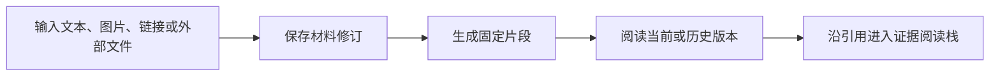

# Web 工作台：从材料采集到可追溯行动

omem Web 工作台把材料输入、固定版本阅读、证据追问、记忆提炼、人工判断、待办与通知串成一条可回查链路。前端负责统一导航、状态展示和流程编排；模型执行、版本冲突、权限校验及自动应用规则仍由服务端决定。

来源：gpt-5.6-sol 分析，gpt-5.6-sol 独立复核；模型解释仍可被原始证据纠正。

## 把记忆、证据与行动放在同一工作台

工作台面向“记下材料、找回依据、继续推进事项”的连续场景，而不是若干孤立工具。导航覆盖日常助理、知识库、原始材料、材料输入、处理任务、待判断、待办、变更、通知、飞书接入和运行配置，并通过 URL 与会话状态保持当前位置。参考 [工作台编排说明 ↗](da0e264957572bf35832a2327ed88508c6913c8ffb0323e87898adcffe262642.md#workspace-and-boot "子知识解释统一工作台如何组织页面状态与启动流程；附近论断同时由原始组件导航代码支撑。") [工作台导航与页面状态 ↗](../../../apps/web/src/App.vue#L39 "支持工作台包含的主要功能入口，以及 hash、会话状态和默认页面的同步方式。")

日常助理提供更直接的入口：用户可以交办跟进、回顾事项或查询记忆，页面持续展示处理状态，失败消息会保留并允许重试，命中的原始证据仍可打开阅读。它与工作台共享刷新和证据入口，而不是另建一套不可追溯的聊天记录。参考 [日常助理消息与证据入口 ↗](../../../apps/web/src/DailyAssistant.vue#L49 "支持日常助理的使用场景、发送门槛、轮次状态、失败重试和证据打开能力。")

## 从多来源输入形成固定证据

材料可以来自文本、链接、图片、飞书文档、Git 文件或服务器文件。文本模式把不同内容组成统一 parts，并附带采集者、来源、时间、时区和转发状态；保存后刷新公共数据、打开返回版本，并区分新版本与内容重复。参考 [材料采集子流程 ↗](da0e264957572bf35832a2327ed88508c6913c8ffb0323e87898adcffe262642.md#capture-and-refresh "子知识概括多来源材料如何汇入统一捕获流程；附近事实由捕获函数的原始实现进一步支撑。") [多来源材料保存流程 ↗](../../../apps/web/src/App.vue#L281 "支持导入模式分流、统一内容部件与来源信息构造，以及保存后的刷新、版本打开和重复提示。")

阅读页连续呈现正文、图片、版本状态与历史入口，并允许把固定片段设为提问焦点。参考 [原始材料与版本阅读 ↗](../../../apps/web/src/App.vue#L565 "支持正文、图片、固定片段、提问焦点及版本历史在阅读页中的组织方式。") 证据阅读器在深入下一条引用前保存滚动位置，把新证据压入帧栈；返回时恢复上一层位置，遇到已在路径中的片段则提示回跳，避免引用环无限展开。参考 [证据分层导航说明 ↗](12a5295cb1a5cb2774b5de2f3f8084513b5cf0fe3b2974118aa9b84fe8246672.md#navigation "子知识解释阅读栈、滚动恢复和循环引用处理；附近论断同时引用对应原始实现。") [证据栈与滚动恢复 ↗](../../../apps/web/src/EvidenceReader.vue#L16 "支持加载证据、保存当前滚动位置、压入新帧、检测重复目标和返回恢复位置的流程。")

## 让证据进入问答、处理与人工决策

选定片段后，问答面板携带焦点、Agent 配置以及可选引用路径创建异步运行，并持续轮询至完成、失败或取消；组件卸载时清理定时器。参考 [证据问答运行生命周期 ↗](../../../apps/web/src/ChatPane.vue#L49 "支持问答提交焦点与运行配置、轮询运行状态、取消请求及组件卸载清理。") 完成后的回答可以回到本次依据，但界面明确说明尚未自动逐项核验回答中的每个主张，因此“可回查”不等同于“已验证”。参考 [回答依据与核验提示 ↗](../../../apps/web/src/ChatPane.vue#L95 "支持回答完成后回查焦点证据，并明确尚未自动逐项核验回答主张的限制。")

证据还可以直接转成行动：创建待办时关联当前片段，更新状态时携带预期版本以避免无声覆盖。参考 [证据关联待办与版本更新 ↗](../../../apps/web/src/App.vue#L343 "支持创建任务时关联当前证据，以及任务状态更新携带预期版本。") 材料处理页展示提炼、核验和依赖复查的任务状态；自动处理未启用时，原文仍可保存和检索，页面不会自行开启模型。参考 [材料处理范围与启用边界 ↗](../../../apps/web/src/LearningView.vue#L83 "支持材料提炼和独立核验的页面说明，并明确自动处理关闭时原文能力仍可使用。") 候选记忆保留策略结果、影响范围和原证据入口，任务可取消或重试，但候选审批由“待判断”流程承担。参考 [候选记忆与任务控制 ↗](../../../apps/web/src/LearningView.vue#L137 "支持候选记忆展示原证据、策略结果和影响范围，以及任务取消、重试和分批展示能力。")

待判断页面只为仍处于 pending 的提案提供确认、拒绝或补充背景操作；来源变化后的旧判断会失效，高置信小范围变化则可能走自动路径。参考 [人工判断与失效约束 ↗](../../../apps/web/src/DecisionsView.vue#L112 "支持证据入口、来源变化后的失效警告、三类人工动作及高置信变化的自动处理边界。") 通知详情把内容差异、固定版本、原始证据和外部投递结果重新汇合，使用户能从提醒追溯到变化本身，而“已读”不会替代业务操作。参考 [通知中的差异、证据与投递 ↗](../../../apps/web/src/NotificationDetail.vue#L44 "支持通知详情展示固定版本差异、原始证据入口和外部提醒投递状态。")

## 当前进展与能力边界

当前个人材料搜索仍是精确文本检索，未接入语义检索；无结果时界面建议改用原文关键词或先导入材料。参考 [精确文本搜索限制 ↗](../../../apps/web/src/App.vue#L530 "支持当前搜索采用精确文本匹配、语义检索尚未接入及空结果提示。") Agent 配置不是写死的：前端会探测 select 类型能力并忽略迟到结果，模型与思考强度从探测选项中选择。参考 [Agent 能力动态探测 ↗](../../../apps/web/src/App.vue#L410 "支持能力探测筛选配置项、忽略迟到响应，以及切换 Agent 后清理旧探测状态。") 设置页同时声明上下文超限应明确拒绝，浏览器令牌只用于连接 omem 服务；网页不能修改宿主执行命令。参考 [模型、上下文与连接设置 ↗](../../../apps/web/src/App.vue#L797 "支持模型和思考强度的选择方式、上下文上限说明，以及浏览器连接配置的边界。")

启动阶段会先识别仓库评审服务，仅在评审健康路由确实不存在时进入个人服务初始化；其他错误会保留连接状态并重试。参考 [评审与个人服务启动分流 ↗](../../../apps/web/src/App.vue#L183 "支持启动时识别服务模式、区分真实 404 与其他故障，并在连接失败后定时重试。") 识别到 review 模式时，当前应用只提示仓库知识已合并到主应用。参考 [仓库知识合并提示 ↗](../../../apps/web/src/App.vue#L484 "支持识别到 review 模式后不进入个人业务页面，而提示使用统一主应用的当前行为。") 代码库中仍保留使用真实评审 API、共享证据 trail 与哈希深链的 Code Wiki 组件，因此独立评审入口与统一主应用之间仍存在需要明确的产品边界。参考 [Code Wiki 的真实数据与共享 trail ↗](../../../apps/web/src/codewiki/CodeWiki.vue#L1 "支持现有 Code Wiki 仍使用真实评审接口，并复用共享 UI 的证据 trail 与哈希深链能力。")
