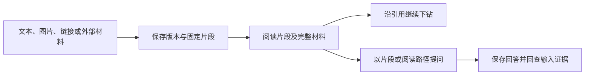

# Web 工作台：从材料采集到可追溯行动

Web 模块以 Vue 3 和共享 UI 组成个人记忆工作台，连接多来源采集、固定证据阅读、证据问答、学习提案、人工判断、待办、通知和飞书接入，并提供仓库知识阅读界面。前端负责交互与流程编排，权限、幂等、密钥保护和最终状态应用仍依赖服务端保证。

来源：gpt-5.6-sol 分析，gpt-5.6-sol 独立复核；模型解释仍可被原始证据纠正。

## 统一的个人记忆工作台

Web 端把日常助理、知识库、原始材料、输入、学习、待判断、待办、变更、通知和连接配置集中在同一导航中，承担业务页面之间的状态恢复与交互编排。参考 [工作台功能导航 ↗](../../../apps/web/src/App.vue#L38 "支持个人工作台集中提供助理、知识、材料、学习、判断、待办、通知和连接配置等入口。")

前端采用 Vue 3，并通过工作区依赖复用共享 UI；Markdown、代码高亮、内容净化和二维码库为阅读与接入界面提供技术基础，但依赖声明本身不代表所有安全策略已经落实。参考 [Vue 与共享界面依赖 ↗](../../../apps/web/package.json#L10 "支持 Web 包采用 Vue 3、共享 UI，以及 Markdown、高亮、净化和二维码相关依赖。")

创建待办时可提交当前焦点片段作为来源证据。参考 [待办关联当前证据 ↗](../../../apps/web/src/App.vue#L334 "支持创建待办时把当前焦点片段作为 evidenceId 提交。") 待办列表会在存在来源时显示“查看事项来源”，由统一证据阅读器打开对应片段，因此用户能从行动返回原始材料。参考 [待办来源回查入口 ↗](../../../apps/web/src/App.vue#L724 "支持待办列表在存在来源证据时显示人类可读的回查入口，并交给证据阅读器打开。")

## 从输入材料到证据问答

采集入口按普通输入、飞书文档、服务器文件或 Git 文件分派；普通输入可组合文本、链接和图片并附带来源信息。保存后刷新工作台并打开对应版本，内容未变化时复用原版本，否则提示已经生成固定证据片段。参考 [多来源材料采集 ↗](../../../apps/web/src/App.vue#L272 "支持采集模式分派、多模态载荷、来源信息、保存后刷新及重复内容复用版本的流程。")

阅读器以帧栈保存证据、标签页、追问状态和滚动位置，并在重复打开既有片段时提示回到原层。参考 [证据阅读帧栈 ↗](../../../apps/web/src/EvidenceReader.vue#L7 "支持帧栈保存阅读状态、重复路径检测、新证据入栈以及返回时恢复滚动位置。") 用户可在引用片段、完整材料和反向引用之间切换，并沿关系继续阅读。参考 [证据阅读视角与关系 ↗](../../../apps/web/src/EvidenceReader.vue#L104 "支持引用片段、完整材料和反向引用三种视角，以及沿出向或反向关系继续阅读。") 问答面板以焦点片段和可选路径上下文创建异步运行并轮询结果。参考 [基于证据创建问答运行 ↗](../../../apps/web/src/ChatPane.vue#L33 "支持以焦点片段、模型配置和可选路径上下文创建异步问答，并轮询运行结果。") 完成后可以回查本次提供的依据，但界面明确说明尚未自动核验回答中每个主张的支持度。参考 [回答依据回查与核验限制 ↗](../../../apps/web/src/ChatPane.vue#L115 "支持完成态回查本次固定依据，并明确逐主张支持度尚未自动核验。")

## 学习、判断与通知形成闭环

材料进入处理流程后，学习页以“材料已保存—提炼与核验—形成提案—应用并通知”呈现进度；等待和失败不会被显示为成功。参考 [学习处理轨迹 ↗](../../../apps/web/src/LearningView.vue#L68 "支持材料保存、提炼核验、形成提案及应用通知四阶段的进度表达。") 学习页中的任务提案逐项提供原证据入口，可把固定片段交给外层阅读器打开。参考 [学习提案的原证据入口 ↗](../../../apps/web/src/LearningView.vue#L134 "支持学习页为每项任务提案展示原始证据引用，并把固定片段标识交给父组件打开。")

需要人工介入的变化进入待判断页。提案依据同样可以回查；只有待处理状态显示补充背景、拒绝或确认入口，来源变化后的旧判断会被标为失效并阻止继续提交。参考 [判断依据与失效保护 ↗](../../../apps/web/src/DecisionsView.vue#L112 "支持待判断提案展示证据入口，并在来源变化时阻止旧判断，仅为待处理项提供人工动作。")

通知详情把“收到通知”和“变化已应用”分开：application receipt 才作为生效记录，并可打开变更前后版本。参考 [通知生效回执与版本入口 ↗](../../../apps/web/src/NotificationDetail.vue#L42 "支持通知通过应用回执区分实际生效，并提供变更前后版本入口。") 原始证据与各渠道投递状态独立呈现，便于核对变化的来路、投递尝试和失败信息。参考 [通知证据与投递状态 ↗](../../../apps/web/src/NotificationDetail.vue#L66 "支持通知详情提供原始证据入口，并按渠道展示尝试次数、合并状态和失败信息。")

## 外部连接、仓库知识与当前边界

飞书页面支持创建、授权或导入应用；非终态接入会定时刷新，进入终态或组件卸载后停止轮询。参考 [飞书接入状态轮询 ↗](../../../apps/web/src/LarkSetup.vue#L190 "支持非终态接入定时刷新，并在终态或卸载后停止轮询。") 收到凭据后仍需完成实际权限与事件核验，完成前不会标记为可用。参考 [飞书实际能力核验 ↗](../../../apps/web/src/LarkSetup.vue#L362 "支持收到凭据后继续核验权限和事件，完成能力探测前不标记为可用。") 随后可通过一次性配对码接收候选身份并由用户确认 Owner。参考 [飞书 Owner 配对 ↗](../../../apps/web/src/LarkSetup.vue#L375 "支持生成一次性配对码、等待同一应用收到私聊，并由用户确认候选 Owner。") 前端会在请求结束后清空 Secret，但服务端是否加密落盘、脱敏日志并抵御配对重放，仍需后端证据确认。参考 [飞书凭据提交与清理 ↗](../../../apps/web/src/LarkSetup.vue#L96 "支持接入模式分流、手工 Secret 提交及请求结束后的前端内存清理，同时界定服务端安全仍待验证。")

仓库知识界面并行加载代码快照、依赖图和模块理解，并初始化共享证据 trail。参考 [仓库快照与知识加载 ↗](../../../apps/web/src/codewiki/CodeWiki.vue#L116 "支持 Code Wiki 加载快照、代码图和模块理解，并初始化共享证据 trail。") 文件、符号和片段可作为不同类型的阅读帧压入路径。参考 [跨类型证据下钻 ↗](../../../apps/web/src/codewiki/CodeWiki.vue#L185 "支持将文件、符号和片段作为不同类型的帧压入共享阅读路径。") 当前视图与完整阅读栈会写入 URL hash，并可从深链恢复。参考 [阅读路径哈希深链 ↗](../../../apps/web/src/codewiki/CodeWiki.vue#L218 "支持把当前视图及 trail 写入 URL hash，并从 hash 恢复视图和完整阅读栈。") 共享抽屉按知识、模块、文件、符号或片段类型渲染内容，并提供返回、跳转和循环处理。参考 [多类型证据抽屉 ↗](../../../apps/web/src/codewiki/CodeWiki.vue#L371 "支持共享抽屉按知识、模块、文件、符号和片段帧分别渲染，并提供返回、跳转与循环处理。")

仓库评审 API 当前面向本机读取、浏览和同步，不发送个人工作区授权头，不能据此宣称已有租户隔离。参考 [仓库评审接口边界 ↗](../../../apps/web/src/review-api.ts#L1 "支持评审客户端面向本机读取、浏览和同步，且不发送个人工作区授权头的当前边界。") 个人工作台搜索仍明确标注为精确文本检索，语义检索尚未接入。参考 [精确文本搜索限制 ↗](../../../apps/web/src/App.vue#L529 "直接支持个人工作台当前使用精确文本检索、语义检索尚未接入。")
