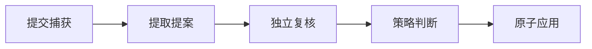

# 受控学习流水线的端到端行为验证

该测试验证捕获内容如何经过独立提取与复核、原子应用、重启恢复、过期输入拒绝、批量影响控制及任务类型隔离。它重点证明持久化副作用不会因重放而重复，并区分大量独立变更与同实体重复提案；测试使用本地 ACP 夹具，不代表真实外部 Agent CLI 已通过联调。

来源：gpt-5.6-sol 分析，gpt-5.6-sol 独立复核；模型解释仍可被原始证据纠正。

## 从捕获到原子应用

这组测试解决的核心风险是：学习任务虽然经过多个异步阶段，但最终记忆或待办不能半应用、重复应用。测试用临时数据库、受控 ACP 进程和真实 `LearningPipeline` 组合出隔离环境。参考 [受控测试环境 ↗](../../../apps/server/tests/learning-pipeline.test.ts#L22 "说明测试通过固定 ACP 夹具、临时存储和真实流水线服务构造隔离运行环境，也界定其不是外部 CLI 联调。")

HTTP 场景断言提取与复核形成两个成功作业、分别使用独立会话，随后提案进入已应用状态，并且只产生一条应用回执；健康接口还应报告流水线正在运行且无错误。这证明了主路径的阶段隔离与单次落地，而不是只检查接口返回成功。参考 [捕获到应用的主路径断言 ↗](../../../apps/server/tests/learning-pipeline.test.ts#L104 "支持提取与复核使用两个独立会话、提案自动应用、单次回执及健康状态正常的论断。")

## 重启、重放与中断边界

持久化作业允许进程在提取完成、复核尚未完成时重启。测试重新打开同一存储后继续排空队列，并人为追加一次复核重放；两次处理后仍只有一个待办和一条应用回执，说明幂等边界落在持久化应用结果上。参考 [重启与幂等重放 ↗](../../../apps/server/tests/learning-pipeline.test.ts#L150 "支持持久化复核作业可在重启后恢复，并在再次重放时不重复创建待办或应用回执。")

输入版本变化时，旧作业会以 `STALE_JOB_INPUT` 失败，新版本仍可继续处理；若 worker 正在执行超时任务时被正常停止，作业转入可重试等待并标为瞬时错误，而非误判成功或永久失败。参考 [过期输入与正常停机 ↗](../../../apps/server/tests/learning-pipeline.test.ts#L214 "支持旧版本输入被拒绝，以及执行中停止后作业进入瞬时错误的可重试状态。")

## 批量变更的整体风险控制

批量策略按去重后的实际影响评估整个 ChangeSet。十二个不同实体的创建请求会全部停在等待决定状态，只生成一个汇总决策事项，且不写入应用回执或活动记忆，避免把一次高影响操作拆成许多看似安全的小操作。参考 [独立批量变更门控 ↗](../../../apps/server/tests/learning-pipeline.test.ts#L308 "支持十二项不同创建被整体暂存、汇总为单个决策事项且没有任何物化结果。")

相反，十二个指向同一实体、同一陈述的创建请求被视为影响量一：仅一项应用，其余十一项保留为重复记录，不生成决策事项，最终只有一条活动 claim。这个对照验证了门控依据是去重后的影响，而非原始提案数量。参考 [同实体批量去重 ↗](../../../apps/server/tests/learning-pipeline.test.ts#L365 "支持十二项同实体创建按影响量一处理，仅应用一项并保留其余重复项。")

## 职责隔离与测试范围

学习 worker 只领取自身支持的作业类型；知识角色作业保持排队且没有执行尝试，防止不同 worker 争抢任务。参考 [worker 类型隔离 ↗](../../../apps/server/tests/learning-pipeline.test.ts#L407 "支持学习流水线不领取知识角色作业、也不创建执行尝试的职责边界。")

这些用例覆盖成功、重启、重放、过期、停止和两类批量决策，但 Agent 行为来自仓库内夹具进程，因此不能据此推断真实 CLI、认证、网络故障或模型输出质量已经验证。夹具配置明确以当前 Node 进程启动固定脚本。参考 [受控测试环境 ↗](../../../apps/server/tests/learning-pipeline.test.ts#L22 "说明测试通过固定 ACP 夹具、临时存储和真实流水线服务构造隔离运行环境，也界定其不是外部 CLI 联调。")
