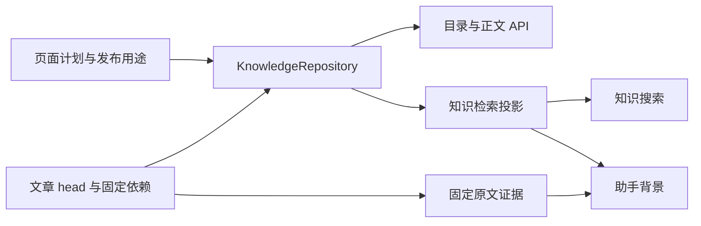

# 知识文章的状态、来源与修改入口

面向需要定位知识更新行为的开发者，区分发布用途、页面生成状态和章节适用状态，并说明正文引用、背景前提、调查轨迹如何影响目录、API、检索、助手与导入退役。

来源：gpt-5.6-sol 分析，gpt-5.6-sol 独立复核；模型解释仍可被原始证据纠正。

## 先分清三种彼此独立的状态

设想一篇活动文章有“预算”和“集合地点”两节：预算从 80 元改为 120 元，文章仍能打开，预算节提示需要核对，而未受影响的集合节仍可参与搜索。要理解这个结果，先不要问“文章是不是最新”，而要分开看三条轴。

| 维度 | 可取值 | 回答的问题 |
| --- | --- | --- |
| **发布用途** | `article`、`reference`、`note` | 这是主题文章、快速参考，还是内部分析？ |
| **页面生成状态** | `planned`、`writing`、`published`、`failed`、`retired` | 这次整理走到哪一步，是否还应进入发布目录？ |
| **章节适用状态** | `current`、`needs-review`、`unavailable` | 某一节相对当前原件还能否直接使用？ |

用途保存在发布元数据中；旧产物迁移时才依据原有阅读计划映射，不能按 key、路径或主题猜测。参考页进入“参考资料”，主题文章进入“主题文章”，内部笔记不进入发布目录。参考 [知识用途与产物结构 ↗](../../../packages/contracts/src/knowledge.ts#L92 "支持发布用途、章节状态以及 dependencies 与 investigation 的数据结构说明。")、[旧产物用途迁移 ↗](../../../apps/server/src/knowledge/lifecycle.ts#L10 "说明旧产物依据已保存的阅读意图映射用途，而非按路径或名称推断。")、[主题与参考目录 ↗](../../../apps/web/src/knowledge/KnowledgeHome.vue#L354 "支持前端将 article 和 reference 呈现为主题文章与参考资料两个视图。")

页面计划独立于正文保存。新计划先是 `planned`，写作时进入 `writing`，成功为 `published`，失败为 `failed`；`retired` 表示受管导入版本退出发布，并不等于生成失败。已有 head 在重写或失败期间仍可保留，因为发布列表只排除 `planned`、`retired` 和 `note`；全新页面没有正文时则只出现在“准备整理”。参考 [页面状态与发布资格 ↗](../../../apps/server/src/knowledge/repository.ts#L113 "支持页面计划保存、状态字段以及 pages 和 published 的过滤规则。")、[写作状态转换 ↗](../../../apps/server/src/knowledge/pipeline.ts#L251 "说明页面从保存计划、写作到发布或失败的状态转换。")

## 章节状态怎样随原件变化

章节先从正文中的引用和本节的背景前提出发。固定依赖缺失，或固定/当前原件读不到时是 `unavailable`；来源可读但引用所在上下文、背景前提或下游知识发生变化时是 `needs-review`；这些检查都通过才是 `current`。文章 head 上的 `current` 只是汇总：所有章节都为 `current` 才为真。参考 [逐节适用状态 ↗](../../../apps/server/src/knowledge/lifecycle.ts#L95 "支持正文引用与背景前提共同决定 current、needs-review、unavailable，以及子知识变化传播。")、[文章汇总与历史原件 ↗](../../../apps/server/src/knowledge/repository.ts#L277 "说明文章 current 是所有章节状态的汇总，并展示按 digest 回读旧材料版本。")

变化判断不是比较绝对行号。材料摘要变化后，系统在旧原件中找包住引用的最小 Markdown 章节或代码结构，再到新原件中用相同标题与结构类型唯一匹配并比较完整结构文本。因此在前面插入无关函数、整体移行，仍可能保持 `current`；被引用函数、说明或章节正文改变，则需要核对。图片、没有行范围、无法定位局部结构的普通全文在材料变化后不能沿用这一局部判断。这个机制只定位复查范围，不证明跨文件语义未变。参考 [局部结构变化判断 ↗](../../../apps/server/src/knowledge/lifecycle.ts#L40 "支持按最小章节或代码结构比较、允许移行以及该判断并非语义重映射的边界。")

回到示例：预算引用所在章节改变后，预算节变为 `needs-review`；集合地点所在章节未变，集合节仍为 `current`。若“集合方案以原预算为前提”没有写进正文，就应把预算行作为集合节的 `reviewSources`，这样预算变化也会使集合节需要核对。阅读页仍显示全文，只在对应章节说明原因，并保留写作时的固定引用。参考 [逐节适用状态 ↗](../../../apps/server/src/knowledge/lifecycle.ts#L95 "支持正文引用与背景前提共同决定 current、needs-review、unavailable，以及子知识变化传播。")、[章节待核对提示 ↗](../../../apps/web/src/knowledge/KnowledgeDocument.vue#L94 "支持阅读页保留全文、在对应章节展示状态原因和固定引用。")

## 直接引用、背景前提与调查轨迹

三类记录用途不同，不能互相替代。

| 记录 | 存在哪里 | 何时使用 |
| --- | --- | --- |
| **正文直接引用** | `document.citations`，正文以 `[知识用途与产物结构 ↗](../../../packages/contracts/src/knowledge.ts#L92 "支持发布用途、章节状态以及 dependencies 与 investigation 的数据结构说明。")` 就近使用 | 支持附近论断，打开固定材料行或固定文章章节 |
| **背景前提** | 每节的 `reviewSources` | 配置、约定、调用条件虽不适合作为正文证据，但变化会影响本节 |
| **调查轨迹** | artifact 的 `investigation` | 记录调查、写作、复核实际读过的材料，保留审计与访问边界 |

发布校验要求每节都有正文引用，引用必须实际出现在叙述附近；材料引用还必须给出有效行范围。模型选择定位，宿主从固定原件复制短引文，因此正文证据不是模型自行转述的一段“原文”。参考 [引用与背景前提合同 ↗](../../../packages/contracts/src/knowledge.ts#L4 "支持正文引用目标、行范围和逐节 reviewSources 的结构定义。")、[就近引用与原文绑定 ↗](../../../apps/server/src/knowledge/repository.ts#L45 "说明每节必须使用正文引用、游离引用会被拒绝，并由宿主复制固定原文短引文。")

生成时，正文引用和 `reviewSources` 对应的材料被固化为 `dependencies`；实际读取过的材料另存入 `investigation`。生命周期只用前两者判断章节是否需要更新，偶然读过的材料换版不会让正文失效。参考 [依赖与调查轨迹形成 ↗](../../../apps/server/src/knowledge/pipeline.ts#L177 "支持 citations 和 reviewSources 形成 dependencies，而实际读取材料形成 investigation。")、[逐节适用状态 ↗](../../../apps/server/src/knowledge/lifecycle.ts#L95 "支持正文引用与背景前提共同决定 current、needs-review、unavailable，以及子知识变化传播。")

不过，调查轨迹仍参与可见性约束：检索投影只有在调查材料和所有固定依赖都处于允许范围时才接纳文章，并将二者共同投影为可见范围。这表示“不是论断依据”不等于“可以绕过来源权限”。参考 [调查背景的可见性 ↗](../../../apps/server/src/retrieval/units.ts#L587 "说明 investigation 与 dependencies 共同约束派生知识的可见范围，而章节支持状态另行判断。")

## 目录、API、检索与助手怎样消费状态

这些消费者共享章节判断，但各自回答不同问题：

- **目录与正文 API**：列表使用 `published()` 和页面计划；详情接口按 key 或 revision 直接读取文章，再返回逐节状态和解析后的固定引用。因此“能用已知 key 打开历史或退役正文”与“会出现在目录”是两种能力。参考 [文章与固定引用 API ↗](../../../apps/server/src/knowledge/api.ts#L43 "支持列表使用 published、详情按 key/revision 读取、并按 dependency 固定版本解析引用。")
- **知识搜索**：候选先限定在发布文章；共享检索只接受当前投影中同一 revision 的命中，回退路径也只遍历 `current` 章节。参考 [知识搜索章节过滤 ↗](../../../apps/server/src/knowledge/api.ts#L121 "说明搜索限定已发布文章，并在回退路径只遍历 current 章节。")
- **检索投影**：排除 `note`、`planned`、`retired`，并且只把可支持的 `current` 章节切成知识段落。文章若只有部分章节可用，命中仍可出现，但会携带整篇 `needs-review` 标记；段落的原文 references 只沿该段实际使用的正文引用递归展开。参考 [知识检索投影 ↗](../../../apps/server/src/retrieval/units.ts#L619 "支持排除非发布用途和状态、仅投影受支持章节、携带整篇 reviewState 并展开段落原文 references。")
- **助手**：原始来源命中成为可直接引用的 evidence；知识、记忆、任务等派生命中作为 background，并保留知识的复核状态和可回到的原文引用。最终事实引用仍落到固定原件。参考 [助手证据与背景 ↗](../../../apps/server/src/assistant/runtime.ts#L927 "说明 source 命中转为原文 evidence，知识等派生命中作为 background 并保留复核状态。")
- **自主调查**：先按会话可见性筛材料，再提供发布文章；提交引用时重新检查材料身份、历史版本、片段可见性和行范围。参考 [自主调查引用校验 ↗](../../../apps/server/src/assistant/research.ts#L49 "支持按会话可见性筛材料、提供发布文章，并校验历史版本、片段范围和行号。")

所以示例中整篇可以在目录显示“待更新”并继续阅读，而搜索与助手只消费仍为 `current` 的集合节；如果预算被登记为集合节的背景前提，集合节也会退出知识检索。

## 导入资产移除后的退役与历史保留

导入恢复以目录绝对路径作为 owner。它先解析目录中的所有 JSON 并恢复有效文章；只要出现解析错误，就不执行删除对账，避免把暂时不可读误判为资产已删除。参考 [导入恢复与安全对账 ↗](../../../apps/server/src/knowledge/artifacts.ts#L32 "说明导入 owner、解析失败时跳过删除对账以及恢复后触发 reconcileImport。")

对账发现某个 key 不再属于该 owner 时，只删除这条 membership。仅当没有其他导入 owner，且当前 head 仍正好是该 owner 管理的 revision，页面才改为 `retired`；同一资产重新加入且 head 匹配时可以恢复为 `published`。用户后来发布的新 head、其他 owner 管理的版本都不会因此被下架。参考 [导入成员与退役 ↗](../../../apps/server/src/knowledge/repository.ts#L154 "支持只移除单个 owner 的 membership、满足条件才 retired，以及同资产重新加入可恢复发布。")

这是一种**逻辑退役**：页面退出 pages、published、目录、搜索和助手知识背景，但不是删除知识 revision、head 或个人材料。固定引用仍可按 material key 和 digest 扫描旧 revisions 回读；导入新版本也只能推进它此前管理的 head，个人改写会被保留。参考 [受管 head 与固定历史 ↗](../../../apps/server/src/knowledge/repository.ts#L241 "说明导入只能推进其管理的 head，知识 revision 保留，并能按 digest 回读旧材料。")

开发环境恢复分成三个阶段：先把资产文章及其引用的旧文章 revision 收集到内存，并从先前 review 数据库补齐这些文章依赖的固定材料 revision；再捕获 live files，使当前原件成为 material head；最后把收集到的历史文章 revision 和当前资产文章写入知识仓储。防止 head 倒退的是“固定材料历史先补回、live files 后捕获”这一顺序，文章 revision 则在 live 捕获之后恢复。当前这些入口没有定义物理历史的最终保留期限；清理策略不能从 `reconcileImport` 推断。参考 [开发环境分阶段恢复 ↗](../../../apps/server/src/review/development.ts#L37 "说明先收集文章历史并补齐其固定材料依赖，再捕获 live files，最后恢复历史及资产文章 revision；防止原件 head 倒退只对应固定材料与 live 捕获的先后顺序。")

## 按问题定位修改入口

需要改行为时，先按问题进入主判断点，而不是从 UI 文案反推：

| 想修改什么 | 首要入口 |
| --- | --- |
| 用途、引用、背景前提、章节状态类型 | `packages/contracts/src/knowledge.ts` |
| 变化是否影响某节、子知识传播、结构范围匹配 | `apps/server/src/knowledge/lifecycle.ts`，结构解析继续看 `knowledge/structure.ts` |
| 计划状态、发布目录资格、固定历史、导入 membership | `apps/server/src/knowledge/repository.ts` |
| 写作状态转换、依赖与 investigation 的形成 | `apps/server/src/knowledge/pipeline.ts` |
| 资产恢复与何时触发导入对账 | `apps/server/src/knowledge/artifacts.ts` |
| 列表、详情、引用解析与知识搜索 | `apps/server/src/knowledge/api.ts` |
| 哪些章节进入索引、段落 references 与 visibility | `apps/server/src/retrieval/units.ts` |
| 助手调查的材料准入和提交引用校验 | `apps/server/src/assistant/research.ts` |
| 开发库补回固定历史 | `apps/server/src/review/development.ts` |

一个实用排查顺序是：先看页面的 role/state，再用详情 API 查看 `sectionStatus`，接着核对该节正文引用与 `reviewSources`，最后才检查检索投影。这样能迅速区分“页面没发布”“章节待核对”“固定来源不可读”和“章节有效但未被查询命中”。参考 [页面状态与发布资格 ↗](../../../apps/server/src/knowledge/repository.ts#L113 "支持页面计划保存、状态字段以及 pages 和 published 的过滤规则。")、[逐节适用状态 ↗](../../../apps/server/src/knowledge/lifecycle.ts#L95 "支持正文引用与背景前提共同决定 current、needs-review、unavailable，以及子知识变化传播。")、[文章与固定引用 API ↗](../../../apps/server/src/knowledge/api.ts#L43 "支持列表使用 published、详情按 key/revision 读取、并按 dependency 固定版本解析引用。")、[知识检索投影 ↗](../../../apps/server/src/retrieval/units.ts#L619 "支持排除非发布用途和状态、仅投影受支持章节、携带整篇 reviewState 并展开段落原文 references。")
