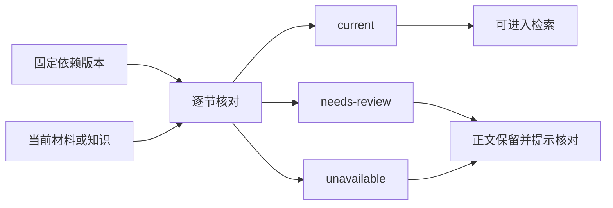

# 知识文章的状态、证据关系与修改入口

面向维护知识更新行为的开发者，区分文章用途、页面生成状态和章节适用状态，说明直接引用、背景前提、调查轨迹如何影响阅读、检索与助手，并给出资产退役和历史保留的实现入口。

来源：gpt-5.6-sol 分析，gpt-5.6-sol 独立复核；模型解释仍可被原始证据纠正。

## 先用一个场景建立判断顺序

假设一篇活动说明有“预算”和“集合地点”两节。预算原文变化后，文章仍能打开，预算节显示待核对，集合节仍可搜索——这不是状态冲突，而是系统刻意把**页面是否可读**与**章节是否仍适用**分开。固定引用继续打开写作时的原文，不会静默换成新版本。参考 [预算与集合示例 ↗](../../../docs/reader-first/publication-lifecycle.md#L1 "说明文章可读、章节待核对和固定旧引用可以同时成立。")

遇到这类问题时，依次问三件事：它是正式文章、参考资料还是内部笔记？页面处于计划、写作、发布、失败还是退役？具体章节是当前、需核对还是来源不可用？合同把用途和章节状态定义为两组独立概念。参考 [用途与章节状态类型 ↗](../../../packages/contracts/src/knowledge.ts#L92 "定义三种发布用途和三种章节适用状态。")

## 三套状态分别回答什么

| 层次 | 取值 | 回答的问题 | 主要影响 |
| --- | --- | --- | --- |
| 发布用途 | `article` / `reference` / `note` | 这份知识给谁用 | 前两者面向读者；内部笔记不进入目录和知识召回 |
| 页面生成状态 | `planned` / `writing` / `published` / `failed` / `retired` | 页面生成走到哪一步 | 计划和失败可展示、重试；退役退出读者集合 |
| 章节适用状态 | `current` / `needs-review` / `unavailable` | 这一节能否继续作为当前解释 | 决定章节提示和是否进入检索 |

用途由发布元数据显式保存；兼容旧资产时才根据已有阅读目标迁移，不能从路径、项目名或 key 猜测。参考 [用途迁移规则 ↗](../../../apps/server/src/knowledge/lifecycle.ts#L10 "说明用途优先取显式 publication，并仅用既有阅读目标兼容旧资产。") 页面计划单独落库，`pages()` 排除内部笔记与退役页；`published()` 排除内部笔记、计划页和退役页。因此一次重新整理进入 `writing` 或 `failed` 时，只要已有正文仍在，正文仍属于可读集合。参考 [页面与发布集合 ↗](../../../apps/server/src/knowledge/repository.ts#L127 "说明 pages、计划保存、状态更新和 published 集合的过滤规则。") [页面生成状态流 ↗](../../../apps/server/src/knowledge/pipeline.ts#L251 "说明写作前保存计划并进入 writing，成功 published、失败 failed。")

文章上的 `current` 布尔值只是逐节状态的汇总：所有节均为 `current` 才为真。它不是“是否发布”的同义词。参考 [整页当前状态汇总 ↗](../../../apps/server/src/knowledge/repository.ts#L255 "说明文章 current 是所有章节状态的聚合。")

## 直接引用、背景前提与调查轨迹

三种关系用途不同，维护时不要互换：

- **直接引用**在正文中以双中括号包住引用键并就近出现，目标可以是原始材料的行范围，也可以是另一篇文章的章节；它支撑附近论断，并通过依赖中的 digest 固定到写作时版本。参考 [引用目标合同 ↗](../../../packages/contracts/src/knowledge.ts#L4 "说明正文引用的键、关系、材料行范围与文章章节目标。")
- **背景前提**放在具体章节的 `reviewSources`。它适合没有必要写入正文、但变化会改变该节解释的配置、约定或调用条件；需要记录最小原文范围和原因。参考 [章节背景前提 ↗](../../../packages/contracts/src/knowledge.ts#L25 "定义 reviewSources 的材料范围和原因字段，并明确其用于会影响章节的背景前提。")
- **调查轨迹**位于产物顶层 `investigation`，记录研究、写作和复核实际读过的材料及 digest。它说明生成背景，不等于每份材料都支持正文。参考 [产物依赖与调查轨迹 ↗](../../../packages/contracts/src/knowledge.ts#L102 "区分固定依赖与仅表示实际阅读范围的 investigation。")

发布时，正文引用与 `reviewSources` 共同形成章节依赖；实际读取集合另存为调查轨迹。这样，偶然读过的材料变化不会直接把章节判旧，而真正支撑论断或构成前提的来源会进入生命周期检查。参考 [依赖与阅读集合落盘 ↗](../../../apps/server/src/knowledge/pipeline.ts#L177 "说明发布管线如何从引用和背景前提生成 dependencies，并另存实际读取材料。")

## 固定版本怎样变成逐节状态

生命周期先读取依赖指定的固定版本，再与当前版本比较。材料 digest 相同直接保持当前；若不同，则比较引用所处的最小 Markdown 章节或代码结构。标题、结构类型和整段内容唯一匹配时，行号移动不影响状态；图片、无行范围、普通整篇文本、来源元数据变化或上下文变化会保守地要求复核。这个比较只用于定位复核范围，不证明语义等价。参考 [上下文变化比较 ↗](../../../apps/server/src/knowledge/lifecycle.ts#L40 "说明固定引用保留、结构范围匹配和保守复核边界。")

逐节判断还会合并正文引用与 `reviewSources`：缺少引用或依赖、固定版或当前版不可读会得到 `unavailable`；上下文变化会得到 `needs-review`。引用另一篇文章时，固定子文章不可读、子章节已待核对，或当前子文章出现了新解释，也会向上游传播相应状态。参考 [逐节适用判断 ↗](../../../apps/server/src/knowledge/lifecycle.ts#L81 "说明引用与背景前提如何产生 current、needs-review、unavailable，并传播子文章状态。")

## 目录、API、检索与助手在哪里做决定

| 入口 | 决策位置 | 可观察结果 |
| --- | --- | --- |
| 目录集合 | `KnowledgeRepository.pages()` / `published()` | 展示可整理计划和可读正文；退役与内部笔记退出读者入口 |
| 详情与引用 | `knowledge/api.ts` 的文章详情、引用解析 | 可按 key 和 revision 读取保存正文；引用按依赖 digest 打开固定材料或固定子文章 |
| 检索投影 | `retrieval/units.ts` | 只投影状态为 `current` 且全部生成背景仍在可见范围内的章节 |
| 助手快照 | `assistant/research.ts` | 先按会话可见性筛原始材料，再把 `published()` 文章交给受控研究快照 |

详情接口直接调用 `get(key, revision)` 并返回逐节状态，因此明确知道 key 或历史 revision 时，可以下钻保存的正文；引用解析不会自动改指向当前材料。参考 [详情与固定引用解析 ↗](../../../apps/server/src/knowledge/api.ts#L43 "说明文章详情按 key/revision 读取，并按 dependency digest 解析固定引用。") 检索更严格：文章用途不能是内部笔记，页面不能是计划或退役，且至少有一节同时满足输入可见和章节当前；真正切分为检索单元的也只有这些受支持章节。若同页还有其他待核对章节，命中会携带页面级 `needs-review` 提示。参考 [知识检索准入 ↗](../../../apps/server/src/retrieval/units.ts#L577 "说明调查材料与依赖可见性、用途、页面状态和章节状态共同决定文章是否进入检索。") [章节检索单元 ↗](../../../apps/server/src/retrieval/units.ts#L660 "说明仅受支持章节被切分为检索单元，部分待核对页面会附带 reviewState。")

普通助手的候选文章来自 `published()`，原始材料则先经过会话可见性过滤，再一起构建快照。参考 [助手研究快照入口 ↗](../../../apps/server/src/assistant/research.ts#L49 "说明助手先过滤可见材料，再以 published 文章构建统一研究环境。") Web 端把非全当前文章标为“待更新”，正文按节显示原因并保留旧解释；尚无正文的计划或失败页进入“准备整理”。参考 [目录状态呈现 ↗](../../../apps/web/src/knowledge/KnowledgeHome.vue#L390 "说明待更新文章与计划、写作、失败页面在目录中的可见文案和操作。") [逐节状态呈现 ↗](../../../apps/web/src/knowledge/KnowledgeDocument.vue#L64 "说明页面保留旧正文并在对应章节显示需核对原因。")

## 资产移除后的退役、历史与修改入口

导入目录扫描成功后才会协调归属，避免一个暂时损坏的 JSON 被误判成批量删除。资产消失时，仓储只删除该导入 owner 的 membership；仅当没有其他 owner，且当前 head 仍是该资产管理的 revision，页面才转为 `retired`。相同资产重新出现且仍是当前 revision 时可恢复发布。参考 [安全恢复与协调 ↗](../../../apps/server/src/knowledge/artifacts.ts#L32 "说明仅在导入目录整体可解析时协调成员关系，避免误判删除。") [导入归属与退役 ↗](../../../apps/server/src/knowledge/repository.ts#L144 "说明移除 membership、满足条件才退役，以及同资产重新出现后的恢复。")

`retired` 的含义是退出 `pages()`、`published()`、目录、搜索和助手候选，并非删除知识历史。`knowledge_revisions`、head 以及按 digest 查找的原始材料版本仍保留；历史恢复只插入已复核版本，不覆盖已有 head。参考 [历史版本与固定材料 ↗](../../../apps/server/src/knowledge/repository.ts#L229 "说明历史恢复不覆盖 head，并可按 digest 查找材料历史。") 开发导入还会先补回文章依赖的旧知识 revision 和旧材料 digest，再捕获 live 文件，避免恢复历史时把当前 head 倒退。参考 [开发库历史合并 ↗](../../../apps/server/src/review/development.ts#L37 "说明开发导入补齐旧知识和旧材料后再捕获当前文件，保留固定证据。")

修改时按问题定位：用途与公开类型先看 `packages/contracts/src/knowledge.ts`；页面状态和读者集合看 `repository.ts`，状态生产看 `pipeline.ts`，逐节判断看 `lifecycle.ts`；目录/详情接口看 `knowledge/api.ts`，搜索准入看 `retrieval/units.ts`，助手快照看 `assistant/research.ts`；导入恢复与退役分别看 `artifacts.ts`、`reconcileImport`，开发库历史合并看 `review/development.ts`。物理删除原件或文章历史不属于退役流程，必须另行检查固定引用。参考 [维护入口与历史边界 ↗](../../../docs/reader-first/publication-lifecycle.md#L35 "汇总各类修改入口，并明确退役不等于物理删除历史。")
