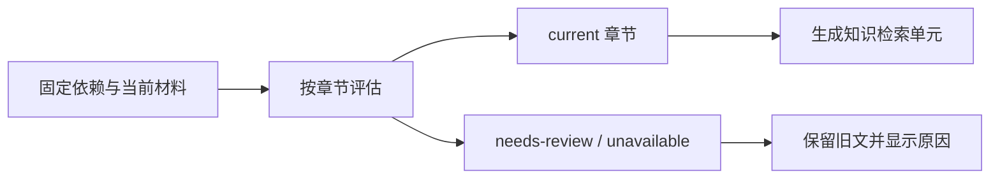

# 知识文章的状态、来源与修改入口

面向需要定位知识更新行为的开发者，区分文章用途、页面生成状态、章节适用状态与整篇汇总状态；说明正文引用、背景前提、调查轨迹怎样影响固定历史、目录、API、助手和检索，并给出导入资产下架及主要修改入口。

来源：gpt-5.6-sol 分析，gpt-5.6-sol 独立复核；模型解释仍可被原始证据纠正。

## 先用局部变化读懂问题

假设一篇活动文章有“预算”和“集合地点”两节。原件把预算从八十元改成一百二十元，地点仍是图书馆。系统不会把整篇文章删除：文章仍可打开并显示“待更新”，预算节保留旧解释但退出知识搜索，地点节仍能被检索；两节中的引用仍打开写作时固定的原件版本。这是代码中的教学示例，不是用户真实经历。参考 [预算与地点的局部变化示例 ↗](../../../apps/server/tests/knowledge-lifecycle.test.ts#L92 "支持贯穿示例中预算节退出检索、地点节继续可用、旧文章与固定引用仍保留。")

这个场景揭示了维护模型的核心：**可阅读**、**可当作当前解释检索**、**引用能否回到历史原文**是三件不同的事。局部变化只缩小可用范围，不自动改写旧文，也不把旧引用重定向到新版。参考 [局部维护的设计边界 ↗](../../../docs/reader-first/publication-lifecycle.md#L27 "解释局部变化、固定引用、显式更新及缺少自动语义影响分析的产品边界。")

## 四类状态分别回答什么

| 概念 | 值 | 回答的问题 |
| --- | --- | --- |
| 发布用途 `KnowledgeRole` | `article` / `reference` / `note` | 这份知识面向哪类阅读与召回入口？ |
| 页面生成状态 | `planned` / `writing` / `published` / `failed` / `retired` | 整理工作进行到哪一步？ |
| 章节适用状态 `SectionStatus` | `current` / `needs-review` / `unavailable` | 这一节现在能否继续作为已核对解释？ |
| 页面 `current` | 布尔值 | 是否所有章节都为 `current`？ |

用途不是新旧状态。显式 `publication.role` 优先；旧资产才按保存的阅读目标迁移：参考页成为 `reference`，其他有阅读目标的页面成为 `article`，没有目标的旧说明成为 `note`，不会从路径或 key 猜测。`note` 仍可存于仓储，但不进入发布目录和知识召回。参考 [知识用途与调查轨迹类型 ↗](../../../packages/contracts/src/knowledge.ts#L92 "定义 article、reference、note，并说明 publication 与 investigation 的语义。") [旧资产用途迁移规则 ↗](../../../apps/server/src/knowledge/lifecycle.ts#L10 "支持用途优先取显式 role，旧资产按 reading 迁移且不依赖路径或 key。")

页面状态独立保存。写作先保存计划并进入 `writing`，成功转为 `published`，异常转为 `failed`。目录用的 `published()` 只排除 `planned`、`retired` 和 `note`；因此已有正文即使新一轮写作失败，旧版本仍可读。参考 [页面状态筛选 ↗](../../../apps/server/src/knowledge/repository.ts#L127 "支持计划保存、状态写入、pages 与 published 的筛选差异。") [写作状态流转 ↗](../../../apps/server/src/knowledge/pipeline.ts#L251 "支持 writePage 从计划到 writing，并在成功或异常时转为 published 或 failed。")

章节状态才决定内容能否继续使用：有完整固定来源且上下文未变是 `current`；原文章节、背景前提或下层解释变化是 `needs-review`；固定版本或依赖缺失则是 `unavailable`。仓储刷新时把“所有章节均为 current”汇总为页面 `current`，所以整篇待更新不等于每节都失效。参考 [章节状态判定 ↗](../../../apps/server/src/knowledge/lifecycle.ts#L83 "支持 current、needs-review、unavailable 的主要触发条件及背景前提变化提示。") [整篇状态汇总 ↗](../../../apps/server/src/knowledge/repository.ts#L265 "支持页面 current 由全部章节状态汇总，而非单独替代章节状态。")

## 正文引用、背景前提与调查轨迹

三种来源关系应按用途保存，而不是合并成一张“读过的文件”列表：

1. **正文引用**位于 `document.citations`，正文用 `[[引用键]]` 就近挂接。目标可以是材料的精确行范围，也可以是另一篇文章的固定章节。发布时把实际引用对应的材料摘要或文章 revision 写入 `dependencies`；API 依此解析固定版本，所以原件换版后仍能打开写作时证据。参考 [正文引用合同 ↗](../../../packages/contracts/src/knowledge.ts#L4 "定义引用键、材料或文章目标、行范围与章节定位。") [固定引用解析 ↗](../../../apps/server/src/knowledge/api.ts#L45 "支持 API 按 artifact dependency 的 digest 或 revision 解析固定材料与文章版本。")
2. **背景前提**位于章节 `reviewSources`。它记录没有写成正文论断、但变化后必须复核本节的配置、约定或调用条件。生成管线要求作者确实读过该范围，并把它加入固定依赖；生命周期与正文引用一起比较，但提示原因会明确写成“背景前提已有变化”。参考 [章节背景前提合同 ↗](../../../packages/contracts/src/knowledge.ts#L25 "定义 reviewSources 的材料范围与原因字段，说明其属于章节级更新依据。") [背景前提进入固定依赖 ↗](../../../apps/server/src/knowledge/pipeline.ts#L140 "支持生成时校验已读范围，并把正文引用与 reviewSources 对应材料写入 dependencies。")
3. **调查轨迹**位于 `investigation`，运行 trace 还可保存研究 findings 与角色活动。它回答“研究过程读过什么”，不表示每份材料直接支持正文，也不会仅因偶然读过的材料换版就把章节判旧。参考 [调查轨迹的生成 ↗](../../../apps/server/src/knowledge/pipeline.ts#L180 "支持将实际读取材料保存为 investigation，并将研究发现与运行 trace 放入 generation。")

调查轨迹虽不是更新依据，仍是访问边界。检索投影要求调查材料仍在当前可见范围，并递归检查文章依赖；授权快照也只复制允许材料及其可满足的固定知识版本。这样可以让派生解释参与检索，又不越过原材料权限。参考 [检索的生成背景可见性 ↗](../../../apps/server/src/retrieval/units.ts#L577 "支持检索投影检查 investigation 材料和递归文章依赖仍处于可见范围。") [调查快照的授权复制 ↗](../../../apps/server/src/knowledge/research-snapshot.ts#L98 "支持调查快照只复制授权材料能够满足的固定文章依赖及其页面记录。")

## 从原件变化到搜索结果

仓储的 `statusReader()` 汇集当前材料、全部文章、可按摘要恢复的历史材料和人工失效记录，再调用统一生命周期判断。材料摘要相同可直接沿用；摘要变化时，只对 Markdown 章节或代码结构寻找同标题、同类型的唯一包围结构并比较完整文本。因此单纯移动行号或修改无关导读可以保持章节有效，但固定引用本身不会映射到新版。图片、无精确范围、普通文档级文本或无法唯一定位的结构不能享受这种局部保留。参考 [统一状态读取入口 ↗](../../../apps/server/src/knowledge/repository.ts#L163 "支持 statusReader 组装当前材料、固定历史、文章与失效记录后调用生命周期判断。") [结构上下文比较 ↗](../../../apps/server/src/knowledge/lifecycle.ts#L40 "支持材料元数据检查、摘要快速通过，以及按唯一章节或代码结构比较完整文本。")

文章引用按保存的子文章 revision 递归评估；指定了 section 就只看该节，否则看整篇。固定子版本不可读会变成 `unavailable`，子节待更新或最新解释已经改变会让上层成为 `needs-review`。参考 [文章依赖递归判定 ↗](../../../apps/server/src/knowledge/lifecycle.ts#L152 "支持固定子文章版本、指定章节状态及最新解释变化对上层状态的影响。")

检索只为 `current` 章节生成单元。若文章仅部分章节可用，可用节仍进入索引，但结果携带整篇 `needs-review` 标记；引用锚点继续指向固定旧原件。开头示例中，地点节因此继续出现，预算节不再出现。参考 [当前章节检索投影 ↗](../../../apps/server/src/retrieval/units.ts#L660 "支持只为 current 章节生成检索单元，同时保留整篇 needs-review 标记和固定引用锚点。")

## 目录、API、助手与检索怎样取舍

| 入口 | 可见或可用内容 | 主要实现入口 |
| --- | --- | --- |
| 阅读目录 | `published()` 中的 `article` 与 `reference`；局部待更新文章仍保留 | `knowledge/repository.ts`、`KnowledgeHome.vue` |
| 单篇 API | 可按 key 读取当前正文，也可显式指定 revision；同时返回逐节状态和解析后的固定引用 | `knowledge/api.ts` |
| 搜索 API | 只在发布集合中搜索，并只采用 `current` 章节 | `knowledge/api.ts`、`retrieval/units.ts` |
| 助手 | 先按会话权限筛原件，再把发布文章放入同一调查快照 | `assistant/research.ts`、`knowledge/research-snapshot.ts` |

`GET /articles` 返回发布正文和页面计划；`GET /articles/:key` 则直接按 key/revision 读取，并附带 `sectionStatus` 与引用解析。后者没有再次要求文章属于目录，因此“能按已知固定版本读取历史”和“有资格出现在目录”应分开理解。参考 [文章列表与固定版本 API ↗](../../../apps/server/src/knowledge/api.ts#L43 "支持列表返回 published 与 pages，而单篇接口可按 key/revision 读取并返回章节状态和解析引用。")

助手把知识当作派生背景。知识搜索结果暴露 revision、section、原始 references 与 `reviewState`，读取文章也返回 dependencies；最终回答的事实引用仍必须落在本次授权的原始材料行范围内。待更新知识可以帮助找到线索，但不能被声称为已重新核对的当前事实。参考 [助手调查材料授权 ↗](../../../apps/server/src/assistant/research.ts#L49 "支持助手先按会话可见性筛原件，再以发布文章和同一可见策略准备调查环境。") [知识作为派生背景 ↗](../../../apps/server/src/knowledge/agent-research.ts#L590 "支持知识搜索与读取暴露 revision、section、references、dependencies 和 reviewState，并提示回查原文。")

统一检索与 API 备用搜索都按章节过滤：前者投影当前章节，后者显式检查章节状态。因此排查“文章明明能打开，为什么搜不到某一节”时，应先看该节状态和生成背景可见性，而不是只看页面是否在目录。参考 [当前章节检索投影 ↗](../../../apps/server/src/retrieval/units.ts#L660 "支持只为 current 章节生成检索单元，同时保留整篇 needs-review 标记和固定引用锚点。") [搜索 API 的章节过滤 ↗](../../../apps/server/src/knowledge/api.ts#L121 "支持搜索限定发布集合，并在备用搜索路径显式只采用 current 章节。")

## 导入资产移除以后保留什么

文件资产恢复以导入目录为 owner，记录“文章 key—revision”成员关系。只有整个目录都能解析时才执行成员对账；暂时损坏的 JSON 会被报告，但不会被误判为资产删除。参考 [资产目录恢复与对账 ↗](../../../apps/server/src/knowledge/artifacts.ts#L32 "支持导入目录作为 owner、暂时不可解析不视为删除，以及只在目录可解析时执行 reconcile。")

某资产从目录消失后，仓储先移除该 owner 的成员关系。只有不存在其他导入 owner，且当前 head 仍恰好是该 owner 管理的 revision，页面才会转为 `retired`。若用户后来发布了自己的 revision，head 已不同，移除导入资产不会下架用户版本；同一受管资产重新出现时可以恢复 `published`。参考 [导入成员下架规则 ↗](../../../apps/server/src/knowledge/repository.ts#L144 "支持只在无其他 owner 且 head 仍为受管 revision 时 retired，并可恢复相同资产。")

`retired` 只让页面退出目录和检索，不会删除 `knowledge_revisions`、历史 head 所需记录或原件 revision。文章仍可按 key+revision 读取，材料仍可按 key+digest 从同一 source 的历史版本恢复。导入新资产也只能推进它此前管理的 head，不能覆盖用户接管后的版本。物理清理历史必须另行核对引用，不能与目录下架混为一谈。参考 [历史文章与受管 head ↗](../../../apps/server/src/knowledge/repository.ts#L229 "支持导入只能推进自己管理的 head，并保留固定依赖对应的历史文章 revision。") [历史材料恢复 ↗](../../../apps/server/src/knowledge/repository.ts#L272 "支持按同一 source 的历史 revisions 和预期 digest 恢复固定材料。")

## 按问题定位修改入口与能力边界

- 改**类型、引用与页面计划合同**：`packages/contracts/src/knowledge.ts`。
- 改**用途迁移、章节状态与结构比较**：`apps/server/src/knowledge/lifecycle.ts`。
- 改**页面状态、目录资格、固定历史和导入所有权**：`apps/server/src/knowledge/repository.ts`。
- 改**生成时三类来源关系与写作状态切换**：`apps/server/src/knowledge/pipeline.ts`。
- 改**资产恢复与下架触发**：`apps/server/src/knowledge/artifacts.ts`；开发仓历史补齐在 `apps/server/src/review/development.ts`。
- 改**HTTP 列表、单篇读取与搜索**：`apps/server/src/knowledge/api.ts`。
- 改**统一检索的章节投影和可见性**：`apps/server/src/retrieval/units.ts`。
- 改**助手授权材料与固定知识快照**：`apps/server/src/assistant/research.ts`、`knowledge/research-snapshot.ts`、`knowledge/agent-research.ts`。参考 [知识维护修改地图 ↗](../../../docs/reader-first/publication-lifecycle.md#L41 "为开发者提供合同、发布更新、搜索调查和阅读操作的主要代码入口。")

最后要守住边界：当前比较回答的是“哪一节需要复查”，不是对代码语义未变化的证明。系统没有完整调用图或自动跨文件影响分析；会改变解释的重要跨文件条件应显式写进 `reviewSources`。更新也是显式触发，不能假定后台会自动重写所有受影响文章。参考 [局部维护的设计边界 ↗](../../../docs/reader-first/publication-lifecycle.md#L27 "解释局部变化、固定引用、显式更新及缺少自动语义影响分析的产品边界。")
