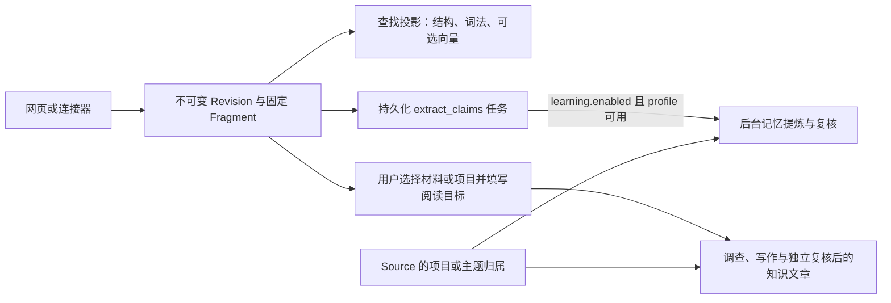

# 一份材料的旅程：从导入到阅读与引用

用一份两节 Markdown 项目约定走完 omem 的材料链路：网页或连接器如何形成统一输入，同一来源如何保留不可变版本，固定片段与可重建检索投影为何分开，以及保存后查找、后台记忆和知识文章分别在什么条件下发生。最后解释旧版引用、图片与代码的特殊边界，并按修改目标给出代码入口。

来源：gpt-5.6-sol 分析，gpt-5.6-sol 独立复核；模型解释仍可被原始证据纠正。

<a id="walkthrough"></a>
## 先走一遍：同一份约定从 V1 到 V2

先给结论：**同一来源类型与同一来源标识，会把多次导入串成一条 Source 版本链；内容变化时，新内容成为下一版 Revision，旧版仍然保留。** 搜索、后台记忆和知识文章都从这条原件链出发，但它们不是同一份数据，也不会在“保存”瞬间一起完成。

下面是贯穿全文的教学示例，不是仓库里的真实项目材料。第一次在网页选择“主动输入”，标题填“项目约定”，来源标识填 `project-rules`，正文是：

```markdown
# 提交
合并前运行检查。

# 发布
发布由值班同学执行。
```

保存后，页面打开服务端返回的 Revision，并提示固定证据片段已经生成。第二次仍选 `manual`，仍填 `project-rules`，只把第一条改成“合并前运行完整检查并记录结果”。网页再次提交同一来源身份；Store 找到原来的 Source，内容指纹变化，于是写入 V2，并把 Source 的当前 head 指向 V2。V1 没有被覆盖。参考 [网页捕获与来源标识 ↗](../../../apps/web/src/App.vue#L423 "支持网页组装 parts、留空来源标识时生成随机 ID、保存后打开 Revision 的案例行为。") [Source 查找与新版本写入 ↗](../../../apps/server/src/store.ts#L176 "支持同一 source/externalId 复用 Source、变化时创建下一版并更新 head。")

这里有一个会直接改变结果的输入细节：网页允许把来源标识留空，但此时每次提交都会生成新的随机标识。因此，想让第二次导入自然接成 V2，就要继续使用原来的标识；留空更适合创建一条新来源链。参考 [网页捕获与来源标识 ↗](../../../apps/web/src/App.vue#L423 "支持网页组装 parts、留空来源标识时生成随机 ID、保存后打开 Revision 的案例行为。")

<a id="capture-input"></a>
## 网页和连接器最终交出同一种输入

网页、服务器文件、Git 文件和飞书文档的入口不同，但越过适配器边界后都交给 Store 一个 `CaptureInput`。这个输入的核心是稳定的 `source + externalId`、标题、1–50 个 parts，以及可选的观察时间、上游版本、来源上下文和 provenance。part 可以是非空文本、HTTP(S) 链接，或 PNG/JPEG/WebP 图片。项目/主题选择不属于原件正文合同；HTTP 路由把 `contextIds` 单独交给 Store。参考 [CaptureInput 合同 ↗](../../../packages/contracts/src/index.ts#L21 "说明 text、link、image parts、来源身份、数量限制和可选来源元数据。") [捕获与连接器 HTTP 路由 ↗](../../../apps/server/src/app.ts#L262 "说明 contextIds 作为选择参数单独传给 Store，连接器结果仍进入同一 capture 路径。")

连接器把外部读取约束收在入口处：

- 文件连接器只读取 `captureRoots` 内的 UTF-8 文本，大小上限为 500 KB；
- Git 连接器先把 ref 解析成 commit SHA，再读取单个路径，并把 SHA 记为 `upstreamVersion`；
- 飞书连接器只接受受支持主机上的 HTTPS docx/wiki 链接，通过已有 CLI 登录态读取 Markdown，并保留文档 ID 与 revision ID；
- 捕获正文里的 URL 只是链接 part，不会因为出现 URL 就自动爬取。

参考 [受控文件、Git 与飞书连接器 ↗](../../../apps/server/src/connectors.ts#L1 "说明各连接器的读取边界以及它们如何统一构造 CaptureInput。")

因此，增加一种导入方式时，合适的边界是“受控读取外部内容，然后构造 `CaptureInput`”；后面的版本、片段和任务逻辑仍复用同一条 Store 路径。参考 [受控文件、Git 与飞书连接器 ↗](../../../apps/server/src/connectors.ts#L1 "说明各连接器的读取边界以及它们如何统一构造 CaptureInput。") [捕获与连接器 HTTP 路由 ↗](../../../apps/server/src/app.ts#L262 "说明 contextIds 作为选择参数单独传给 Store，连接器结果仍进入同一 capture 路径。")

<a id="immutable-original"></a>
## 为什么改一条规则不会覆盖旧版

保存时，Store 先用 `source + externalId` 找到或创建稳定 Source。若当前标题、正文和相关来源元数据与 head 相同，可以复用原版本；若发生变化，则插入新的 Revision，版本号加一，并用 `previousId` 指向旧 head。随后它把文本按空行切成固定 Fragment，链接和图片也各形成证据片段，最后才把 Source head 切到新 Revision。参考 [不可变 Revision 与固定 Fragment ↗](../../../apps/server/src/store.ts#L108 "支持图片资产处理、版本插入、previousId、片段生成、head 更新及捕获完成边界。")

这三个概念分别回答不同问题：

- **Source**：这些版本是不是同一个外部来源？
- **Revision**：某次保存时实际收到的完整内容是什么？
- **Fragment**：以后要引用的固定证据锚点在哪里？

项目/主题归属又是另一层。手工选择写在 Source membership 上，所以换成 V2 后仍属于同一项目；它不会被塞进某一版正文。人工选择有最高优先级，包括明确选择空集合。参考 [Source 级项目与主题归属 ↗](../../../apps/server/src/contexts/repository.ts#L35 "说明 membership 绑定 Source、人工选择被记录且可为空。")

回到示例：V1 和 V2 是同一 Source 的两个不可变 Revision；当前列表通常从 head 看到 V2，但需要历史证据时仍可找到 V1。Fragment 适合固定引用，不应该顺手充当全文阅读目录。

<a id="retrieval-projection"></a>
## 保存后如何查找：索引是投影，不是原件

检索使用可重建的 retrieval units，而不是修改 Revision，或把 Fragment 当作最佳阅读切分。Markdown 投影按标题与语法块产生 passage，并保留原行号；引导句若紧接列表、表格或代码，会尽量和后者放在同一 passage。代码投影则优先保留完整函数或方法控制流、父级路径，以及顶层导入和初始化内容。参考 [Markdown 与代码检索投影 ↗](../../../apps/server/src/retrieval/units.ts#L33 "说明 Markdown 按结构块投影、代码保留完整操作和模块初始化的实现。")

查询时，检索器会先同步这些单位，再做全文 BM25 和符号召回；有 embedding 模型时再加入语义候选。如果没有模型，或者 embedding 计算失败，它仍会返回词法与符号结果。参考 [词法、符号与语义检索回退 ↗](../../../apps/server/src/retrieval/unified.ts#L427 "支持查询时同步单位、无模型或 embedding 失败时仍使用词法与符号结果。")

所以两个看似矛盾的说法可以同时成立：**材料保存后，不必等后台学习 Agent 才能进入结构化查找；但语义向量可能仍在补齐。** Revision 和固定 Fragment 是事实依据；passage、全文索引和向量是为查找而生的投影，损坏或换模型时可以重建。

<a id="post-capture-branches"></a>
## 保存之后分成三条用途

一次保存不会自动变成“一份已经整理好的知识”。更准确的关系是：



这三条分支的启动条件不同：

1. **查找**：查询入口会同步可重建投影，不依赖后台学习开关。参考 [词法、符号与语义检索回退 ↗](../../../apps/server/src/retrieval/unified.ts#L427 "支持查询时同步单位、无模型或 embedding 失败时仍使用词法与符号结果。")
2. **后台记忆**：原始材料保存时会排下 `extract_claims` 任务，但 `learning.enabled` 默认关闭；只有开关启用且指定 profile 存在，应用才创建 `LearningPipeline` 去消费任务。排队成功不等于已经提炼或复核完成。参考 [捕获时排下提炼任务 ↗](../../../apps/server/src/store.ts#L394 "说明非 derived 输入保存后排队 extract_claims，但这里只代表任务持久化。") [后台学习默认关闭 ↗](../../../apps/server/src/config.ts#L63 "支持 learning.enabled 的默认值及 profile、轮询配置。") [LearningPipeline 启动条件 ↗](../../../apps/server/src/app.ts#L122 "说明只有启用 learning 且找到指定 profile 才实例化后台学习管线。")
3. **知识文章**：它不是捕获的自动副作用。用户要选择固定材料和/或持续跟踪的项目、主题，再填写希望读者弄懂的问题与场景；服务端校验材料范围、保存 page plan，然后排队调查与写作。固定 `materialKeys` 与动态 `contextIds` 的当前成员取并集。参考 [文章选材与阅读目标界面 ↗](../../../apps/web/src/knowledge/ArticleComposer.vue#L163 "说明知识文章需要先选材料或持续范围，再填写读者问题与场景。") [知识页面计划入口 ↗](../../../apps/server/src/knowledge/api.ts#L200 "支持 profile、阅读目标、固定材料或 context 范围校验，并在保存计划后启动整理。") [固定材料与动态范围取并集 ↗](../../../apps/server/src/knowledge/repository.ts#L123 "说明 materialsForPlan 如何把 materialKeys 与 contextIds 当前成员组合为文章材料范围。")

如果文章后来开启自动维护，Source 换版或动态范围成员变化才会触发同一文章重新整理；没有页面计划、材料范围或 Agent profile 时，不能把“保存材料”理解为“文章已生成”。参考 [知识页面计划入口 ↗](../../../apps/server/src/knowledge/api.ts#L200 "支持 profile、阅读目标、固定材料或 context 范围校验，并在保存计划后启动整理。")

<a id="context-branch"></a>
## 未手工归属时，后台整理可能先问“属于哪个项目”

项目/主题归属只在需要范围的后续整理里起作用，不影响原文是否保存。后台学习已启用、使用原生研究能力、库中已有项目/主题，且 Source 没有人工归属时，事实抽取前可以先调查归属。实现会先形成提案；若提案是明确匹配，再启动独立会话复核。只有两次判断同意同一组 ID，才保存 automatic membership。参考 [事实抽取前的归属调查 ↗](../../../apps/server/src/learning/pipeline.ts#L664 "说明自动归属的前置检查、独立复核、含糊暂停与记录行为。") [自动归属一致性与人工优先 ↗](../../../apps/server/src/contexts/repository.ts#L70 "说明两个判断必须同意同组 ID，人工选择或输入变化会阻止旧自动结果应用。")

如果材料像“接上次发布约定”这样可以明确续接，后续记忆和按项目跟踪的文章就能使用该范围；如果只说“负责人改了”而多个项目都可能符合，系统保留原文、记录候选和澄清问题，并暂缓这份材料的事实抽取。界面允许用户手工选择，也允许明确不选任何项目；人工选择后以用户决定为准，并重新排队需要范围的整理。参考 [事实抽取前的归属调查 ↗](../../../apps/server/src/learning/pipeline.ts#L664 "说明自动归属的前置检查、独立复核、含糊暂停与记录行为。") [含糊归属的人工补充界面 ↗](../../../apps/web/src/SourceContexts.vue#L11 "说明界面展示候选与问题、手工保存归属并重新排队整理。")

因此，自动归属改变的是**后续整理采用哪个范围**，不是原件是否保存；人工补充或纠正始终优先于先前的自动判断。

<a id="pinned-citation"></a>
## 为什么 V2 出现后，V1 引用仍能打开

知识文章发布时，会把正文引用到的材料 key 与当时的 digest 写入 dependencies。点击引用时，API 不是简单读取 Source 当前 head，而是拿文章 Revision 中的 citation，再用对应 dependency digest 解析材料。参考 [发布时固定依赖 digest ↗](../../../apps/server/src/knowledge/pipeline.ts#L190 "说明文章发布产物按正文引用保存材料 digest 依赖。") [按固定依赖解析引用 ↗](../../../apps/server/src/knowledge/api.ts#L64 "说明引用 API 从指定文章版本取 citation，并按 dependency digest 解析材料。")

如果当前材料恰好仍是该 digest，就直接打开当前版；如果 head 已经变成 V2，repository 会沿同一 Source 的历史 Revisions 查找匹配 digest 的旧版。于是，引用 V1“合并前运行检查”的文章，在 V2 出现后仍打开 V1，不会拿 V2 的新句子冒充旧证据。参考 [从 Source 历史找固定材料 ↗](../../../apps/server/src/knowledge/repository.ts#L304 "支持当前 head 不匹配时沿历史 Revision 查找相同 digest。")

但“旧证据还能打开”和“旧解释仍然适用”是两件事。生命周期检查会比较引用所在的原文章节或函数；上下文、图片或 provenance 变化，或者无法唯一定位结构时，会保守地把对应知识章节标为 `needs-review`。它不会把旧 citation 重映射到新文字。参考 [固定引用与章节复核分离 ↗](../../../apps/server/src/knowledge/lifecycle.ts#L72 "说明 citation 不会重映射，原章节、图片或 provenance 变化会使知识章节需要复核。")

这层分离的意义是：引用负责回答“当时依据了什么”，章节状态负责回答“今天是否还应相信这段解释”。

<a id="images-and-code"></a>
## 图片和代码仍走同一来源体系，但有专门投影

**图片**先作为同一 Capture 的 part 进入 Revision。Store 校验 base64、5 MB 上限以及真实字节是否匹配 PNG/JPEG/WebP 声明，再按内容哈希写入私有资产，并在 Revision 中保存资产引用。知识材料读取时，文本和链接被拼成 text，图片则保留为独立 images 列表，供需要视觉能力的调查使用。参考 [图片校验与私有资产保存 ↗](../../../apps/server/src/store.ts#L111 "说明图片字节校验、5 MB 上限、内容哈希和 Revision 资产引用。") [知识材料中的文本与图片 ↗](../../../apps/server/src/knowledge/repository.ts#L13 "说明同一 Revision 如何投影为文本、固定 digest 和独立 images 列表。")

这不等于图片已经被通用 OCR 结构化。当前说明明确写着：图像可进入视觉分析，但还没有通用 OCR、布局定位和视觉索引闭环。参考 [当前图片理解能力边界 ↗](../../../docs/reader-first/current-system.md#L11 "明确当前没有通用 OCR、布局定位和视觉索引闭环。")

**代码**也先作为普通文本进入 Source/Revision；专门能力出现在检索层。代码 passage 以单个文件的 AST 符号为基础，尽量保留完整函数、方法和模块初始化，便于按符号导航。参考 [代码 passage 的单文件结构投影 ↗](../../../apps/server/src/retrieval/units.ts#L92 "说明函数、方法、父级路径和模块初始化如何形成检索单位。") 解析器只建立单文件 TypeScript AST 与 Vue SFC 结构，没有跨文件 `Program`/`TypeChecker`；calls 是名称级 candidate，不是完整调用图。参考 [代码导航不是跨文件调用图 ↗](../../../apps/server/src/code/parse.ts#L1 "明确解析器只有单文件 AST、Vue SFC 与名称级候选调用。")

因此，图片和代码共享“来源—版本—固定证据”的保真底座，但分别使用视觉调查和 AST 导航作为可重建的阅读辅助。

<a id="change-map"></a>
## 想改哪一层，就从哪一层进入

沿着上面的案例定位修改点，会比从对象名表格倒推更直接：

- **改输入形状或网页提交**：看 `packages/contracts/src/index.ts::captureSchema`、`apps/web/src/App.vue::capture/upload`，以及 `apps/server/src/app.ts` 的 capture routes。参考 [网页捕获与来源标识 ↗](../../../apps/web/src/App.vue#L423 "支持网页组装 parts、留空来源标识时生成随机 ID、保存后打开 Revision 的案例行为。") [CaptureInput 合同 ↗](../../../packages/contracts/src/index.ts#L21 "说明 text、link、image parts、来源身份、数量限制和可选来源元数据。") [捕获与连接器 HTTP 路由 ↗](../../../apps/server/src/app.ts#L262 "说明 contextIds 作为选择参数单独传给 Store，连接器结果仍进入同一 capture 路径。")
- **新增或调整连接器**：看 `apps/server/src/connectors.ts`，让适配器最终产出 `CaptureInput`。参考 [受控文件、Git 与飞书连接器 ↗](../../../apps/server/src/connectors.ts#L1 "说明各连接器的读取边界以及它们如何统一构造 CaptureInput。")
- **改版本、图片资产或固定证据**：看 `apps/server/src/store.ts::capture`；这里决定 Source 查找、新 Revision、`previousId`、Fragment 和 head。参考 [不可变 Revision 与固定 Fragment ↗](../../../apps/server/src/store.ts#L108 "支持图片资产处理、版本插入、previousId、片段生成、head 更新及捕获完成边界。") [图片校验与私有资产保存 ↗](../../../apps/server/src/store.ts#L111 "说明图片字节校验、5 MB 上限、内容哈希和 Revision 资产引用。")
- **改 Markdown/代码切分与检索回退**：看 `retrieval/units.ts::markdownPassages/codePassages`、`retrieval/unified.ts::search` 和 `code/parse.ts::parseFile`。参考 [Markdown 与代码检索投影 ↗](../../../apps/server/src/retrieval/units.ts#L33 "说明 Markdown 按结构块投影、代码保留完整操作和模块初始化的实现。") [词法、符号与语义检索回退 ↗](../../../apps/server/src/retrieval/unified.ts#L427 "支持查询时同步单位、无模型或 embedding 失败时仍使用词法与符号结果。") [代码导航不是跨文件调用图 ↗](../../../apps/server/src/code/parse.ts#L1 "明确解析器只有单文件 AST、Vue SFC 与名称级候选调用。")
- **改后台记忆或自动归属**：先看 `config.ts` 与 `app.ts` 的启用条件，再看 `learning/pipeline.ts::resolveContexts/extract` 和 `contexts/repository.ts`。参考 [后台学习默认关闭 ↗](../../../apps/server/src/config.ts#L63 "支持 learning.enabled 的默认值及 profile、轮询配置。") [LearningPipeline 启动条件 ↗](../../../apps/server/src/app.ts#L122 "说明只有启用 learning 且找到指定 profile 才实例化后台学习管线。") [事实抽取前的归属调查 ↗](../../../apps/server/src/learning/pipeline.ts#L664 "说明自动归属的前置检查、独立复核、含糊暂停与记录行为。") [自动归属一致性与人工优先 ↗](../../../apps/server/src/contexts/repository.ts#L70 "说明两个判断必须同意同组 ID，人工选择或输入变化会阻止旧自动结果应用。")
- **改知识选材、写作或历史引用**：看 `knowledge/ArticleComposer.vue`、`knowledge/api.ts`、`knowledge/repository.ts::materialsForPlan/resolveMaterial`、`knowledge/pipeline.ts` 与 `knowledge/lifecycle.ts::knowledgeStatus`。参考 [文章选材与阅读目标界面 ↗](../../../apps/web/src/knowledge/ArticleComposer.vue#L163 "说明知识文章需要先选材料或持续范围，再填写读者问题与场景。") [知识页面计划入口 ↗](../../../apps/server/src/knowledge/api.ts#L200 "支持 profile、阅读目标、固定材料或 context 范围校验，并在保存计划后启动整理。") [固定材料与动态范围取并集 ↗](../../../apps/server/src/knowledge/repository.ts#L123 "说明 materialsForPlan 如何把 materialKeys 与 contextIds 当前成员组合为文章材料范围。") [发布时固定依赖 digest ↗](../../../apps/server/src/knowledge/pipeline.ts#L190 "说明文章发布产物按正文引用保存材料 digest 依赖。") [按固定依赖解析引用 ↗](../../../apps/server/src/knowledge/api.ts#L64 "说明引用 API 从指定文章版本取 citation，并按 dependency digest 解析材料。") [从 Source 历史找固定材料 ↗](../../../apps/server/src/knowledge/repository.ts#L304 "支持当前 head 不匹配时沿历史 Revision 查找相同 digest。") [固定引用与章节复核分离 ↗](../../../apps/server/src/knowledge/lifecycle.ts#L72 "说明 citation 不会重映射，原章节、图片或 provenance 变化会使知识章节需要复核。")

判断修改是否落在正确层，可以用一个简单问题：你是在改变“当时收到什么”、改变“怎样找到它”，还是改变“怎样从原件整理出当前记忆或文章”？前者属于 Capture/Store，中间属于 retrieval，后者属于 learning/knowledge。不要用改索引的方式改写原件，也不要把后台产物误当成捕获成功的必要条件。
