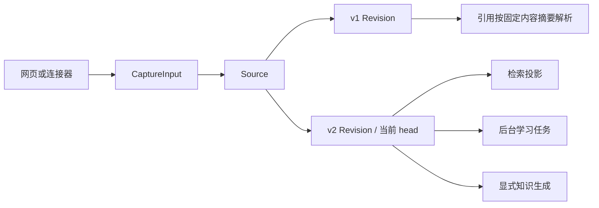

# 一份材料的旅程：从导入到检索、知识与固定引用

用同一份 Markdown 的两次网页导入，解释 CaptureInput 如何变成稳定 Source 与不可变 Revision，何时可被检索，后台学习和显式知识生成如何分工，以及图片、代码和历史引用为何仍共享同一来源体系。

来源：gpt-5.6-sol 分析，gpt-5.6-sol 独立复核；模型解释仍可被原始证据纠正。

<a id="journey"></a>
## 先看一次可观察的旅程

假设你在“输入材料”中保存标题为“项目约定”、来源标识为 `project-rules` 的 Markdown：

```markdown
# 构建
使用 Bun 运行脚本。

# 评审
合并前需要一位评审者。
```

稍后仍用 `project-rules` 导入第二版，只把“一位”改成“两位”。读者会看到同一来源的 v1、v2；当前阅读和检索面向 v2，而引用旧内容的文章仍能找到与写作时内容一致的材料。这里要分清三种东西：**Source** 是跨导入稳定的来源身份，**Revision** 是一次不可变原件，知识文章则是围绕读者问题组织、带引用的派生解释。它可以写成“脚本用 Bun，合并前需两位评审者”，但不能替代原始 Markdown。



这是一套来源的多种用途：原件、检索块和讲解页面采用不同单位，代码也只是在同一来源体系上增加专用解析。参考 [统一来源与组织单位 ↗](../../../docs/reader-first/architecture.md#L5 "支持 Source/Revision 统一来源体系，以及保存、检索和讲解单位分离。")

<a id="input"></a>
## 入口只负责采集与规范化

统一输入合同是 `CaptureInput`：它包含来源类型、`externalId`、标题、1–50 个 part 和上下文；part 可以是文本、HTTP(S) 链接或 PNG/JPEG/WebP 图片，并可携带来源与时间信息。参考 [统一捕获输入合同 ↗](../../../packages/contracts/src/index.ts#L21 "支持文本、图片、链接、来源标识、标题、上下文和数量限制的输入说明。")

网页会把正文、可选链接和图片组成 parts；没有来源标识时才生成随机值。手工输入还带上已认证 owner、事件标识和时间，然后提交到 `/captures`。连接器入口也不会绕开保存逻辑：文件、Git、飞书和 Traex hook 都先变成同一合同，再调用 `Store.capture`。参考 [网页捕获载荷 ↗](../../../apps/web/src/App.vue#L416 "支持网页组装 parts、来源标识及每次创建 eventId 和 eventAt 的行为。") [捕获与连接器路由 ↗](../../../apps/server/src/app.ts#L247 "证明直接捕获、文件、Git、飞书和 hook 最终都调用 Store.capture。")

因此，想改变“页面交给服务端什么”，先看前端载荷与合同；想增加外部来源，则在连接器中完成受限读取和字段映射。文件连接器只读允许根内的 UTF-8 文本，Git 连接器先把 ref 固定到 commit，并把 SHA 记为上游版本；正文里的 URL 只被保留，不会被自动抓取。参考 [文件与 Git 连接器 ↗](../../../apps/server/src/connectors.ts#L1 "支持连接器的受限读取、UTF-8 校验、commit 固定和 upstreamVersion 映射。")

<a id="revision"></a>
## 一次保存如何形成固定版本

`Store.capture` 以“来源类型 + `externalId`”查找 Source。首次导入创建 Source 和 v1；此后它比较**标题与完整保存载荷的指纹**，载荷包括 parts、context、provenance、`observedAt` 和 `upstreamVersion`。指纹不同便插入下一版，让 `previous_id` 指回旧 head；相同则复用当前 Revision。参考 [修订指纹与版本创建 ↗](../../../apps/server/src/store.ts#L139 "支持指纹由标题、parts、context、provenance、observedAt、upstreamVersion 组成，以及按来源身份创建递增 Revision。")

这意味着“正文没改”不必然等于“不会换版”：网页每次手工提交都会创建新的 `eventId` 与 `eventAt`，它们属于 provenance，也参与上述指纹，所以新一次点击可能形成新 Revision。仓库同步的语义不同：它先比较正文 SHA-256，正文未变就不调用 `capture`，避免仅 `syncedAt` 变化制造版本。示例第二次确实改了规则，因此会形成 v2。参考 [网页捕获载荷 ↗](../../../apps/web/src/App.vue#L416 "支持网页组装 parts、来源标识及每次创建 eventId 和 eventAt 的行为。") [仓库文件幂等捕获 ↗](../../../apps/server/src/review/sync.ts#L463 "支持仓库文件按正文哈希避免仅同步时间变化造成重复修订，再把固定文本交给 Store.capture。")

文本 part 按空行生成固定 fragment，链接生成“标签 + URL”片段，图片生成带标签的片段。示例中的两节 Markdown 因空行分隔而得到可引用片段；v2 会生成自己的新片段，v1 不被覆盖。捕获返回前，原件、片段、head、变更记录和任务入队已经完成；来源更新还会让依赖旧版的记忆失效并排入重核验。这里的“已入队”不等于模型已经处理完，更不等于知识文章已经生成。参考 [片段生成 ↗](../../../apps/server/src/store.ts#L213 "支持文本、链接和图片生成固定 fragment 的方式。") [捕获事务后半段 ↗](../../../apps/server/src/store.ts#L234 "支持 head 更新、旧记忆失效、刷新任务、变更记录、回执和提取任务入队。")

<a id="retrieval"></a>
## 保存后何时能搜到

检索不会直接拿保存用 fragment 当最终结果。普通 Markdown 按标题上下文、列表、表格和代码块组织 passage；TS、JS、Vue 等代码则按 AST 符号保留完整函数或方法，并补上导入与顶层初始化。保存单位与检索单位因此可以分别服务于保真和找回。参考 [Markdown 与代码检索切分 ↗](../../../apps/server/src/retrieval/units.ts#L31 "支持 Markdown 结构块与代码 AST 符号采用不同 passage 策略。")

检索投影只读取每个 Source 的当前 head；当 Revision 或材料说明变化时，以新的身份替换该来源的检索单元。每次统一搜索会先等待投影追平，所以 v2 能在该次搜索前进入全文检索。若启用了 embedding，向量由后台分批补齐；模型尚未就绪或嵌入失败时，搜索仍会用 lexical 结果。换句话说，原文和片段在捕获事务内固定，但向量索引不在这个事务内完成。参考 [当前来源投影 ↗](../../../apps/server/src/retrieval/units.ts#L451 "支持检索投影只读取当前 head，并在身份变化时替换来源单元。") [搜索追平与向量降级 ↗](../../../apps/server/src/retrieval/unified.ts#L370 "支持搜索前等待投影同步，以及向量不可用时保留 lexical 路径。")

<a id="processing"></a>
## 后台学习与知识文章是两条支路

非派生 Capture 会排入 `extract_claims`。只有配置了学习 profile，应用才会建立 LearningPipeline；任务处理会核对固定 Revision 与有效性 epoch，图片还会以真实字节交给多模态 Agent。提取结果先成为观察与 proposal，再交给独立 verifier，最终由 MemoryService 按策略应用、待判断或拒绝，模型并不直接写入事实。参考 [学习管线装配 ↗](../../../apps/server/src/app.ts#L121 "支持只有配置学习 profile 才建立 LearningPipeline。") [固定输入与图片上下文 ↗](../../../apps/server/src/learning/pipeline.ts#L290 "支持学习任务核对固定 Revision，并向 Agent 提供 fragment 和真实图片字节。") [提取复核与策略应用 ↗](../../../apps/server/src/learning/pipeline.ts#L604 "支持提案经独立 verifier 复核后由 MemoryService 整批评估和应用。")

知识文章不是这条队列的自动副作用。用户在“整理文章”中选择当前 Revision，并提交读者、目标、标题和问题；`/knowledge/pages` 校验材料仍为当前版本后返回 202，后台再执行调查、写作、独立复核与发布。只有复核接受的文档会发布，并保存实际材料摘要作为依赖。批量知识整理走 `/analyze`，材料用途分析走 `/describe`，两者也都需要显式调用。参考 [显式知识页面入口 ↗](../../../apps/server/src/knowledge/api.ts#L165 "支持选择当前 Revision 并显式启动页面或批量知识整理。") [材料用途分析入口 ↗](../../../apps/server/src/knowledge/api.ts#L28 "支持 /describe 校验所选当前材料后显式启动材料用途分析。") [知识调查复核与发布 ↗](../../../apps/server/src/knowledge/pipeline.ts#L157 "支持原生调查、写作、独立复核与接受后发布。")

所以可用一句话判断状态：**Capture 返回时已有可读、可追溯的原件；检索投影随搜索或后台追平；学习 Agent 可继续整理记忆；知识页面必须显式发起。**

<a id="history"></a>
## 引用固定内容身份，不总是固定 Revision

知识材料有自己的 digest：它由材料正文、图片及 actor、quoted、forwarded 等来源属性计算，不包含 `revisionId`、标题、context、`eventAt` 或 `upstreamVersion`。因此它表达的是**知识阅读所用的内容身份**，范围比 Capture 的版本指纹窄。示例把“一位”改成“两位”，正文改变，v1 与 v2 的材料 digest 也会不同；若新 Revision 只改了未纳入 digest 的元数据，两版则可能共享同一 digest。参考 [知识材料摘要范围 ↗](../../../apps/server/src/knowledge/repository.ts#L12 "说明材料 digest 由正文、图片及部分来源属性计算，不等同于 Revision 身份或 Capture 指纹。")

发布时，仓储会同时校验直接材料依赖的 digest 和文章依赖的 revision。发布后刷新 current 状态时，直接材料 digest 不匹配会使文章失效；但若某次来源换版后材料 digest 不变，**仅这次换版本身**不会让直接依赖它的文章失效。文章依赖换版、显式 invalidation，以及被依赖文章已经失效并向上层传播，也都可以让文章变为非 current。参考 [发布依赖校验 ↗](../../../apps/server/src/knowledge/repository.ts#L122 "支持发布时同时校验材料 digest 与文章 revision 依赖。") [文章当前状态刷新 ↗](../../../apps/server/src/knowledge/repository.ts#L179 "支持材料或文章依赖失配、显式 invalidation 及下游失效传播共同决定 current。")

读者点击引用时，服务先从文章依赖中取出写作时的 digest。解析会先检查当前材料：若当前 head 的 digest 相同，就直接返回当前 Revision；只有当前 digest 不同，才沿同一 Source 的历史 Revision 反向查找匹配内容。找不到时会明确说明固定材料不可用。参考 [固定引用解析 ↗](../../../apps/server/src/knowledge/api.ts#L45 "支持引用从文章依赖取得固定 digest，再解析材料并给出人读错误。") [材料摘要解析顺序 ↗](../../../apps/server/src/knowledge/repository.ts#L193 "支持先返回 digest 相同的当前材料，仅在不匹配时遍历同一 Source 的历史 Revision。")

所以本例的旧引用会打开 v1，是因为规则正文已经改变；这不代表所有引用都固定了精确 `revisionId`。真正固定的是材料内容摘要：元数据变化但 digest 相同时，引用可能解析到当前 Revision。界面仍会根据解析结果标明当前或历史版本。参考 [当前与历史阅读标识 ↗](../../../apps/web/src/knowledge/KnowledgeSource.vue#L19 "支持前端以 digest 请求原文，并明确标识当前版本或历史版本。")

<a id="specialized"></a>
## 图片、代码与修改入口

图片进入 Store 时会校验 base64、大小和真实文件签名，再按内容哈希保存资产；Revision body 只保留 assetId、MIME 和标签。纯图片材料可用标签形成文本检索单元，后台学习能读取真实字节；阅读接口会核对已存 MIME 后以该类型返回图片。参考 [图片资产固定 ↗](../../../apps/server/src/store.ts#L105 "支持图片真实类型校验、内容哈希命名和安全落盘。") [图片检索投影 ↗](../../../apps/server/src/retrieval/units.ts#L265 "支持纯图片材料使用标签形成可检索单元。") [图片阅读接口 ↗](../../../apps/server/src/knowledge/api.ts#L99 "支持材料接口提供资产 URL，并在资产读取时校验已存 MIME 后返回图片字节。")

代码原文同样先成为 file Source/Revision。仓库同步在正文哈希未变时不造新版本；CodeKnowledgeService 只读取捕获 head 的固定文本，再建立代码快照，把快照文件绑定到 `reviewRevisionId`，并把 AST 符号绑定到对应 fragment；解析得到的定义、导入和同文件调用再写为关系边，其中调用只是候选关系。参考 [仓库文件幂等捕获 ↗](../../../apps/server/src/review/sync.ts#L463 "支持仓库文件按正文哈希避免仅同步时间变化造成重复修订，再把固定文本交给 Store.capture。") [代码读取固定原文 ↗](../../../apps/server/src/code/sync.ts#L170 "支持代码分析只读取捕获 head 的不可变文本，而不混用实时文件内容。") [快照与符号绑定 ↗](../../../apps/server/src/code/sync.ts#L220 "支持快照绑定 reviewRevisionId，以及 AST 符号绑定回对应 fragment。") [代码关系边 ↗](../../../apps/server/src/code/sync.ts#L272 "支持定义、导入与同文件调用写入关系边，并明确调用边状态为 candidate。")

| 想改什么 | 入口 |
| --- | --- |
| 输入字段与网页载荷 | `packages/contracts/src/index.ts`、`apps/web/src/App.vue` |
| 外部来源规范化 | `apps/server/src/connectors.ts` |
| 版本、片段、资产与入队 | `apps/server/src/store.ts` |
| 检索切分与追平 | `apps/server/src/retrieval/units.ts`、`unified.ts` |
| 后台记忆学习 | `apps/server/src/learning/pipeline.ts` |
| 知识生成与历史引用 | `apps/server/src/knowledge/*` |
| 代码固定快照 | `apps/server/src/review/sync.ts`、`code/sync.ts` |

当前不能把图片入口描述成完整 OCR/PDF/Office 管线，也不能把代码候选关系描述成完整跨文件调用图；跨文件业务链与全面 OCR 仍是明确缺口。参考 [当前能力缺口 ↗](../../../docs/reader-first/progress.md#L35 "支持跨文件业务链和全面 PDF、Office、OCR 闭环尚未完成的限制说明。")
