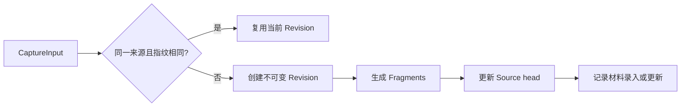
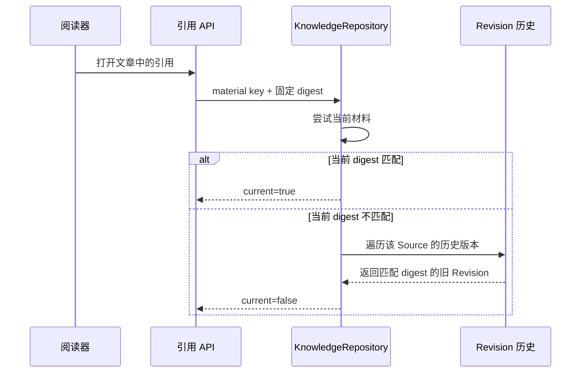

# 一份材料的旅程：从导入、版本化到可追溯阅读

以一份两节 Markdown 项目约定的两次导入为例，沿统一输入、不可变版本、即时检索、后台学习、知识生成和历史引用的主链，说明图片与代码如何在同一来源体系中获得专门处理，并给出对应实现入口。

来源：gpt-5.6-sol 分析，gpt-5.6-sol 独立复核；模型解释仍可被原始证据纠正。

<a id="scenario"></a>
## 从一份两节约定开始

假设网页保存下面这份材料：

```markdown
# 项目约定

## 提交
提交前运行检查。

## 发布
发布前由一人批准。
```

网页提交的不是一篇“知识文章”，而是统一的 `CaptureInput`：它用 `source` 和 `externalId` 标识来源，携带标题及 1～50 个文本、链接或图片 part；说话者、事件时间、回复关系和原始或派生属性也可随捕获或单个 part 保留。参考 [统一捕获合同 ↗](../../../packages/contracts/src/index.ts#L4 "支持 CaptureInput 的来源标识、part 类型、数量范围，以及捕获级和 part 级来源信息。")

直接保存走 `POST /api/captures`；文件、Git、飞书和 hook 连接器先把各自输入转换并校验为同一合同，再调用 `store.capture`。需要静默窗口的聊天或屏幕事件会先聚合，最终仍进入相同保存入口。参考 [服务端输入入口 ↗](../../../apps/server/src/app.ts#L206 "支持直接捕获、各连接器和聚合输入最终调用同一保存入口。")

文件连接器会产生一个文本 part；Git 连接器还会先把 ref 固定成 commit SHA，并把它写入 `upstreamVersion`。连接器负责安全取得输入，后面的版本、检索和学习流程不必为每种来源各建一套。参考 [文件与 Git 连接器 ↗](../../../apps/server/src/connectors.ts#L19 "说明文件输入的构造方式，以及 Git ref 固定为 commit 后写入上游版本。")

<a id="versioning"></a>
## 同一来源怎样形成不可变版本

第一次导入时，Store 按 `source + externalId` 查找 Source；不存在便创建。标题、保存后的 parts、上下文和上游版本等共同形成内容指纹。若同一来源的当前 head 指纹没有变化，系统直接复用已有 Revision；带采集事件标识的重复投递还会通过 receipt 识别，若同一事件携带不同内容则报告冲突。参考 [捕获去重与来源识别 ↗](../../../apps/server/src/store.ts#L136 "支持事件 receipt、来源查询、指纹相同复用当前 Revision 及事件内容冲突处理。")

现在把发布规则改为“发布前必须由两人批准”，仍以相同 `source` 和 `externalId` 导入。系统会新建 v2：版本号递增，`previousId` 指向 v1，再把 Source head 切到 v2。文本按空行拆成 Fragment，链接和图片也形成可检索的文字表示；旧 Revision 不会被覆盖。参考 [版本与片段写入 ↗](../../../apps/server/src/store.ts#L197 "支持新 Revision 的版本号和前驱关系、Fragment 生成、head 与来源状态更新。")



更新发生时，旧版本相关的记忆依赖会被标记为过时，并产生来源刷新任务；材料变更、通知记录和新 head 则在保存事务中完成。参考 [来源更新事务 ↗](../../../apps/server/src/store.ts#L246 "支持旧依赖失效、刷新任务入队、变更记录和捕获返回结果。")

<a id="immediate"></a>
## 保存后立即可用的内容

Capture 返回时，Source、Revision、parts、Fragments 和 head 已经落库，所以基础关键词检索不需要等待模型。检索主要从各 Source 当前 head 的原始 Fragment 取候选，并融合全文、短关键词、可选代码符号、记忆和知识正文等路线；从记忆或知识命中时，结果仍回到原始证据，而不是把派生文字当成第二份事实。参考 [原始证据检索 ↗](../../../apps/server/src/retrieval/keyword.ts#L53 "支持检索只以当前原始 Fragment 为证据，并融合全文、记忆、知识等路线。")

在示例中，搜索“发布”会面向当前 v2 的 Fragment。阅读命中时，系统还能按该 Fragment 所属的固定 Revision 恢复材料结构，找到所在章节并补充邻近原文；这体现了保存单位、检索单位和阅读上下文可以不同。参考 [命中上下文恢复 ↗](../../../apps/server/src/retrieval/context.ts#L5 "支持按命中 Fragment 所属 Revision 恢复材料章节和邻近证据。")

原始材料与知识也应区分：v2 中“发布前必须由两人批准”是用户提交的原文；以后生成的“发布采用双人复核”只是带引用的解释。解释可以帮助检索和阅读，但其事实依据仍是 v2 的原始行。

<a id="background"></a>
## 后台学习是另一条条件性分支

每次原始捕获都会在同一事务中尝试排入 `extract_claims` 持久任务；`producerKind=derived` 的内容不会进入该队列，以免模型总结再次被当成独立经历循环学习。无论是新建 Revision，还是因事件 receipt 或相同指纹而复用已有 Revision，都会调用同一入队函数；持久任务层再处理重复身份。参考 [各捕获分支调用入队 ↗](../../../apps/server/src/store.ts#L154 "支持事件重复、相同指纹复用以及新建 Revision 三条捕获路径都会调用统一的 queueCaptureJob。") [原始材料学习入队 ↗](../../../apps/server/src/store.ts#L284 "支持新 Revision 路径调用入队函数，并证明该函数排除 derived 内容、为其他捕获创建 extract_claims 任务。")

LearningPipeline 只消费 `extract_claims`、`verify_proposals` 和 `refresh_dependents` 三类任务。提取器先从固定 Revision 产生候选；有候选时再交给独立验证器，之后才由 MemoryService 按整批策略决定自动应用、等待判断或拒绝。参考 [后台任务分派 ↗](../../../apps/server/src/learning/pipeline.ts#L65 "支持 LearningPipeline 使用持久 worker 处理提取、验证和来源刷新三类任务。") [提取与整批验证 ↗](../../../apps/server/src/learning/pipeline.ts#L421 "支持提取候选后再排入验证，并由 MemoryService 对整批候选作策略评估。")

这条链路不会阻塞或撤销已经保存的原文。服务是否实际持续处理任务取决于学习配置；健康接口分别暴露 `processingEnabled` 和运行状态。因此“保存成功”只保证材料和基础检索数据已经存在，不等于后台 Agent 已产出记忆。参考 [学习运行状态 ↗](../../../apps/server/src/app.ts#L185 "支持学习处理由配置启用，并通过健康接口单独暴露运行状态。")

<a id="knowledge"></a>
## 知识文章必须显式生成

知识页面不是 Capture 的自动副产品。用户需要通过知识页面接口提交阅读目标并选择当前的固定 `revisionIds`，或者显式请求分析选定材料。接口会先创建 KnowledgePipeline 并调用页面写作或材料分析来启动异步流程，随后返回 202，表示请求已接受且整理仍在后台进行。参考 [显式知识生成入口 ↗](../../../apps/server/src/knowledge/api.ts#L131 "支持页面写作和材料分析需显式提交固定 Revision；处理流程在响应前已异步启动，接口以 202 表示后台处理中。")

生成流程会把所选 Revision 还原成 `KnowledgeMaterial`。它保留 `sourceId`、`revisionId`、文本、图片、Fragments 和内容摘要，并排除标记为 derived 的 Revision；`currentMaterials` 则从各 Source 当前 head 建立当前材料目录。参考 [固定版本材料 ↗](../../../apps/server/src/knowledge/repository.ts#L12 "支持从指定 Revision 重建材料、排除派生版本，并区分当前材料目录。")

写作结果会经过引用范围校验和独立复核，发布时记录固定材料摘要依赖。由此，知识文章是帮助读者理解原文的派生层，而不是改写 Source head 或替代 Revision 的保存层。参考 [知识发布与固定依赖 ↗](../../../apps/server/src/knowledge/pipeline.ts#L97 "支持写作结果经过引用校验和独立复核后，携带材料摘要依赖发布。")

<a id="historical"></a>
## 为什么更新后仍能打开旧引用

假设一篇文章在 v1 时引用“发布前由一人批准”。导入 v2 后，仓库刷新会比较文章记录的材料摘要与当前材料摘要；不匹配时把文章标为非 current，并把依赖该文章的上层页面一并传播为非 current。参考 [知识时效刷新 ↗](../../../apps/server/src/knowledge/repository.ts#L178 "支持仓库比较固定依赖与当前材料或文章版本，并将不匹配页面及其上层依赖标为非 current。") 这表示文章需要重新核对，不表示旧引用立即失效。

打开引用时，API 先查文章记录的固定依赖。若当前材料摘要仍匹配，就返回当前版本；否则按同一个材料 key 和预期摘要请求仓库解析，并明确返回该材料是否 current。参考 [引用版本解析 ↗](../../../apps/server/src/knowledge/api.ts#L25 "支持引用 API 根据文章中的固定依赖解析材料并返回可用性与 current 状态。")

仓库会先尝试当前材料，再由稳定材料 key 找到 Source，遍历该 Source 的不可变 Revision 历史，以摘要定位生成文章时使用的版本。因此历史可读性来自四件事共同成立：旧 Revision 未覆盖、材料 key 能定位 Source、文章依赖固定摘要、解析器按摘要回查历史。若版本确实不可用，接口会返回明确原因，不会悄悄把引用跳到 v2。参考 [历史材料回查 ↗](../../../apps/server/src/knowledge/repository.ts#L193 "支持按稳定材料 key 定位 Source，并按预期摘要遍历不可变 Revision 历史。")



参考 [旧版本解析流程 ↗](../../../apps/server/src/knowledge/repository.ts#L193 "为引用时序图提供当前摘要匹配与历史 Revision 回查的直接依据。")

<a id="specialized"></a>
## 图片与代码如何共用来源体系

**图片**仍作为 Capture part 进入同一 Source/Revision。Store 会校验 base64、大小和 PNG/JPEG/WebP 文件签名，以内容哈希作为 `assetId` 将二进制去重保存；Revision 只保留资产引用、MIME、标签和来源信息。参考 [图片资产保存 ↗](../../../apps/server/src/store.ts#L102 "支持图片内容校验、按哈希去重保存以及 Revision 中只保留资产引用。") 后台学习需要图片时，会按 `assetId` 重新读取固定资产，把哈希、MIME、标签以及原 Fragment/Revision 身份一同交给 Agent。参考 [图片学习上下文 ↗](../../../apps/server/src/learning/pipeline.ts#L220 "支持后台学习按资产引用读取图片，并携带哈希、MIME、标签及固定证据身份。") 阅读接口也只允许打开数据库中确实被 Revision 引用且类型受支持的资产。参考 [受控图片读取 ↗](../../../apps/server/src/knowledge/api.ts#L81 "支持知识阅读接口只提供被 Revision 引用且 MIME 类型受支持的图片资产。")

**代码**的原文同样先保存为 Revision；AST 是附加投影，不是第二个证据库。仓库代码同步会从已保存 Revision 重建文本，再调用解析器生成符号结构。参考 [代码 AST 投影入口 ↗](../../../apps/server/src/code/sync.ts#L181 "支持代码同步从已保存 Revision 重建文本并调用解析器生成结构投影。") 关键词检索只有在可选的代码符号表存在时才加入符号候选，而且结果仍绑定原 Fragment 和 Revision。参考 [符号检索投影 ↗](../../../apps/server/src/retrieval/keyword.ts#L123 "支持 AST 符号表是可选检索路线，返回结果仍关联原 Fragment、Revision 和当前 Source head。") 阅读时形成的章节或符号结构同样只是投影，不会改变原始 Fragment 及其 ID。参考 [阅读结构投影 ↗](../../../apps/server/src/knowledge/structure.ts#L1 "支持阅读结构只是附加投影，不会改变原始 Fragment 及其身份。")

定位实现时，可以依次阅读：HTTP 与连接器入口 `app.ts`、统一合同 `packages/contracts/src/index.ts`、版本写入与任务入队 `store.ts`、后台学习 `learning/pipeline.ts`、当前原文检索 `retrieval/keyword.ts`、固定材料和历史解析 `knowledge/repository.ts`，最后再看图片路由与代码 AST 投影。
