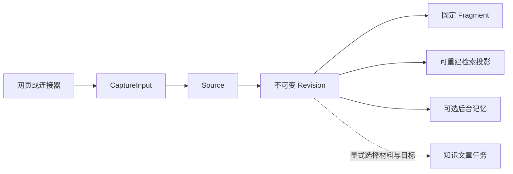

# 一份材料如何变成可检索、可追溯的知识

沿一份两节 Markdown 项目约定的两次导入，解释网页与连接器如何形成统一 Capture，Source、Revision、Fragment 与 Knowledge 如何分工；再区分保存后立即可用的原件与检索、可选的后台记忆、排队生成和持续维护的知识文章，并说明固定历史引用、章节级复核、图片与代码的边界和修改入口。

来源：gpt-5.6-sol 分析，gpt-5.6-sol 独立复核；模型解释仍可被原始证据纠正。

<a id="example"></a>
## 先走一遍：同一份约定的两个版本

先给结论：一次导入先固定“当时收到的原件”，再从这个不可变版本建立可重建的检索、记忆候选和知识文章。**原件、索引、记忆和讲解不是同一份数据，也不会在保存按钮按下时同时完成。**

下面的 Markdown 是教学示例，不是仓库中的真实材料。假设你在“输入材料”里填写标题“项目约定”、来源类型 `manual`、来源标识 `project-rules`：

```markdown
# 提交
合并前运行检查。

# 发布
发布由值班同学执行。
```

页面把非空正文、可选链接和图片组成 `parts`，并为这次手工提交生成新的事件 ID 与时间；保存成功后打开服务端返回的 Revision。参考 [网页捕获请求 ↗](../../../apps/web/src/App.vue#L420 "支持网页组装 parts、随机外部标识、事件 ID 与时间，并打开返回 Revision。")

第二次仍使用 `manual + project-rules`，但把“提交”规则改成“合并前运行完整检查并记录结果”。相同的来源类型与来源标识让系统找到同一个 Source；标识留空则由页面随机生成，不会自然接到旧版本链。界面也明确提示“相同标识产生新版本”。参考 [来源标识表单 ↗](../../../apps/web/src/App.vue#L902 "支持来源类型、来源标识复用或留空分配和段落固定片段的界面语义。") [资产、身份、去重与片段 ↗](../../../apps/server/src/store.ts#L105 "支持图片校验、完整 fingerprint、事件幂等、Source 定位、新 Revision 与 Fragment 生成。")

| 对象 | 示例中的含义 | 作用 |
| --- | --- | --- |
| Source | `manual + project-rules` | 稳定来源身份，不代表某一版正文 |
| Revision | V1、V2 | 不可变原件快照；V2 指向 V1 |
| Fragment | 按空行固定的证据片段 | 捕获时的证据锚点，不是文章目录 |
| Knowledge | 围绕读者目标写成的本文 | 派生讲解，不能替代原件 |

还有一个容易误判的细节：Source 复用与 Revision 去重是两件事。Store 比较的是包含标题、parts、context、provenance、观察时间和上游版本的完整 fingerprint；网页每次都会生成新的 `eventId` 和 `eventAt`，所以即使 Markdown 没改，两次普通网页提交也通常会形成两个 Revision。只有同一采集事件重放，或完整 fingerprint 相等，才会复用已有版本。参考 [网页捕获请求 ↗](../../../apps/web/src/App.vue#L420 "支持网页组装 parts、随机外部标识、事件 ID 与时间，并打开返回 Revision。") [资产、身份、去重与片段 ↗](../../../apps/server/src/store.ts#L105 "支持图片校验、完整 fingerprint、事件幂等、Source 定位、新 Revision 与 Fragment 生成。")

<a id="entry"></a>
## 网页和连接器最终交出同一种输入

手工页面只是 Capture 的一个生产者。统一合同要求 `source`、`externalId`、标题和 1–50 个 parts；part 只能是非空文本、HTTP(S) 链接或 PNG/JPEG/WebP 图片，还可为每个 part 保存参与者、时间、回复关系、引用/转发和生产者类型等 provenance。参考 [统一 Capture 合同 ↗](../../../packages/contracts/src/index.ts#L7 "支持文本、图片、链接、逐 part provenance 与 CaptureInput 的字段边界。")

文件、Git、飞书连接器的职责是**适配格式并划定读取边界**，最终仍返回同一个 `CaptureInput`：

- 文件连接器只读取 `captureRoots` 内的真实路径，限制 500 KB，要求 UTF-8 且拒绝含 NUL 的二进制内容。
- Git 连接器校验 ref 与路径，先把 ref 固定为 commit SHA，再读取该提交中的文件，并把 SHA 写入 `upstreamVersion`。
- 飞书连接器校验 HTTPS docx/wiki 地址，经外部 CLI 拉取 Markdown，以文档 ID 作为稳定标识、revision ID 作为上游版本，并把原链接和引用 sidecar 一并保存。

捕获正文中的 URL 只作为内容保留，不会被连接器自动爬取。参考 [有边界的连接器 ↗](../../../apps/server/src/connectors.ts#L1 "支持文件、Git、飞书的读取边界、身份与上游版本；文件与 Git 输入不注入网页手工提交的 eventAt，并说明不自动爬取正文 URL。")



因此入口可以不同，落库后的身份、版本和证据语义相同；差别留在 `source`、上游版本、上下文和 provenance 中。

<a id="commit"></a>
## 一次 Capture 在事务里提交什么

`Store.capture` 先计算输入 payload digest。图片会从 base64 解码，限制真实字节不超过 5 MB，并用 magic bytes 校验声明的 PNG/JPEG/WebP 类型；内容哈希成为 `assetId`，Revision body 只保存资产引用、MIME、标签和 provenance。随后系统用标题与完整 body 计算 fingerprint。参考 [资产、身份、去重与片段 ↗](../../../apps/server/src/store.ts#L105 "支持图片校验、完整 fingerprint、事件幂等、Source 定位、新 Revision 与 Fragment 生成。")

版本判断依次进行：

1. 若存在 `collectorId + eventId`，先查采集收据；同一事件与相同 payload 直接返回原 Revision，同一事件却携带不同 payload 会报冲突。
2. 再按 `source + externalId` 查找或创建 Source。
3. 当前 head 的 fingerprint 完全相同时复用 head；否则插入 `version + 1` 的 Revision，并记录 `previous_id`。
4. 文本按空行、链接按“标签＋URL”、图片按“[图片] 标签”生成最多 2000 个固定 Fragment。参考 [资产、身份、去重与片段 ↗](../../../apps/server/src/store.ts#L105 "支持图片校验、完整 fingerprint、事件幂等、Source 定位、新 Revision 与 Fragment 生成。")

新 Revision 建好后，系统会尽力写入轻量、确定性的导航画像；失败会留下失败记录，但不阻止来源保存。随后更新 Source head 与 source state。若这是换版，还会把旧记忆依赖标成 stale、使相关记忆 invalidated，并排入 `refresh_dependents`；最后记录变化、写采集收据，并按输入性质排后续捕获任务。参考 [换版后的确定性工作 ↗](../../../apps/server/src/store.ts#L227 "支持导航画像尽力写入、切换 head、失效旧记忆依赖、记录变化与排入后续任务。")

所以“保存成功”的准确边界是：原件、版本链、固定片段、Source head、变化记录和持久任务已提交。它**不表示** embedding 已补齐、模型已提炼记忆，或知识文章已经写完。旧 Revision 仍可读取，`current` 只表示它是否仍是 Source head。参考 [Revision 历史状态 ↗](../../../apps/server/src/store.ts#L390 "支持 Revision 返回前序、固定 Fragment，并以 Source head 判断 current。")

<a id="retrieval"></a>
## 为什么保存后马上能搜，但索引又不等于原件

Revision 与 Fragment 落库后即可直接读取；搜索调用会先同步可重建投影。显式代码导航意图会先返回符号或调用方候选；自然语言中识别到“谁调用某符号”时，只有确实找到候选才走这条捷径，否则仍回到普通召回。参考 [代码导航候选 ↗](../../../apps/server/src/retrieval/unified.ts#L345 "支持显式代码意图和自然语言调用方意图优先导航，并在无候选时回到普通召回。")

普通非空查询组合词法与符号候选。**空查询直接得到空结果**；精确定位、向量模型尚未加载，或向量计算失败时，则使用词法/符号结果。参考 [搜索同步、空查询与回退 ↗](../../../apps/server/src/retrieval/unified.ts#L427 "支持搜索前同步投影；词法查询无词项时返回空，空查询因此为空；精确定位、无向量模型和向量失败时使用词法与符号召回。") 检索服务在应用构建阶段创建时会启动后台循环：首轮 `tick` 延迟 100 ms，之后同步投影并分批补建 embedding，正常约 1 秒继续，出错后约 30 秒重试。这个 100 ms 延迟只是启动安排，不是 HTTP listener 已经建立的就绪保证。参考 [后台补建向量 ↗](../../../apps/server/src/retrieval/unified.ts#L84 "支持首轮延迟 100 ms 的后台循环、同步投影、分批索引和错误退避，不构成 listener 就绪保证。") [检索服务构建时启动 ↗](../../../apps/server/src/retrieval/factory.ts#L13 "支持 createRetrieval 创建 UnifiedRetrieval 后立即调用 start。")

对示例 Markdown，passage 按 Markdown token 和标题路径建立，保留原始行号；以冒号结尾的引导段会尽量与紧随的表格、列表或代码块放在一起。它不会改写 Revision，也不会把捕获时按空行形成的 Fragment 当成阅读章节。参考 [Markdown passage ↗](../../../apps/server/src/retrieval/units.ts#L33 "支持按标题与语法块投影、保留行号、合并引导段和结构块。")

代码也先作为文本进入同一 Source/Revision，只在投影层特殊处理：完整函数和方法保留控制流，函数内局部 `const` 不抢占为独立 passage；有可调用子项的 class/component 不再生成笼统整块，imports 与顶层初始化仍可搜索。参考 [代码 passage ↗](../../../apps/server/src/retrieval/units.ts#L92 "支持按完整操作切分代码、保留父级路径、注释、imports 与顶层初始化。") 底层解析是离线、单文件的 TypeScript AST 与 Vue SFC；calls 只是名称级候选，没有 Program 或跨文件 TypeChecker，因此它适合导航调查，不能当成完整调用图。参考 [单文件 AST 边界 ↗](../../../apps/server/src/code/parse.ts#L1 "支持 TypeScript 单文件 AST、Vue SFC 和名称级调用候选的能力边界。")

<a id="branches"></a>
## 保存后的三条分支：立即、后台与显式整理

**立即且确定性可用**的是不可变原件、版本历史、Fragment、尽力生成的导航画像，以及搜索时可同步重建的投影。

**后台记忆提炼**有额外开关。配置默认 `learning.enabled=false`；只有启用并找到指定 profile，应用才创建 LearningPipeline。参考 [学习默认配置 ↗](../../../apps/server/src/config.ts#L63 "支持 learning 默认关闭以及 profile 与轮询配置。") [学习管线启动条件 ↗](../../../apps/server/src/app.ts#L121 "支持仅在启用并找到指定 profile 时创建 LearningPipeline。") 启用后，extractor 保存运行结果与 observations，并只在存在未处理候选时排 verifier；verifier 要覆盖整批提案并校验 digest，最后由 `MemoryService.evaluateBatch` 决定自动应用、等待决定或拒绝。模型输出本身不等于记忆已写入。参考 [候选提取流程 ↗](../../../apps/server/src/learning/pipeline.ts#L550 "支持 extractor 保存输出与观察，并只为未处理候选排 verifier。") [整批复核与策略应用 ↗](../../../apps/server/src/learning/pipeline.ts#L640 "支持 verifier 覆盖整批提案、校验 digest，并由 MemoryService 批量评估应用策略。")

**知识文章整理**是显式动作。用户先选择固定材料，再填写标题、读者和目标；页面发送 revision IDs 与 brief。服务端验证所选 Revision 仍是当前版本，把材料 key 写入阅读计划，保存计划后返回 `202` 和 `queued`，由持久 worker 执行，而不是在这个请求内直接完成整篇写作。参考 [文章计划提交 ↗](../../../apps/web/src/knowledge/ArticleComposer.vue#L80 "支持前端选择当前 revision IDs、填写读者与目标并提交页面计划。") [页面创建与排队接口 ↗](../../../apps/server/src/knowledge/api.ts#L190 "支持服务端校验当前材料、保存 materialKeys 和计划并以 202 queued 返回。")

worker 根据计划和所选材料当前 digest 计算 scope digest；同一页面的待处理变化会合并。用户可在文章末尾开启“随所选材料自动更新”，但前提是计划明确列出 `materialKeys`。worker 定期观察这些材料，digest 变化时排自动维护；未选择的新材料不会自行加入。首次整理和手动刷新仍属于显式请求。参考 [所选材料持续维护 ↗](../../../apps/server/src/knowledge/page-worker.ts#L64 "支持 scope digest、明确 materialKeys 前提、请求合并和材料变化后自动排队。") [持久维护循环 ↗](../../../apps/server/src/knowledge/page-worker.ts#L149 "支持 worker 周期观察材料并处理持久任务。")

真正执行时，pipeline 把页面设为 writing，围绕选定材料自主调查；研究必须自行完成工具调查后才能进入写作。writer 或 refresher 生成完整文章，独立 verifier 复核，最多四轮修订；只有 accepted 的文档才按实际引用与 reviewSources 固定依赖并发布。参考 [按计划自主调查 ↗](../../../apps/server/src/knowledge/pipeline.ts#L258 "支持页面 writing、published、failed 状态、固定选材、自主 research 和维护模式。") [写作与独立复核 ↗](../../../apps/server/src/knowledge/pipeline.ts#L162 "支持最多四轮写作或修订、独立 verifier、accepted 后固定实际依赖并发布。") 发布前 repository 还会检查整理期间计划是否改变，以及每个材料 digest/被引文章 revision 是否仍匹配；通过后才保存新的知识 Revision 并切换 head。参考 [知识 Revision 发布 ↗](../../../apps/server/src/knowledge/repository.ts#L206 "支持发布前核对计划和依赖、保存新知识 Revision、切换 head 并保留版本记录。")

这三条分支服务于不同问题：原件回答“当时收到了什么”，记忆支持持续助理状态，知识文章围绕特定读者目标组织解释。

<a id="citations"></a>
## 材料更新后，旧引用为什么仍能打开

知识文章的 citation 与 dependency digest 一起固定。读者点击引用时，前端发送“文章 key + 文章 revision + citation key”；API 从指定知识 Revision 找到 citation，再用其 dependency digest 解析材料。当前材料 digest 不匹配时，repository 会沿同一 Source 的历史 Revisions 查找对应版本，并返回 `current:false`。参考 [固定引用解析 ↗](../../../apps/server/src/knowledge/api.ts#L66 "支持从指定文章 Revision 查 citation，并按固定 dependency digest 解析材料。") [历史材料回溯 ↗](../../../apps/server/src/knowledge/repository.ts#L286 "支持文章状态汇总，并在当前 digest 不匹配时沿同一 Source 的历史 Revisions 找固定版本。")

原文页随后显示“当前版本”或“历史版本”、引用行号以及对应全文或代码摘录。因此 V2 改写了“提交”规则后，写作时引用 V1 的旧句仍能打开；系统不会把 V2 的新句冒充成旧论断的依据。参考 [历史原文阅读 ↗](../../../apps/web/src/knowledge/KnowledgeSource.vue#L19 "支持前端按 digest 读取材料，标注历史版本并显示引用行、全文或代码摘录。")

“旧引用还能打开”和“这一节仍然适用”是两项独立判断。系统逐节检查正文内 citation 与 `reviewSources`；适用性比较会先检查 `actorId`、`actorVerifiedBy`、`quoted`、`forwarded`、`eventAt`，其中任一项变化都会直接判定上下文需要复核。材料 digest 则由文本、图片、顶层 actor、quoted 和 forwarded 计算，所以 digest 与章节适用性检查也不能混为一谈。参考 [结构未变与受检字段 ↗](../../../apps/server/src/knowledge/lifecycle.ts#L40 "支持适用性比较先检查 actorId、actorVerifiedBy、quoted、forwarded、eventAt，随后才按唯一同名结构比较，并明确不做语义重映射。") [知识材料 digest ↗](../../../apps/server/src/knowledge/repository.ts#L13 "支持材料 digest 由文本、图片、顶层 actor、quoted 和 forwarded 构成，并显示 eventAt 单独进入 KnowledgeMaterial。") [章节级知识状态 ↗](../../../apps/server/src/knowledge/lifecycle.ts#L81 "支持逐节检查 citation 与 reviewSources，区分 current、needs-review 与 unavailable。")

**在本文的网页手工导入案例里，V1 和 V2 的 `eventAt` 必然不同。** 因此即使 V2 只改了“提交”节，依赖这份材料的“提交”和“发布”知识章节都会进入 needs-review；系统不会继续把未改的“发布”节标为 current。文章 head 的 `current` 是所有章节状态的汇总，只要有一节待复核，整篇汇总值就是 false；界面会在具体章节标出原因，同时保留旧解释和写作时的固定引用。参考 [网页捕获请求 ↗](../../../apps/web/src/App.vue#L420 "支持网页组装 parts、随机外部标识、事件 ID 与时间，并打开返回 Revision。") [结构未变与受检字段 ↗](../../../apps/server/src/knowledge/lifecycle.ts#L40 "支持适用性比较先检查 actorId、actorVerifiedBy、quoted、forwarded、eventAt，随后才按唯一同名结构比较，并明确不做语义重映射。") [章节级知识状态 ↗](../../../apps/server/src/knowledge/lifecycle.ts#L81 "支持逐节检查 citation 与 reviewSources，区分 current、needs-review 与 unavailable。") [章节更新提示 ↗](../../../apps/web/src/knowledge/KnowledgeDocument.vue#L82 "支持文章汇总非 current 时仍保留其他章节可读，并在具体章节显示复核原因。")

章节级保留能力仍然存在，但要换一个满足前提的场景。例如文件或 Git 连接器不会像网页手工入口那样注入新的 `eventAt`；若换版前后这些受检字段保持相同，而且旧引用所在的唯一同名 Markdown/代码结构原文完全未变，那么只依赖该结构的章节可以继续 current。图片存在或变化、引用没有行范围、结构缺失或同名歧义、相关结构内容变化时则不能沿用。这个比较只判断章节是否仍适用，**不会把引用语义重映射到新行**。参考 [有边界的连接器 ↗](../../../apps/server/src/connectors.ts#L1 "支持文件、Git、飞书的读取边界、身份与上游版本；文件与 Git 输入不注入网页手工提交的 eventAt，并说明不自动爬取正文 URL。") [结构未变与受检字段 ↗](../../../apps/server/src/knowledge/lifecycle.ts#L40 "支持适用性比较先检查 actorId、actorVerifiedBy、quoted、forwarded、eventAt，随后才按唯一同名结构比较，并明确不做语义重映射。") [章节级知识状态 ↗](../../../apps/server/src/knowledge/lifecycle.ts#L81 "支持逐节检查 citation 与 reviewSources，区分 current、needs-review 与 unavailable。")

开启持续维护后，worker 才会排队重新调查、写作、复核并发布新的知识 Revision；无论是否自动维护，旧知识 Revision 和它固定的历史原文都不会被悄悄改写。参考 [持久维护循环 ↗](../../../apps/server/src/knowledge/page-worker.ts#L149 "支持 worker 周期观察材料并处理持久任务。") [知识 Revision 发布 ↗](../../../apps/server/src/knowledge/repository.ts#L206 "支持发布前核对计划和依赖、保存新知识 Revision、切换 head 并保留版本记录。")

<a id="media-code"></a>
## 图片、代码与修改入口

图片没有旁路存储：它仍属于固定 Revision，只是字节按内容哈希写入私有资产目录。知识材料从同一 Revision 分离 text 与 images，并把文本、图片身份以及顶层参与者/引用/转发信息纳入材料 digest。参考 [资产、身份、去重与片段 ↗](../../../apps/server/src/store.ts#L105 "支持图片校验、完整 fingerprint、事件幂等、Source 定位、新 Revision 与 Fragment 生成。") [知识材料中的图片 ↗](../../../apps/server/src/knowledge/repository.ts#L13 "支持从同一 Revision 分离文本与图片，并共同计算知识材料 digest。") 当前产品边界仍是：图片可以进入视觉分析，但没有通用 OCR、布局定位和视觉索引闭环；标签可搜索、模型能看图，不等于所有图片都已结构化理解。参考 [图片理解边界 ↗](../../../docs/reader-first/current-system.md#L13 "支持当前没有通用 OCR、布局定位和视觉索引闭环这一产品边界。")

要修改这条链，可以沿数据流找入口：

- **网页输入与统一合同**：`apps/web/src/App.vue::capture/upload`；`packages/contracts/src/index.ts::captureSchema`。
- **连接器边界**：`apps/server/src/connectors.ts::fileInput/gitInput/larkInput`。
- **原件与版本**：`apps/server/src/store.ts::capture/queueCaptureJob`，包括去重、Fragment、导航画像和任务入队。
- **检索投影**：`apps/server/src/retrieval/units.ts::markdownPassages/codePassages`；单文件 AST 在 `code/parse.ts::parseFile`；召回顺序与向量回退在 `retrieval/unified.ts::search/start`。
- **后台记忆**：`config.ts` 与 `app.ts` 决定启用条件，`learning/pipeline.ts::extract/verify` 负责候选与复核。
- **知识页面**：`knowledge/api.ts` 保存计划和排队，`page-worker.ts` 观察所选材料，`pipeline.ts` 调查/写作/复核，`repository.ts` 发布并解析历史材料，`lifecycle.ts` 计算章节状态。
- **固定引用阅读**：`KnowledgeDocument.vue::cite`、`knowledge/api.ts::resolveCitation` 与 `KnowledgeSource.vue`。

这些入口分别对应输入、原件、投影、派生处理和阅读。导航画像、passage 与 embedding 都可以重建；需要长期保真的事实边界仍是 Source、不可变 Revision 和它的固定证据。
