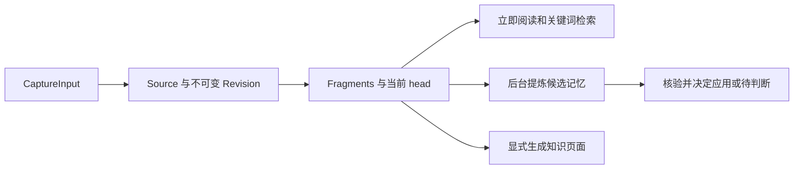

# 一份材料的旅程：从导入到阅读与引用

以两节 Markdown 项目约定的首次导入和再次修订为例，解释网页与连接器如何形成统一捕获输入，Source、不可变 Revision 与 Fragment 如何保存版本，当前原文如何立即进入检索，后台记忆学习与显式知识生成为何是两条独立的派生流程，以及历史引用、图片和代码如何复用同一来源体系。

来源：gpt-5.6-sol 分析，gpt-5.6-sol 独立复核；模型解释仍可被原始证据纠正。

<a id="scenario"></a>
## 先看一次可操作的导入

假设要保存下面这份项目约定：

```markdown
## 提交
合并前需评审。

## 发布
周五冻结。
```

在网页的手动导入区填写标题、固定的来源标识和正文后，页面会把文本组织成 `parts`，提交给捕获接口。以后修改同一材料时，应继续使用相同的来源类型和来源标识；如果来源标识留空，网页会生成新的随机值，服务端会将其视为另一份来源。参考 [网页提交捕获输入 ↗](../../../apps/web/src/App.vue#L281 "支持示例中网页如何组织文本、链接和图片 parts，并说明来源标识留空时会生成随机值。")

服务端接收的统一结构叫 **CaptureInput**：除来源、来源标识和标题外，它可以包含文本、图片或链接，还可携带观察时间、上游版本、来源信息和上下文。因此，网页手工输入与连接器虽然入口不同，进入保存层前都遵守同一份合同。参考 [统一捕获输入合同 ↗](../../../packages/contracts/src/index.ts#L70 "说明 CaptureInput 的来源、标识、文本图片链接 parts 及可选上下文字段。")

文件连接器会先确认路径位于允许目录内，读取不超过 500 KB 的严格 UTF-8 文本，再以规范化文件路径作为来源标识，转换成一个文本 part。参考 [文件连接器规范化 ↗](../../../apps/server/src/connectors.ts#L10 "支持文件连接器的目录约束、大小和编码检查，以及转换为 CaptureInput 的过程。") 捕获 API、文件连接器和 Git 连接器最终都汇入 `Store.capture`，这是追踪导入主链的第一个服务端入口。参考 [捕获 API 与连接器入口 ↗](../../../apps/server/src/app.ts#L206 "给开发者定位通用捕获、文件和 Git 连接器汇入 Store.capture 的代码入口。")

<a id="revision"></a>
## 同一来源如何形成固定版本

保存层先用 `(source, externalId)` 查找 Source。首次导入会建立 Source、version 1 的不可变 Revision，并把正文按空行切成可定位的 Fragment；上面的示例会形成“提交”和“发布”两个片段。随后把“周五冻结”改为“周四冻结”，仍以同一来源标识导入，就会建立 version 2，令 `previousId` 指向 version 1，并把 Source 的 head 移到新版。参考 [版本与片段建立 ↗](../../../apps/server/src/store.ts#L168 "支持按来源查找 Source、建立递增 Revision、记录 previousId，并按空行生成 Fragment。")

重复提交与内容更新会被区别处理：完整输入形成的指纹若与当前 head 相同，系统直接返回当前 Revision，并标记为重复；只有指纹变化才增加版本。若采集器提供事件身份，同一事件的相同载荷也会复用原 Revision，而同一事件对应不同载荷会被判为冲突。参考 [重复捕获判定 ↗](../../../apps/server/src/store.ts#L136 "支持事件回执冲突检查、当前 head 指纹去重，以及重复时不建立新版本。")

测试覆盖了这一核心性质：相同输入不会增加版本，修改文本后得到 version 2，但仍可通过 version 1 的片段读取原来的文字。参考 [历史证据测试 ↗](../../../apps/server/tests/store.test.ts#L40 "验证相同输入去重、修改后升到 version 2，以及旧片段仍可读取原文字。")

<a id="save_and_jobs"></a>
## 保存完成后，哪些工作已经发生

一次新版本保存处在同一个 SQLite 事务中：Revision 与 Fragment 写入、Source head 更新、变更通知、旧依赖失效以及后台任务入队共同提交；中途异常则整体回滚。新版本出现时，依赖旧 Revision 的记忆会先被标为失效，并安排后续复查。参考 [保存事务与刷新任务 ↗](../../../apps/server/src/store.ts#L231 "支持 head 更新、旧记忆依赖失效、刷新任务、变更记录和捕获任务在事务路径中完成。")



其中 Source、Revision、Fragment、当前 head 和任务入队属于保存阶段；候选提取与核验由持久后台 worker 分别处理。参考 [保存事务与刷新任务 ↗](../../../apps/server/src/store.ts#L231 "支持 head 更新、旧记忆依赖失效、刷新任务、变更记录和捕获任务在事务路径中完成。") [候选记忆提取 ↗](../../../apps/server/src/learning/pipeline.ts#L421 "说明提取器保存观察、产生候选后才排入核验任务，并协调来源刷新状态。")

后台提取器读取固定 Revision，记录观察并产生候选；只有确实产生候选时才继续排入核验任务。核验器检查完整候选批次，再交给 MemoryService 决定自动应用还是等待判断。参考 [候选记忆提取 ↗](../../../apps/server/src/learning/pipeline.ts#L421 "说明提取器保存观察、产生候选后才排入核验任务，并协调来源刷新状态。") [候选核验与应用决策 ↗](../../../apps/server/src/learning/pipeline.ts#L458 "支持核验完整候选批次并由 MemoryService 决定自动应用或等待判断。") 因此“原文已保存”并不表示“记忆已经形成并生效”；界面在任务排队时也明确提示尚未调用模型。参考 [后台排队状态提示 ↗](../../../apps/web/src/LearningView.vue#L22 "支持原文已经保存与模型尚未调用是两个不同状态。")

<a id="retrieval_and_knowledge"></a>
## 原始材料、记忆与知识文章不是一回事

当前原文不必等待模型才能被找到。关键词检索直接查询 Fragment，并通过 `sources.head` 只选择当前 Revision；所以第二次导入后，普通搜索会转向“周四冻结”，旧版本不再作为普通当前结果出现。记忆和知识命中也会路由回原始证据，而不是把派生文字当成另一份事实。参考 [当前原文关键词检索 ↗](../../../apps/server/src/retrieval/keyword.ts#L53 "支持检索只连接当前 Source head，并说明记忆与知识命中最终回到原始证据。")

| 层次 | 作用 | 何时产生 |
| --- | --- | --- |
| 原始材料 | 保存输入事实、版本和片段 | 捕获事务内立即完成 |
| 候选记忆 | 提炼可复用的信息或行动线索 | 后台提取与核验后产生 |
| 知识文章 | 围绕读者问题重新组织讲解 | 显式发起知识生成后产生 |

显式知识生成是另一条流程：它从当前材料建立调查范围，最多进行三轮补读，再由写作者和复核者生成页面，并非每次 capture 都自动生成文章。参考 [显式知识生成流程 ↗](../../../apps/server/src/knowledge/pipeline.ts#L192 "说明知识页面先调查当前材料，再经写作与复核形成，属于独立的显式流程。") 知识材料仍由某个固定 Revision 重建；派生来源会被排除，新一轮生成默认只使用各 Source 的当前 head。参考 [固定版本构造知识材料 ↗](../../../apps/server/src/knowledge/repository.ts#L11 "支持知识材料从 Revision 重建、排除派生来源，并默认从各 Source 当前 head 取材。")

<a id="historical_citations"></a>
## 为什么引用可以回到旧版本

Source 的 head 只是“当前版本”指针，并不会覆盖历史 Revision。服务端能按明确的 revision ID 取回其 parts、Fragments、上一版本及是否现行等信息；按 fragment ID 打开证据时，又会从该片段所属的 Revision 还原完整上下文。因此，引用 version 1 的片段时，即使 head 已移动到 version 2，仍可显示旧文字并标为历史版本。参考 [按片段读取历史版本 ↗](../../../apps/server/src/store.ts#L387 "支持按 revision ID 还原完整版本，并由 fragment ID 回到其所属 Revision 与上下文。")

知识文章的引用还会绑定材料依赖的内容摘要。打开引用时，服务端先按文章固定的依赖解析材料；当前材料摘要不匹配时，会在该 Source 的历史 Revision 中寻找对应版本，而不是静默跳到新版。参考 [知识引用固定版本解析 ↗](../../../apps/server/src/knowledge/api.ts#L24 "说明引用依赖固定摘要，当前摘要不匹配时会在历史 Revision 中查找对应材料。") 阅读界面会把摘要随请求传给材料接口，并展示“当前版本”或“历史版本”、引用行范围和完整原文，读者可以从论断沿固定证据回查。参考 [历史原文阅读界面 ↗](../../../apps/web/src/knowledge/KnowledgeSource.vue#L17 "支持阅读端携带材料摘要，并展示历史或当前状态、引用行范围及完整原文。")

这也解释了示例中的结果：新搜索面向“周四冻结”，但旧文章若固定引用 version 1，仍会打开“周五冻结”。历史引用保留的是当时的依据，并不表示它仍是现行规则。

<a id="images"></a>
## 图片复用版本链，但资产另行保存

图片与 Markdown 共用 Capture → Source → Revision 主链，不过输入只接受 PNG、JPEG 或 WebP。服务端会解码并核对文件签名与 5 MB 上限，再以字节的 SHA-256 作为资产标识，将二进制内容寻址保存；Revision 中只保留资产标识、类型和标签。没有文本的图片也会生成一个可导航的图片片段。参考 [图片资产内容寻址 ↗](../../../apps/server/src/store.ts#L102 "支持图片字节校验、大小限制、内容哈希落盘，以及 Revision 只保存资产元数据。")

图片证据除 Source Revision 和 Fragment Revision 外，还携带资产哈希、可选区域及观察说明，并明确标记为推断内容。这让“看到什么”与原始图片资产保持可回查关系，同时避免把视觉解释当作图片本身。参考 [图片证据结构 ↗](../../../packages/contracts/src/index.ts#L249 "说明图片证据绑定两个版本标识、资产哈希、区域和推断观察。")

<a id="code_and_entrypoints"></a>
## 代码的专门处理与开发入口

代码同样不建立第二套事实来源。代码同步读取已经捕获的 file Source 当前不可变 Revision，对其中符合范围的文件进行解析，并形成用于代码定位的投影；分析不会拿实时工作区文本去搭配旧 Fragment。参考 [代码基于捕获版本分析 ↗](../../../apps/server/src/code/sync.ts#L170 "支持代码同步读取 Capture 链当前不可变 Revision，筛选文件并解析为代码定位所需的信息。") 精确符号检索可以借助 `code_symbols` 投影提高命中，但返回结果仍通过 Fragment、Revision 和当前 Source head 接回原始捕获证据。参考 [符号投影回到原始证据 ↗](../../../apps/server/src/retrieval/keyword.ts#L123 "说明精确符号检索通过 Fragment、Revision 与当前 Source head 回到原始捕获材料。")

追踪本流程时可以从四个入口开始：API 与连接器汇合点在 `app.ts` 的捕获路由；输入规范化在 `connectors.ts`；版本、片段、事务和任务入队在 `Store.capture`；后台提取与核验在学习流水线。显式知识页则沿知识流水线与 Repository 调查。普通检索面向当前 head，历史版本主要通过固定引用或明确的 Revision、Fragment 标识读取；代码投影在同一来源体系中承担辅助定位与检索的作用。参考 [按片段读取历史版本 ↗](../../../apps/server/src/store.ts#L387 "支持按 revision ID 还原完整版本，并由 fragment ID 回到其所属 Revision 与上下文。") [代码基于捕获版本分析 ↗](../../../apps/server/src/code/sync.ts#L170 "支持代码同步读取 Capture 链当前不可变 Revision，筛选文件并解析为代码定位所需的信息。") [符号投影回到原始证据 ↗](../../../apps/server/src/retrieval/keyword.ts#L123 "说明精确符号检索通过 Fragment、Revision 与当前 Source head 回到原始捕获材料。") [捕获 API 与连接器入口 ↗](../../../apps/server/src/app.ts#L206 "给开发者定位通用捕获、文件和 Git 连接器汇入 Store.capture 的代码入口。")
