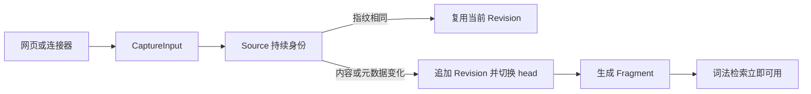

# 一份材料的旅程：从导入到可检索、可追溯

以一份两节 Markdown 约定的两次导入为例，解释统一 Capture 输入、Source/Revision/Fragment 分工、即时检索与后台处理、知识生成、历史引用，以及图片和代码的专用处理入口。

来源：gpt-5.6-sol 分析，gpt-5.6-sol 独立复核；模型解释仍可被原始证据纠正。

<a id="scenario"></a>
## 先看结果：新规则可搜，旧论断仍可核对

假设通过“输入材料”保存一份 Markdown（示例，不代表真实用户数据）：

```markdown
# 提交
合并前运行 check。

# 评审
至少一位评审者批准。
```

来源类型选“主动输入”，来源标识填写 `project-policy`。稍后仍用这个标识导入，只把最后一句改为“至少两位评审者批准”。页面会把正文、链接和图片组装为同一个捕获请求；相同来源标识用于续接版本，留空则会随机生成标识。参考 [网页捕获请求 ↗](../../../apps/web/src/App.vue#L290 "支持网页如何组装正文、链接、图片与来源身份。") [来源标识提示 ↗](../../../apps/web/src/App.vue#L653 "支持相同来源标识产生新版本的页面语义。")

第二次保存后，普通搜索面向新版本；若旧知识文章引用了第一版，引用仍能回到第一版原文。理解这一点只需区分四个角色：**Source** 是持续身份，**Revision** 是一次不可变状态，**Fragment** 是该状态中的定位与检索单位，**Knowledge** 是基于固定材料生成的读者解释。

<a id="input"></a>
## 不同入口先汇成同一种输入

服务端接收的统一边界是 `CaptureInput`：来源类型、来源标识、标题、1—50 个 parts，以及可选的上下文、观测时间、上游版本和来源信息。part 可以是文本、HTTP(S) 链接或 PNG/JPEG/WebP 图片；它们共享捕获流程，而不是各自进入一套存储。参考 [统一捕获合同 ↗](../../../packages/contracts/src/index.ts#L20 "说明 CaptureInput 字段、part 类型与数量边界。")

连接器只是适配器：文件连接器在允许目录内读取有限大小的 UTF-8 文本；Git 连接器先把 ref 固定为 commit，再读取一个仓库内路径；飞书连接器读取 Markdown，并保留文档标识、修订号、原链接和引用元信息。三者的结果都会再次经过输入校验，再交给同一个 `Store.capture`。参考 [连接器适配 ↗](../../../apps/server/src/connectors.ts#L19 "支持文件、Git 与飞书连接器如何固定外部输入并构造 CaptureInput。") [连接器路由 ↗](../../../apps/server/src/app.ts#L206 "支持各连接器输出经 schema 校验后统一交给 Store.capture。")

因此，若要改变“允许导入什么”，先看 contracts 中的捕获 schema；若要改变外部来源如何映射身份与版本，则看 connectors 和对应 HTTP 路由。

<a id="persist"></a>
## 保存时追加版本，而不是覆盖原文

`Store.capture` 先规范化 parts；图片会校验字节、大小与 MIME，并按内容哈希保存为资产。随后标题、parts、上下文、来源信息、观测时间和上游版本共同形成 fingerprint。因为网页每次手工提交都会生成新的事件标识和时间，而这些信息也进入 fingerprint，所以“正文相同”不等于在所有入口都必然去重；本例明确改了规则，必然产生新版本。参考 [图片资产与指纹 ↗](../../../apps/server/src/store.ts#L102 "支持图片字节校验、内容寻址保存、Revision 中的资产字段及捕获指纹。") [网页事件来源信息 ↗](../../../apps/web/src/App.vue#L312 "支持网页每次捕获生成事件标识和时间，从而限定去重表述。")

事务内，系统按“来源类型＋来源标识”寻找 Source。fingerprint 与当前 head 相同就复用 Revision；不同则追加 `version + 1` 的 Revision，以 `previous_id` 指回旧版，并把按空行切分的文本、链接说明或图片占位符写成 Fragment。两节示例因此得到可独立定位的片段，但这些片段只是保存与检索单位，不决定未来知识文章的章节。参考 [版本追加与分片 ↗](../../../apps/server/src/store.ts#L168 "支持按来源身份寻找 Source、按指纹复用或追加 Revision，以及生成 Fragment。")



新 head、来源有效性、受影响记忆的失效记录、变更通知、接收回执和首个持久任务在数据库事务中一起推进；图片文件则在事务前写入资产目录，不能把二者笼统称为一次跨存储原子提交。参考 [切换当前版本 ↗](../../../apps/server/src/store.ts#L231 "支持切换 head、来源有效性、记忆失效、刷新任务、变更与接收回执在捕获事务内推进。")

<a id="retrieval"></a>
## 提交后立即可搜，语义索引随后追赶

Fragment 写入时，SQLite 触发器同步更新 FTS5 投影，因此数据库提交完成后即可进行词法搜索。检索查询把 Fragment、Revision 与 Source 连接，并要求 Revision 是当前 head；所以上例重导入后，常规搜索返回“至少两位”的第二版，而不会把第一版也当作当前结果。参考 [全文索引触发器 ↗](../../../apps/server/src/storage/migrations.ts#L915 "支持 Fragment 写入时同步维护 FTS5 投影。") [当前版本词法检索 ↗](../../../apps/server/src/retrieval/keyword.ts#L54 "支持词法检索通过 Source.head 只返回当前 Revision 的证据。")

语义检索是可选后台能力。启用时，它按批次为尚未嵌入的当前 Fragment 补向量，健康状态暴露 indexed 与 pending；模型未就绪或查询失败时仍保留词法路径。未启用时，工厂直接创建词法检索。换言之，**保存成功与词法可搜是同步结果，向量索引追平不是保存完成的前提**。参考 [语义索引追赶 ↗](../../../apps/server/src/retrieval/semantic.ts#L26 "支持后台补向量、健康状态与词法降级行为。") [检索模式选择 ↗](../../../apps/server/src/retrieval/factory.ts#L10 "支持未启用语义检索时使用词法检索，启用后创建语义检索。")

<a id="background"></a>
## 保存、记忆学习与 Wiki 生成是三条节奏

导入成功并不表示模型已经理解材料，更不表示 Wiki 已生成：

| 节奏 | 发生什么 | 触发方式 |
|---|---|---|
| 同步保存 | Revision、Fragment、head、词法索引、变更与任务记录落库 | 每次捕获 |
| 后台可选 | 语义向量追赶；记忆候选抽取、复核与刷新 | 配置启用后由 worker 消费 |
| 用户显式 | 调查固定材料，写作、独立复核并发布知识页 | 选择材料并发起整理 |

每个非派生 Capture 会持久化 `extract_claims` 任务，以避免模型派生内容再次自循环为独立证据；但 learning 默认关闭。参考 [捕获后排队抽取 ↗](../../../apps/server/src/store.ts#L348 "支持非派生材料持久化抽取任务，派生材料不进入自循环。") [学习能力开关 ↗](../../../apps/server/src/config.ts#L56 "支持学习处理默认关闭及其配置字段。")

worker 执行时会确认输入 Revision 仍是 head 且有效性版本匹配，再把固定 Fragment 和逐 part 的来源信息组成上下文；图片 part 会连同资产字节进入该上下文。提取器产生候选后，独立 verifier 完整复核，再由 MemoryService 按策略决定自动应用、等待判断或拒绝，模型本身不直接写入事实。参考 [固定修订学习上下文 ↗](../../../apps/server/src/learning/pipeline.ts#L180 "支持 worker 校验当前 head 与有效性，并携带 Fragment、来源信息及图片资产。") [提取复核与策略应用 ↗](../../../apps/server/src/learning/pipeline.ts#L421 "支持候选由提取器产生、独立 verifier 复核，最终交 MemoryService 批量评估。")

知识文章是另一条显式流程：页面接口要求选定仍为当前的 revisionIds 和阅读目标，并要求可用 Agent；接口返回 202 后，KnowledgePipeline 才调查固定材料、写作、复核并发布。普通 Capture 不会自动生成 Wiki。参考 [显式知识整理接口 ↗](../../../apps/server/src/knowledge/api.ts#L133 "支持用户选择当前修订与阅读目标后异步启动知识流水线。") [读者页面生成流程 ↗](../../../apps/server/src/knowledge/pipeline.ts#L212 "支持 KnowledgePipeline 对固定材料执行研究后再写作和复核发布。")

<a id="history"></a>
## 旧引用如何准确回到旧版本

知识材料由某个具体 Revision 构造，包含来源身份、Revision 标识、完整文本或图片和内容摘要；“可选材料”默认只列每个 Source 的当前 head。发布时，文章保存每项依赖的 key 与摘要，并在写入前确认所用依赖仍匹配。参考 [固定知识材料 ↗](../../../apps/server/src/knowledge/repository.ts#L12 "支持知识材料从具体 Revision 构造，并且当前材料列表只取各 Source 的 head。") [知识发布依赖校验 ↗](../../../apps/server/src/knowledge/repository.ts#L122 "支持发布前核对材料摘要并把文章作为不可变修订保存。")

来源更新后，repository 会比较文章依赖摘要与当前材料摘要：不一致时把文章标为非当前，但保留文章修订。读者打开引用时，API 使用**这篇文章自己的依赖摘要**解析材料；若当前材料不匹配，就沿同一 Source 的历史 Revision 查找摘要相符者，并返回 `current=false`。这形成“旧文章修订 → 固定依赖摘要 → 旧材料版本”的闭环。参考 [知识过期与历史解析 ↗](../../../apps/server/src/knowledge/repository.ts#L178 "支持依赖变化时标记文章非当前，并按摘要沿历史 Revision 查找材料。") [引用解析闭环 ↗](../../../apps/server/src/knowledge/api.ts#L27 "支持引用使用文章自身依赖摘要解析当前或历史材料并返回 current 状态。")

普通证据链也不要求 Fragment 属于当前 head：Fragment 自带 Revision 归属，证据读取按其标识打开对应 Revision；版本历史接口则列出该 Source 的全部修订。于是“搜索只看当前版”与“引用可以回历史”是两种有意区分的读取方式。参考 [证据与版本历史读取 ↗](../../../apps/server/src/store.ts#L387 "支持按 Fragment 打开所属 Revision，且历史接口列出 Source 的全部 Revision。")

<a id="specialized"></a>
## 图片与代码共享来源体系，但有专用处理

**图片。** 网页限制 PNG/JPEG/WebP 且单张不超过 5 MB；服务端还会校验 base64、文件头与大小，再以内容哈希作为资产标识，Revision 保存资产标识、类型和标签。普通文本检索只看到“[图片] 标签”，不等于保存时已经完成 OCR。参考 [网页图片边界 ↗](../../../apps/web/src/App.vue#L269 "支持网页接受的图片类型、单张大小和 base64 组装方式。") [图片资产与指纹 ↗](../../../apps/server/src/store.ts#L102 "支持图片字节校验、内容寻址保存、Revision 中的资产字段及捕获指纹。")

图片进入模型的方式取决于具体流程：学习流水线直接把资产字节、哈希、类型和标签放进固定修订上下文；逐材料知识分析会为含图片的材料选择视觉分析角色，非原生上下文直接注入图片资产；原生读者页面研究则提供受所选材料范围约束的 `read_image`，让研究角色按需读取固定资产。参考 [图片进入学习上下文 ↗](../../../apps/server/src/learning/pipeline.ts#L220 "支持学习流程从资产读取图片字节并携带哈希、类型和标签。") [图片材料角色选择 ↗](../../../apps/server/src/knowledge/pipeline.ts#L18 "支持逐材料分析为含图片材料选择 visual-analyst。") [非原生图片注入 ↗](../../../apps/server/src/knowledge/pipeline.ts#L35 "支持非原生知识上下文把固定图片资产字节直接作为材料传入。") [原生图片读取 ↗](../../../apps/server/src/knowledge/agent-research.ts#L601 "支持原生研究工作区按所选材料范围开放 read_image 并返回固定资产。")

**代码。** 仓库 review 适配器先读取并验证 UTF-8 文件，按 Markdown 或代码边界拆成 parts，以 `verbatim-v1` 和内容哈希捕获；重同步会先比内容哈希，避免同步时间变化制造假版本。后续代码同步只从固定 Capture head 还原逐字原文，再建立快照、文件和符号投影，并把符号位置绑定回 Fragment。参考 [仓库文件捕获 ↗](../../../apps/server/src/review/sync.ts#L443 "支持仓库适配器读取 UTF-8、按边界拆分、用内容哈希去重并以 verbatim 格式捕获。") [固定版本原文读取 ↗](../../../apps/server/src/source-text.ts#L3 "支持代码分析只从指定不可变 Capture Revision 还原逐字原文。") [代码快照与符号定位 ↗](../../../apps/server/src/code/sync.ts#L170 "支持代码同步读取 Capture head、建立快照和文件符号投影，并把符号绑定到 Fragment。")

导入、路由和调用关系是该投影的进一步结构：导入可解析为文件边，路由记录为符号与边，调用仅在单文件内按名称形成候选。解析器没有 TypeScript Program 或跨文件类型解析，因此这里提供的是统一证据体系上的专用定位层，不是第二份权威源码，也不是完整调用图。参考 [代码关系投影 ↗](../../../apps/server/src/code/sync.ts#L291 "支持导入边、名称级候选调用和路由符号的投影方式。") [代码解析能力边界 ↗](../../../apps/server/src/code/parse.ts#L1 "支持单文件 TypeScript AST、Vue SFC、保守路由解析及无跨文件类型解析的限制。")

修改入口可按职责定位：输入字段看 contracts；来源适配看 connectors；版本、分片、失效和任务排队看 `Store.capture`；检索看 retrieval；记忆后台链看 learning pipeline；知识生成与历史引用看 knowledge pipeline、API 和 repository；仓库捕获与 AST 投影看 review/code sync。
