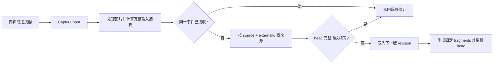

# 一份材料的旅程：从导入到固定引用

以两次导入同一份 Markdown 项目约定为例，说明网页与连接器如何形成统一捕获输入，服务端怎样保存不可变版本、生成检索投影，并区分立即可用的原文、可选后台记忆与显式知识文章；同时解释网页重复提交的版本行为、旧引用为何仍能打开，以及图片和代码的专门处理。

来源：gpt-5.6-sol 分析，gpt-5.6-sol 独立复核；模型解释仍可被原始证据纠正。

<a id="scenario"></a>
## 从一份两节约定开始

假设你在网页中保存下面这份材料（示例内容，不是仓库内置数据）：

```markdown
# 提交约定
合并前必须运行检查。

# 发布约定
发布前记录回滚步骤。
```

网页会把正文组装成一个 text part，并连同标题、来源类型和来源标识发送给服务端；统一合同还允许 image 与 HTTP(S) link part，以及时间、上游版本和来源信息。参考 [统一捕获输入 ↗](../../../packages/contracts/src/index.ts#L20 "支持网页与连接器最终提交统一 CaptureInput，及其 part 类型和主要元数据字段。")。要让稍后的修改进入**同一来源的版本链**，这里可填写 `externalId=project-rules`；留空时网页会生成随机标识。网页还会为每次手动提交生成新的事件标识和事件时间。参考 [网页提交事件 ↗](../../../apps/web/src/App.vue#L421 "支持网页组装 parts、随机生成空缺 externalId，并为每次手动提交生成新的 eventId 与 eventAt。")。

若改用文件、Git 或飞书连接器，它们只负责有边界地读取内容并转换为同一个 CaptureInput：文件受允许目录、500 KB 和 UTF-8 文本限制；Git 固定到解析出的 commit；正文中的 URL 只会保留，不会被自动抓取。参考 [有边界的连接器 ↗](../../../apps/server/src/connectors.ts#L1 "支持文件、Git 与飞书连接器转换为稳定 CaptureInput，并说明正文 URL 不会自动抓取。")。保存成功后，页面刷新并打开返回的修订，根据服务端结果提示复用原版本或已生成固定证据片段。参考 [保存后的页面反馈 ↗](../../../apps/web/src/App.vue#L451 "支持保存后刷新、打开返回 revision，并按 duplicate 结果显示反馈。")。

<a id="capture-flow"></a>
## 保存如何变成固定版本

所有入口最终都校验 CaptureInput，再调用 `Store.capture`。参考 [捕获请求入口 ↗](../../../apps/server/src/app.ts#L207 "支持直接捕获和各连接器在合同校验后调用 Store.capture。")。



服务端先把标题、parts、context、provenance、观察时间和上游版本组成完整指纹；所以“正文一样”并不必然等于“指纹一样”。参考 [完整版本指纹 ↗](../../../apps/server/src/store.ts#L136 "支持标题、已存 parts、context、provenance、观察时间和上游版本共同进入 fingerprint。")。如果请求携带与已接收事件相同的 collector/eventId 且载荷摘要一致，服务端按收据返回原修订；相同事件却换了载荷会被拒绝。参考 [同一事件幂等收据 ↗](../../../apps/server/src/store.ts#L145 "支持相同 collector/eventId 且载荷一致时返回已记录修订，不一致则报告事件冲突。")。否则，来源身份由 `source + externalId` 决定：head 完整指纹相同才复用，变化后写入 `version + 1`，并让 `previous_id` 指向旧版。参考 [来源身份与下一版 ↗](../../../apps/server/src/store.ts#L168 "支持按 source 与 externalId 找来源，比较 head 完整指纹，并以 version+1 和 previous_id 创建新修订。")。

新修订把文本按空行分成 fragments，链接转成“标签＋URL”，图片转成带标签的占位片段，再更新 head 与来源有效性代次。参考 [片段与当前版本 ↗](../../../apps/server/src/store.ts#L210 "支持不同 part 的片段生成方式，以及更新 source head 和 validity epoch。")。这些数据库写入包在同一个显式事务中，异常会回滚。参考 [数据库事务边界 ↗](../../../apps/server/src/store.ts#L74 "支持捕获写入使用显式 BEGIN、COMMIT 与异常 ROLLBACK。")。Markdown 标题和代码符号属于阅读结构投影，不会改写原 fragment 与 ID。参考 [阅读结构投影 ↗](../../../apps/server/src/knowledge/structure.ts#L10 "支持 Markdown 标题和代码符号只是阅读结构投影，不改写原始 fragment 或其 ID。")。

<a id="second-import"></a>
## 改一条规则后，v1 去了哪里

现在把第一条改成“合并前必须运行完整检查”，仍使用 `manual + project-rules` 保存。正文变化会改变完整指纹，系统创建 v2。即使正文不改，网页普通地重新填写并点击保存通常也会创建下一版，因为它每次产生新的事件标识和时间，而这些 provenance 字段参与指纹；只有完整指纹输入完全一致，或调用方是在重放同一个已接收事件时，才会复用既有修订。文件或 Git 连接器没有网页这组动态 provenance，输入未变时可命中完整指纹复用。参考 [网页提交事件 ↗](../../../apps/web/src/App.vue#L421 "支持网页组装 parts、随机生成空缺 externalId，并为每次手动提交生成新的 eventId 与 eventAt。")、[有边界的连接器 ↗](../../../apps/server/src/connectors.ts#L1 "支持文件、Git 与飞书连接器转换为稳定 CaptureInput，并说明正文 URL 不会自动抓取。")、[完整版本指纹 ↗](../../../apps/server/src/store.ts#L136 "支持标题、已存 parts、context、provenance、观察时间和上游版本共同进入 fingerprint。")、[同一事件幂等收据 ↗](../../../apps/server/src/store.ts#L145 "支持相同 collector/eventId 且载荷一致时返回已记录修订，不一致则报告事件冲突。")、[来源身份与下一版 ↗](../../../apps/server/src/store.ts#L168 "支持按 source 与 externalId 找来源，比较 head 完整指纹，并以 version+1 和 previous_id 创建新修订。")。

若网页两次都把来源标识留空，随机标识会让它们成为两个来源，而不是版本链。v2 成为 head 后，v1 也没有被覆盖：按 revision ID 仍能读取它，`current` 只是比较该 revision 是否等于当前 head；按 fragment ID 取证也不要求它当前。参考 [历史修订与证据读取 ↗](../../../apps/server/src/store.ts#L387 "支持按任意 revision ID 和 fragment ID 读取历史内容，并把 current 作为与 head 的比较结果。")。因此“历史仍可复核”和“普通搜索只给当前内容”可以同时成立——基础 fragment 搜索显式把结果限制在 source head。参考 [当前来源搜索 ↗](../../../apps/server/src/store.ts#L464 "支持基础 fragment 搜索只连接 source head，因此历史版本不会冒充当前结果。")。

<a id="after-save"></a>
## 保存后：立即发生、后台发生与显式发生

三类结果不要混为一次同步操作：

| 时机 | 会发生什么 | 读者可观察到什么 |
| --- | --- | --- |
| 立即 | revision、parts、fragments 与 head 已保存 | 可打开原文和固定片段；页面马上返回保存结果 |
| 检索时/索引后台 | 当前 head 被投影成检索单位 | Markdown 按块、代码按符号、纯图片至少按标签可找 |
| 后台学习启用后 | 提取候选、独立核验，再由记忆策略处理 | 可能自动应用、等待判断或拒绝 |
| 显式整理后 | 针对选中的当前材料生成知识文章 | 出现围绕读者问题组织、带原文引用的页面 |

检索请求会先同步投影；没有可用语义模型时仍走词法结果，有模型时再结合向量候选，所以“原文可查”不等于“语义索引已经完成”。参考 [检索时同步与降级 ↗](../../../apps/server/src/retrieval/unified.ts#L323 "支持检索请求先同步投影，并在没有语义模型或精确查询时返回词法结果。")。投影只读取各来源的当前 head，并按材料类型形成 Markdown、代码或图片检索单位。参考 [当前材料检索单位 ↗](../../../apps/server/src/retrieval/units.ts#L243 "支持 Markdown、代码和纯图片采用不同 passage 方式，且投影来源行只读取当前 head。")。

每份非 derived 捕获都会排入 `extract_claims`；派生内容被排除，避免摘要把自己当独立事实循环学习。参考 [捕获后的学习排队 ↗](../../../apps/server/src/store.ts#L348 "支持非 derived 捕获排入 extract_claims，而 derived 材料被排除以避免自循环。")。但真正的学习 worker 只有在 `learning.enabled` 且找到配置 profile 时才装配并启动。参考 [学习服务启用条件 ↗](../../../apps/server/src/app.ts#L92 "支持只有 learning 启用并找到 profile 时才创建 LearningPipeline。")。处理时它会再次确认输入仍是当前 head 和有效代次，旧任务会以 `STALE_JOB_INPUT` 退出；提取候选还要进入独立 verifier，再整批交给记忆策略。参考 [陈旧学习输入保护 ↗](../../../apps/server/src/learning/pipeline.ts#L180 "支持后台处理重新核对 revision 是否仍为当前 head 及有效代次。")、[提取、复核与记忆策略 ↗](../../../apps/server/src/learning/pipeline.ts#L421 "支持 extractor 产出候选后排入 verifier，并由记忆策略处理结果。")。

知识文章是另一条显式流程：`/pages` 要求可用 Agent、阅读目标和用户选中的当前 revision，随后才异步生成；普通 capture 不会自动发布 Wiki。参考 [显式知识生成 ↗](../../../apps/server/src/knowledge/api.ts#L147 "支持知识页面要求 Agent、阅读目标和选中的当前 revision，并以异步管线生成。")。

<a id="three-products"></a>
## 原文、记忆与知识文章不是同一个对象

沿用示例，可以这样辨认三者：

- **原始材料 v1/v2**：用户实际输入的 Markdown、固定 revision 与 fragments；保存完成即存在。
- **记忆**：后台从当前原文提出的事实、经历、流程或待办，经复核与策略后才可能应用；它不是原文副本。参考 [捕获后的学习排队 ↗](../../../apps/server/src/store.ts#L348 "支持非 derived 捕获排入 extract_claims，而 derived 材料被排除以避免自循环。")、[提取、复核与记忆策略 ↗](../../../apps/server/src/learning/pipeline.ts#L421 "支持 extractor 产出候选后排入 verifier，并由记忆策略处理结果。")。
- **知识文章**：例如围绕“如何执行项目约定”重组的读者讲解；需要显式选材与阅读目标，正文引用仍回到固定材料。参考 [显式知识生成 ↗](../../../apps/server/src/knowledge/api.ts#L147 "支持知识页面要求 Agent、阅读目标和选中的当前 revision，并以异步管线生成。")。

这就是“保存单位、检索单位、讲解单位”分开的实际含义：同一来源体系保留事实身份，但不同读者任务采用不同组织方式。

<a id="historical-citations"></a>
## 为什么知识引用还能打开 v1

知识材料的内容摘要来自固定 revision 的文本、图片和部分来源属性；文章发布时还保存每项材料依赖的 key 与该摘要。参考 [固定材料内容摘要 ↗](../../../apps/server/src/knowledge/repository.ts#L12 "支持知识材料从固定 revision 组合文本和图片，并计算稳定摘要。")。当 source 已更新为 v2，仓储会把依赖旧摘要的知识 head 标成非 current，但不会删除历史知识 revision。参考 [知识依赖失效 ↗](../../../apps/server/src/knowledge/repository.ts#L122 "支持发布前校验固定依赖，并在材料或子文章摘要变化后把知识 head 标为非 current。")。

打开引用时，API 先从**指定文章版本**找到对应依赖摘要，再解析材料；仓储先检查当前材料，摘要不匹配就遍历同一 source 的历史 revisions，找到后返回 `current=false`。参考 [引用解析入口 ↗](../../../apps/server/src/knowledge/api.ts#L28 "支持引用从文章依赖取固定摘要，并据此解析材料或文章版本。")、[历史材料摘要回查 ↗](../../../apps/server/src/knowledge/repository.ts#L193 "支持当前材料摘要不符时遍历同一来源历史 revisions，并返回 current=false。")。因此链接表达的是“打开文章写作时所依据的内容身份”，而不是“永远跳到该来源最新 head”。普通检索偏向当前 source 和 current 知识；固定引用则承担复核当时依据的职责。

<a id="special-materials"></a>
## 图片与代码：共享版本体系，使用专门投影

**图片**仍是 revision part。保存前会解码 base64、限制为 5 MB、核对 PNG/JPEG/WebP 的真实字节，并按内容哈希保存资产；revision 中只保留资产 ID、MIME 与标签。参考 [图片资产保存 ↗](../../../apps/server/src/store.ts#L102 "支持图片大小与真实格式校验、内容哈希去重，以及 revision 只保存资产引用和标签。")。学习上下文需要图片时，会从该资产 ID 取回字节并附上哈希、MIME 和标签；历史资产接口则从任意 revision 的 parts 验证资产确实被引用后再返回。参考 [学习上下文中的图片 ↗](../../../apps/server/src/learning/pipeline.ts#L220 "支持学习阶段按资产 ID 取回图片字节，并附带哈希、MIME 和标签。")、[历史图片读取 ↗](../../../apps/server/src/knowledge/api.ts#L87 "支持资产接口从所有 revisions 的 image parts 验证资产引用和 MIME 后返回字节。")。

**代码**也不另存一套原件。通用检索从固定文本解析 TS/JS/Vue 符号，把函数、方法、组件及顶层初始化组织成可搜索 passage。参考 [代码检索 passage ↗](../../../apps/server/src/retrieval/units.ts#L68 "支持从固定代码文本解析符号，并保留函数、方法、组件和顶层初始化的可搜索范围。")。知识阅读还会把相对 import 显示为确定性的模块跳转，但这只证明导入关系，不等于完整调用图。参考 [确定性模块跳转 ↗](../../../apps/server/src/knowledge/api.ts#L70 "支持知识材料 API 从相对 import 生成模块链接，同时明确它只表示模块依赖。")。仓库评审中的 Code Knowledge sync 是更专门的分支：它读取已经捕获的 head revision，按仓库状态和内容哈希建立符号/边的侧表快照，并明确不从实时文件系统替换固定原文。参考 [仓库代码侧表快照 ↗](../../../apps/server/src/code/sync.ts#L152 "支持 Code Knowledge 只读取已捕获 head revision，并用仓库状态和内容哈希建立专门快照。")。

需要修改这条主链时，可从这些入口开始：输入形状看 `captureSchema`；入口路由看 `/api/captures` 与 connectors；版本和片段看 `Store.capture/revision/evidence`；当前检索看 `sourceUnits` 与 `UnifiedRetrieval.search`；后台记忆看 `LearningPipeline.context/extract/verify`；旧引用看 `KnowledgeRepository.resolveMaterial` 与 `resolveCitation`。上述入口分别对应本文各阶段，能从一个真实输入继续追到用户看到的结果。
