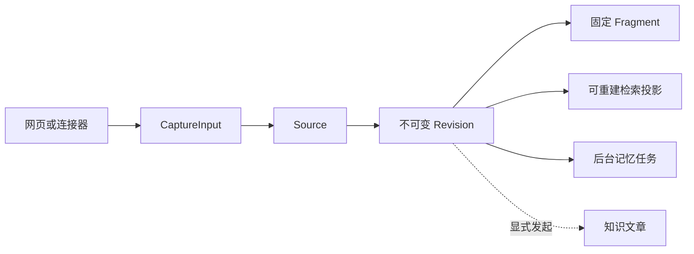

# 一份材料如何变成可检索、可追溯的知识

沿一份两节 Markdown 项目约定的两次导入，解释网页与连接器如何形成统一 Capture，Source、Revision、Fragment 如何分工，保存后检索、后台记忆提炼与显式知识整理分别何时发生，以及固定引用、图片和代码为何仍能回到当时原文。

来源：gpt-5.6-sol 分析，gpt-5.6-sol 独立复核；模型解释仍可被原始证据纠正。

<a id="example"></a>
## 先走一遍：同一份约定的两个版本

假设你在“输入材料”里填写标题“项目约定”、来源标识 `project-rules`，正文是：

```markdown
# 提交
合并前运行检查。

# 发布
发布由值班同学执行。
```

页面把非空正文、可选链接和图片组成 `parts`，连同来源类型、标题、标识与 provenance 交给 `/api/captures`；手工提交时还会为本次操作生成新的事件 ID 和时间，保存后立即打开返回的 Revision。参考 [网页捕获请求 ↗](../../../apps/web/src/App.vue#L416 "支持网页组装文本、链接、图片和来源元数据，并为手工提交生成事件标识与时间。")

要让两次导入归到同一来源，必须保留同一个来源类型和 `project-rules`；若标识留空，页面会随机生成一个。第二次把第一条改为“合并前运行完整检查并记录结果”，可以确保在同一 Source 下形成 V2。**Source 身份复用和 Revision 去重是两件事**：相同标识只决定系统找到同一 Source，并不保证正文相同就复用旧版。参考 [来源标识输入 ↗](../../../apps/web/src/App.vue#L887 "支持来源标识可复用、留空自动分配，以及正文段落成为固定片段的界面说明。") [稳定来源定位 ↗](../../../apps/server/src/store.ts#L171 "支持 Store 按 namespace 与 externalId 查找或创建 Source。")

| 对象 | 在示例中的含义 | 是否可替代原文 |
| --- | --- | --- |
| Source | “项目约定”这条稳定来源身份 | 不保存某一版正文 |
| Revision | V1、V2 两份不可变快照 | 就是当时原件 |
| Fragment | 捕获时按空行得到的固定证据锚点 | 不是文章目录 |
| Knowledge | 围绕读者问题重写的讲解 | 不能替代 Revision |

新版本会记录前序版本，并把文本按空行、链接按“标签＋URL”、图片按标签占位生成 Fragment。参考 [版本与片段生成 ↗](../../../apps/server/src/store.ts#L200 "支持新 Revision 的版本号、前序指针和三类 Fragment 生成规则。")

<a id="entry"></a>
## 网页和连接器最终交出同一种输入

手工入口只是一个 Capture 生产者。合同把 part 限定为文本、HTTP(S) 链接或 PNG/JPEG/WebP 图片，并要求来源标识、来源类型、标题与至少一个 part；因此 Store 不需要知道输入来自哪个页面。参考 [统一捕获合同 ↗](../../../packages/contracts/src/index.ts#L21 "支持文本、图片、链接 parts 以及来源、标题、上下文和 provenance 输入边界。")

连接器负责**适配并划定读取边界**：文件连接器只读配置根目录内的真实路径，限制大小并拒绝非 UTF-8/二进制；Git 连接器先把 ref 固定为 commit SHA，再读取该提交中的文件，并把 SHA 写入 `upstreamVersion`。参考 [文件与 Git 连接器 ↗](../../../apps/server/src/connectors.ts#L19 "支持受限文件读取、UTF-8 校验，以及 Git ref 固定为 commit SHA 后生成统一输入。") 飞书连接器校验 HTTPS 文档地址，通过外部 CLI 获取 Markdown，以文档 ID 作为稳定标识、revision ID 作为上游版本；原链接与引用元信息也作为 parts 保存，但不会沿链接自动抓取。参考 [飞书文档连接器 ↗](../../../apps/server/src/connectors.ts#L76 "支持飞书地址校验、Markdown 拉取、稳定文档标识、上游版本和引用 sidecar 保存。")



入口可以不同，落库后的身份、版本与证据语义相同。

<a id="commit"></a>
## 一次 Capture 在事务里提交什么

进入 `Store.capture` 后，图片先解码并校验真实字节类型，内容哈希成为资产标识；Revision 只保存资产引用。随后系统计算整个输入的 payload digest，并用标题、parts、context、provenance、`observedAt` 与 `upstreamVersion` 生成 fingerprint。网页每次手工提交都会刷新事件 ID 和时间，所以即使 Markdown 未变，也可能产生下一版；“相同”不能简化为只比较正文。参考 [图片资产与完整指纹 ↗](../../../apps/server/src/store.ts#L105 "支持图片按真实字节校验和哈希保存，并证明 Revision fingerprint 包含标题与完整 body 元数据。")

系统先检查采集事件收据：同一采集器、同一事件 ID 且 payload 相同时直接返回原 Revision；同一事件 ID 携带不同 payload 会冲突。之后才按 `source + externalId` 找 Source，并比较当前 head 的完整 fingerprint；只有 fingerprint 完全相同才复用 head，否则插入 `version + 1` 的 Revision。参考 [事件收据与版本去重 ↗](../../../apps/server/src/store.ts#L147 "支持事件级幂等、冲突检测、Source 定位、完整 fingerprint 去重及新版本插入。")

新 Revision 记录 `previous_id`，随后 Source 的 head 切到新版。旧 Revision 和旧 Fragment 不会被改写，读取时的 `current` 只表示它是否仍是 head。参考 [历史版本读取状态 ↗](../../../apps/server/src/store.ts#L390 "支持 Revision 返回前序、固定片段，并以 Source head 判断 current。") 更新 Source 还会使依赖旧版的记忆失效，排入刷新任务；每个非 derived 输入也会排入提取任务。因此“保存成功”表示原件、版本、证据锚点、变化记录和持久任务已经提交，**不表示模型已经提炼出记忆或文章**。参考 [换版与任务入队 ↗](../../../apps/server/src/store.ts#L234 "支持更新 head、失效旧记忆依赖、记录变化并排入刷新与提取任务。")

<a id="retrieval"></a>
## 保存后为什么马上能搜，但索引又不等于原件

Revision 与 Fragment 保存后即可从修订、历史和证据接口读取。搜索会先同步可重建投影，再执行词法与符号候选；没有可用 embedding 时仍可返回这些结果。参考 [搜索前同步投影 ↗](../../../apps/server/src/retrieval/unified.ts#L413 "支持搜索前同步检索投影，并在无向量模型时使用词法与符号候选。") 向量模型启用后，后台循环会同步投影并分批补建向量，不会阻塞原件成为可读内容。参考 [后台补建向量 ↗](../../../apps/server/src/retrieval/unified.ts#L72 "支持后台循环同步投影并分批建立 embedding。")

对示例 Markdown，检索投影按标题路径生成块，并尽量把引导句与后续表格、列表或代码围栏放在一起。它保留原始行范围，却不会改变 Revision，也不会把捕获时的空行 Fragment 强行当作阅读章节。参考 [Markdown 检索块 ↗](../../../apps/server/src/retrieval/units.ts#L31 "支持按标题和语法块建立 passage，并保留原始行范围与相邻引导句。")

代码同样先作为文本进入 Source/Revision；差别只在投影：TS、JS、Vue 会按完整函数、方法或符号切分，模块初始化与 import 也保留为可检索内容。参考 [代码检索块 ↗](../../../apps/server/src/retrieval/units.ts#L90 "支持代码按完整符号切分，并保留模块初始化与 import 内容。") 底层解析是单文件 TypeScript AST 与 Vue SFC；调用仅是名称级候选，没有跨文件 TypeChecker，因此不能据此宣称已有完整调用图。参考 [单文件 AST 边界 ↗](../../../apps/server/src/code/parse.ts#L1 "支持 TypeScript 单文件 AST 与 Vue SFC 解析，并明确 calls 仅为名称级候选。")

<a id="branches"></a>
## 保存后的三条分支：立即、后台、显式

**立即发生**的是原件可读、版本历史可查、结构化与词法检索可同步重建。

**后台记忆提炼**有额外条件：捕获会持久排任务，但默认配置 `learning.enabled=false`；只有启用并找到指定 profile 时，应用才创建 LearningPipeline。参考 [后台学习默认配置 ↗](../../../apps/server/src/config.ts#L56 "支持 learning 默认关闭以及 profile 和轮询配置。") [学习管线启动条件 ↗](../../../apps/server/src/app.ts#L121 "支持仅在启用且找到 profile 时创建 LearningPipeline。") worker 读取固定 Revision/Fragment，extractor 保存观察与候选，有待处理候选才排 verifier；复核后由 MemoryService 决定自动应用、等待决定或拒绝，模型不直接写入事实。参考 [候选提取流程 ↗](../../../apps/server/src/learning/pipeline.ts#L550 "支持 extractor 保存运行结果和观察，并仅在存在待处理候选时排 verifier。") [复核与策略应用 ↗](../../../apps/server/src/learning/pipeline.ts#L645 "支持 verifier 校验整批提案，并由 MemoryService 批量评估和应用。")

**知识文章整理**必须另行发起。用户先选择材料，再填写主题、阅读目标与读者，点击“开始整理”；服务端只接受仍为当前版本的 revision IDs。参考 [知识文章整理交互 ↗](../../../apps/web/src/knowledge/ArticleComposer.vue#L102 "支持先选材料、再说明阅读目标并显式开始整理的两步操作。") [知识页面创建接口 ↗](../../../apps/server/src/knowledge/api.ts#L165 "支持服务端校验当前 Revision IDs，并以读者 brief 启动页面写作。") KnowledgePipeline 调查、写作并调用独立复核，只有被接受的文档才连同固定 dependencies、生成与复核记录交给 repository 发布。参考 [写作与独立复核 ↗](../../../apps/server/src/knowledge/pipeline.ts#L157 "支持写作产物经过独立 verifier 接受后才构造带固定依赖的 artifact。") [知识版本发布 ↗](../../../apps/server/src/knowledge/repository.ts#L122 "支持发布前核对依赖 digest、保存知识 Revision 并切换 head。")

所以三者不是重复副本：原始材料保存“当时说了什么”，记忆服务于持续助理状态，知识文章围绕读者问题组织解释。

<a id="citations"></a>
## 为什么更新后仍能打开旧引用

文章发布时会检查依赖 digest 是否仍匹配，并把文章自身保存成知识 Revision。来源变化后，refresh 会把依赖不再匹配的文章标为非当前，而不会悄悄把引用改指 V2。参考 [知识版本发布 ↗](../../../apps/server/src/knowledge/repository.ts#L122 "支持发布前核对依赖 digest、保存知识 Revision 并切换 head。") [知识依赖失效 ↗](../../../apps/server/src/knowledge/repository.ts#L178 "支持来源或上层文章依赖变化时把文章标记为非当前。")

读者点击引用时，API 从指定文章 Revision 中找到 citation 及其 dependency digest，再调用 `resolveMaterial(key, digest)`。如果当前材料 digest 不符，repository 会沿同一 Source 的历史 Revisions 查找匹配版本，返回 `current:false`。参考 [引用固定版本解析 ↗](../../../apps/server/src/knowledge/api.ts#L45 "支持引用解析从指定文章 Revision 取得依赖 digest，再解析固定材料。") [历史材料回溯 ↗](../../../apps/server/src/knowledge/repository.ts#L193 "支持当前 digest 不匹配时遍历同一 Source 的历史 Revisions。") 前端据此标为“历史版本”，显示引用行并允许阅读完整原文；文章自身也会提示材料已变化、引用仍指向写作时版本。参考 [历史原文阅读 ↗](../../../apps/web/src/knowledge/KnowledgeSource.vue#L19 "支持前端按 digest 读取材料、标注当前或历史版本并显示引用行与原文。") [文章更新提示 ↗](../../../apps/web/src/knowledge/KnowledgeDocument.vue#L32 "支持文章依赖变化时提示等待更新，并说明引用仍指向写作时版本。")

因此示例文章若写作时引用 V1 的“合并前运行检查”，之后导入 V2，旧句仍可查看；文章会等待重新核对，不能把 V2 的新规则冒充成 V1 论断的依据。

<a id="media-code"></a>
## 图片、代码与修改入口

图片没有旁路存储：它仍属于固定 Revision，只是字节按内容哈希存入私有资产目录；知识材料把文本与 images 分开保留，纯图片材料则以标签形成可搜索单位。参考 [图片资产与完整指纹 ↗](../../../apps/server/src/store.ts#L105 "支持图片按真实字节校验和哈希保存，并证明 Revision fingerprint 包含标题与完整 body 元数据。") [知识材料中的图片 ↗](../../../apps/server/src/knowledge/repository.ts#L20 "支持知识材料从同一 Revision 分离文本与图片资产并共同计算材料身份。") 后台学习会从固定资产读取图片字节，把 MIME、哈希与 base64 交给模型。参考 [学习上下文图片 ↗](../../../apps/server/src/learning/pipeline.ts#L330 "支持后台学习读取固定资产，并携带哈希、MIME、base64 与标签。") 当前没有通用 OCR、布局定位和视觉索引闭环；标签可搜、模型可看图，不等于所有图片都已结构化理解。参考 [图片理解现状 ↗](../../../docs/reader-first/current-system.md#L17 "支持当前尚无通用 OCR、布局定位和视觉索引闭环这一产品边界。")

要修改这条链，可以从这些入口开始：

- 改网页字段与提交：`apps/web/src/App.vue::capture`；改统一输入合同：`packages/contracts/src/index.ts::captureSchema`。
- 改文件、Git、飞书适配：`apps/server/src/connectors.ts`；改版本、去重、Fragment 与任务入队：`apps/server/src/store.ts::capture`。
- 改 Markdown/代码检索切分：`apps/server/src/retrieval/units.ts::markdownPassages/codePassages`；改 AST 边界：`apps/server/src/code/parse.ts::parseFile`。
- 改后台记忆：`apps/server/src/learning/pipeline.ts::extract/verify/refreshDependents`；改文章生成与发布：`knowledge/api.ts`、`knowledge/pipeline.ts`、`knowledge/repository.ts`。
- 改旧引用解析与阅读：后端 `resolveCitation/resolveMaterial`，前端 `KnowledgeDocument.vue` 与 `KnowledgeSource.vue`。

这些入口分别对应输入、保存、检索、派生处理和阅读，不需要在另一套“代码知识库”里重做 Source/Revision。
