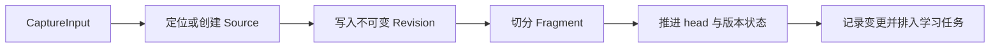

# 一份材料的旅程：从导入、版本到可追溯阅读

以两次导入同一份 Markdown 项目约定为例，解释 CaptureInput 如何落成 Source、Revision 与 Fragment，哪些能力保存后立即可用，哪些依赖后台学习或显式知识生成，以及历史引用、图片和代码为何仍能回到固定原件。

来源：gpt-5.6-sol 分析，gpt-5.6-sol 独立复核；模型解释仍可被原始证据纠正。

<a id="scenario"></a>
## 先看一次两版导入

假设你在网页中填写标题“项目约定”，把来源设为 `manual`，并把来源标识固定为 `project-rules`，正文是：

```markdown
# 提交
合并前运行检查。

# 评审
至少一人批准。
```

网页把正文装进一个 text part，再提交给 `/api/captures`；保存成功后按服务端返回的 revision 打开材料。服务端按空行切分文本，因此这个例子形成两个固定证据片段：一段“提交”，一段“评审”。参考 [网页捕获组包 ↗](../../../apps/web/src/App.vue#L405 "支持示例中网页把文本组成 part、提交捕获并打开返回 revision 的过程。") [证据片段切分 ↗](../../../apps/server/src/store.ts#L210 "支持文本按空行切片，以及链接和图片各自形成证据文本。")

第二次仍用 `manual + project-rules`，只把末句改成“至少两人批准”。同一来源身份会得到第 2 版，head 转向新版，第 1 版仍保留。若来源标识留空，网页会生成新的 UUID，两次保存会成为两个 Source，而非一条版本链。还要注意，网页每次都会生成新的事件标识，而 revision 指纹包含 provenance；因此即使正文相同，普通网页再次提交也可能产生新版本。参考 [网页来源与事件标识 ↗](../../../apps/web/src/App.vue#L427 "支持空 externalId 生成 UUID、每次捕获生成新 eventId 的行为。") [来源身份与版本指纹 ↗](../../../apps/server/src/store.ts#L136 "支持以 source 和 externalId 定位 Source，并由包含 provenance 的 body 参与 revision 指纹。")

<a id="concepts"></a>
## 四个对象各自解决什么问题

| 对象 | 作用 | 在示例中是什么 |
|---|---|---|
| **CaptureInput** | 统一入口信封，携带来源、标题、parts、上下文与 provenance | 网页提交的“项目约定” |
| **Source** | 跨版本的长期身份 | `manual + project-rules` |
| **Revision** | 一次不可变内容状态 | v1 与 v2 |
| **Fragment** | 检索、引用和学习读取的固定证据片段 | “提交”“评审”两段 |

Revision 明确记录版本号、前一版本、parts、fragments 和是否为当前 head；这使“当前内容”与“当时引用的内容”可以同时存在。参考 [Revision 数据结构 ↗](../../../packages/contracts/src/index.ts#L129 "解释 Revision 如何同时携带版本链、固定片段与 current 状态。")

**知识文章不是第五种原文。** 例如“提交检查与双人评审共同构成合并门禁”是对 v2 的组织性解释，应作为带引用、固定依赖摘要、生成与独立复核记录的 KnowledgeArtifact 保存，而不是回写或替换 Markdown。参考 [知识产物与固定依赖 ↗](../../../packages/contracts/src/knowledge.ts#L88 "支持知识文档与原始材料分层，并记录依赖摘要、生成和复核信息。")

<a id="entry"></a>
## 网页和连接器最终进入同一入口

CaptureInput 的 part 可以是文本、HTTP(S) 链接或 PNG/JPEG/WebP 图片，整个信封还可带观测时间、上游版本和来源信息。参考 [统一捕获合同 ↗](../../../packages/contracts/src/index.ts#L20 "支持 CaptureInput 的来源、parts、上下文与 provenance 字段。")

网页直接组装这些 parts；文件、Git、飞书连接器则先把外部内容规范化，再共同调用 `Store.capture`。文件连接器只读取允许根目录内、至多 500 KB 的 UTF-8 文本；Git 连接器先解析明确 commit，再用该 commit 读取文件并把 SHA 记为 `upstreamVersion`；飞书连接器保存 Markdown、原文链接和引用侧车。它们改变的是“如何取得输入”，不是后续保存模型。参考 [连接器统一落库 ↗](../../../apps/server/src/app.ts#L207 "支持直接捕获及文件、Git、飞书连接器最终共同调用 Store.capture。") [文件与 Git 输入规范化 ↗](../../../apps/server/src/connectors.ts#L19 "支持文件读取边界、固定 commit 读取以及 upstreamVersion 的来源。")

想找入口时，从 `apps/web/src/App.vue::capture` 看页面组包，从 `apps/server/src/app.ts` 的 `/api/captures` 与 `/api/connectors/*` 看路由，再进入 `apps/server/src/store.ts::Store.capture`。

<a id="commit_and_search"></a>
## 一次事务内，原文先成为可读、可搜的版本



`Store.capture` 先规范化 parts 并计算指纹，再以 `source + externalId` 找 Source。指纹变化时写入 `version = head.version + 1` 的新 Revision，并用 `previous_id` 连回旧版；随后生成 fragments、推进 head、更新有效性 epoch、记录变更，最后返回固定 revision。整个过程包在 `BEGIN IMMEDIATE` 事务中，任一步失败都会回滚。参考 [捕获事务边界 ↗](../../../apps/server/src/store.ts#L74 "支持捕获写入整体在事务内提交或回滚。") [版本写入与推进 head ↗](../../../apps/server/src/store.ts#L197 "支持新 revision 的版本号、previous_id、片段写入和 head 更新。")

保存后，原文、版本历史和证据片段已经可读；Fragment 的插入触发器会同步更新 FTS。统一检索在查询前同步当前 head 的检索单元，所以新材料无需等待 Agent 就能走词法检索。若配置了 embedding，语义向量由启动后的循环补齐；向量尚未完成时，检索仍可返回词法结果。参考 [Fragment 的 FTS 投影 ↗](../../../apps/server/src/storage/migrations.ts#L915 "支持新片段由数据库触发器同步进入全文检索索引。") [检索同步与语义补齐 ↗](../../../apps/server/src/retrieval/unified.ts#L58 "支持查询前同步检索投影、无语义模型时仍走词法结果，以及后台批量补向量。")

<a id="background"></a>
## 保存完成不等于记忆或知识已经生成

保存原始材料时，每个非 derived capture 都会在同一事务中排入 `extract_claims`。若 Source 更新，旧版本依赖的 memories 会先标为 stale/invalidated，并排入 `refresh_dependents`；旧原文不会因此删除。参考 [捕获后的学习与刷新任务 ↗](../../../apps/server/src/store.ts#L246 "支持非派生捕获排入提取任务，以及来源更新时冻结依赖并排刷新任务。")

后台学习只有在配置了 learning profile 且应用启动了 LearningPipeline 时才消费任务。它先确认 job 仍指向当前 head 与有效性 epoch，再从固定 fragments 提取候选；有候选才交给独立 verifier，最终由 MemoryService 按整批策略自动应用、等待决定或拒绝，模型本身不直接写记忆。参考 [学习运行时装配 ↗](../../../apps/server/src/app.ts#L92 "支持只有配置学习 profile 才创建并启动 LearningPipeline。") [提取、复核与策略应用 ↗](../../../apps/server/src/learning/pipeline.ts#L421 "支持候选提取后才排复核，并由 MemoryService 对整批结果执行策略。")

知识文章是另一条**显式**流程：用户选择固定 revision、填写读者目标并发起“整理文章”，服务端才异步研究、写作和复核，通过后由 KnowledgeRepository 发布。因此，本例的 v1/v2 Markdown 保存成功，只代表原件与检索基础就绪；不会自动出现一篇“项目合并门禁”的知识文章。参考 [知识整理入口 ↗](../../../apps/web/src/knowledge/ArticleComposer.vue#L58 "支持用户选择 revision 并填写阅读目标后显式提交页面生成。") [异步知识页面生成 ↗](../../../apps/server/src/knowledge/api.ts#L147 "支持页面生成依赖 Agent profile、固定材料选择并以异步任务执行。")

<a id="historical_evidence"></a>
## 为什么引用仍能打开旧版本

知识正文里的 citation 保存可读的材料 key 与行范围；KnowledgeArtifact 的 dependencies 另外固定该材料当时的 digest。打开引用时，API 从所读文章版本取 citation 和依赖摘要，再调用 `resolveMaterial(key, digest)`。若当前 head 摘要不同，仓储会遍历这个 Source 的历史 revisions，找到摘要匹配的版本并标为 `current=false`。参考 [引用解析固定摘要 ↗](../../../apps/server/src/knowledge/api.ts#L28 "支持 API 按文章依赖摘要解析材料引用，而不是只读当前同名材料。") [历史材料解析 ↗](../../../apps/server/src/knowledge/repository.ts#L193 "支持当前摘要不匹配时遍历同一 Source 的历史 revisions。")

因此，v1 中“至少一人批准”的引用不会被 v2 的“两人批准”静默替换。阅读界面会明确显示“历史版本”，并仍可按原行范围展开原文。来源更新也会让依赖不再匹配的知识 head 变为非 current，但不会删除旧知识 revision 或旧材料 revision。参考 [知识失效传播 ↗](../../../apps/server/src/knowledge/repository.ts#L178 "支持来源或文章依赖变化时将知识 head 标为非 current。") [历史版本阅读提示 ↗](../../../apps/web/src/knowledge/KnowledgeSource.vue#L33 "支持阅读界面明确区分当前版本与历史版本并显示引用行范围。")

<a id="media_and_code"></a>
## 图片与代码共用来源体系，但有专门投影

**图片。** 网页先限制格式和 5 MB 大小；服务端再次校验 base64、大小与文件魔数，以字节 SHA-256 作为 assetId，只保存一份资产文件，Revision 中只保留 assetId、类型和标签。图片仍生成“[图片] 标签”Fragment；后台学习需要视觉内容时，再按 assetId 读取真实字节并连同 `asset_ref` 交给模型。参考 [图片内容寻址存储 ↗](../../../apps/server/src/store.ts#L102 "支持图片格式与字节校验、assetId 计算和 Revision 中的轻量引用。") [学习读取图片资产 ↗](../../../apps/server/src/learning/pipeline.ts#L220 "支持后台从 assetId 取回真实字节，并保留图片资产引用。")

**代码。** 代码原文仍走 Source → Revision → Fragment。仓库评审同步以 repo-relative path 作为稳定身份，按顶层声明或测试用例边界预分 part，并记录 commit、dirty 与内容摘要；随后显式的 `runCodeSync` 只读取已捕获的当前 revisions，建立固定快照并解析符号等侧表。普通检索也会把代码按函数、方法、组件及其邻近注释投影为精确行范围 passage。参考 [代码捕获的稳定边界 ↗](../../../apps/server/src/review/sync.ts#L430 "支持仓库评审按声明或测试边界预分代码，并以稳定路径和快照元数据捕获。") [固定 revision 上的代码同步 ↗](../../../apps/server/src/code/sync.ts#L152 "支持代码分析只读取已捕获 head，建立快照并把符号锚回固定证据。") [代码检索单元投影 ↗](../../../apps/server/src/retrieval/units.ts#L68 "支持普通检索按代码符号及邻近注释生成精确行范围 passage。")

边界要分清：普通 `/api/connectors/git` 只把某个 commit 的文件交给 `Store.capture`，这足以保存和检索原文；该路由没有调用仓库级代码同步。需要 AST 符号与快照导航时，应走显式的仓库评审同步入口，不能假定任意 Git 导入都会自动建立代码图。参考 [文件与 Git 输入规范化 ↗](../../../apps/server/src/connectors.ts#L19 "支持文件读取边界、固定 commit 读取以及 upstreamVersion 的来源。") [固定 revision 上的代码同步 ↗](../../../apps/server/src/code/sync.ts#L152 "支持代码分析只读取已捕获 head，建立快照并把符号锚回固定证据。")
