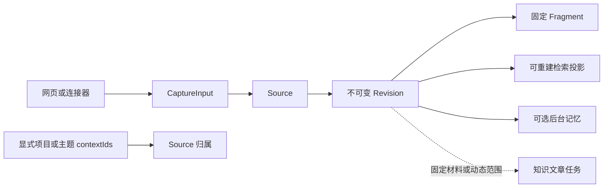

# 一份材料如何变成可检索、可追溯的知识

沿一份两节 Markdown 项目约定的两次导入，解释网页与连接器如何形成统一 Capture，Source、Revision、Fragment、检索投影、Memory 与 Knowledge 如何分工；再区分保存后立即可用的原件与检索、可选的后台记忆、固定或动态选材的知识文章，并说明固定历史引用、章节适用性、图片与代码处理边界以及相应代码入口。

来源：gpt-5.6-sol 分析，gpt-5.6-sol 独立复核；模型解释仍可被原始证据纠正。

<a id="example"></a>
## 先走一遍：同一份约定的两个版本

先给结论：一次导入先固定“当时收到的原件”，再从这个不可变版本建立可重建的检索、记忆候选和知识文章。**原件、索引、记忆和讲解不是同一份数据，也不会在保存按钮按下时同时完成。**

下面的 Markdown 是教学示例，不是仓库中的真实材料。假设你在“输入材料”里填写标题“项目约定”、来源类型 `manual`、来源标识 `project-rules`：

```markdown
# 提交
合并前运行检查。

# 发布
发布由值班同学执行。
```

页面把非空正文、可选 HTTP(S) 链接和图片组成 `parts`，可同时选择项目或主题；手工提交还会生成新的 `eventId` 与 `eventAt`，保存后打开服务端返回的 Revision。参考 [网页捕获请求 ↗](../../../apps/web/src/App.vue#L423 "支持网页组装 parts、附加 contextIds、生成 eventId 与 eventAt 并打开返回 Revision。")

第二次仍使用 `manual + project-rules`，但把“提交”规则改成“合并前运行完整检查并记录结果”。相同来源类型与来源标识让系统找到同一个 Source；标识留空则由页面随机分配，不会自然接到旧版本链。界面也明确提示“相同标识产生新版本”。参考 [来源标识与输入表单 ↗](../../../apps/web/src/App.vue#L909 "支持来源标识复用或留空分配、正文段落片段以及链接和图片输入的界面语义。")

| 对象 | 示例中的含义 | 作用 |
| --- | --- | --- |
| Source | `manual + project-rules` | 稳定来源身份；项目/主题归属也绑定在这里 |
| Revision | V1、V2 | 不可变原件快照；V2 指向 V1 |
| Fragment | 按空行、链接或图片固定的片段 | 捕获时的证据锚点，不是文章目录 |
| 检索投影 | Markdown passage、代码符号、向量 | 可重建的查找入口，不改写原件 |
| Memory | 从原始输入提炼并复核的持续状态 | 可选后台分支 |
| Knowledge | 围绕读者目标写成的本文 | 派生讲解，不能替代原件 |

还有一个容易误判的细节：Source 复用与 Revision 去重是两件事。根据当前实现推导，网页每次普通提交都会换新的 `eventId` 和 `eventAt`，而 fingerprint 包含 provenance，因此即使正文不变，两次独立网页提交通常也会形成两个 Revision。只有同一采集事件重放，或完整 fingerprint 相等，才会复用已有版本。参考 [网页捕获请求 ↗](../../../apps/web/src/App.vue#L423 "支持网页组装 parts、附加 contextIds、生成 eventId 与 eventAt 并打开返回 Revision。") [资产、幂等、身份与片段 ↗](../../../apps/server/src/store.ts#L108 "支持图片事务前校验和内容寻址、receipt 幂等、Source 定位、fingerprint、新 Revision 与 Fragment 生成。")

<a id="entry"></a>
## 网页和连接器最终交出同一种原件输入

手工页面只是 Capture 的一个生产者。统一合同要求 `source`、`externalId`、标题和 1–50 个 parts；part 只能是非空文本、HTTP(S) 链接或 PNG/JPEG/WebP 图片。顶层和逐 part provenance 可保留采集器、参与者、事件、时间、回复关系、引用/转发及 original/derived 等信息。参考 [统一 Capture 合同 ↗](../../../packages/contracts/src/index.ts#L5 "支持文本、链接、图片、顶层及逐 part provenance 与 CaptureInput 的字段边界。")

文件、Git、飞书连接器的职责是**适配格式并划定读取边界**，最终仍返回 `CaptureInput`：

- 文件连接器只读取 `captureRoots` 内的真实路径，限制 500 KB，要求 UTF-8 且拒绝含 NUL 的二进制内容。
- Git 连接器校验 ref 与路径，先把 ref 固定为 commit SHA，再读取该提交中的文件，并把 SHA 写入 `upstreamVersion`。
- 飞书连接器只接受指定 HTTPS docx/wiki 地址，经外部 CLI 拉取 Markdown，以文档 ID 作为稳定标识、revision ID 作为上游版本，并保留原链接和引用 sidecar。
- 捕获正文中的 URL 只作为内容保存，不会被连接器自动爬取。参考 [有边界的连接器 ↗](../../../apps/server/src/connectors.ts#L1 "支持文件、Git、飞书的读取边界、稳定身份和上游版本，并说明正文 URL 不自动爬取。")

项目/主题不是 `CaptureInput` 正文的一部分，而是 HTTP 入口随 Capture 传给 Store 的附加选择。服务端把这些 `contextIds` 交给网页、文件、Git 和飞书的同一保存入口。参考 [Capture 路由附加选材 ↗](../../../apps/server/src/app.ts#L258 "支持网页和三个连接器路由把 contextIds 作为 Capture 之外的选择传给 Store。") 归属表明确绑定 **Source**，不会从文件名、会话 ID 或材料正文推断；重新为同一 Source 提交一组 context IDs 会替换原集合，显式空集合可以清除归属。参考 [Source 级项目与主题归属 ↗](../../../apps/server/src/contexts/repository.ts#L5 "支持显式归属、不从内容推断、校验 context IDs、替换 Source 归属和按 context 取 Source。")



因此入口可以不同，落库后的身份、版本和证据语义相同；差别保留在 `source`、上游版本、上下文、provenance 与显式 Source 归属中。

<a id="commit"></a>
## 一次 Capture 真正提交了什么

`Store.capture` 先计算原始输入的 payload digest。图片在进入数据库事务前从 base64 解码，限制真实字节不超过 5 MB，以 magic bytes 校验声明的 PNG/JPEG/WebP 类型，再按内容哈希写入私有资产文件；Revision body 只保存资产引用及元数据。随后标题、parts、context、provenance、观察时间和上游版本共同进入 fingerprint。参考 [资产、幂等、身份与片段 ↗](../../../apps/server/src/store.ts#L108 "支持图片事务前校验和内容寻址、receipt 幂等、Source 定位、fingerprint、新 Revision 与 Fragment 生成。")

数据库事务内按以下顺序处理：

1. 若存在 `collectorId + eventId`，先查采集收据；相同事件与相同 payload 返回原 Revision，同一事件携带不同 payload 则报冲突。即使复用 Revision，也可以更新这个 Source 的 context 归属并确保后续任务。
2. 再按 `source + externalId` 查找或创建 Source，并写入显式项目/主题归属。
3. 当前 head 的 fingerprint 完全相同时复用 head；否则插入 `version + 1` 的 Revision，记录 `previous_id`。
4. 文本按空行、链接按“标签＋URL”、图片按“[图片] 标签”生成最多 2000 个固定 Fragment。参考 [资产、幂等、身份与片段 ↗](../../../apps/server/src/store.ts#L108 "支持图片事务前校验和内容寻址、receipt 幂等、Source 定位、fingerprint、新 Revision 与 Fragment 生成。")

新 Revision 建好后，系统尽力写入确定性导航画像；失败只记录画像失败，不阻止来源保存。随后切换 Source head 与 validity epoch。若这是换版，还会把旧记忆依赖标为 stale、相应记忆标为 invalidated，登记刷新并排入 `refresh_dependents`；最后记录变化、写采集收据，并为非 derived 输入排 `extract_claims`。参考 [换版后的确定性工作 ↗](../../../apps/server/src/store.ts#L233 "支持导航画像、切换 head、失效旧记忆、登记刷新、记录变化与后续任务。") [学习任务与 Revision 状态 ↗](../../../apps/server/src/store.ts#L357 "支持非 derived 输入排 extract_claims，以及 Revision 返回固定 parts、Fragments、previousId 和 current。")

所以“保存成功”的准确边界是：原件版本、固定片段、Source head、显式归属、变化记录和持久任务已经落下。它**不表示** embedding 已补齐、模型已提炼记忆，或知识文章已经写完。旧 Revision 仍可读取，`current` 只表示它是否仍是 Source head。参考 [学习任务与 Revision 状态 ↗](../../../apps/server/src/store.ts#L357 "支持非 derived 输入排 extract_claims，以及 Revision 返回固定 parts、Fragments、previousId 和 current。")

<a id="retrieval"></a>
## 为什么保存后马上能搜，但索引又不等于原件

Revision 与 Fragment 落库后即可直接读取；搜索调用会先同步可重建投影。显式代码导航意图优先返回符号或调用方候选；自然语言中识别到“谁调用某符号”时，只有确实找到候选才走捷径，否则仍回到普通召回。参考 [代码导航候选 ↗](../../../apps/server/src/retrieval/unified.ts#L345 "支持显式代码意图优先，以及自然语言调用方捷径无候选时回到普通召回。")

普通非空查询组合词法、符号与可用的语义候选。**空查询得到空结果**；精确定位、向量模型尚未加载，或向量计算失败时，使用词法与符号结果。参考 [搜索同步、空查询与回退 ↗](../../../apps/server/src/retrieval/unified.ts#L427 "支持搜索前同步投影、空查询为空以及精确定位、无模型或向量失败时的词法和符号回退。") 检索服务创建后立即启动后台循环：首轮 `tick` 延迟 100 ms，随后同步投影并分批补建 embedding，正常约 1 秒继续，出错后约 30 秒重试。这个 100 ms 是调度安排，不是 HTTP listener 的就绪承诺。参考 [后台补建向量 ↗](../../../apps/server/src/retrieval/unified.ts#L84 "支持首轮延迟 100 ms 的后台循环、同步投影、分批索引与错误退避。") [检索服务创建时启动 ↗](../../../apps/server/src/retrieval/factory.ts#L14 "支持 createRetrieval 构建 UnifiedRetrieval 后立即调用 start。")

对示例 Markdown，passage 按 Markdown token 与标题路径建立并保留真实行号；以冒号结尾的引导段会尽量与紧随的表格、列表或代码块一起返回。它不会改写 Revision，也不会把捕获时按空行形成的 Fragment 当成阅读章节。参考 [Markdown passage ↗](../../../apps/server/src/retrieval/units.ts#L33 "支持按标题与语法块投影、保留行号并合并引导段和结构块。")

代码也先作为文本进入同一 Source/Revision，只在投影层特殊处理：完整函数和方法保留控制流，函数内局部 `const` 不抢占为独立 passage；imports 与顶层初始化仍可搜索。参考 [代码 passage ↗](../../../apps/server/src/retrieval/units.ts#L92 "支持按完整操作切分代码、保留父级路径、注释、imports 与顶层初始化。") 底层解析是离线、单文件的 TypeScript AST 与 Vue SFC；calls 只是名称级候选，没有 Program 或跨文件 TypeChecker，因此适合导航调查，不能当成完整调用图。参考 [单文件 AST 边界 ↗](../../../apps/server/src/code/parse.ts#L1 "支持 TypeScript 单文件 AST、Vue SFC 与名称级调用候选的能力边界。")

<a id="branches"></a>
## 保存后的三条分支：立即、后台与显式整理

**第一条是立即可用的原件与检索。** Source、Revision、Fragment 和版本历史已经确定；词法/结构投影可同步重建，embedding 再由后台补齐。

**第二条是可选的后台记忆。** 配置默认 `learning.enabled=false`；只有启用并找到指定 profile，应用才创建并启动 LearningPipeline。参考 [学习默认配置 ↗](../../../apps/server/src/config.ts#L63 "支持 learning 默认关闭以及 profile 与轮询配置。") [学习管线启动条件 ↗](../../../apps/server/src/app.ts#L122 "支持仅在启用并找到指定 profile 时创建 LearningPipeline，并在应用启动阶段启动它。") 原始 Capture 即使在 learning 关闭时仍会排 `extract_claims`，只是没有 worker 消费；开启后，extractor 保存运行结果和 observations，并仅为仍需处理的提案排 verifier。参考 [学习任务与 Revision 状态 ↗](../../../apps/server/src/store.ts#L357 "支持非 derived 输入排 extract_claims，以及 Revision 返回固定 parts、Fragments、previousId 和 current。") [候选提取流程 ↗](../../../apps/server/src/learning/pipeline.ts#L608 "支持 extractor 保存运行与观察，并只在存在未处理提案时排 verifier。") verifier 必须覆盖整批提案并校验 digest，最后由 `MemoryService.evaluateBatch` 统一应用策略；模型输出本身不等于记忆已写入。参考 [整批复核与策略应用 ↗](../../../apps/server/src/learning/pipeline.ts#L689 "支持 verifier 覆盖整批提案、校验 digest，并由 MemoryService 批量评估应用策略。")

项目作用域还有严格条件：只有所有输入 Source **共同且唯一**属于一个显式 project 时，该 project 才成为可信 scope；topic、名字、路径、会话载体、无项目或多个项目都不能代替。抽取前后还会比较 membership stamp，归属在异步运行期间变化就拒绝旧结果；更新已有记忆也不能把它搬到另一个项目。参考 [可信项目 scope 与归属戳 ↗](../../../apps/server/src/learning/pipeline.ts#L321 "支持唯一共同显式 project、禁止内容推断、membership stamp 前后校验和禁止跨项目搬迁记忆。")

**第三条是显式排队的知识文章。** 整理窗口可以同时选择固定 Revision 和持续跟踪的项目/主题：动态范围中的当前材料自动包含，仍可另选固定背景材料。参考 [固定材料与动态范围界面 ↗](../../../apps/web/src/knowledge/ArticleComposer.vue#L163 "支持文章组合动态 context 范围与另选固定背景材料，并说明以后加入的成员可触发维护。") 前端提交 revision IDs、`contextIds` 和阅读目标；服务端确认至少存在固定材料或动态范围，验证 Revision 仍为当前版本，保存 `materialKeys + contextIds` 计划并返回 `202 queued`。参考 [页面计划校验与排队 ↗](../../../apps/server/src/knowledge/api.ts#L207 "支持服务端验证固定 Revision 或 context 范围、保存 materialKeys 计划并以 202 queued 返回。")

两种选材语义不同：

- `materialKeys` 是固定集合；未选的新材料不会自行加入。
- `contextIds` 是显式动态范围。repository 每次把固定 keys 与这些 context 当前成员取并集；它不是文章分类，也不是相似度分组。参考 [计划材料并集 ↗](../../../apps/server/src/knowledge/repository.ts#L123 "支持每次把显式 materialKeys 与 contextIds 当前 Source 成员取并集。")
- 开启自动维护后，worker 把计划和当时实际材料 digest 一起计算为 scope digest。换版、加入或移出动态范围都会产生新 digest；连续变化合并到当前请求，定时循环再处理最新范围。参考 [范围摘要与自动维护 ↗](../../../apps/server/src/knowledge/page-worker.ts#L64 "支持 scope digest 包含实际成员及其 digest、连续请求合并和动态范围变化后自动排队。")

真正执行时，pipeline 读取当下范围，自主调查，最多进行四轮写作/修订与独立复核；只有 accepted 文档才固定实际 citation 和 reviewSources 依赖。动态范围还把本次实际 material keys 保存为 selection 快照。参考 [写作、独立复核与选材快照 ↗](../../../apps/server/src/knowledge/pipeline.ts#L165 "支持最多四轮写作或维护、独立 verifier、固定实际依赖并为动态范围保存 selection 快照。") 发布前 repository 再检查阅读计划未变、动态成员集合未变、依赖 digest 未变，防止旧调查结果覆盖新范围；通过后才保存新的知识 Revision 并切换 head。参考 [发布竞态检查 ↗](../../../apps/server/src/knowledge/repository.ts#L215 "支持发布前核对计划、动态成员快照和依赖 digest，再保存新的知识 Revision。")

三条分支回答不同问题：原件说明“当时收到了什么”，记忆支持持续助理状态，知识文章围绕特定读者目标组织解释。

<a id="citations"></a>
## 材料更新后，旧引用为什么仍能打开

知识文章的 citation 与 dependency digest 一起固定。读者点击引用时会携带“文章 key + 文章 revision + citation key”；API 从指定知识 Revision 找 citation，再按 dependency digest 解析材料。参考 [固定引用解析 ↗](../../../apps/server/src/knowledge/api.ts#L66 "支持从指定文章 Revision 查 citation，并按固定 dependency digest 解析材料或文章。") 当前材料 digest 不匹配时，repository 会沿同一 Source 的历史 Revisions 找对应版本，并返回 `current:false`；原文页明确显示“当前版本”或“历史版本”、引用行号和对应摘录。参考 [历史材料回溯 ↗](../../../apps/server/src/knowledge/repository.ts#L297 "支持当前 digest 不匹配时沿同一 Source 的历史 Revisions 查找固定材料。") [历史原文阅读 ↗](../../../apps/web/src/knowledge/KnowledgeSource.vue#L19 "支持前端按 digest 读取材料，标注当前或历史版本并显示引用行和摘录。")

因此 V2 改写“提交”规则后，写作时引用 V1 的旧句仍能打开；系统不会拿 V2 的新句冒充旧论断的依据。但“旧引用还能打开”和“这一节仍然适用”是两项独立判断。

适用性比较先检查 `actorId`、`actorVerifiedBy`、`quoted`、`forwarded`、`eventAt`；任一项变化都会直接进入 needs-review。只有元数据门槛通过后，系统才可能比较原引用周围的唯一同名 Markdown 章节或代码结构。存在图片、引用没有行范围、结构缺失或同名歧义时也不会沿用。这个过程只判断旧解释是否仍适用，**不会重映射或替换 citation**。参考 [结构未变与 Markdown 根范围 ↗](../../../apps/server/src/knowledge/lifecycle.ts#L40 "支持元数据门槛、图片与行范围限制、唯一结构比较，以及单一 H1 只比较实际相交连续章节的规则。")

这对本文教学案例有一个关键限定：网页 manual 的两次普通提交会产生不同 `eventAt`，所以元数据检查先失败。即使 V2 只改了“提交”，依赖该材料的“提交”和“发布”知识章节都会 needs-review，而不是把“发布”继续标为 current。系统逐节合并 citation 与 `reviewSources` 的状态；文章 head 的 `current` 是所有章节状态的汇总，界面仍保留旧解释与写作时原文。参考 [网页捕获请求 ↗](../../../apps/web/src/App.vue#L423 "支持网页组装 parts、附加 contextIds、生成 eventId 与 eventAt 并打开返回 Revision。") [章节级知识状态 ↗](../../../apps/server/src/knowledge/lifecycle.ts#L116 "支持逐节检查 citation 与 reviewSources，并区分 current、needs-review 与 unavailable。")

章节级保留要看另一个满足前提的场景，例如 file/Git 换版前后上述 provenance 字段不变。若引用位于唯一同名结构中，相关结构原文完全未变，其他章节变化可以不影响它。单一 H1 还有更细的规则：引用横跨导读和若干直接子章时，只比较实际相交的连续部分，而不是把后续所有章节都算进来；每个相交子章仍包含其嵌套条件。范围外后续章节变化可以不影响，范围内新增、重排、改文或定位不唯一仍需复核。参考 [结构未变与 Markdown 根范围 ↗](../../../apps/server/src/knowledge/lifecycle.ts#L40 "支持元数据门槛、图片与行范围限制、唯一结构比较，以及单一 H1 只比较实际相交连续章节的规则。") [根章节覆盖范围测试 ↗](../../../apps/server/tests/knowledge-lifecycle.test.ts#L137 "验证范围外后续章节变化可保留、嵌套条件变化和范围内新增章节会触发复核。")

开启持续维护后，worker 才会按最新范围重新调查、写作、复核并发布新的知识 Revision；无论是否自动维护，旧知识 Revision 和它固定的历史原文都不会被悄悄改写。

<a id="media-code"></a>
## 图片、代码与修改入口

图片仍属于同一 Revision，但字节按内容哈希写入私有资产目录，Revision 保存引用。KnowledgeMaterial 从该 Revision 分离 text 与 images；材料 digest 包含文本、图片身份以及顶层 actor、quoted、forwarded，而 `eventAt` 由生命周期适用性检查另行处理。参考 [资产、幂等、身份与片段 ↗](../../../apps/server/src/store.ts#L108 "支持图片事务前校验和内容寻址、receipt 幂等、Source 定位、fingerprint、新 Revision 与 Fragment 生成。") [知识材料中的图片与 digest ↗](../../../apps/server/src/knowledge/repository.ts#L13 "支持从同一 Revision 分离文本和图片，并说明材料 digest 与 eventAt 的不同职责。") 图片可以进入原生视觉调查，但当前没有通用 OCR、布局定位和视觉索引闭环；标签可搜索、模型能按需看图，不等于所有图片都已结构化理解。参考 [图片理解边界 ↗](../../../docs/reader-first/current-system.md#L13 "支持当前没有通用 OCR、布局定位和视觉索引闭环这一产品边界。")

代码同样先作为普通文本进入 Source/Revision，只在检索和调查层用单文件 AST/Vue SFC 建立符号、imports、route/test 与名称级调用候选。它帮助定位阅读入口，不证明跨文件语义或完整影响范围。参考 [代码 passage ↗](../../../apps/server/src/retrieval/units.ts#L92 "支持按完整操作切分代码、保留父级路径、注释、imports 与顶层初始化。") [单文件 AST 边界 ↗](../../../apps/server/src/code/parse.ts#L1 "支持 TypeScript 单文件 AST、Vue SFC 与名称级调用候选的能力边界。")

要修改这条链，可以沿数据流找入口：

- **输入、合同与归属**：`apps/web/src/App.vue::capture/upload`、`packages/contracts/src/index.ts::captureSchema`、`apps/server/src/contexts/repository.ts::MaterialContexts`、`apps/server/src/app.ts` 的 capture routes。
- **连接器与固定原件**：`apps/server/src/connectors.ts::fileInput/gitInput/larkInput`；`apps/server/src/store.ts::capture/queueCaptureJob/revision`。
- **检索投影**：`retrieval/units.ts::markdownPassages/codePassages`、`retrieval/unified.ts::search/start`、`retrieval/factory.ts::createRetrieval`、`code/parse.ts::parseFile`。
- **后台记忆**：`config.ts` 与 `app.ts` 决定启用条件；`learning/pipeline.ts::context/runRole/extract/verify` 负责 scope、候选与复核。
- **知识文章**：`ArticleComposer.vue`、`knowledge/api.ts`、`repository.ts::materialsForPlan/publish`、`page-worker.ts`、`pipeline.ts::writePlannedPage/writeAndVerify`。
- **固定引用与适用性**：`KnowledgeDocument.vue::cite`、`KnowledgeSource.vue`、`knowledge/api.ts::resolveCitation`、`repository.ts::resolveMaterial`、`lifecycle.ts::unchangedContext/knowledgeStatus`。

导航画像、passage 与 embedding 都可以重建；需要长期保真的事实边界仍是 Source、不可变 Revision 和它的固定证据。
