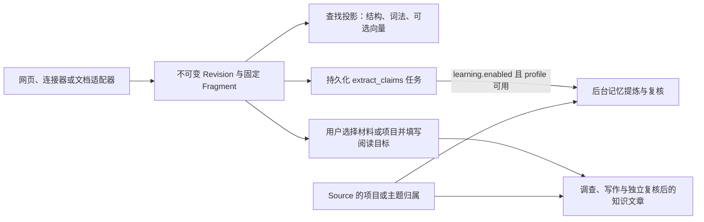

# 一份材料的旅程：从导入到阅读与引用

用一份两节 Markdown 项目约定走完 omem 的材料链路：不同入口如何形成统一 CaptureInput，同一来源如何保留不可变版本，固定片段与可重建检索投影为何分开，以及保存后查找、后台记忆和知识文章分别在什么条件下发生。补充 PDF/DOCX 与飞书的适配和原文阅读路径，并明确文档附件、内嵌图和知识引用目前各自固定到哪一层。

来源：gpt-5.6-sol 分析，gpt-5.6-sol 独立复核；模型解释仍可被原始证据纠正。

<a id="walkthrough"></a>
## 先走一遍：同一份约定从 V1 到 V2

先给结论：**同一来源类型与同一来源标识，会把多次导入串成一条 Source 版本链；内容变化时，新内容成为下一版 Revision，旧版仍然保留。** 搜索、后台记忆和知识文章都从这条材料链出发，但它们不是同一份数据，也不会在“保存”瞬间一起完成。

下面是贯穿全文的教学示例，不是仓库里的真实项目材料。第一次在网页选择“主动输入”，标题填“项目约定”，来源标识填 `project-rules`，正文是：

```markdown
# 提交
合并前运行检查。

# 发布
发布由值班同学执行。
```

保存后，页面打开服务端返回的 Revision，并提示固定证据片段已经生成。第二次仍选 `manual`，仍填 `project-rules`，只把第一条改成“合并前运行完整检查并记录结果”。Store 用同一组 `source + externalId` 找到原 Source；内容指纹变化后写入 V2，把 Source 的当前 head 指向 V2，而 V1 不被覆盖。参考 [网页提交与来源身份 ↗](../../../apps/web/src/App.vue#L438 "支持 manual 留空 externalId、文档随机上传身份、保存后打开 Revision 的行为。") [Source 查找与版本写入 ↗](../../../apps/server/src/store.ts#L176 "支持同一 source/externalId 复用 Source、指纹变化时创建下一版并更新 head。")

这个结果依赖稳定的来源身份。普通输入若把来源标识留空，网页会为本次提交生成随机 ID；它适合新建来源，不适合自然续成 V2。后文还会看到，服务器文件、飞书和浏览器文档上传各有自己的身份策略。参考 [网页提交与来源身份 ↗](../../../apps/web/src/App.vue#L438 "支持 manual 留空 externalId、文档随机上传身份、保存后打开 Revision 的行为。")

<a id="capture-input"></a>
## 入口不同，越过适配器后都是 CaptureInput

网页、服务器文件、Git 文件、飞书链接和 PDF/DOCX 的外部读取方式不同，但适配器成功后都交给 Store 一个 `CaptureInput`。它用 `source + externalId` 表示来源身份，带标题、1–50 个 parts，以及可选的上游版本、来源上下文和 provenance。part 可以是非空文本、HTTP(S) 链接或 PNG/JPEG/WebP 图片；项目/主题选择由路由单独传给 Store，不是正文 part。参考 [CaptureInput 合同 ↗](../../../packages/contracts/src/index.ts#L21 "说明 parts、来源身份、数量限制和 document context 的当前合同。") [服务器文件连接器 ↗](../../../apps/server/src/connectors.ts#L21 "说明普通文本和 PDF/DOCX 的受控读取、路径身份与统一 CaptureInput 输出。")

PDF/DOCX 是 Capture 之前的一层适配，不是第二套材料库。当前入口只接受 PDF 或 DOCX、原文件不超过 20 MB；解析器必须已显式准备，PDF 还需要本地布局与表格模型。转换在离线模式运行，OCR 关闭，最多 200 页；没有可读正文的扫描件会明确失败。解析结果还要有非空 Markdown，且不超过 20 万字符。只有这些步骤成功后，适配器才构造一个普通 `source=file` 的 CaptureInput：Markdown 成为 text part，原字节哈希成为 `upstreamVersion`，原件、完整结构、页数、警告与块图片则作为文档附件保存。解析失败不会先创建一个空 Revision。参考 [PDF/DOCX 文档适配器 ↗](../../../apps/server/src/imports/documents.ts#L16 "说明格式、大小、准备条件、解析输出、附件保存和成功后构造 CaptureInput。") [离线 Docling 转换 ↗](../../../scripts/document-parser/convert.py#L11 "说明 OCR 关闭、200 页上限、无正文失败、Markdown、结构块、页坐标和图片输出。") [文档入口使用与限制 ↗](../../../docs/reader-first/document-import.md#L5 "补充显式准备、20 MB、200 页、20 万字符以及解析失败不发布空 Capture 的当前行为。")

飞书走另一条入口：服务端校验 HTTPS docx/wiki 地址，通过项目依赖中的官方 CLI 使用用户登录态读取 Markdown。文档 ID 用作来源身份，revision ID 用作上游版本；可读正文和原文链接进入 parts，完整官方响应作为文档附件保存，而不是把一大段元数据 JSON 混进正文。它不经过 Docling。参考 [飞书连接器 ↗](../../../apps/server/src/connectors.ts#L84 "说明官方 CLI 读取、document/revision 身份、正文 parts 与原始响应附件的分离。")

因此，增加导入方式时，边界问题是：**如何受控地读取外部内容、决定稳定身份，并构造 CaptureInput**。版本、固定片段、检索和后续整理继续复用 Store 之后的主链。

<a id="immutable-original"></a>
## 是否成为 V2，先看入口提供的来源身份

Store 先用 `source + externalId` 找到或创建稳定 Source，再比较标题、parts、context、provenance、观察时间和上游版本形成的指纹。指纹未变时可以复用当前 Revision；发生变化时插入下一版，用 `previousId` 指向旧 head。随后文本按空行、链接和图片分别生成固定 Fragment，最后才更新 Source head。参考 [Source 查找与版本写入 ↗](../../../apps/server/src/store.ts#L176 "支持同一 source/externalId 复用 Source、指纹变化时创建下一版并更新 head。") [不可变 Revision 与 Fragment ↗](../../../apps/server/src/store.ts#L108 "支持指纹、图片处理、下一版插入、固定片段生成和 head 更新。")

这三个概念回答不同问题：

- **Source**：这些版本是不是同一个外部来源？
- **Revision**：某次保存时实际接收到的完整内容是什么？
- **Fragment**：以后要引用的固定证据片段在哪里？

入口怎样生成 externalId，直接决定“再导入一次”是 V2 还是新 Source。manual 示例复用 `project-rules`；服务器文件用规范化路径，所以同一路径能续版本；飞书优先使用 document ID；Git 以仓库与文件路径组成身份。当前网页 PDF/DOCX 每次重新选择文件都会生成新的随机上传身份，因此即使字节相同，默认也不会自然接到上一次浏览器上传的 Source；直接调用文档连接器的调用方则可以提供稳定 externalId。参考 [网页提交与来源身份 ↗](../../../apps/web/src/App.vue#L438 "支持 manual 留空 externalId、文档随机上传身份、保存后打开 Revision 的行为。") [服务器文件连接器 ↗](../../../apps/server/src/connectors.ts#L21 "说明普通文本和 PDF/DOCX 的受控读取、路径身份与统一 CaptureInput 输出。") [飞书连接器 ↗](../../../apps/server/src/connectors.ts#L84 "说明官方 CLI 读取、document/revision 身份、正文 parts 与原始响应附件的分离。") [浏览器文档随机身份 ↗](../../../apps/web/src/App.vue#L244 "说明每次选择 PDF/DOCX 时刷新 documentIdentity。")

项目/主题归属是另一层：membership 绑定 Source，而不是塞进某一版正文。人工选择有最高优先级，包括明确选择空集合；换成 V2 后仍沿用这个 Source 的归属。参考 [Source 归属与人工优先 ↗](../../../apps/server/src/contexts/repository.ts#L34 "说明 membership 绑定 Source、人工选择可为空，以及自动结果的过期保护。")

回到示例，V1 和 V2 是同一 Source 的两个不可变 Revision；当前列表通常显示 V2，但需要历史证据时仍能找到 V1。Fragment 是证据锚点，不必兼任最适合全文阅读的目录。

<a id="retrieval-projection"></a>
## 保存后如何查找：索引是投影，不是原件

检索使用可重建的 retrieval units，而不是改写 Revision，或把 Fragment 当作最佳阅读切分。Markdown 按标题与语法块产生 passage 并保留行号；引导句若紧接列表、表格、代码或引用，会尽量和后者放在同一 passage。代码则另外按符号投影。参考 [Markdown 检索投影 ↗](../../../apps/server/src/retrieval/units.ts#L33 "说明 Markdown 按标题和语法块生成带原行号的可重建 passage。")

PDF/DOCX 也遵循这条规则：Docling 导出的 Markdown 进入 `markdownPassages`，所以正文标题、段落和表格 Markdown 可参与现有检索。原 PDF/DOCX 字节、完整结构 JSON、页坐标和文档块图片目前是阅读附件，不会自动变成检索单元；“结构已保存”不能理解为“可以按 PDF 坐标召回”。参考 [PDF/DOCX 文档适配器 ↗](../../../apps/server/src/imports/documents.ts#L16 "说明格式、大小、准备条件、解析输出、附件保存和成功后构造 CaptureInput。") [知识材料文本与图片投影 ↗](../../../apps/server/src/knowledge/repository.ts#L13 "说明 KnowledgeMaterial 只从 text/link 和独立 image parts 构造正文、图片及 digest。")

查询时，检索器先同步单位，再做全文 BM25 和符号召回；配置了 embedding 模型时再加入语义候选。没有模型，或 embedding 计算失败时，仍返回词法与符号结果。参考 [词法、符号与语义回退 ↗](../../../apps/server/src/retrieval/unified.ts#L427 "说明查询同步单位、BM25/符号召回以及无模型或 embedding 失败时的回退。")

因此两句话可以同时成立：**材料保存后，不必等后台学习 Agent 才能进入结构化查找；但语义向量可能仍在补齐。** Revision 和固定 Fragment 是事实底座；passage、全文索引和向量为查找而生，可以重建。

<a id="post-capture-branches"></a>
## 保存之后分成三条用途

一次保存不会自动变成“一份已经整理好的知识”。更准确的关系是：



参考 [词法、符号与语义回退 ↗](../../../apps/server/src/retrieval/unified.ts#L427 "说明查询同步单位、BM25/符号召回以及无模型或 embedding 失败时的回退。") [捕获时排下提炼任务 ↗](../../../apps/server/src/store.ts#L394 "说明非 derived 输入保存后只排队 extract_claims，并不代表任务已执行。") [后台学习默认关闭 ↗](../../../apps/server/src/config.ts#L64 "支持 learning.enabled 默认值和 profile 配置。") [LearningPipeline 启动条件 ↗](../../../apps/server/src/app.ts#L128 "说明只有启用 learning 且找到指定 profile 才实例化后台管线。")

三条分支的启动条件不同：

1. **查找**：查询入口会同步可重建投影，不依赖后台学习开关。参考 [词法、符号与语义回退 ↗](../../../apps/server/src/retrieval/unified.ts#L427 "说明查询同步单位、BM25/符号召回以及无模型或 embedding 失败时的回退。")
2. **后台记忆**：非 derived 材料保存时会排下 `extract_claims` 任务，但 `learning.enabled` 默认关闭；只有启用开关且指定 profile 存在，应用才创建 `LearningPipeline` 消费任务。排队成功不等于已经提炼或复核完成。参考 [捕获时排下提炼任务 ↗](../../../apps/server/src/store.ts#L394 "说明非 derived 输入保存后只排队 extract_claims，并不代表任务已执行。") [后台学习默认关闭 ↗](../../../apps/server/src/config.ts#L64 "支持 learning.enabled 默认值和 profile 配置。") [LearningPipeline 启动条件 ↗](../../../apps/server/src/app.ts#L128 "说明只有启用 learning 且找到指定 profile 才实例化后台管线。")
3. **知识文章**：它不是捕获的自动副作用。用户要选择固定材料和/或持续跟踪的项目、主题，再填写希望读者弄懂的问题与场景；服务端校验 Agent profile、阅读目标和材料范围，保存 page plan 后才排队写作。固定 `materialKeys` 与动态 `contextIds` 的当前成员取并集。参考 [文章选材与阅读目标 ↗](../../../apps/web/src/knowledge/ArticleComposer.vue#L163 "说明知识文章先选择材料或持续范围，再填写读者目标和场景。") [知识页面计划入口 ↗](../../../apps/server/src/knowledge/api.ts#L229 "说明 profile、阅读目标、材料或 context 范围校验，以及保存计划后排队整理。") [固定材料与动态范围并集 ↗](../../../apps/server/src/knowledge/repository.ts#L123 "说明 materialKeys 与 contextIds 当前成员如何组合为文章材料范围。")

所以，PDF/DOCX 解析成功只表示派生 Markdown 和附件进入了同一材料底座；它不表示后台记忆已产生，也不表示 Wiki 已生成。

<a id="context-branch"></a>
## 未手工归属时，后台整理可能先问“属于哪个项目”

项目/主题归属只影响需要范围的后续整理，不影响原件是否保存。后台学习已启用、原生研究能力可用、库中已有项目/主题，且 Source 没有人工归属时，事实抽取前可以先调查归属。实现先形成提案；若提案明确匹配，再由独立会话复核。只有两次判断同意同一组 ID，才保存 automatic membership。参考 [事实抽取前的归属调查 ↗](../../../apps/server/src/learning/pipeline.ts#L664 "说明自动归属的前置检查、独立复核、含糊暂停和人工补充入口。") [Source 归属与人工优先 ↗](../../../apps/server/src/contexts/repository.ts#L34 "说明 membership 绑定 Source、人工选择可为空，以及自动结果的过期保护。")

如果材料像“接上次发布约定”这样可以明确续接，后续记忆和按项目跟踪的文章就能采用该范围；如果只说“负责人改了”而多个项目都可能符合，系统保留原文、记录候选和澄清问题，并暂缓这份材料的事实抽取。用户可以手工选择，也可以明确不选任何项目；人工选择或材料在调查期间发生变化，旧自动结果不会覆盖新决定。参考 [事实抽取前的归属调查 ↗](../../../apps/server/src/learning/pipeline.ts#L664 "说明自动归属的前置检查、独立复核、含糊暂停和人工补充入口。") [Source 归属与人工优先 ↗](../../../apps/server/src/contexts/repository.ts#L34 "说明 membership 绑定 Source、人工选择可为空，以及自动结果的过期保护。")

因此，自动归属改变的是**后续整理采用哪个范围**，不是原件是否保存；人工补充或纠正始终优先。

<a id="pinned-citation"></a>
## 旧版引用能打开，但固定的是可引用材料版本

知识文章发布时，会把正文引用到的材料 key 与当时的 KnowledgeMaterial digest 写入 dependencies。点击引用时，API 读取文章 Revision 中的 citation，再用 dependency digest 解析材料，而不是直接拿 Source 当前 head。参考 [发布时固定依赖 digest ↗](../../../apps/server/src/knowledge/pipeline.ts#L194 "说明发布文章为正文引用和 reviewSources 保存材料 digest 依赖。") [按依赖解析引用 ↗](../../../apps/server/src/knowledge/api.ts#L92 "说明引用 API 使用文章中的 citation 与 dependency digest 解析固定材料。")

如果当前材料仍是该 digest，就直接打开当前版；如果 manual 示例的 head 已变成 V2，repository 会沿同一 Source 的历史 Revisions 查找匹配 digest 的旧版。因此，引用 V1“合并前运行检查”的文章，在 V2 出现后仍打开 V1，不会拿新句子冒充旧证据。参考 [从 Source 历史找材料 ↗](../../../apps/server/src/knowledge/repository.ts#L312 "支持当前 head 不匹配时沿历史 Revision 查找相同 KnowledgeMaterial digest。")

但这里要准确区分“Revision 附件”和“KnowledgeMaterial 依赖”。当前 KnowledgeMaterial 的 text 来自 text/link parts，images 只来自独立 image parts；digest 由这些派生内容及部分 provenance 组成，不包含 `context.document`、PDF/DOCX 原字节、结构附件、页坐标或文档块图片。文档引用目前固定的是**可引用的派生文字材料版本**，不能据此声称点击引用必然固定或框选 PDF 原页。参考 [KnowledgeMaterial digest 边界 ↗](../../../apps/server/src/knowledge/repository.ts#L21 "说明派生文字、独立图片和部分 provenance 进入 digest，而 document 附件未进入。") [知识材料文本与图片投影 ↗](../../../apps/server/src/knowledge/repository.ts#L13 "说明 KnowledgeMaterial 只从 text/link 和独立 image parts 构造正文、图片及 digest。")

“旧证据还能打开”和“旧解释今天仍适用”也不同。生命周期检查比较引用所在的原文章节或函数；上下文、独立图片或 provenance 变化，或结构无法唯一定位时，会保守地标记章节需要复核。它不会把旧 citation 语义重映射到新文字。参考 [固定引用与章节复核分离 ↗](../../../apps/server/src/knowledge/lifecycle.ts#L72 "说明 citation 不重映射，章节上下文、图片或 provenance 变化会触发保守复核。")

这层分离让引用回答“当时依据了哪份可引用材料”，章节状态回答“今天是否还应相信这段解释”。

<a id="images-documents-code"></a>
## 独立图片、文档插图和代码使用不同的阅读辅助

三类内容共享 Source/Revision 的版本底座，但不要把它们的派生能力混成一条路径。

**主动提交的 image part** 会由 Store 校验 base64、5 MB 上限和 PNG/JPEG/WebP 的真实字节，再按内容哈希保存为私有资产。投影成 KnowledgeMaterial 时，这类 part 进入 `images`，可以交给具备视觉能力的调查。参考 [主动图片的校验与保存 ↗](../../../apps/server/src/store.ts#L111 "说明 image part 的字节校验、5 MB 上限、格式校验和私有资产引用。") [KnowledgeMaterial digest 边界 ↗](../../../apps/server/src/knowledge/repository.ts#L21 "说明派生文字、独立图片和部分 provenance 进入 digest，而 document 附件未进入。")

**PDF/DOCX 内嵌图** 走文档附件路径。解析器把图从结构块中提取为 PNG 资产，结构记录 `imageAssetId`；原文页按块顺序显示标题、段落、表格、首个页码和图片，结构读取失败时仍回退到已保存 Markdown。资产路由还会核对该图片是否列在这份 Revision 的结构里。参考 [PDF/DOCX 文档适配器 ↗](../../../apps/server/src/imports/documents.ts#L16 "说明格式、大小、准备条件、解析输出、附件保存和成功后构造 CaptureInput。") [文档结构阅读组件 ↗](../../../apps/web/src/DocumentReading.vue#L10 "说明 Docling 结构加载、顺序块、页码、图片显示和 Markdown 回退。") [文档附件访问边界 ↗](../../../apps/server/src/app.ts#L347 "说明原件、结构和块图片都通过具体 Revision 的 document 清单解析。") 但这些图片不是 Revision 的 image part，当前 `materialFromRevision` 不会把它们放入 KnowledgeMaterial.images；因此不能笼统声称文档插图已进入视觉知识调查。参考 [KnowledgeMaterial digest 边界 ↗](../../../apps/server/src/knowledge/repository.ts#L21 "说明派生文字、独立图片和部分 provenance 进入 digest，而 document 附件未进入。")

**代码** 仍先作为文本进入 Source/Revision，专门能力在检索层。代码 passage 尽量保留完整函数、方法、父级路径和模块初始化；解析器只建立单文件 TypeScript AST 与 Vue SFC 结构，没有跨文件 `Program`/`TypeChecker`，calls 只是名称级候选，不是完整调用图。参考 [代码 passage 投影 ↗](../../../apps/server/src/retrieval/units.ts#L92 "说明完整函数、方法、父级路径与模块初始化如何形成检索单位。") [代码导航能力边界 ↗](../../../apps/server/src/code/parse.ts#L1 "明确解析器只有单文件 AST、Vue SFC 与名称级候选调用。")

所以“原件已保留”“可以按结构阅读”“能被知识 Agent 视觉理解”是三个不同结论，要分别看 Revision 附件、阅读组件和 KnowledgeMaterial 投影。

<a id="change-map"></a>
## 想改哪一层，就从哪一层进入

沿着上面的材料旅程定位修改点，比从对象名总表倒推更直接：

- **改普通输入合同或网页提交**：看 `packages/contracts/src/index.ts::captureSchema`、`apps/web/src/App.vue::capture` 和 `apps/server/src/app.ts` 的 capture routes。参考 [网页提交与来源身份 ↗](../../../apps/web/src/App.vue#L438 "支持 manual 留空 externalId、文档随机上传身份、保存后打开 Revision 的行为。") [CaptureInput 合同 ↗](../../../packages/contracts/src/index.ts#L21 "说明 parts、来源身份、数量限制和 document context 的当前合同。") [服务器文件连接器 ↗](../../../apps/server/src/connectors.ts#L21 "说明普通文本和 PDF/DOCX 的受控读取、路径身份与统一 CaptureInput 输出。")
- **改 PDF/DOCX 适配与附件**：看 `apps/server/src/imports/documents.ts::documentInput`；改结构抽取看 `scripts/document-parser/convert.py`；改原文阅读看 `apps/web/src/DocumentReading.vue` 与 `app.ts` 的 document asset route。参考 [PDF/DOCX 文档适配器 ↗](../../../apps/server/src/imports/documents.ts#L16 "说明格式、大小、准备条件、解析输出、附件保存和成功后构造 CaptureInput。") [离线 Docling 转换 ↗](../../../scripts/document-parser/convert.py#L11 "说明 OCR 关闭、200 页上限、无正文失败、Markdown、结构块、页坐标和图片输出。") [文档结构阅读组件 ↗](../../../apps/web/src/DocumentReading.vue#L10 "说明 Docling 结构加载、顺序块、页码、图片显示和 Markdown 回退。") [文档附件访问边界 ↗](../../../apps/server/src/app.ts#L347 "说明原件、结构和块图片都通过具体 Revision 的 document 清单解析。")
- **改服务器文件或飞书入口身份**：看 `apps/server/src/connectors.ts::fileInput/larkInput`。适配器最终仍要产出 CaptureInput。参考 [服务器文件连接器 ↗](../../../apps/server/src/connectors.ts#L21 "说明普通文本和 PDF/DOCX 的受控读取、路径身份与统一 CaptureInput 输出。") [飞书连接器 ↗](../../../apps/server/src/connectors.ts#L84 "说明官方 CLI 读取、document/revision 身份、正文 parts 与原始响应附件的分离。")
- **改版本、固定 Fragment 或主动图片**：看 `apps/server/src/store.ts::capture`；这里决定 Source 查找、新 Revision、`previousId`、Fragment、图片资产和 head。参考 [不可变 Revision 与 Fragment ↗](../../../apps/server/src/store.ts#L108 "支持指纹、图片处理、下一版插入、固定片段生成和 head 更新。") [主动图片的校验与保存 ↗](../../../apps/server/src/store.ts#L111 "说明 image part 的字节校验、5 MB 上限、格式校验和私有资产引用。")
- **改 Markdown/代码切分与检索回退**：看 `retrieval/units.ts::markdownPassages/codePassages`、`retrieval/unified.ts::search` 和 `code/parse.ts::parseFile`。参考 [Markdown 检索投影 ↗](../../../apps/server/src/retrieval/units.ts#L33 "说明 Markdown 按标题和语法块生成带原行号的可重建 passage。") [词法、符号与语义回退 ↗](../../../apps/server/src/retrieval/unified.ts#L427 "说明查询同步单位、BM25/符号召回以及无模型或 embedding 失败时的回退。") [代码导航能力边界 ↗](../../../apps/server/src/code/parse.ts#L1 "明确解析器只有单文件 AST、Vue SFC 与名称级候选调用。")
- **改后台记忆或自动归属**：先看 `config.ts` 与 `app.ts` 的启用条件，再看 `learning/pipeline.ts::resolveContexts` 和 `contexts/repository.ts`。参考 [后台学习默认关闭 ↗](../../../apps/server/src/config.ts#L64 "支持 learning.enabled 默认值和 profile 配置。") [LearningPipeline 启动条件 ↗](../../../apps/server/src/app.ts#L128 "说明只有启用 learning 且找到指定 profile 才实例化后台管线。") [事实抽取前的归属调查 ↗](../../../apps/server/src/learning/pipeline.ts#L664 "说明自动归属的前置检查、独立复核、含糊暂停和人工补充入口。") [Source 归属与人工优先 ↗](../../../apps/server/src/contexts/repository.ts#L34 "说明 membership 绑定 Source、人工选择可为空，以及自动结果的过期保护。")
- **改知识选材、写作或历史引用**：看 `knowledge/api.ts`、`knowledge/repository.ts::materialsForPlan/materialFromRevision/resolveMaterial`、`knowledge/pipeline.ts` 与 `knowledge/lifecycle.ts`。参考 [文章选材与阅读目标 ↗](../../../apps/web/src/knowledge/ArticleComposer.vue#L163 "说明知识文章先选择材料或持续范围，再填写读者目标和场景。") [固定材料与动态范围并集 ↗](../../../apps/server/src/knowledge/repository.ts#L123 "说明 materialKeys 与 contextIds 当前成员如何组合为文章材料范围。") [发布时固定依赖 digest ↗](../../../apps/server/src/knowledge/pipeline.ts#L194 "说明发布文章为正文引用和 reviewSources 保存材料 digest 依赖。") [从 Source 历史找材料 ↗](../../../apps/server/src/knowledge/repository.ts#L312 "支持当前 head 不匹配时沿历史 Revision 查找相同 KnowledgeMaterial digest。") [KnowledgeMaterial digest 边界 ↗](../../../apps/server/src/knowledge/repository.ts#L21 "说明派生文字、独立图片和部分 provenance 进入 digest，而 document 附件未进入。") [固定引用与章节复核分离 ↗](../../../apps/server/src/knowledge/lifecycle.ts#L72 "说明 citation 不重映射，章节上下文、图片或 provenance 变化会触发保守复核。")

最后用四个问题检查修改是否落在正确层：是在改变“外部内容如何变成 CaptureInput”、改变“当时保存了什么”、改变“如何找到派生内容”，还是改变“如何从固定材料整理出记忆或文章”？新增文档能力主要扩展第一层和原文阅读层，并没有替换 Store、retrieval、learning 或 knowledge 的主链。
