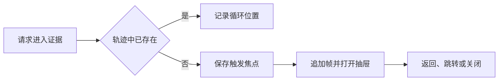

# 递归证据抽屉的导航状态管理

该组合函数为个人知识与仓库知识阅读器统一管理递归证据抽屉：保存浏览栈、当前层级、开关状态、循环提示及焦点来源，并提供进入、返回、跳转和关闭操作。它只负责交互状态；数据加载、抽屉渲染、滚动恢复、URL 持久化与焦点归还由调用方或相关组件承担。

来源：gpt-5.6-sol 分析，gpt-5.6-sol 独立复核；模型解释仍可被原始证据纠正。

## 让读者沿证据逐层深入

`useEvidenceTrail` 解决的是阅读知识时连续追踪引用的问题：用户可以从当前内容进入下一层证据，同时仍能沿原路径返回。它把个人知识与仓库知识阅读器共用的状态收敛为一组响应式引用，并允许调用方传入 `onChange`，在导航发生变化后同步执行外围逻辑。参考 [共享导航状态入口 ↗](../../../packages/ui/src/useEvidenceTrail.ts#L4 "支持该组合函数服务于两类知识阅读器，并通过响应式状态及变更回调统一管理证据轨迹。")

每个层级使用 `TrailFrame` 表示；帧以 `kind` 与 `id` 作为稳定身份，还可携带标题、滚动位置及加载文件、符号或片段所需的引用信息。因此，本组合函数管理的是统一的导航轨迹，而不是某一种材料的内容。参考 [证据轨迹帧结构 ↗](../../../packages/ui/src/trail.ts#L16 "解释轨迹帧的身份、展示标题、滚动位置和数据加载引用等核心概念。")

## 入栈、返回与路径截断

调用 `push` 时，函数先检查栈中是否已有相同 `kind + id` 的帧：若存在，只记录循环发生的位置并停止入栈；若不存在，则在抽屉首次打开时保存当前聚焦元素，随后追加新帧、切换到末帧并打开抽屉。参考 [证据入栈与循环检测 ↗](../../../packages/ui/src/useEvidenceTrail.ts#L8 "支持 push 对重复帧的检测、首次打开时保存焦点以及追加新帧的完整流程。")

参考 [证据入栈与循环检测 ↗](../../../packages/ui/src/useEvidenceTrail.ts#L8 "支持 push 对重复帧的检测、首次打开时保存焦点以及追加新帧的完整流程。")

`back` 在只剩一层时直接关闭，否则弹出末帧；`jump` 将轨迹截断到指定层级；`close` 清空整条轨迹并复位循环状态。三者都会触发 `onChange`，便于路由或宿主界面跟随更新。参考 [返回跳转与关闭 ↗](../../../packages/ui/src/useEvidenceTrail.ts#L14 "支持返回、路径截断、整体关闭及触发变更回调的行为说明。")

## 职责边界与已知限制

该状态本身不限制递归深度；源码明确把 URL 长度预算交给路由序列化器处理。相关轨迹类型模块也将“可渲染深度”和“写入 URL 的深度”分开，后者定义了上限，但这里没有直接调用其序列化函数，因此无法仅凭现有材料确认具体由哪个页面完成深链同步。参考 [渲染与 URL 深度边界 ↗](../../../packages/ui/src/trail.ts#L32 "说明状态渲染不设深度上限，而 URL 持久化预算属于路由序列化职责。")

组合函数只保存首次打开抽屉时的触发元素，并未在 `close` 中主动调用 `focus()`；同样，帧的 `scroll` 字段由抽屉管理，而本函数只做数组增删。由此可知，焦点归还和逐层滚动恢复需要外围抽屉组件实现，当前材料不能证明这些行为已经完整接线。参考 [焦点与滚动状态边界 ↗](../../../packages/ui/src/trail.ts#L20 "支持本函数仅记录触发元素，以及滚动恢复字段明确由抽屉管理的判断。")

此外，`jump(index)` 未在函数内部校验索引范围。正常调用应传入现有层级索引；越界、负数及循环提示如何呈现均未在所给代码中定义。参考 [跳转索引处理 ↗](../../../packages/ui/src/useEvidenceTrail.ts#L15 "支持 jump 直接切片和设置当前索引、内部未进行范围校验这一边界说明。")
