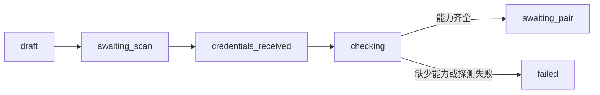

# 飞书应用接入、能力校验与安全配对

LarkOnboardingService 负责个人工作区的飞书接入生命周期：启动新应用授权或导入已有凭据，把密钥写入加密存储，为同一应用创建候选连接版本，探测能力后签发一次性配对码，最后将已验证的飞书用户与会话绑定并激活连接。流程同时保存状态事件，处理取消和服务重启，也覆盖能力缺失、配对过期与旧绑定替换。

来源：gpt-5.6-sol 分析，gpt-5.6-sol 独立复核；模型解释仍可被原始证据纠正。

## 解决什么问题

这个服务把飞书应用从“拿到凭据”推进到“可以向已确认的用户和会话工作”。`start` 接受新建或已有应用模式，先写入 onboarding 记录，再异步调用注册适配器；接口会在二维码出现或注册流程结束时返回当前状态，因此调用方能尽早展示扫码入口。参考 [异步启动与首个状态返回 ↗](../../../apps/server/src/integrations/lark/onboarding.ts#L83 "支持 start 创建记录、启动可取消任务，并在二维码就绪或任务结束时返回状态。")

已有应用还有一条同步导入路径。凭据可以来自可选的已有应用提供器，也可以由调用方直接提交；两种来源随后共用同一个凭据接收流程。参考 [已有应用导入 ↗](../../../apps/server/src/integrations/lark/onboarding.ts#L124 "支持已有应用凭据的两种来源及其共用凭据接收流程。") 官方工厂负责装配环境加密存储、官方注册适配器、能力探测器和可选的已有应用提供器，文件只规定这些协作者如何被使用，不展开它们的内部实现。参考 [官方服务装配 ↗](../../../apps/server/src/integrations/lark/onboarding.ts#L854 "说明工厂如何提供加密存储、注册适配器、能力探测器和已有应用提供器。")

## 从授权到候选连接

以“新建应用并扫码授权”为例，注册适配器收到配置和取消信号；二维码必须是 HTTPS 地址，随后状态进入 `awaiting_scan`。注册失败会按错误内容归为 `denied`、`expired`、`cancelled` 或 `failed`。参考 [注册回调与错误分类 ↗](../../../apps/server/src/integrations/lark/onboarding.ts#L167 "支持二维码校验、状态推进及注册异常到终态的映射。")

凭据接收只允许合法的 `cli_` 应用 ID、非空密钥，以及与已有应用请求一致的 ID。参考 [凭据前置校验 ↗](../../../apps/server/src/integrations/lark/onboarding.ts#L244 "支持应用 ID、密钥和已有应用一致性的校验规则。") 密钥写入加密存储后，服务按应用复用或创建连接，并新增递增的连接版本，让候选配置与已激活版本并存。参考 [连接版本创建 ↗](../../../apps/server/src/integrations/lark/onboarding.ts#L293 "支持加密保存凭据、复用连接并创建递增候选版本的流程。") 能力探测器使用应用凭据和请求配置检查实际能力。参考 [能力探测调用 ↗](../../../apps/server/src/integrations/lark/onboarding.ts#L365 "说明服务把应用凭据和请求配置交给能力探测器。") 缺少能力时会保存去重排序后的缺项与修复提示；能力齐全才进入 `awaiting_pair`。参考 [能力结果落库 ↗](../../../apps/server/src/integrations/lark/onboarding.ts#L417 "支持缺项整理、修复提示及 awaiting_pair 或 failed 的状态选择。")

## 配对、激活与边界

只有 `awaiting_pair` 状态能签发配对码。新码会使同一连接的旧未消费码失效，数据库只保存码的哈希；默认有效期为五分钟。参考 [一次性配对码 ↗](../../../apps/server/src/integrations/lark/onboarding.ts#L591 "支持配对前置状态、旧码失效、哈希保存和默认有效期。") 飞书事件带回应用 ID、发送者和会话后，服务检查哈希、应用、消费状态、有效期及候选身份。错误码尝试会累计，达到五次时令当前码失效；同一码也不能换人或换会话。参考 [配对事件验证 ↗](../../../apps/server/src/integrations/lark/onboarding.ts#L626 "支持错误尝试计数，以及应用、时效、消费状态和候选身份检查。")

确认配对还会复核候选身份。参考 [确认前置条件 ↗](../../../apps/server/src/integrations/lark/onboarding.ts#L687 "支持确认阶段再次校验配对存在性、消费状态、时效和预期用户。") 若连接已有绑定，旧绑定会被标记为替代，相关待处理卡片动作、投递和目标一并停用，候选连接版本再转为 active。参考 [旧绑定替换 ↗](../../../apps/server/src/integrations/lark/onboarding.ts#L705 "支持旧绑定及其待处理工作被取消、旧目标停用和候选版本激活。") 新绑定会创建通知和决策目标；群聊额外开启群监控目标，随后更新连接所有者、消费配对码，并把对应 onboarding 置为 `active`。返回值包含绑定 ID、应用 ID、绑定版本、所有者和目标会话。参考 [新绑定与目标激活 ↗](../../../apps/server/src/integrations/lark/onboarding.ts#L750 "支持新绑定、用途目标、群监控目标、连接激活和返回结果。")

注册任务保存在进程内存中。服务重启后，仍处于注册中间态的记录会显示不可恢复和重新配置提示，已经生效的连接不受影响。参考 [重启中断提示 ↗](../../../apps/server/src/integrations/lark/onboarding.ts#L524 "支持注册中间态在内存任务丢失后被标记为不可恢复。") 取消后若外部注册仍迟到返回凭据，服务不会继续激活，而是记录应用 ID 和人工复核错误。参考 [取消后的迟到凭据 ↗](../../../apps/server/src/integrations/lark/onboarding.ts#L258 "支持取消后仅记录迟到凭据并要求人工复核，而不继续激活。")
