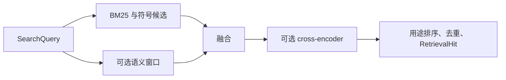

# 统一检索：把词面、语义与代码导航汇成可追溯结果

UnifiedRetrieval 是服务端共享的检索编排层：它把检索单位投影、BM25、符号定义、调用方候选、可选向量召回和重排器接到同一入口，并在输出前统一执行范围过滤、用途偏好、去重与证据投影。本文沿一次普通实现查询说明输入、主要阶段、输出和降级边界。

来源：gpt-5.6-sol 分析，gpt-5.6-sol 独立复核；模型解释仍可被原始证据纠正。

## 它解决什么问题

阅读器、Agent、知识页和旧处理流程需要搜索同一批材料，但关注点不同：有人找概念，有人找实现或调用位置，也有人最终只需要原始证据片段。`UnifiedRetrieval` 因而不是单一排序算法，而是**统一编排层**：它继承词面检索能力，持有检索单位投影与代码导航，并通过构造参数接入可选 embedding 与 reranker；内部结果统一携带分数、召回路线、摘录和代码匹配。参考 [统一检索的装配职责 ↗](../../../apps/server/src/retrieval/unified.ts#L40 "支持该类复用词面检索，并装配检索单位投影、代码导航、可选 embedding 与 reranker 的说明。")

旧的来源接口没有另建索引，而是把相同命中再投影为去重后的固定 fragment、revision、snippet 与 provenance，供仍依赖原始证据的调用方使用。参考 [旧来源接口的证据投影 ↗](../../../apps/server/src/retrieval/unified.ts#L732 "支持旧接口复用统一结果，并将引用去重投影为固定 fragment 与 revision 候选的说明。")

## 一次普通查询如何流过系统

以下是教学示例：`search({ text: "重复投递如何避免", purpose: "implementation", limit: 10 })`。入口先同步检索单位；只有显式或识别出的代码意图才直接走定义/调用方分支，否则先产生 BM25 与符号候选。没有文本、要求精确匹配，或 embedding 尚不可用时，会直接整理词面结果。参考 [词面候选生成 ↗](../../../apps/server/src/retrieval/unified.ts#L414 "支持 BM25 查询、资格与相关性过滤、材料适用性排序及候选截断的说明。") [检索入口与快速路径 ↗](../../../apps/server/src/retrieval/unified.ts#L476 "支持代码意图直接分流，以及空查询、精确查询或无语义模型时采用词面/符号结果的说明。")

语义分支把最长 400 字的查询编码后，与当前模型身份下的窗口向量做点积，只保留每个检索单位的最佳窗口，再与前 100 个词面候选和符号候选融合。可选重排器从前 40 个单位构造相关 passage，以 70% 重排分和 30% 融合分更新结果；最后按 `purpose`、定义偏好、知识新鲜度和材料适用性排序，生成含正文摘录、上下文、路线、目标、引用及来源信息的 `RetrievalHit[]`，到 `limit` 即停止。参考 [语义召回与融合 ↗](../../../apps/server/src/retrieval/unified.ts#L490 "支持查询向量、窗口点积、每单位最佳窗口、阈值筛选、融合及语义异常回退的流程说明。") [可选 passage 重排 ↗](../../../apps/server/src/retrieval/unified.ts#L545 "支持候选池、相关窗口构造、cross-encoder 计分、混合分数和失败保留原结果的说明。") [最终排序与返回结构 ↗](../../../apps/server/src/retrieval/unified.ts#L606 "支持用途偏好、定义与新鲜度权重、去重、多样化以及 RetrievalHit 字段和 limit 截断的说明。")

## 过滤、降级与代码导航边界

候选在召回时和输出前都会经过资格检查：材料角色与有效期、事项状态、可信项目范围、种类、主题路径、可见性和时间范围都可能排除结果；计划、调研、示例或历史材料通常只是降低导航优先级，并不被当成真假判断。参考 [范围过滤与材料适用性 ↗](../../../apps/server/src/retrieval/unified.ts#L225 "支持角色、有效期、事项状态、项目、种类、主题、可见性和时间过滤，以及材料角色仅作排序偏好的说明。")

向量索引按文本窗口批量生成并以“检索单位版本 + 模型 ID”隔离；写入前会在事务锁内复查单位仍存在。维度变化、非法向量或语义查询异常会记录错误并回退到词面/符号结果；重排异常则保留已融合结果。只读实例不会同步或写向量。参考 [向量索引事务 ↗](../../../apps/server/src/retrieval/unified.ts#L140 "支持可选索引、批量窗口编码、向量校验、事务内存在性复查、模型身份写入和只读边界的说明。") [语义召回与融合 ↗](../../../apps/server/src/retrieval/unified.ts#L490 "支持查询向量、窗口点积、每单位最佳窗口、阈值筛选、融合及语义异常回退的流程说明。") [可选 passage 重排 ↗](../../../apps/server/src/retrieval/unified.ts#L545 "支持候选池、相关窗口构造、cross-encoder 计分、混合分数和失败保留原结果的说明。")

“哪些地方调用 `reserveParcel`”这类问题会提取符号名、扫描代码单位，再由 `CodeNavigation.matches` 给出行号；结果明确标记为 `code-call-candidate`，优先最小包围操作并跨文件交错展示。因此它适合导航候选，不能当作类型解析完备的调用图；别名或动态调用是否命中不由本文件保证。参考 [调用方候选导航 ↗](../../../apps/server/src/retrieval/unified.ts#L339 "支持调用方意图识别、名称筛选、最小包围操作优先、行号去重、候选路线及局部摘录的说明。")
