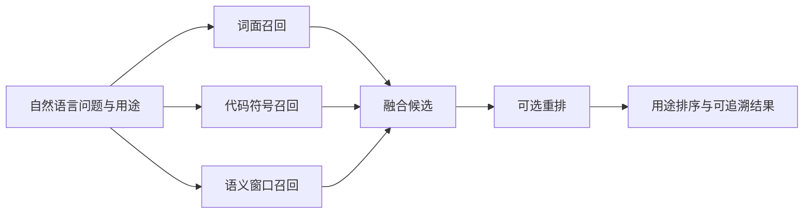

# 统一检索：从多路召回到可追溯结果

UnifiedRetrieval 让读者与 Agent 共用检索单元：词面和代码符号召回始终可用；自然语言问题在语义模型就绪后加入向量窗口，并可选重排；资格过滤按条件分别作用，结果多样化默认开启但可以关闭。

来源：gpt-5.6-sol 分析，gpt-5.6-sol 独立复核；模型解释仍可被原始证据纠正。

## 为什么需要统一检索

`UnifiedRetrieval` 解决的是“同一份知识如何同时服务阅读器、Agent 与旧处理器”：主流程检索统一的 `RetrievalUnit`，旧来源接口再把结果投影回不可变证据。它在关键词检索之上组合检索单位投影、embedding 与可选 reranker，避免不同入口各自维护一套结果。参考 [统一检索职责 ↗](../../../apps/server/src/retrieval/unified.ts#L36 "支持统一检索单元服务读者与 Agent、旧来源接口只做证据投影，以及类组合的主要依赖。")

服务创建检索器后会启动后台追赶。后台先同步检索单位，有 embedding 配置时再分批补齐向量；模型身份由检索单位版本和模型 ID 共同组成，失败后会延长下一次重试间隔。参考 [检索器启动入口 ↗](../../../apps/server/src/retrieval/factory.ts#L14 "支持服务创建 UnifiedRetrieval 后立即调用 start，并按配置注入 embedding 与 reranker 加载器。") [模型身份与后台追赶 ↗](../../../apps/server/src/retrieval/unified.ts#L65 "支持模型身份由检索单位版本和模型 ID 组成，以及后台延迟启动、同步单位、分批索引和错误后退避调度。") 每个长文本会切成窗口，连同短上下文生成 passage embedding；生成完毕后，窗口向量和该单位的索引头在写事务中保存。参考 [窗口向量生成 ↗](../../../apps/server/src/retrieval/unified.ts#L148 "支持按检索单位选择未索引记录、切分文本窗口并分批生成 passage embedding。") [向量事务写入 ↗](../../../apps/server/src/retrieval/unified.ts#L178 "支持在写事务中复核单位仍存在，并保存各窗口向量与索引头。")

## 自然语言实现问题怎样得到结果

以教学调用 `search({ text: "UnifiedRetrieval 如何融合词面、代码符号和语义窗口？", purpose: "implementation" })` 为例：查询先同步检索单位，并计算 BM25 与代码符号候选。语义模型已经由后台加载时，它再生成查询向量，为每个单位保留得分最高的窗口，将达到相似度门槛的候选与前两路融合；查询本身不会等待尚未就绪的模型。参考 [多路召回与融合 ↗](../../../apps/server/src/retrieval/unified.ts#L413 "支持查询先产生词面和符号候选、仅在模型已就绪时计算语义窗口，以及筛选并融合三路候选。")

配置 reranker 后，最多 40 个融合候选会携带上下文与命中片段参与打分；代码符号候选即使重排分数较低也会保留，重排失败则沿用融合结果。参考 [候选重排 ↗](../../../apps/server/src/retrieval/unified.ts#L476 "支持可选重排器的候选池、上下文输入、混合打分、代码符号保留规则和失败后的融合结果保留。") 收尾时再按 `purpose`、是否命中具名定义、知识新鲜度与材料适用性调整优先级。参考 [用途与优先级排序 ↗](../../../apps/server/src/retrieval/unified.ts#L515 "支持按检索用途、具名定义、知识新鲜度、材料适用性及跟进时间调整排序优先级。") 默认还会限制同一 owner 最多两项并去除相同正文；显式传入 `diversify: false` 时，这两条跳过规则关闭，但资格条件和最终数量上限仍然有效。参考 [可关闭的结果多样化 ↗](../../../apps/server/src/retrieval/unified.ts#L559 "支持默认限制同一 owner 的数量并按正文指纹去重，也明确显示 diversify 为 false 时跳过这两项限制。") 最终结果包含正文或摘要、路由、固定目标、引用和来源信息。参考 [结果内容与溯源 ↗](../../../apps/server/src/retrieval/unified.ts#L576 "支持摘要选择、知识引用提取以及结果目标、路由、引用和来源信息装配。")

## 精确查询、筛选与兼容边界

`exactLookup` 把去除首尾空白后、以 ASCII 字母、下划线或 `$` 开头，且其余部分只含单词字符、点、斜杠、反斜杠或连字符的整段文本视为精确查询；因此单独输入 `UnifiedRetrieval` 属于这一类，而带空格的自然语言问题不属于。参考 [精确查询定义 ↗](../../../apps/server/src/retrieval/relevance.ts#L15 "直接定义哪些单段 ASCII 标识符或路径式文本会被识别为精确查询。") 精确查询仍先做词面与符号召回，但随后直接收尾，不计算查询向量，也不进入后续重排；空文本和语义模型尚未就绪时同样如此。语义计算或向量维度检查异常时，也会退回词面与符号结果。参考 [提前收尾与语义降级 ↗](../../../apps/server/src/retrieval/unified.ts#L413 "支持精确查询、空文本或模型未就绪时直接返回词面和符号结果，以及语义异常时的降级行为。")

资格条件各有自己的作用域：材料角色筛选会把没有材料描述的单位视为 `unknown`；`effectiveAt` 只检查带材料描述的单位；只有 `follow-up` 用途下的任务会被限制为 `open` 或 `waiting`。项目条件更窄：仅在查询同时提供 `project_id` 与 `project_trusted` 时检查 `memory`，且只排除 scope 中存在字符串项目 ID、但与查询不一致的记忆；它不会按项目过滤 source、knowledge 或 task。类型、主题路径、可见性和捕获时间范围则按各自查询字段继续筛选。参考 [分作用域的资格条件 ↗](../../../apps/server/src/retrieval/unified.ts#L219 "支持材料角色、有效期、跟进任务状态和可信项目筛选的不同适用范围，并支持类型、主题、可见性与时间范围筛选。")

同步 `searchSources` 只走词面与符号路线，异步版本可复用完整 `search`；二者最终按 fragment 去重并投影成旧式 `SourceCandidate`，所以这是兼容边界，不是另一套知识检索。参考 [旧来源接口投影 ↗](../../../apps/server/src/retrieval/unified.ts#L624 "支持同步与异步来源搜索的路线差异，以及按 fragment 去重后投影为 SourceCandidate 的兼容行为。")
