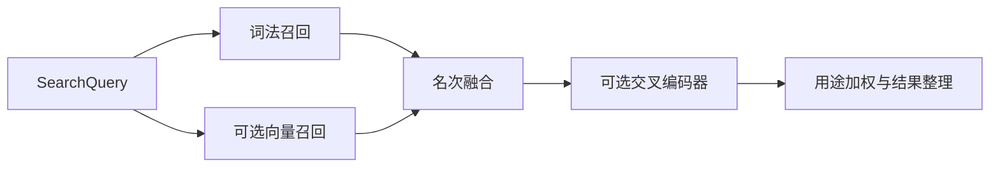

# 统一检索：从结构化知识单元到可追溯结果

UnifiedRetrieval 为阅读器、助手和 Agent 提供同一条检索主线：先把来源、知识、记忆与任务投影成统一单元，再融合 BM25、向量与可选重排，最后按用途、权限和多样性生成可回到原始证据的结果；同时保留旧 SourceCandidate 接口。

来源：gpt-5.6-sol 分析，gpt-5.6-sol 独立复核；模型解释仍可被原始证据纠正。

## 为什么需要统一检索

阅读器要找讲解，助手要找原始证据，Agent 还会检索记忆与任务。`UnifiedRetrieval` 用同一种 `RetrievalUnit` 承接这些对象，并通过 `RetrievalProjection` 更新可替换的检索视图；旧处理器仍可把同一批结果投回不可变证据片段，而不另建一套知识产品。构造函数只接收 SQLite 与可选的 embedding、reranker 加载器，因此纯词法模式也能工作。参考 [统一检索职责与构造 ↗](../../../apps/server/src/retrieval/unified.ts#L35 "支持统一单元、旧证据接口兼容以及可选模型依赖的说明。")

后台 `start()` 先同步投影，再分批补向量。每个单元按文本窗口编码，正文前拼接少量上下文并去掉知识引用标记；写入前会在事务锁内确认单元仍存在，避免索引期间材料被替换后留下孤立向量。向量以“结构版本 + 模型 id”隔离，批次失败则记录降级状态。参考 [后台同步与健康状态 ↗](../../../apps/server/src/retrieval/unified.ts#L71 "说明后台周期同步、错误退避以及语义和重排器状态如何报告。")、[分批向量索引 ↗](../../../apps/server/src/retrieval/unified.ts#L133 "支持窗口编码、模型身份、事务内复查与原子写入的流程描述。")

## 一条查询怎样变成结果

代表性调用可写成 `search({ text: "reserveParcel", purpose: "implementation" })`。查询先刷新投影并走 FTS/BM25；标识符式精确查询必须在正文或上下文中真实出现，命名代码定义会获得专门路由。空查询、精确查询或模型尚未就绪时直接完成词法结果，不等待语义索引。参考 [词法召回与快速返回 ↗](../../../apps/server/src/retrieval/unified.ts#L259 "支持 BM25 召回、精确标识符约束，以及空查询、精确查询和模型未就绪时只返回词法结果。")

普通自然语言查询会把前 400 字编码为查询向量，与当前模型身份下的窗口做点积，每个单元只保留最佳窗口；随后以绝对下限和相对最佳分数带截断语义候选，再按名次融合词法与语义分支。若配置交叉编码器，只重排前 40 项，并以 70% 重排分与 30% 融合分形成新分数；向量阶段异常会回退词法，重排异常则保留融合候选。参考 [语义融合与交叉重排 ↗](../../../apps/server/src/retrieval/unified.ts#L328 "支持向量查询、阈值筛选、名次融合、前 40 项重排及异常降级行为。")

图中的语义与重排分支都由可选模型控制，词法分支始终存在。参考 [词法召回与快速返回 ↗](../../../apps/server/src/retrieval/unified.ts#L259 "支持 BM25 召回、精确标识符约束，以及空查询、精确查询和模型未就绪时只返回词法结果。")、[语义融合与交叉重排 ↗](../../../apps/server/src/retrieval/unified.ts#L328 "支持向量查询、阈值筛选、名次融合、前 40 项重排及异常降级行为。")

## 过滤、排序与兼容边界

候选进入排序前会统一检查类型、主题前缀、捕获时间和可见性；一次命中关联的所有可见性片段都必须通过。只有项目关系已标记为可信时，记忆才按显式项目范围排除；`follow-up` 用途只保留开放或等待中的任务。参考 [候选资格过滤 ↗](../../../apps/server/src/retrieval/unified.ts#L218 "支持任务状态、可信项目范围、类型、主题、可见性和时间范围的过滤规则。")

最终阶段按用途调权：概念偏知识、实现偏代码、背景偏知识与记忆、跟进偏任务并轻度照顾近期事件；命名定义再加权。默认还会限制同一 owner 最多两项并去掉正文重复项。短知识段保留全文，其他结果取语义命中窗口或关键词摘要；知识结果只携带当前返回文本实际出现的引用。参考 [用途权重与结果去重 ↗](../../../apps/server/src/retrieval/unified.ts#L423 "支持不同查询用途的权重、命名定义优先级、跟进时效性和默认多样化规则。")、[知识引用随结果返回 ↗](../../../apps/server/src/retrieval/unified.ts#L483 "说明知识结果如何只附带当前摘要中实际出现的引用，并装配最终 RetrievalHit。")

兼容接口有意分成两条：同步 `searchSources()` 仅执行词法检索，异步 `searchSourcesAsync()` 才调用完整 `search()`；二者最终都把 `RetrievalHit.references` 展开为去重、再次校验可见性的 `SourceCandidate`。因此希望获得语义召回的调用者应使用异步入口。`close()` 会停止定时器、等待在途投影与索引，并关闭已加载模型。参考 [来源候选适配与关闭 ↗](../../../apps/server/src/retrieval/unified.ts#L523 "支持同步和异步来源检索的差异、引用片段展开去重，以及资源关闭流程。")
