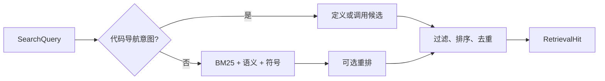

# 统一检索：从多路召回到可读证据

UnifiedRetrieval 把结构化检索单元、BM25、向量语义、代码符号导航和可选重排器收束为同一查询入口，并在输出前执行范围过滤、用途偏置、去重和固定证据投影。它既服务读者与 Agent，也兼容仍以 Fragment 为单位的旧调用方。

来源：gpt-5.6-sol 分析，gpt-5.6-sol 独立复核；模型解释仍可被原始证据纠正。

## 解决什么问题

这个类解决的是“同一份个人知识如何被读者、助手和研究 Agent 一致检索”的问题。它继承关键词检索能力，同时装配检索单元投影和代码导航；向量模型与重排器都是可选依赖。参考 [统一检索职责与装配 ↗](../../../apps/server/src/retrieval/unified.ts#L40 "支持该类统一服务读者和 Agent、兼容旧 source 端口，并装配投影与代码导航的说明。")

新入口返回带上下文、来源和路由信息的 `RetrievalHit`。参考 [结果收尾与多样化 ↗](../../../apps/server/src/retrieval/unified.ts#L606 "支持用途偏置、定义优先、复核状态降权、去重、多样化及最终 RetrievalHit 的上下文、路由、来源等字段组装。") 旧的 source 接口则把同一结果投影回不可变 Fragment，避免形成两套知识检索。参考 [旧接口投影与关闭 ↗](../../../apps/server/src/retrieval/unified.ts#L739 "支持同步与异步 source 接口能力差异、Fragment 去重投影及资源关闭顺序。")

## 一条代表性查询如何流动

例如输入“谁调用 `search`”，`search` 先同步投影，再把自然语言识别为 callers 意图；随后按符号名缩小代码单元，并用 `CodeNavigation.matches` 找到名称级调用位置，返回带 `codeMatches` 的候选。这是导航线索，不是类型解析后的完整调用图。参考 [符号与调用候选导航 ↗](../../../apps/server/src/retrieval/unified.ts#L312 "支持符号直达、自然语言 callers 分流以及名称级调用候选生成流程。")

普通问题走多路召回：BM25 负责词面命中，已就绪的 embedding 计算查询与各文本窗口的相似度，符号定义另设直达支路；三路先把各分支分数换算成可比较的质量，再按名次衰减累加。参考 [词面召回 ↗](../../../apps/server/src/retrieval/unified.ts#L414 "支持 BM25 查询构造、相关性过滤及词面候选截断的说明。") [语义召回与重排 ↗](../../../apps/server/src/retrieval/unified.ts#L476 "支持查询向量、窗口相似度、三路输入融合、可选交叉编码器重排，以及重排失败时保留候选继续收尾的行为。") [分支质量与名次融合 ↗](../../../apps/server/src/retrieval/unified.ts#L393 "直接支持各召回分支先归一化质量，再以 quality 除以 61 加名次的方式衰减累加。") 若配置了 reranker，再从前 40 个候选抽取段落打分，最后交给统一收尾逻辑。参考 [语义召回与重排 ↗](../../../apps/server/src/retrieval/unified.ts#L476 "支持查询向量、窗口相似度、三路输入融合、可选交叉编码器重排，以及重排失败时保留候选继续收尾的行为。")

参考 [符号与调用候选导航 ↗](../../../apps/server/src/retrieval/unified.ts#L312 "支持符号直达、自然语言 callers 分流以及名称级调用候选生成流程。") [语义召回与重排 ↗](../../../apps/server/src/retrieval/unified.ts#L476 "支持查询向量、窗口相似度、三路输入融合、可选交叉编码器重排，以及重排失败时保留候选继续收尾的行为。") [结果收尾与多样化 ↗](../../../apps/server/src/retrieval/unified.ts#L606 "支持用途偏置、定义优先、复核状态降权、去重、多样化及最终 RetrievalHit 的上下文、路由、来源等字段组装。")

## 过滤、降级与兼容边界

候选在召回前后都会经过资格检查：材料角色与有效期、任务状态、结果种类、主题前缀、可见性和时间范围都可限制结果。对于同时带有 `project_id` 且 `project_trusted=true` 的查询，记忆过滤会排除 `scope.project_id` 明确绑定到其他项目的条目；未绑定项目的记忆仍可进入候选，因此这不是完整的项目隔离。材料角色和历史状态通常只是排序偏置，不直接判定真假。参考 [范围与适用性规则 ↗](../../../apps/server/src/retrieval/unified.ts#L225 "支持角色、有效期、任务状态、可信项目、种类、主题、可见性和时间过滤及排序偏置，并明确可信项目查询仍保留未绑定项目的记忆。")

空查询、精确查询或尚无向量模型时直接使用词面/符号结果；查询向量或已存向量处理失败也回退到这一路。参考 [查询降级分支 ↗](../../../apps/server/src/retrieval/unified.ts#L476 "支持空查询、精确查询、无模型或向量异常时回退词面与符号结果的说明。") 若可选重排器加载或评分失败，系统会记录重排错误，并保留已经融合的候选继续收尾。参考 [语义召回与重排 ↗](../../../apps/server/src/retrieval/unified.ts#L476 "支持查询向量、窗口相似度、三路输入融合、可选交叉编码器重排，以及重排失败时保留候选继续收尾的行为。") 最终排序还结合查询目的、代码定义优先级、文章复核状态与材料适用性，并限制同来源、同章节和重复文本的挤占。参考 [结果收尾与多样化 ↗](../../../apps/server/src/retrieval/unified.ts#L606 "支持用途偏置、定义优先、复核状态降权、去重、多样化及最终 RetrievalHit 的上下文、路由、来源等字段组装。")

后台索引把长文本切窗、批量生成归一化向量，并在写锁内确认单元仍存在后事务写入；关闭时会停止定时器、等待在途投影与索引，再释放模型。旧同步 source 接口只提供词面与符号路径，调用方若需要语义检索应使用异步版本。参考 [向量索引生命周期 ↗](../../../apps/server/src/retrieval/unified.ts#L140 "支持文本切窗、批量嵌入、锁内存在性复查和事务写入的索引流程。") [旧接口投影与关闭 ↗](../../../apps/server/src/retrieval/unified.ts#L739 "支持同步与异步 source 接口能力差异、Fragment 去重投影及资源关闭顺序。")
