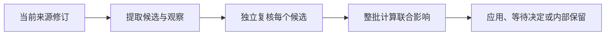

# 从捕获材料到可信记忆的学习与重核验

学习模块把当前来源修订转化为可追溯的记忆变更：先构造受约束上下文，再提取候选、独立复核并按整批影响执行策略；来源更新时冻结受影响记忆并重新走同一流程。现有实现已覆盖持久化作业、运行追踪、刷新对账和失败分类，但刷新输入范围、对账来源约束及完整运行验收仍有待确认。

来源：gpt-5.6-sol 分析，gpt-5.6-sol 独立复核；模型解释仍可被原始证据纠正。

## 为什么不能直接把模型回答写成记忆

学习模块位于**原始捕获材料**与**可长期使用的记忆**之间，解决模型输出不可直接信任、旧材料可能已过期、一次变更可能波及多条知识等问题。它只领取提取、复核和来源刷新三类持久化作业，并要求提取者与复核者的角色配置匹配当前运行档案；模型、推理强度及提示词、技能、工具指纹会随作业记录，便于追踪一次结论如何产生。参考 [学习作业与运行指纹 ↗](../../../apps/server/src/learning/pipeline.ts#L86 "支持学习模块限定作业类型、校验提取与复核角色配置，并记录模型及运行组件指纹的论断。")

底层 worker 通过租约领取限定类型的作业，运行期间发送心跳；找不到处理器会记录配置失败，停止或取消则中止正在运行的处理器。这让学习流程可以恢复和重试，而不是依赖一次内存调用。参考 [持久化作业执行 ↗](../../../apps/server/src/jobs/worker.ts#L47 "支持租约领取、类型过滤、心跳、处理器缺失失败以及取消运行的说明。") 延伸阅读：[学习流水线子知识 ↗](5d7f1fb09279c4326beba8fb40838bf744a9aa7218a1f0c8a4d5e298830a201a.md#purpose "作为延伸阅读，提供学习流水线可信边界的已组织说明；附近事实仍由原始实现引用支持。")

## 如何把当前材料组织成可信上下文

每次运行都会重新解析来源引用，确认修订仍是当前 head、来源一致且有效性世代未变化；任一条件不满足就拒绝旧作业，避免过时材料覆盖现行记忆。捕获发生在哪个应用或会话，并不等同于材料已归属某个可信项目，因此当前上下文默认不授予项目可信性。参考 [修订新鲜度与项目信任 ↗](../../../apps/server/src/learning/pipeline.ts#L180 "支持运行前核对来源 head、来源身份和有效性世代，以及不把会话位置视为可信项目的说明。")

固定片段会按顺序映射回原始文本、链接或图片部分，携带说话者、回复关系、观察时间、转发状态等来源信息；图片还需能取得对应资产。系统可以召回相关记忆作为背景，并把失效记忆作为原身份的刷新目标，但角色被明确限制为只根据当前原始材料重核验，旧派生正文不能充当新证据。参考 [材料来源与刷新上下文 ↗](../../../apps/server/src/learning/pipeline.ts#L220 "支持片段来源信息、图片资产、相关记忆召回，以及仅以当前原始材料重核验失效记忆的说明。")

## 提取、独立复核与整批治理

该流程由实际实现串联：提取阶段保存角色运行结果和观察；有候选时才创建复核作业，无候选时直接参与来源刷新对账。复核阶段验证父作业、输出合同、摘要和角色包，并要求每个规范化候选恰有一条摘要匹配的判断。参考 [候选提取与复核入队 ↗](../../../apps/server/src/learning/pipeline.ts#L421 "支持保存提取结果、记录观察、有候选时创建复核作业以及无候选时执行刷新对账的流程。") [独立复核完整性校验 ↗](../../../apps/server/src/learning/pipeline.ts#L458 "支持复核阶段校验父作业、已存输出、摘要、角色包和候选覆盖完整性的论断。")

通过复核后，整份变更一次性交给记忆服务评估。服务先合并受影响记忆与新实体的去重集合；若超过自动应用预算，原本可自动应用的提案会整体停放，并只生成一次批量确认。其他策略还包括拒绝、延后到使用时处理、仅保留为可检索来源以及忽略噪声，因而“进入队列”或“模型支持”都不等于已经写入有效记忆。参考 [整批影响评估 ↗](../../../apps/server/src/learning/pipeline.ts#L525 "支持流水线将全部候选一次性交给记忆服务评估，并对评估结果进行记录的说明。") [批量策略与治理结果 ↗](../../../apps/server/src/memory/service.ts#L1380 "支持对整份变更计算去重联合影响、超预算时整体停放，以及不同非应用策略不会生成活跃状态的说明。")

## 来源更新、当前进展与限制

来源更新时，模块先以工作区、来源和新修订生成稳定刷新记录，并冻结首次发现的失效记忆集合；若来源已经继续前进，本轮标为被取代，否则复用普通提取身份重新入队，避免启动第二套提取链。最终状态依据实际记忆依赖和来源 head 对账，区分已应用、仍需复核或已被取代。参考 [来源刷新重新入队 ↗](../../../apps/server/src/learning/pipeline.ts#L126 "支持来源更新后记录影响、识别已前进的来源，并复用普通提取身份重新入队的流程。") [刷新快照与实际对账 ↗](../../../apps/server/src/learning/refresh.ts#L6 "支持冻结受影响记忆集合，并依据当前依赖和来源 head 计算已应用、仍需复核或被取代状态。") 延伸阅读：[来源刷新子知识 ↗](819a9f2861dfc7f9e280c99318c412655c30248d504b23e3367dc5edf2f0ef7e.md#reconciliation-flow "作为延伸阅读，汇总刷新快照和对账边界；正文中的事实结论同时引用了原始实现。")

从提供的实现看，持久化作业、角色运行追踪、独立复核、整批策略和刷新对账已经形成可运行的功能链；但材料没有给出端到端测试或线上验收结果，不能据此断言所有外部角色运行均已验证。刷新还有两个明确边界：建档只选择第一个完整来源引用；修复查询虽校验目标修订和来源 head，却没有显式用刷新记录中的来源限定依赖，需结合数据库约束确认其安全性。参考 [刷新输入与来源约束 ↗](../../../apps/server/src/learning/refresh.ts#L8 "支持刷新只选取第一个完整引用，以及修复查询未显式按刷新记录来源限定依赖的限制说明。")
