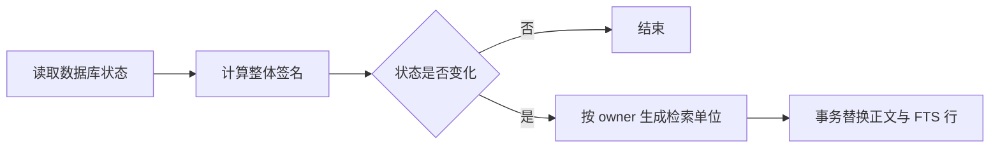

# 把多种记忆投影成统一检索单位

该模块把当前原件、知识章节、事项和已应用记忆转换为可替换的检索单位，同时保留固定来源、可见范围和时态元数据；它负责结构化分段、增量重建、知识依赖校验、全文索引写入与数据库行解码，是统一检索读取不可变事实之前的投影层。

来源：gpt-5.6-sol 分析，gpt-5.6-sol 独立复核；模型解释仍可被原始证据纠正。

## 为什么需要独立的检索投影

原件、知识文章、事项和记忆的保存结构不同，搜索却需要统一的标题、正文、上下文、来源锚点和可见范围。这里定义的 `RetrievalUnit` 是**可重建索引**，不替代原始版本；结构规则变化时可通过 `UNIT_VERSION` 形成新身份。参考 [检索单位合同 ↗](../../../apps/server/src/retrieval/units.ts#L1 "支持该文件将检索单位定义为独立于不可变存储和阅读页面的可替换结构，并给出版本、核心字段与主要依赖。")

原件先恢复为 `KnowledgeMaterial`：派生来源会被排除，文本、链接和图片重新组合，并优先采用已登记的稳定材料 key。随后按类型分段：Markdown 保持标题层级，并把引导句与紧随的表格、列表或代码块合并；代码则借助 AST 保留完整函数/方法及其相邻注释，同时把 import、顶层配置等未被符号覆盖的内容也纳入检索。AST 在这里用于确定阅读边界，不代表跨文件调用关系。参考 [Markdown 分段 ↗](../../../apps/server/src/retrieval/units.ts#L31 "支持按 Markdown 块和标题层级分段、合并引导句与表格列表代码块，以及空正文边界。") [代码结构分段 ↗](../../../apps/server/src/retrieval/units.ts#L90 "支持代码用 AST 选择完整操作边界、保留相邻注释并补入未覆盖顶层内容的机制。") [原件恢复规则 ↗](../../../apps/server/src/retrieval/units.ts#L183 "支持排除派生来源、组合文本链接图片、解析稳定材料 key 并保留原始片段。")

## 一次同步如何产生可搜索结果

代表性调用是 `projection.syncAsync()`：输入不是单个文档，而是 SQLite 中当前的来源头、材料说明、知识头与失效记录、事项和记忆状态。方法用共享 Promise 避免并发重复执行；异步入口只在 `changes()` 生成器的让出点调用 `setImmediate`，把同步过程分批交还事件循环。当前来源遍历均有让出点，知识文章只在实际替换后让出；事项与记忆循环没有额外让出点。参考 [同步与防重入 ↗](../../../apps/server/src/retrieval/units.ts#L424 "支持同步和异步入口、共享工作 Promise 防止重复执行，以及异步入口仅在生成器让出点调用 setImmediate。") [增量变更判定 ↗](../../../apps/server/src/retrieval/units.ts#L451 "支持基于多类头状态计算签名、读取当前来源、按 owner 身份只重建变化对象，并显示来源循环逐项让出。") [知识与应用状态投影 ↗](../../../apps/server/src/retrieval/units.ts#L630 "支持 current 与 needs-review 区分、递归来源引用和可见范围，知识替换后的让出点，以及事项和 active 记忆的投影循环。")

整体签名未变就直接结束；有变化时，再用“来源版本 + 材料说明版本”等 owner 身份跳过未变对象。当前原件经分段后写入标题、概念、会话/发言者/时间、固定行号锚点与 fragment 可见范围。参考 [增量变更判定 ↗](../../../apps/server/src/retrieval/units.ts#L451 "支持基于多类头状态计算签名、读取当前来源、按 owner 身份只重建变化对象，并显示来源循环逐项让出。") [原件单位生成 ↗](../../../apps/server/src/retrieval/units.ts#L265 "支持原件按代码、Markdown 或图片选择分段，并附加概念、会话时态、来源锚点和可见范围。")

知识文章按**章节**判断是否可召回：必须已通过复核、未失效、调查依赖仍存在，而且该章正文实际引用的材料摘要或子文章章节仍受支持。若引用依据仍匹配、但文章已不是完全 current，章节仍可作为 `needs-review` 背景；引用会递归还原到原件锚点，全部调查材料仍进入可见范围。事项无论进行中、等待、完成或取消都会投影其当前状态；记忆只投影 active 头版本，并把证据恢复成原件引用。参考 [知识章节可用性 ↗](../../../apps/server/src/retrieval/units.ts#L572 "支持以章节为边界校验复核状态、失效标记、依赖存在性和实际引用摘要。") [知识与应用状态投影 ↗](../../../apps/server/src/retrieval/units.ts#L630 "支持 current 与 needs-review 区分、递归来源引用和可见范围，知识替换后的让出点，以及事项和 active 记忆的投影循环。")

## 一致性边界与修改入口

每个 owner 的旧普通行、FTS 行和投影头会在一个 `BEGIN IMMEDIATE` 事务中删除并重建；任一步失败都会回滚，因此调用完成后的普通索引和词面索引保持一致。写入 FTS 前还会移除知识正文里的 `[[引用标签]]`，并用中文 ICU 分词转成小写词元；读取时 `decodeUnit` 再把 JSON 字段恢复为统一对象。参考 [事务替换索引 ↗](../../../apps/server/src/retrieval/units.ts#L920 "支持按 owner 在事务中替换普通检索行、投影头和 FTS 行，并在错误时回滚。") [中文索引与解码 ↗](../../../apps/server/src/retrieval/units.ts#L984 "支持 ICU 中文词切分、统一小写，以及从数据库行恢复检索单位字段。")

本模块依赖代码解析、片段行号映射、稳定摘要和材料说明模块。修改分段粒度应从 `markdownPassages` / `codePassages` 入手，增加新的保存对象要扩展 `changes()`，调整词面规范化则修改 `indexText`；若改变单位身份或结构，应同步提升 `UNIT_VERSION`，使旧投影自动失效重建。需要注意：这里只生成候选数据和来源约束，不负责最终的词面/向量融合排序，也不把 AST 名称候选升级成完整调用图。参考 [检索单位合同 ↗](../../../apps/server/src/retrieval/units.ts#L1 "支持该文件将检索单位定义为独立于不可变存储和阅读页面的可替换结构，并给出版本、核心字段与主要依赖。") [代码结构分段 ↗](../../../apps/server/src/retrieval/units.ts#L90 "支持代码用 AST 选择完整操作边界、保留相邻注释并补入未覆盖顶层内容的机制。") [增量变更判定 ↗](../../../apps/server/src/retrieval/units.ts#L451 "支持基于多类头状态计算签名、读取当前来源、按 owner 身份只重建变化对象，并显示来源循环逐项让出。") [中文索引与解码 ↗](../../../apps/server/src/retrieval/units.ts#L984 "支持 ICU 中文词切分、统一小写，以及从数据库行恢复检索单位字段。")
