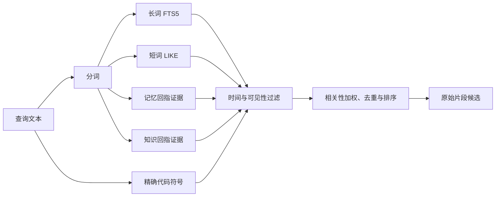

# 面向原始证据的 SQLite 关键词检索

KeywordRetrieval 是服务端同步词法检索基座：把用户问题拆成可检索词，从全文、短中文词、代码符号、有效记忆和知识讲解五条路线找候选，再按可见性、时间、相关性与多样性排序，始终返回可回读的当前原始片段。

来源：gpt-5.6-sol 分析，gpt-5.6-sol 独立复核；模型解释仍可被原始证据纠正。

## 解决什么问题

用户可能用自然语言、两字中文词、代码标识符，或记忆中的别名寻找材料。`KeywordRetrieval` 为这些入口提供同一个同步 `RetrievalPort`：数据库可用即报告健康，并把检索结果锚定到原始证据，而不是把派生回答当成新的事实来源。参考 [检索端口与健康状态 ↗](../../../apps/server/src/retrieval/keyword.ts#L22 "支持该类是始终返回原始证据的同步检索端口，并说明其后端健康标识。")、[原始证据约束 ↗](../../../apps/server/src/retrieval/keyword.ts#L1 "支持统一 SQL 条件排除派生来源，并展示本模块依赖知识、相关性与排序组件。")。

例如，用户问“导入旅行照片后怎么生成相册？”只是一个**教学示例**：输入是 `SearchQuery`，输出不是整篇文档，而是一组带片段、版本、来源、分数和命中路线的候选，之后可据此打开固定证据。

## 一次原始材料查询怎样流过

参考 [五路候选汇合 ↗](../../../apps/server/src/retrieval/keyword.ts#L75 "支持全文、短词、代码符号、记忆证据和知识证据五条路线汇成候选集。")、[过滤加权与结果组装 ↗](../../../apps/server/src/retrieval/keyword.ts#L105 "支持候选先过滤，再按来源频率加权、按片段融合并交给最终排序的流程。")。

流程先把结果数限制在 1–100，并在没有有效词时直接返回空数组。三字及以上词走 trigram FTS5；更短的词因 FTS5 无法匹配而走转义后的 `LIKE`。五路候选先经过捕获时间与调用方 `visible` 策略，再按“词在多少个来源出现”降低常见词权重；同一片段只保留最高分，同时记录所有命中路线，最后交给 `rankEvidence`。参考 [查询入口与长词全文检索 ↗](../../../apps/server/src/retrieval/keyword.ts#L54 "支持结果上限、空查询短路、时间与可见性过滤，以及长词的 FTS5 路线。")、[短词转义匹配 ↗](../../../apps/server/src/retrieval/keyword.ts#L155 "支持短词通过转义后的 LIKE 同时匹配片段正文和标题。")。

## 记忆和知识只负责引路

记忆检索只扫描 `active` 版本，以正文子串累计分数；只有 `project_id` 来自可信关联时，才排除其他项目的记忆。记忆命中进入材料检索后，会读取它的证据集合并重新取得当前原始片段，所以返回的 snippet 仍来自原件。知识讲解也只是并列候选路线，模块本身不会把讲解正文作为独立证据输出。参考 [有效记忆召回 ↗](../../../apps/server/src/retrieval/keyword.ts#L163 "支持只搜索有效记忆、仅在项目关联可信时过滤，并说明记忆的子串计分与返回结构。")。

调用方拿到候选后可用 `readEvidence(revisionId, fragmentId)` 精确回读；省略片段 ID 时返回该版本 ordinal 最小的片段，版本或片段不存在则返回 `null`。参考 [固定片段回读 ↗](../../../apps/server/src/retrieval/keyword.ts#L30 "支持按版本和可选片段 ID 回读固定证据，以及不存在时返回空。")。

## 边界与修改入口

代码符号路线是可选投影：没有 `code_symbols` 表就安静返回空；只查询当前快照中未移除文件的名称或限定名。识别规则偏保守，通常要求显式大小写、下划线、点号等代码形态，或整条查询就是该名称，避免普通英文被误当操作名。参考 [可选符号投影 ↗](../../../apps/server/src/retrieval/keyword.ts#L140 "支持代码符号表缺失时降级为空，以及只查当前未移除文件并采用保守名称识别。")。

原始材料 SQL 统一排除 `producerKind=derived` 或 `context.derived=1` 的版本。短词召回要改 `searchFragmentsForTerm`，符号识别改 `exactSymbols`，记忆范围与分数改 `searchMemories`；分词、片段相关性和最终多样化排序分别由导入的 relevance 与 ranking 模块承担。参考 [原始证据约束 ↗](../../../apps/server/src/retrieval/keyword.ts#L1 "支持统一 SQL 条件排除派生来源，并展示本模块依赖知识、相关性与排序组件。")、[可选符号投影 ↗](../../../apps/server/src/retrieval/keyword.ts#L140 "支持代码符号表缺失时降级为空，以及只查当前未移除文件并采用保守名称识别。")、[分词与片段生成委托 ↗](../../../apps/server/src/retrieval/keyword.ts#L227 "支持 tokenize 与 snippetFor 分别委托 queryTerms 和 bestSnippet，说明可修改职责的边界。")。当前类只实现同步词法层；语义向量融合属于它的上层扩展，不应从本文件推断为这里已经完成。
