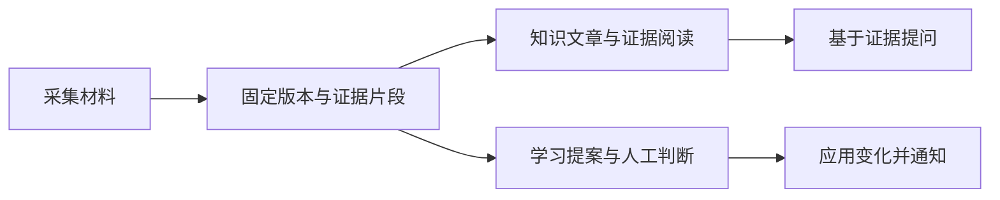

# Web 工作台：从个人记忆到可追溯行动

Web 模块是 omem 面向用户的浏览器入口，以 Vue 工作台连接材料采集、知识与证据阅读、证据问答、学习提案、人工判断、事项跟进、通知、外部连接和仓库知识浏览。它负责交互编排与证据路径呈现，最终权限、持久化、幂等和安全保证仍依赖服务端。

来源：gpt-5.6-sol 分析，gpt-5.6-sol 独立复核；模型解释仍可被原始证据纠正。

## 解决什么问题

Web 模块把个人记忆相关能力集中到一个工作台：用户可以采集材料、阅读知识和原始证据、基于固定片段提问，也可以进入学习流程、待判断、事项跟进、通知与连接配置。创建待办时还能关联当前证据，并从事项返回来源材料。参考 [统一个人记忆工作台 ↗](01a1d59970b64ce9a240d80dd8127c069f020520ca789eec175c9af94250ccfc.md#workspace-purpose "概括工作台并列提供的业务入口，以及待办关联证据和来源回查能力。")

浏览器入口将页面定位为“个人工作记忆”，通过统一根节点启动前端应用。参考 [浏览器应用入口 ↗](../../../apps/web/index.html#L1 "支持页面的中文个人工作记忆定位、统一挂载节点及前端入口文件。") Web 还承载两类并列场景：Code Wiki 支持从仓库概览进入模块、文件、符号和固定原文；事项页面则提供记录等待对象、安排检查时间和取消等操作。参考 [仓库阅读与事项操作 ↗](94218fbf87841cfe339659af5d4b326fd0c168331762f84c04923ee3c1b8985b.md#user_scenarios "支持 Web 同时承载 Code Wiki 阅读和事项跟进两类场景，并说明事项命令携带版本和请求标识。")

## 材料、知识与变化如何流转

采集入口按普通输入、飞书文档、服务器文件和 Git 文件分派，保存后打开对应版本。证据阅读器以帧栈保留阅读层级、标签页和滚动位置；问答可以携带焦点片段和阅读路径，但当前只保证输入依据可回查，尚未自动核验回答中的每项主张。参考 [采集与证据问答流程 ↗](01a1d59970b64ce9a240d80dd8127c069f020520ca789eec175c9af94250ccfc.md#capture-evidence-flow "支持多来源采集、证据阅读帧栈、异步问答、焦点证据与模型配置，以及逐主张核验尚未实现的边界。")

知识库把目录、分节文章、固定引用和原始材料串成连续阅读链；可操作引用可以下钻到固定原文，不可用目标会显示原因。参考 [知识与原文追溯 ↗](1ed2f14c8dbc2b0e8a369de4de7877707fecf84d98b7996ff88fafb99dec43fa.md#evidence-reading "解释知识正文如何通过可操作引用进入固定原文，并呈现不可用目标。") 材料中仍无法确定的事项留在阅读现场，用户可补充背景或加入待办。参考 [阅读现场的待确认事项 ↗](1ed2f14c8dbc2b0e8a369de4de7877707fecf84d98b7996ff88fafb99dec43fa.md#trail-and-questions "支持无法确定的问题留在文章现场，并提供补充背景和加入待办入口。")

学习页呈现材料保存、提炼核验、形成提案和应用通知等状态；需要人工介入的变化进入待判断页，来源变化会使旧判断失效。通知以应用回执区分“收到通知”和“变化已经生效”。参考 [学习判断通知闭环 ↗](01a1d59970b64ce9a240d80dd8127c069f020520ca789eec175c9af94250ccfc.md#governed-change-flow "支持学习状态、人工判断、来源失效保护和应用回执之间的流程关系。")

## 共享能力与跨模块关系

前端基于 Vue，并复用工作区共享 UI。Vite 提供开发与构建入口，TypeScript 采用严格模式并将应用、共享 UI 和契约源码纳入检查。参考 [前端开发入口 ↗](ad84fde4ee0e2a675dfab86d12516ff51be2c50134d04ce3bbb72ecdd301e1d5.md#purpose "支持 Vue 插件作为开发和构建入口，并说明前端构建基础。") [跨包类型检查边界 ↗](ad84fde4ee0e2a675dfab86d12516ff51be2c50134d04ce3bbb72ecdd301e1d5.md#type-boundary "支持严格 TypeScript 检查覆盖应用、共享 UI 与契约源码，并说明不直接产出 JavaScript。") 开发期 `/api` 请求由本机 Vite 服务代理到本地 API；这些材料只说明开发拓扑，不能确定生产环境是否采用相同连接方式。参考 [本地开发请求链路 ↗](ad84fde4ee0e2a675dfab86d12516ff51be2c50134d04ce3bbb72ecdd301e1d5.md#development-flow "支持开发期 Vite 到本地 API 的代理关系，并界定生产部署拓扑尚不能由此确定。")

个人知识库与 Code Wiki 共同复用证据轨迹：文章、引用、来源、模块、文件和符号形成层级式阅读体验，并支持返回、跳转、循环提示、焦点归还和 Hash 深链。个人知识页面把 200 层作为 URL 持久化预算，内存阅读栈不会静默截断；Code Wiki 自有的深链写出逻辑尚未完全统一这一限制。参考 [个人知识证据轨迹 ↗](1ed2f14c8dbc2b0e8a369de4de7877707fecf84d98b7996ff88fafb99dec43fa.md#trail-and-questions "支持个人知识页面保存和恢复证据路径、共享抽屉交互及 URL 长度预算。") [仓库深链与失效边界 ↗](94218fbf87841cfe339659af5d4b326fd0c168331762f84c04923ee3c1b8985b.md#traceability "支持 Code Wiki 轨迹深链、共享限制与页面自有写出逻辑尚未完全统一的判断。")

个人工作区请求使用会话令牌，仓库评审接口当前则面向本机读取、浏览与同步，不发送相同的授权头。因此，两类界面虽然共享阅读交互，却不能被视为已经具备统一鉴权或租户隔离。参考 [接口与辅助数据边界 ↗](94218fbf87841cfe339659af5d4b326fd0c168331762f84c04923ee3c1b8985b.md#contracts_and_limits "解释个人会话认证和本机仓库评审接口的不同授权边界，并支持辅助请求失败降级为空数据的限制。")

## 当前进展与限制

现有界面已经形成多条可用链路：多来源采集和异步证据问答由采集阅读流程承接，知识目录与固定原文回查由个人知识库承接，学习、判断和通知组成变化处理闭环，事项操作与仓库知识浏览则形成另外两类用户场景。参考 [采集与证据问答流程 ↗](01a1d59970b64ce9a240d80dd8127c069f020520ca789eec175c9af94250ccfc.md#capture-evidence-flow "支持多来源采集、证据阅读帧栈、异步问答、焦点证据与模型配置，以及逐主张核验尚未实现的边界。") [知识与原文追溯 ↗](1ed2f14c8dbc2b0e8a369de4de7877707fecf84d98b7996ff88fafb99dec43fa.md#evidence-reading "解释知识正文如何通过可操作引用进入固定原文，并呈现不可用目标。") [学习判断通知闭环 ↗](01a1d59970b64ce9a240d80dd8127c069f020520ca789eec175c9af94250ccfc.md#governed-change-flow "支持学习状态、人工判断、来源失效保护和应用回执之间的流程关系。") [仓库阅读与事项操作 ↗](94218fbf87841cfe339659af5d4b326fd0c168331762f84c04923ee3c1b8985b.md#user_scenarios "支持 Web 同时承载 Code Wiki 阅读和事项跟进两类场景，并说明事项命令携带版本和请求标识。") 飞书接入包含能力探测和 Owner 配对等交互。参考 [连接与工作台限制 ↗](01a1d59970b64ce9a240d80dd8127c069f020520ca789eec175c9af94250ccfc.md#connections-progress-limits "支持精确文本搜索限制、飞书能力探测和配对流程，以及服务端安全保证仍待确认。")

当前限制主要集中在跨端保证与异常表达：个人工作台仍使用精确文本检索；失效深链和超长轨迹的提示合同尚未完全统一。参考 [连接与工作台限制 ↗](01a1d59970b64ce9a240d80dd8127c069f020520ca789eec175c9af94250ccfc.md#connections-progress-limits "支持精确文本搜索限制、飞书能力探测和配对流程，以及服务端安全保证仍待确认。") [仓库深链与失效边界 ↗](94218fbf87841cfe339659af5d4b326fd0c168331762f84c04923ee3c1b8985b.md#traceability "支持 Code Wiki 轨迹深链、共享限制与页面自有写出逻辑尚未完全统一的判断。") 文件辅助信息请求失败时还可能降级为空数据，与“确实没有内容”难以区分。参考 [接口与辅助数据边界 ↗](94218fbf87841cfe339659af5d4b326fd0c168331762f84c04923ee3c1b8985b.md#contracts_and_limits "解释个人会话认证和本机仓库评审接口的不同授权边界，并支持辅助请求失败降级为空数据的限制。")

事项操作会提交期望版本和请求标识，证据问答会提交焦点证据及模型配置，待判断流程也会处理来源变化后的失效状态；这些前端行为不能单独证明服务端已经完成版本冲突处理、重复请求去重、模型能力校验或过期提案拒绝。参考 [仓库阅读与事项操作 ↗](94218fbf87841cfe339659af5d4b326fd0c168331762f84c04923ee3c1b8985b.md#user_scenarios "支持 Web 同时承载 Code Wiki 阅读和事项跟进两类场景，并说明事项命令携带版本和请求标识。") [采集与证据问答流程 ↗](01a1d59970b64ce9a240d80dd8127c069f020520ca789eec175c9af94250ccfc.md#capture-evidence-flow "支持多来源采集、证据阅读帧栈、异步问答、焦点证据与模型配置，以及逐主张核验尚未实现的边界。") [学习判断通知闭环 ↗](01a1d59970b64ce9a240d80dd8127c069f020520ca789eec175c9af94250ccfc.md#governed-change-flow "支持学习状态、人工判断、来源失效保护和应用回执之间的流程关系。") 飞书接入虽然会在前端清理 Secret，但服务端加密、日志脱敏、配对过期与防重放仍需后端材料和真实行为测试确认。参考 [连接与工作台限制 ↗](01a1d59970b64ce9a240d80dd8127c069f020520ca789eec175c9af94250ccfc.md#connections-progress-limits "支持精确文本搜索限制、飞书能力探测和配对流程，以及服务端安全保证仍待确认。")

## 界面技术基础

Web 包采用 Vue 3，并使用共享 UI、Markdown 解析、代码高亮、内容净化和二维码组件，为知识阅读、代码展示及连接配置提供基础能力。参考 [Vue 3 与共享界面依赖 ↗](01a1d59970b64ce9a240d80dd8127c069f020520ca789eec175c9af94250ccfc.md#workspace-purpose "支持 Web 前端采用 Vue 3，并依赖共享 UI、Markdown、高亮、净化和二维码能力。")
