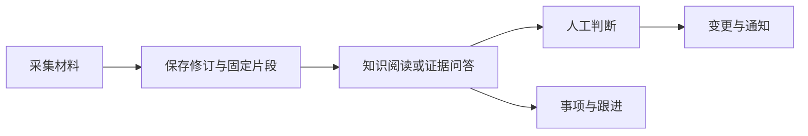

# Web 工作台：从个人记忆到可追溯行动

omem Web 工作台把材料采集、知识阅读、固定证据、问答、记忆处理、人工判断和事项跟进组织在同一界面中。它强调从结论返回原文、从证据继续行动；当前仍受精确搜索、部分未统一的深链与标签合同，以及若干待验证服务端语义限制。

来源：gpt-5.6-sol 分析，gpt-5.6-sol 独立复核；模型解释仍可被原始证据纠正。

## 把记忆使用变成连续工作流

Web 工作台服务于“记下材料、找回依据、形成理解、继续推进事项”的连续场景。浏览器入口加载 Vue 应用，页面再把日常助理、知识库、原始材料、输入、处理任务、待判断、待办、变更和通知组织为统一工作空间。参考 [Web 页面启动入口 ↗](../../../apps/web/index.html#L1 "支持浏览器页面挂载应用及其面向个人工作记忆的基本入口定位。")；延伸阅读：[统一工作台与日常助理 ↗](01a1d59970b64ce9a240d80dd8127c069f020520ca789eec175c9af94250ccfc.md#workspace-purpose "解释工作台为何把材料、知识、助理和行动入口组织在同一连续场景中。")

它的核心价值不是单纯保存笔记，而是让用户能从回答或知识正文回到固定证据，并在需要时把证据带入问答、判断或行动。日常助理提供自然语言入口，知识库则适合按主题阅读；两者共享材料和证据链，而不是形成互不相通的记录。参考 [统一工作台与日常助理 ↗](01a1d59970b64ce9a240d80dd8127c069f020520ca789eec175c9af94250ccfc.md#workspace-purpose "解释工作台为何把材料、知识、助理和行动入口组织在同一连续场景中。") [个人知识的证据阅读 ↗](1ed2f14c8dbc2b0e8a369de4de7877707fecf84d98b7996ff88fafb99dec43fa.md#evidence-flow "说明知识正文如何沿可操作引用进入固定原文，并保留主阅读上下文。")

## 从材料输入到证据驱动的行动

材料可由文本、链接、图片或外部文件进入统一捕获流程，保存为可区分当前与历史状态的修订，再以固定片段参与阅读和引用。阅读器保留深入引用前的滚动位置，并用帧栈支持逐层返回和循环提示。参考 [材料采集与固定证据 ↗](01a1d59970b64ce9a240d80dd8127c069f020520ca789eec175c9af94250ccfc.md#capture-to-evidence "解释多来源输入如何形成修订、固定片段和可逐层返回的证据阅读路径。") [个人知识的证据阅读 ↗](1ed2f14c8dbc2b0e8a369de4de7877707fecf84d98b7996ff88fafb99dec43fa.md#evidence-flow "说明知识正文如何沿可操作引用进入固定原文，并保留主阅读上下文。")

问答运行会携带当前焦点与 Agent 配置，但“可以回查依据”并不代表回答中的每项主张都已自动核验。候选记忆还需经过处理策略和独立核验；有歧义的内容进入人工判断，高置信小范围变化才可能自动应用。参考 [证据进入问答与判断 ↗](01a1d59970b64ce9a240d80dd8127c069f020520ca789eec175c9af94250ccfc.md#evidence-to-action "解释证据如何参与异步问答、候选记忆处理、人工判断及变更通知。") 已有事项可记录等待对象、稍后提醒或取消，并受共享任务状态与版本合同约束；现有材料尚未证明 Code Wiki 阅读链与这套跟进控制已直接打通。参考 [已有事项的跟进控制 ↗](94218fbf87841cfe339659af5d4b326fd0c168331762f84c04923ee3c1b8985b.md#task_followup "说明事项等待、稍后提醒和取消的现有能力，以及其与证据阅读尚未证明直接打通的边界。")

## 在知识、原文与代码之间逐层追溯

个人知识库以主题目录和完整文章为主阅读面，正文中的可操作引用可打开固定原文，同时保留原文章上下文。轨迹栈能够写入 URL 深链，运行时阅读层级不因持久化预算而静默截断，路径过长时则停止保存完整链接并提示用户。参考 [个人知识的证据阅读 ↗](1ed2f14c8dbc2b0e8a369de4de7877707fecf84d98b7996ff88fafb99dec43fa.md#evidence-flow "说明知识正文如何沿可操作引用进入固定原文，并保留主阅读上下文。") [证据轨迹与深链 ↗](1ed2f14c8dbc2b0e8a369de4de7877707fecf84d98b7996ff88fafb99dec43fa.md#trail-and-deeplink "解释运行时轨迹、循环检测、URL 恢复及路径长度预算的关系。")

仓库知识阅读进一步把模块、文件、符号、代码关系和评审片段纳入同一类轨迹交互，使读者能从功能说明下钻到源码范围，再回到需求、决策或测试依据。参考 [源码与评审依据追踪 ↗](94218fbf87841cfe339659af5d4b326fd0c168331762f84c04923ee3c1b8985b.md#evidence_flow "说明 Code Wiki 如何在模块、文件、符号、关系和评审片段之间下钻。") 这项能力与个人证据阅读共享交互思想，但当前材料显示证据阅读与事项跟进仍是并列能力，不能宣称已经形成从任意代码证据直接创建跟进事项的完整闭环。参考 [已有事项的跟进控制 ↗](94218fbf87841cfe339659af5d4b326fd0c168331762f84c04923ee3c1b8985b.md#task_followup "说明事项等待、稍后提醒和取消的现有能力，以及其与证据阅读尚未证明直接打通的边界。")

## 当前进展、运行关系与限制

前端已经具备统一导航、多来源采集、版本阅读、证据问答、材料处理、人工判断、任务控制和通知查看等主要界面。开发时由 Vite 提供页面服务并把 `/api` 请求代理到本地服务；这只说明开发期连接方式，不能推断生产部署也采用相同拓扑。参考 [本地开发请求链路 ↗](ad84fde4ee0e2a675dfab86d12516ff51be2c50134d04ce3bbb72ecdd301e1d5.md#development-flow "解释 Vite 开发服务器与本地 API 代理的关系，并限定该证据不能代表生产部署。")

当前个人材料搜索仍以精确文本为主，语义检索及其与派生知识、原始片段的排序合同尚未在此处落实。启动流程会区分个人服务和仓库评审服务，但统一主应用与仍存在的独立 Code Wiki 入口之间，产品定位还需进一步明确。参考 [工作台当前能力边界 ↗](01a1d59970b64ce9a240d80dd8127c069f020520ca789eec175c9af94250ccfc.md#progress-and-limits "支持精确搜索、Agent 探测、服务模式识别及统一入口定位仍有限制的概括。")

部分阅读路径也尚未完全统一：展示字段和 `actionable` 约束按调用路径落实，失效模块、文件或符号的深链可能保留帧却没有完整正文；页面与共享路由对超长轨迹的序列化处理仍有差异。参考 [标签与失效深链边界 ↗](94218fbf87841cfe339659af5d4b326fd0c168331762f84c04923ee3c1b8985b.md#labels_and_deeplinks "支持展示字段、不可操作约束、失效轨迹和超长路径处理尚未完全统一的论断。") 异常帧校验、章节参数单独变化后的重新定位，以及问题回答是否真正保存为原始材料并触发重核验，仍需结合服务端行为和浏览器验收确认。参考 [知识阅读待验证事项 ↗](1ed2f14c8dbc2b0e8a369de4de7877707fecf84d98b7996ff88fafb99dec43fa.md#progress-and-limits "支持异常帧、章节定位、超长轨迹以及问题回答后端语义仍需验证的说明。")
