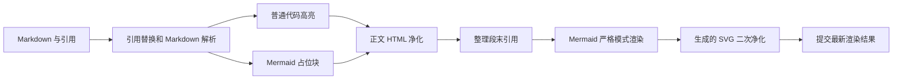

# 共享知识阅读与代码架构界面原语

`@omem/ui` 提供知识正文安全渲染、源码按行阅读、模态证据容器、哈希深链与模块关系图等共享 Vue 3 原语。各组件的局部合同已经实现，但现有材料没有证明它们已由实际调用方串接成完整、可往返的端到端阅读流程。

来源：gpt-5.6-sol 分析，gpt-5.6-sol 独立复核；模型解释仍可被原始证据纠正。

## 共享界面层解决什么问题

`@omem/ui` 是项目内部使用的 Vue 3 ESM 包，统一导出组件入口和视觉令牌，并集中声明 Markdown 解析、HTML 净化、代码高亮与 Mermaid 渲染依赖。它为知识文章、源码证据和架构视图提供可复用的展示基础，但包清单本身不代表上层业务流程已经集成。参考 [共享界面包配置 ↗](../../../packages/ui/package.json#L1 "支持内部 Vue 3 包边界、导出入口以及 Markdown、净化、高亮和流程图依赖的说明。")

基础原语把常见交互和布局收敛为稳定合同：按钮统一变体、原生类型以及加载禁用状态；面板则按需组合标题、正文和操作区。具体业务动作、权限和数据加载仍由调用方负责。参考 [通用按钮状态合同 ↗](../../../packages/ui/src/components/OmButton.vue#L1 "支持按钮变体、默认原生类型以及加载状态联动禁用和忙碌语义的说明。")、[通用内容面板 ↗](../../../packages/ui/src/components/OmPanel.vue#L1 "支持面板按需组合标题、正文与操作区，并把业务内容留给调用方。")

## 正文与源码的安全呈现流程

知识正文先替换可识别的引用标记，再由 Markdown 解析器处理。普通代码块调用共享高亮器；Mermaid 代码块此时只变成保留原始描述的占位元素。解析所得正文随后统一经过 HTML 净化。参考 [Markdown 解析与正文净化 ↗](../../../packages/ui/src/components/OmMarkdown.vue#L25 "支持引用替换、普通代码高亮、Mermaid 占位及随后执行正文 HTML 净化的实际顺序，也支持空正文提前返回的限制。")

正文完成首次净化后，组件才以严格模式渲染 Mermaid，并对生成的 SVG 单独净化；失败时保留原始图表描述，异步结果也只有在仍属最新代次时才会提交。参考 [流程图渲染与二次净化 ↗](../../../packages/ui/src/components/OmMarkdown.vue#L66 "支持正文净化后才渲染 Mermaid、对生成 SVG 再次净化以及失败降级和代次提交控制。")

源码查看器复用共享高亮能力，以稳定行号展示全文，并提供锚点滚动、行范围导航和逐行引用事件；高亮失败时回退为转义后的原文。参考 [源码查看与行级事件 ↗](../../../packages/ui/src/components/OmCodeViewer.vue#L34 "支持异步高亮防竞态、稳定行号、锚点滚动、范围导航和逐行引用事件。")

## 深链、证据容器与架构关系

证据容器基于原生对话框：打开时保存焦点，正常关闭后尝试归还；Esc 发出返回事件，遮罩和关闭按钮发出关闭事件。正文、侧栏和操作区通过插槽组合，但组件本身不管理轨迹数据。参考 [证据对话框交互 ↗](../../../packages/ui/src/components/OmDialog.vue#L14 "支持焦点保存与归还、Esc 返回、遮罩关闭以及正文、侧栏和操作区的组合合同。")

Code Wiki 的轻量哈希协议可表示概览、结构、关系图、模块和文件视图，并解析文件行号及轨迹后缀。写入深链时只保存轨迹帧的 `kind` 与 `id`，完整标题、滚动位置和数据定位字段需要上层恢复；URL 最多持久化 200 帧，而共享入栈函数本身不截断渲染栈。参考 [哈希路由解析 ↗](../../../packages/ui/src/OmHashRoute.ts#L27 "支持主视图、文件行号和轨迹后缀的解析方式，并揭示轨迹 kind 缺少运行时成员校验。")、[哈希深链写入 ↗](../../../packages/ui/src/OmHashRoute.ts#L67 "支持各主视图及轨迹 kind/id 的序列化，并证明写入时应用 200 帧预算。")、[阅读轨迹数据合同 ↗](../../../packages/ui/src/trail.ts#L16 "支持完整轨迹帧字段、循环身份、URL 深度预算以及入栈函数不截断渲染栈的说明。")

关系图以固定排序和分层坐标绘制模块及仓内导入关系。节点点击或键盘操作会发出 `selectNode`，边标签点击会发出 `selectEdge`；后续打开什么内容完全由调用方决定。参考 [关系图分层布局 ↗](../../../packages/ui/src/components/OmRelationGraph.vue#L48 "支持排除缺失端点、固定排序、最多迭代 12 轮以及按层生成坐标的实现说明。")、[关系图选择事件 ↗](../../../packages/ui/src/components/OmRelationGraph.vue#L127 "支持节点和边分别向上层发出选择事件，并证明边标签键盘操作复用了节点事件处理。")

## 当前能力边界与待完善处

现有材料证明了安全正文渲染、源码查看、对话框、哈希轨迹和关系图等共享原语，但没有提供实际阅读容器或浏览器行为，因而不能据此断言引用、内部导航、对话框、深链和架构选择已经串成同一条端到端路径。

局部实现仍有明确边界：异步渲染期间清空 Markdown 会提前返回而不复位加载状态；哈希解析把外部 kind 直接断言为轨迹类型，超出 200 帧时也未在这些材料中看到用户提示。参考 [Markdown 解析与正文净化 ↗](../../../packages/ui/src/components/OmMarkdown.vue#L25 "支持引用替换、普通代码高亮、Mermaid 占位及随后执行正文 HTML 净化的实际顺序，也支持空正文提前返回的限制。")、[哈希路由解析 ↗](../../../packages/ui/src/OmHashRoute.ts#L27 "支持主视图、文件行号和轨迹后缀的解析方式，并揭示轨迹 kind 缺少运行时成员校验。")、[哈希深链写入 ↗](../../../packages/ui/src/OmHashRoute.ts#L67 "支持各主视图及轨迹 kind/id 的序列化，并证明写入时应用 200 帧预算。")、[阅读轨迹数据合同 ↗](../../../packages/ui/src/trail.ts#L16 "支持完整轨迹帧字段、循环身份、URL 深度预算以及入栈函数不截断渲染栈的说明。")

关系图的分层迭代最多执行 12 轮，长链和循环不保证严格层级；`missing` 关系被排除出布局，却仍可能进入模板并产生空路径或原点标签。边标签的键盘处理还复用了节点处理器，实际会发出 `selectNode(edgeId)`，与鼠标点击的 `selectEdge` 不一致。参考 [关系图分层布局 ↗](../../../packages/ui/src/components/OmRelationGraph.vue#L48 "支持排除缺失端点、固定排序、最多迭代 12 轮以及按层生成坐标的实现说明。")、[关系图选择事件 ↗](../../../packages/ui/src/components/OmRelationGraph.vue#L127 "支持节点和边分别向上层发出选择事件，并证明边标签键盘操作复用了节点事件处理。")、[缺失关系的渲染边界 ↗](../../../packages/ui/src/components/OmRelationGraph.vue#L107 "支持端点缺失时路径为空、标签回退原点，以及状态类没有 missing 专用分支的限制。")
