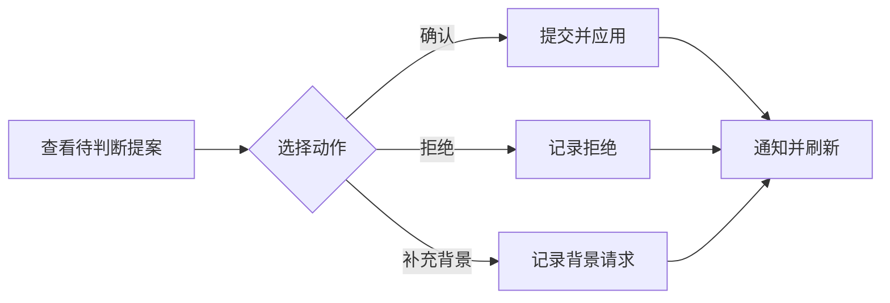

# 需要人工判断的变更处理界面

该 Vue 页面集中展示因歧义、冲突或影响较大而不能自动处理的提案，让用户查看变化、依据与有效状态，并选择确认、拒绝或要求补充背景。提交时携带提案摘要、操作者和独立请求标识，完成后通知上层刷新数据。

来源：gpt-5.6-sol 分析，gpt-5.6-sol 独立复核；模型解释仍可被原始证据纠正。

## 把高风险变化交给用户判断

该页面解决的是**自动处理与人工决策之间的交接**：它接收上层提供的判断列表，并通过事件把刷新、打开证据、错误和操作结果交还给父组件处理，因此本身主要负责展示与交互，不负责持有完整业务状态。参考 [组件输入与上层事件 ↗](../../../apps/web/src/DecisionsView.vue#L2 "支持该页面由外部接收判断列表，并将刷新、证据打开、错误和通知交给父组件处理。")

界面明确只承接歧义、冲突或影响较大的变化，并提示旧批准不会在来源变化或判断过期后继续使用。这使用户面对的不是普通通知，而是一组有时效、有证据且可能改变系统状态的待审提案。参考 [人工判断入口说明 ↗](../../../apps/web/src/DecisionsView.vue#L58 "支持页面只处理歧义、冲突和较大影响，并强调旧批准不会跨来源变化或过期继续生效。")

## 一次判断如何提交

用户可对待处理提案执行确认、拒绝或补充背景。组件先用“判断 ID + 动作”标记当前按钮为忙碌状态，再调用 API，提交动作、提案摘要、随机生成的请求标识和操作者；成功后发出对应通知并刷新列表，失败时上报错误后仍刷新，最后清除忙碌状态。参考 [判断请求处理流程 ↗](../../../apps/web/src/DecisionsView.vue#L28 "支持忙碌状态、API 请求字段、成功通知、异常处理、刷新和状态清理的完整流程。")

三个操作按钮只在状态为 `pending` 时出现，因此已确认、已拒绝、过期或失效的记录仍可阅读，但不能从此界面重复提交。参考 [待处理状态的操作按钮 ↗](../../../apps/web/src/DecisionsView.vue#L123 "支持三种人工动作及其仅在 pending 状态下可用的界面约束。")

## 证据、状态与界面边界

每项判断展示人类可读状态、有效期、已有处理回执、变更原因，以及动作、对象、影响数量和提案正文；若提案仍有不确定项，也会直接提示用户。这些信息帮助用户在操作前理解“改什么、影响多大、还有什么未知”。参考 [判断详情与不确定项 ↗](../../../apps/web/src/DecisionsView.vue#L71 "支持页面展示状态、期限、回执、原因、影响范围、正文和不确定项。")

提案证据以可打开的引用列表呈现，点击后仅向上层发送证据片段标识；页面没有自行读取原文。来源已变化时还会显示明确警告，说明旧判断不能再提交、需要等待新版本核验。参考 [证据入口与失效警告 ↗](../../../apps/web/src/DecisionsView.vue#L112 "支持证据点击由事件交给上层处理，以及来源变化后禁止继续使用旧判断的提示。")

当列表为空时，页面说明高置信、小范围变化会自动生效，表明该视图只覆盖人工介入路径；但自动应用规则及服务端如何校验摘要、过期状态和请求幂等性不在当前材料中。参考 [空列表与自动处理边界 ↗](../../../apps/web/src/DecisionsView.vue#L142 "支持该视图面向需要人工判断的变化，而高置信、小范围变化走自动生效路径。") 页面只提供一处明确的响应式适配：窄屏下把三列变更摘要折叠为单列。参考 [窄屏布局适配 ↗](../../../apps/web/src/DecisionsView.vue#L191 "支持变更摘要在小屏幕下由三列调整为单列的响应式行为。")
