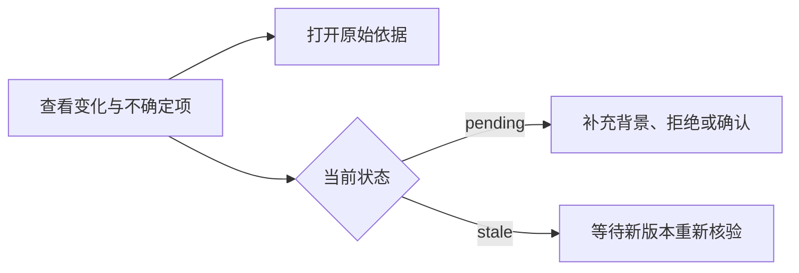

# 需要人工判断的变更处理页

该页面集中展示歧义、冲突或影响较大的变更提案，让用户查看变化与原始依据后选择确认、拒绝或要求补充背景；同时阻止提交来源已变化的旧判断，并在每次操作后刷新列表。

来源：gpt-5.6-sol 分析，gpt-5.6-sol 独立复核；模型解释仍可被原始证据纠正。

## 只把需要判断的变化交给用户

页面接收上层传入的判断列表，定位为处理歧义、冲突和较大影响的入口，而不是所有变化的流水账。顶部明确说明每次动作都有独立回执，并且来源变化或判断过期后不会沿用旧批准；没有待处理项时，也会提示高置信、小范围变化可自动生效。参考 [待判断页面定位 ↗](../../../apps/web/src/DecisionsView.vue#L58 "支持页面只面向歧义、冲突和较大影响变化，以及旧批准不会沿用的说明。") [无待判断项提示 ↗](../../../apps/web/src/DecisionsView.vue#L141 "支持高置信小范围变化自动生效、其余变化进入人工判断入口的产品边界。")

## 从理解提案到提交选择

每项提案先显示人读标题、状态、有效期和已有处理回执，再展开动作、对象、影响数量、结构化正文及不确定项。证据列表可向上层发出 `open` 事件，以查看对应原始片段；若状态为 `stale`，页面明确告知原件已更新，并且不再提供提交按钮。参考 [提案信息展示 ↗](../../../apps/web/src/DecisionsView.vue#L65 "支持页面展示状态、有效期、回执、变化详情和不确定项的描述。") [依据与失效提示 ↗](../../../apps/web/src/DecisionsView.vue#L111 "支持证据片段可被打开，以及来源更新后旧判断不可提交的说明。")

只有 `pending` 状态显示三种动作，因此已确认、已拒绝、过期或失效记录仍可阅读，但不能再次从此页提交。参考 [待处理动作入口 ↗](../../../apps/web/src/DecisionsView.vue#L122 "支持只有 pending 状态展示补充背景、拒绝和确认应用三种操作。")

## 提交协议与界面边界

提交时，组件把动作、提案摘要、随机生成的请求标识和操作者标识发送到对应判断接口。成功后展示与动作匹配的通知并要求上层刷新；失败时上报错误，也会刷新，以便以服务端最新状态为准。`finally` 会清除当前加载标识。参考 [判断提交流程 ↗](../../../apps/web/src/DecisionsView.vue#L28 "支持请求字段、成功与失败通知、刷新列表及清理加载状态的核心流程。")

加载状态由“判断 ID + 动作”组成，只标识具体按钮；材料未显示页面级互斥、服务端幂等实现或摘要冲突的响应规则。布局方面，变化摘要在宽屏使用三列，窄于 700px 时改为单列，长回执和 JSON 内容允许换行或滚动。参考 [窄屏与长内容适配 ↗](../../../apps/web/src/DecisionsView.vue#L149 "支持三列摘要在窄屏切换为单列，以及 JSON、回执长文本的显示边界。")
