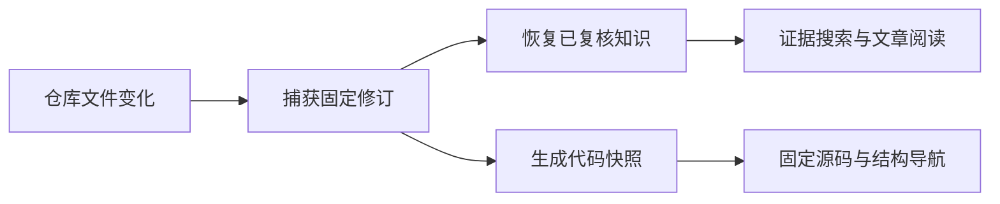

# 仓库知识的捕获、追溯与阅读服务

repo-review 将仓库文件作为统一记忆系统的输入，以稳定来源和不可变修订保存原文，在此基础上恢复已复核文章、生成代码结构投影，并通过本地 HTTP 服务提供证据检索、关系追踪和固定快照阅读。当前实现面向单用户本地场景；生成式代码理解须显式配置，结构分析与人工关系均保留明确的能力边界。

来源：gpt-5.6-sol 分析，gpt-5.6-sol 独立复核；模型解释仍可被原始证据纠正。

## 让仓库评审回到统一证据链

仓库评审不是另一套事实系统：适配器只把文件转换为捕获输入，分析仍由通用知识流水线完成。仓库相对路径构成稳定来源身份，同一路径修改会追加不可变修订，内容摘要仅用于检测变化。参考 [仓库适配器职责 ↗](../../../apps/server/src/review/materials.ts#L1 "支持仓库文件只是统一知识流水线的输入，而非独立事实系统。") [稳定来源与修订身份 ↗](../../../apps/server/src/review/sync.ts#L1 "支持以仓库相对路径维持来源身份，并以内容摘要检测修订变化。")

评审 Store 复用通用捕获与检索能力，但数据库和资源位于独立运行目录，不接触个人工作区状态、密钥及无关 worker。参考 [评审存储隔离 ↗](../../../apps/server/src/review/store.ts#L1 "支持评审运行复用通用 Store，同时隔离个人数据库、worker 与密钥。") 这种隔离仍是本地单用户边界；底层 SQLite 明确未提供团队级租户权限执行。参考 [单用户存储边界 ↗](../../../apps/server/src/store.ts#L4 "支持当前 SQLite 为单用户基础、团队级权限执行尚未实现的限制。")

## 从工作树变化到可回看的知识

同步器结合 Git 基线和工作树变化选择增量或全量目标；捕获后重建人工关系，脏工作树或文件失败时不推进基线。参考 [增量捕获与基线推进 ↗](../../../apps/server/src/review/sync.ts#L940 "支持 Git 差异选择、文件捕获、关系重建以及脏树或失败时不推进基线的同步流程。") 知识恢复会重新接入用户回答与仓库材料，并在回答尚未进入文章依赖时登记失效，因此“回答已保存”不等于“正文已重核对”。参考 [知识恢复与回答失效 ↗](../../../apps/server/src/review/knowledge.ts#L9 "支持恢复用户回答和文章，并区分回答已保存与知识已完成重核对。")

搜索先限定当前修订、删除状态和分类，再交给统一关键词或语义检索器。参考 [证据搜索过滤 ↗](../../../apps/server/src/review/app.ts#L290 "支持搜索在统一检索前按当前修订、删除状态和分类筛选候选片段。") 源码阅读则使用代码快照绑定的固定文本；历史快照不会混入实时工作树内容，未捕获文件也不会被猜测性补全。参考 [固定快照源码 ↗](../../../apps/server/src/review/app.ts#L400 "支持源码接口读取快照绑定的不可变文本并拒绝不可用或越界范围。")

## 把代码结构连接到需求与验证

代码投影只读取捕获链中的当前固定修订，并以仓库、提交、脏状态和内容摘要形成可复用快照。参考 [代码快照来源 ↗](../../../apps/server/src/code/sync.ts#L170 "支持代码分析只读取已捕获修订，并根据固定输入构造幂等快照。") 投影会登记文件、符号、导入、路由、测试和 Vue 组件关系；其中同文件名称级调用及组件使用只标为候选关系。参考 [代码结构投影 ↗](../../../apps/server/src/code/sync.ts#L250 "支持符号、导入、调用、路由、测试和 Vue 组件关系的具体投影及状态规则。")

人工关联种子进一步形成“代码片段→实现意图→需求、决策、调研、测试”的链路。定位失败时写入 `missing`，相似文本不会自动提升为确认关系；重复同步使用稳定种子身份更新同一批边。参考 [人工证据关系构建 ↗](../../../apps/server/src/review/sync.ts#L699 "支持从人工种子构建代码、意图、需求、决策、调研和测试关系，并保留定位失败项。")

派生文章恢复时必须具备模型生成与独立复核来源，且复核已经接受；原始材料摘要或子知识修订变化后，文章会标记为过期，而不会继续冒充当前结论。参考 [文章恢复与过期判定 ↗](../../../apps/server/src/knowledge/artifacts.ts#L40 "支持文章需要生成和独立复核来源，并在材料或子知识变化时标记过期。")

## 当前接口能力与实施边界

HTTP 层分别提供来源版本、修订、片段及关系读取，并提供经过候选过滤的证据搜索。参考 [材料与关系读取接口 ↗](../../../apps/server/src/review/app.ts#L195 "支持来源版本、修订、片段、片段关系、全局关系和代码关系的 HTTP 读取能力。") [证据搜索过滤 ↗](../../../apps/server/src/review/app.ts#L290 "支持搜索在统一检索前按当前修订、删除状态和分类筛选候选片段。") 代码侧提供仓库、快照、模块和文件列表，以及文件详情、符号、结构边、整图和固定源码区间。参考 [代码快照与文件目录 ↗](../../../apps/server/src/review/app.ts#L351 "支持仓库、快照、当前快照、模块分组和文件列表接口。") [源码、符号与结构图接口 ↗](../../../apps/server/src/review/app.ts#L390 "支持文件详情、符号、固定源码、结构边和整图读取能力。") 普通同步与代码同步都检查共享互斥状态，并按材料同步、知识恢复、代码投影的顺序执行。参考 [普通同步互斥流程 ↗](../../../apps/server/src/review/app.ts#L325 "支持普通同步检查共享状态，并依次执行材料同步、知识恢复和代码投影。") [代码同步互斥流程 ↗](../../../apps/server/src/review/app.ts#L607 "支持代码同步端点检查相同互斥状态并执行一致的处理顺序。")

生成式代码理解是显式可选能力：未配置模型时，确定性图谱和人工内容仍可读取；生成失败或校验拒绝不会成为当前结果。参考 [显式模型生成 ↗](../../../apps/server/src/review/app.ts#L579 "支持模型缺失时保留确定性能力，以及拒绝、传输失败和成功结果的不同处理。") 配置来自仓库文件或明确的环境变量覆盖，默认不读取个人配置，也不在启动时推理。参考 [仓库级模型配置 ↗](../../../apps/server/src/review/model-config.ts#L1 "支持模型配置的仓库来源、环境变量覆盖、默认关闭和启动时不推理。")

当前捕获切分依赖声明与测试用例正则，并非完整 AST 类型分析。参考 [正则片段边界 ↗](../../../apps/server/src/review/sync.ts#L210 "支持代码和测试材料依靠轻量正则切分，而非完整类型分析。") 调用关系只解析同文件名称命中并标为候选，确定性理解也明确记录“不做跨文件类型解析”。参考 [同文件候选调用 ↗](../../../apps/server/src/code/sync.ts#L311 "支持调用关系只在当前文件的名称映射中解析，并以 candidate 状态写入。") [跨文件类型限制 ↗](../../../apps/server/src/code/sync.ts#L419 "支持确定性理解明确记录调用解析仅为单文件名称级、不解析跨文件类型。") 无令牌模式依赖回环 Host 与浏览器 Origin，有令牌时校验 Bearer Token；它仍不能替代多租户授权。参考 [本地访问门禁 ↗](../../../apps/server/src/review/app.ts#L97 "支持令牌模式与无令牌时的回环 Host、浏览器 Origin 校验。")

还有两项一致性边界需要决策：文章目前依次写入运行期暂存目录和受版本控制目录，没有展示跨文件原子提交。参考 [文章双目录发布 ↗](../../../apps/server/src/review/knowledge.ts#L35 "支持文章当前分别写入运行期暂存目录和受版本控制目录的事实。") 当人工关联集合为空时，旧 seed 关系的失效函数会直接返回，可能保留最后一批旧关系。参考 [空关联集合失效分支 ↗](../../../apps/server/src/review/store.ts#L485 "支持有效关联集合为空时旧 seed 失效函数直接返回的边界判断。")
