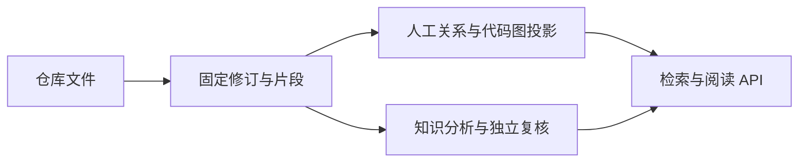

# 仓库评审知识的捕获、追溯与阅读服务

review 模块把当前仓库接入 omem 的统一证据链：安全捕获文件并保存不可变修订，恢复已复核知识，构建人工关系与代码结构投影，再通过本地 HTTP 接口提供检索、阅读、同步和显式模型生成能力。它复用通用 Store 与知识管线，但使用隔离的单用户 SQLite；派生文章和代码理解不能替代原始材料。

来源：gpt-5.6-sol 分析，gpt-5.6-sol 独立复核；模型解释仍可被原始证据纠正。

## 解决什么问题

review 模块让开发者能从“某段实现为什么存在”一路追到需求、决策、调研、测试和固定版本源码，同时继续使用 omem 的 Capture→Revision→Fragment 证据模型，而不是另建一套代码知识库。仓库适配器只负责生产材料，分析与复核仍进入通用知识管线；运行数据则放在隔离目录，不接入个人工作区、Lark、学习或通知运行时。参考 [仓库材料适配职责 ↗](eab8c2169e8c76fc3534c64c006ac7373914a463db40bfe73167df09c5d7040b.md#purpose_and_capture "说明 review 仅把仓库内容转换为通用知识材料，分析仍由共享知识管线完成。") [隔离评审运行时 ↗](../../../apps/server/src/review/store.ts#L1 "支持 review 复用通用 Store 与捕获能力、但使用独立运行目录且不接入个人工作区服务。")

对外服务提供材料浏览、证据搜索、关系查询、代码图、历史快照源码及知识阅读。默认只在回环地址运行；配置 token 时所有评审 API 都需鉴权，否则限制 Host 与浏览器 Origin。这个门禁适合本地单用户使用，但不能被理解为团队租户隔离。参考 [本地 API 门禁 ↗](../../../apps/server/src/review/app.ts#L97 "支持 token、回环 Host 和允许 Origin 的请求限制，并界定其只是本地访问边界。")

## 从仓库文件到可追溯知识

同步以仓库相对路径作为稳定来源身份，内容变化追加新修订；Git 失败会退化为全量扫描，脏工作树或文件失败时不推进基线。捕获本身在 Store 事务中写入来源、修订、片段、状态与变更记录，失败会回滚数据库写入。参考 [增量同步与收敛 ↗](a57f3cbe22aae80c80124eb0110c71ef27faafc8362e44e64de57e9ea8fb6239.md#incremental-sync "说明路径身份、真实快照、Git 失败退化以及脏状态和失败文件不推进同步基线。") [捕获事务 ↗](../../../apps/server/src/store.ts#L74 "证明来源、修订、片段及相关状态写入位于 Store 事务内，异常时执行回滚。")

全量同步随后重建人工关系、恢复文章并生成代码投影。人工 associations 先生成派生意图片段，再建立代码到意图以及意图到需求、决策、调研、测试的边；无法定位的目标保留为 `missing`，相似文本不会自动升级为确认关系。参考 [人工关系构建 ↗](../../../apps/server/src/review/sync.ts#L699 "支持代码到意图、再到原始需求和决策等材料的关系形状，以及 missing 和确定性重建语义。")

代码图只读取已捕获 head revision，不把实时工作树文本与旧片段混合；相同输入复用快照，变化后重投影符号和边。HTTP 源码接口也从 snapshot binding 读取固定文本，因而历史跳转不会悄悄显示当前文件。参考 [固定快照源码 ↗](../../../apps/server/src/review/app.ts#L400 "证明源码读取绑定快照捕获的固定文本，缺少绑定时不会回退实时工作树。")

## 知识恢复、检索与模型边界

已发布知识启动时会重新核对来源摘要和子知识依赖：来源变化时标记过期，缺少生成或独立复核来源时拒绝，子知识尚不可用时保留为缺失。用户回答先作为手工材料保存；若文章依赖尚未吸收该回答，则登记待重核对，而不是把“回答已入库”当成“正文已更新”。参考 [知识恢复与重核对 ↗](15f285fa320add5672a7274e4ed7ac4151012203819b90c2674963fbaa830241.md#restore-flow "说明用户回答、文章恢复和依赖变化如何影响当前知识状态。")

搜索先筛选当前 head、类别及 removed 状态，再交给关键词或语义检索排序，因此不可见材料不会在 top-N 之后才被剔除。仓库路径权重只会保持或降低默认权重；显式类别、历史调研意图或查询中直接出现路径时恢复中性权重。参考 [证据搜索前置过滤 ↗](../../../apps/server/src/review/app.ts#L290 "支持搜索先确定 eligible 当前材料，再调用统一检索并应用仓库路径权重。")

代码理解模型默认关闭，原始代码图和策展 seed 仍可使用。只有仓库配置或显式覆盖提供 ACP、CLI、HTTP 传输后，生成接口才运行；模型不可用返回 503，生成失败不会提升为当前有效理解。参考 [显式模型生成 ↗](../../../apps/server/src/review/app.ts#L579 "说明模型默认关闭、生成入口显式启用，以及不可用和失败结果的 HTTP 边界。")

## 当前进展与限制

当前模块已经串起增量捕获、不可变修订、知识恢复、关系查询、代码快照、固定源码、搜索与显式生成入口，形成可运行的本地评审切片。代码图可确认文件内名称级调用：只有被当前文件局部符号表解析到的调用才写为 `candidate`；跨文件 import 只解析相对路径，尚不能据此获得类型级跨文件调用图。参考 [调用边解析范围 ↗](../../../apps/server/src/code/sync.ts#L311 "证明调用关系只在单文件局部名称表中解析，成功后仍以 candidate 状态保存。")

仍有若干实现边界：关系种子的运行时校验较宽，未知状态会落为 `confirmed`；有效种子集合为空时，旧种子关系不会被批量标为 stale；关系汇总又把 stale 与真正 missing 合并统计。文章发布则依次写运行时暂存目录和可提交目录，材料中没有原子提交或补偿机制。参考 [关系生命周期限制 ↗](a0ff0c9b065f1a0d127f0c3eaab43d101b474dfb5ea36ed4af18f3d54bbae9d3.md#relation-lifecycle "支持空种子集合不失效旧边，以及关系汇总将 stale 归入 missing 的当前限制。") [文章双目录发布 ↗](../../../apps/server/src/review/knowledge.ts#L35 "证明文章先后写入运行时暂存目录和可提交目录，附近实现未展示原子事务。")

此外，当前基础是单用户 SQLite，团队权限执行仍待后续迁移；语义检索只有显式启用时才启动中文 embedding 服务，运行时资源由应用关闭钩子统一释放。参考 [检索资源选择 ↗](../../../apps/server/src/retrieval/factory.ts#L14 "支持默认关键词检索、显式启用语义检索及其独立关闭流程。")
