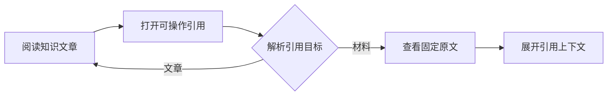

# 个人知识库的阅读与证据追溯

Web 端把知识目录、文章阅读、固定引用解析、原始材料核查和待确认事项串成连续阅读链路，并复用共享 Trail 保存多层证据路径。当前主要边界是目录轮询竞态、同文章章节切换、超长路径恢复，以及问题操作的服务端闭环仍待验证。

来源：gpt-5.6-sol 分析，gpt-5.6-sol 独立复核；模型解释仍可被原始证据纠正。

## 从主题目录进入知识正文

个人知识库作为主应用的一项独立视图接入，与学习、判断和日常助理等页面通过根组件切换，适合先浏览结论、再沿引用核查依据。参考 [主应用知识库入口 ↗](../../../apps/web/src/App.vue#L688 "支持个人知识库作为主应用视图接入，并与其他功能页面通过根组件切换。")

首页在宽屏采用左侧目录、右侧正文的双栏布局，窄屏改为上下排列；目录支持主题、功能和全部文章分组，也可按标题、摘要与文章键筛选。参考 [知识库双栏布局 ↗](../../../apps/web/src/knowledge/KnowledgeHome.vue#L29 "支持目录与正文的双栏模板、文章分组入口以及窄屏改为上下布局。") 文章目录在挂载后加载并每十五秒刷新，选中项保存在当前浏览器会话中。参考 [目录加载与定时刷新 ↗](../../../apps/web/src/knowledge/KnowledgeHome.vue#L12 "支持文章分组、筛选、会话选择恢复、目录加载及十五秒轮询，并揭示目录请求没有代次保护。")

正文呈现摘要、知识时效、分节 Markdown、页内目录和待确认问题。参考 [知识正文与章节定位 ↗](../../../apps/web/src/knowledge/KnowledgeDocument.vue#L11 "支持正文请求的代次保护、章节定位、分节渲染、页内目录和待确认问题入口。") 章节键受共享合同约束，只允许字母开头以及字母、数字、下划线和连字符，因此目录定位不需要处理引号等选择器字符。参考 [章节键格式合同 ↗](../../../packages/contracts/src/knowledge.ts#L25 "支持章节键仅允许字母、数字、下划线和连字符，从而排除目录选择器中的特殊字符风险。")

## 从文章论断回到固定原文

正文只为可操作引用创建导航帧，并携带文章修订和引用键。参考 [可操作引用导航 ↗](../../../apps/web/src/knowledge/KnowledgeDocument.vue#L20 "支持仅对可操作引用创建携带文章修订和引用键的导航帧。") 引用帧先展示关系与理由；目标不可用时显示原因，可用时再进入另一篇文章或原始材料。参考 [固定引用解析与分流 ↗](../../../apps/web/src/knowledge/KnowledgeFrame.vue#L12 "支持引用请求的代次保护、关系理由展示、不可用提示以及文章和材料目标分流。")

原文视图区分当前版本和历史版本。代码材料围绕引用行展示窗口并可上下扩展，Markdown 保留连贯全文，图片随材料显示；存在知识解读时还可返回文章。参考 [固定原文阅读 ↗](../../../apps/web/src/knowledge/KnowledgeSource.vue#L17 "支持材料请求竞态隔离、版本状态、代码引用窗口、Markdown 全文、图片及知识解读入口。") 请求层按需附加会话令牌、统一转换接口错误，并能把文章键、修订和章节序列化进阅读帧。参考 [知识请求与文章帧 ↗](../../../apps/web/src/knowledge/api.ts#L5 "支持会话令牌、统一错误处理，以及文章键、修订和章节的帧序列化。")

## 多层证据轨迹与待确认事项

个人知识页面把当前文章和证据轨迹写入地址片段，并在刷新或地址变化后恢复知识、引用和来源三类帧；共享抽屉负责压栈、回退、层级跳转、循环提示与关闭后的焦点归还。参考 [个人知识深链 ↗](../../../apps/web/src/knowledge/PersonalKnowledge.vue#L8 "支持当前文章与证据轨迹的 URL 保存和恢复、共享抽屉交互及超长路径提示。") Trail 以 `kind + id` 联合识别循环，渲染栈不会静默截断；`MAX_TRAIL` 的 200 层限制只约束 URL 持久化。参考 [共享证据轨迹合同 ↗](../../../packages/ui/src/trail.ts#L16 "支持可序列化帧、200 层 URL 预算、联合身份循环检测和不截断的压栈行为。") 现有测试验证了十二层连续压栈、五层钻取和返回已有层级的循环定位。参考 [深层导航测试 ↗](../../../apps/web/src/codewiki/trail.test.ts#L21 "支持十二层链不被截断、五层钻取及返回已有层级的循环定位。")

材料无法确定的事项会留在文章阅读现场，界面展示疑问原因、下一步和当前状态，并提供“补充背景”与“加入待办”操作。参考 [待确认问题界面 ↗](../../../apps/web/src/knowledge/KnowledgeQuestions.vue#L18 "支持在阅读现场展示问题状态、原因、下一步以及补充背景和加入待办入口。") 前端提交成功后会显示提示并重新加载问题列表；但这只能证明请求和界面反馈，不能单独证明服务端已完成材料保存、重核对或待办持久化。参考 [问题提交与刷新处理 ↗](../../../apps/web/src/knowledge/KnowledgeQuestions.vue#L11 "支持补充背景和加入待办的前端请求、成功提示、编辑状态清理及问题列表重新加载。")

## 当前行为边界

文章、引用和材料加载都用递增代次阻止较慢的旧响应覆盖当前内容。参考 [知识正文与章节定位 ↗](../../../apps/web/src/knowledge/KnowledgeDocument.vue#L11 "支持正文请求的代次保护、章节定位、分节渲染、页内目录和待确认问题入口。") [固定引用解析与分流 ↗](../../../apps/web/src/knowledge/KnowledgeFrame.vue#L12 "支持引用请求的代次保护、关系理由展示、不可用提示以及文章和材料目标分流。") [固定原文阅读 ↗](../../../apps/web/src/knowledge/KnowledgeSource.vue#L17 "支持材料请求竞态隔离、版本状态、代码引用窗口、Markdown 全文、图片及知识解读入口。") 目录轮询没有同类保护，慢请求可能与下一轮刷新重叠；正文监听项也只有文章键和修订号，仅改变章节参数不会再次触发定位。参考 [目录加载与定时刷新 ↗](../../../apps/web/src/knowledge/KnowledgeHome.vue#L12 "支持文章分组、筛选、会话选择恢复、目录加载及十五秒轮询，并揭示目录请求没有代次保护。") [知识正文与章节定位 ↗](../../../apps/web/src/knowledge/KnowledgeDocument.vue#L11 "支持正文请求的代次保护、章节定位、分节渲染、页内目录和待确认问题入口。")

轨迹超过 200 层时，屏幕中的完整阅读栈仍会保留，但页面停止改写 URL，因此复制出的链接可能落后于当前状态。参考 [个人知识深链 ↗](../../../apps/web/src/knowledge/PersonalKnowledge.vue#L8 "支持当前文章与证据轨迹的 URL 保存和恢复、共享抽屉交互及超长路径提示。") 现有实现和测试尚未覆盖第 200、201 层以及刷新后的恢复结果。参考 [共享证据轨迹合同 ↗](../../../packages/ui/src/trail.ts#L16 "支持可序列化帧、200 层 URL 预算、联合身份循环检测和不截断的压栈行为。") [深层导航测试 ↗](../../../apps/web/src/codewiki/trail.test.ts#L21 "支持十二层链不被截断、五层钻取及返回已有层级的循环定位。") 问题操作是否具备服务端幂等、真实持久化和重核对触发，也需要结合端点实现及端到端行为继续确认。参考 [问题提交与刷新处理 ↗](../../../apps/web/src/knowledge/KnowledgeQuestions.vue#L11 "支持补充背景和加入待办的前端请求、成功提示、编辑状态清理及问题列表重新加载。")
