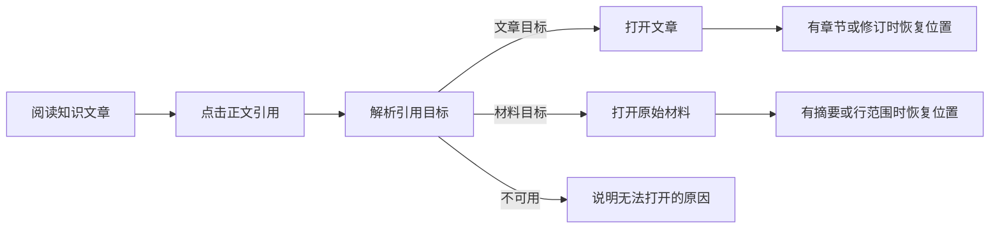

# 个人知识库的阅读与证据追溯

个人知识库把主题浏览、文章阅读和原文核对连成一条流程：读者可按分类或搜索找到文章，沿引用进入解析接口能够定位的文章或材料，并在接口提供修订、章节或行范围时恢复相应位置。系统会提示过期、不可用和待核对事项，同时区分当前阅读状态与可分享链接的持久化边界。

来源：gpt-5.6-sol 分析，gpt-5.6-sol 独立复核；模型解释仍可被原始证据纠正。

## 从主题目录进入知识文章

个人知识库首先解决“文章多了以后如何找到并继续阅读”的问题。页面把文章组织成主题目录，也允许输入关键词搜索；搜索会结合服务端结果与本地标题、摘要匹配，并取消已经过时的请求，避免快速修改查询时旧结果覆盖新结果。参考 [主题导航与搜索流程 ↗](../../../apps/web/src/knowledge/KnowledgeHome.vue#L70 "支持知识库按主题浏览、发起防竞态搜索并合并远程与本地匹配结果的说明。")

选中文章后，正文页展示标题、摘要和分节内容；章节较多时提供篇内目录。若原始材料已经变化，页面会明确标记文章等待更新，同时说明引用仍指向写作时使用的版本，让“正文是否最新”和“证据能否复核”成为两个可辨认的状态。参考 [文章正文与篇内目录 ↗](../../../apps/web/src/knowledge/KnowledgeDocument.vue#L12 "支持文章分节呈现、过期提示、引用入口和响应式篇内目录，并说明章节定位的触发条件。")

## 从结论逐层返回文章与原文

正文中的可操作引用不会直接替换主页面，而是生成一个引用阅读帧。引用解析后先展示关系类型和引用理由；目标不可用时给出原因，可用时则按目标类型打开文章或原始材料。解析结果提供修订、章节、材料摘要或行范围时，视图才会进一步定位到对应版本、章节或行段。参考 [引用解析与条件定位 ↗](../../../apps/web/src/knowledge/KnowledgeFrame.vue#L12 "支持引用的等待、失败和不可操作状态，并证明文章修订、章节、材料摘要与行范围仅在解析结果提供时才会被透传。")

引用解析结果中的修订、摘要、章节和行号都是可选字段，组件只会透传实际存在的信息。参考 [引用解析与条件定位 ↗](../../../apps/web/src/knowledge/KnowledgeFrame.vue#L12 "支持引用的等待、失败和不可操作状态，并证明文章修订、章节、材料摘要与行范围仅在解析结果提供时才会被透传。")

原文视图会标明当前版本或历史版本。代码材料可围绕给定行范围显示摘录，并允许向上、向下扩展上下文；Markdown 材料保持连贯正文，内部链接只有在存在精确映射时才继续导航，不会凭相似名称猜测目标。参考 [原始材料的上下文阅读 ↗](../../../apps/web/src/knowledge/KnowledgeSource.vue#L11 "支持材料版本标记、代码摘录扩展、Markdown 连贯渲染和内部链接精确映射，并揭示行范围处理边界。")

## 证据栈、返回路径与分享边界

页面入口把知识首页与共享证据抽屉组合起来：文章选择保留在主页面，引用、文章和原文则作为独立帧进入证据栈。入口向抽屉提供当前帧、返回、层级跳转、关闭、循环提示和焦点目标，并用 `KeepAlive` 保留已打开帧的组件实例。参考 [知识首页与证据抽屉装配 ↗](../../../apps/web/src/knowledge/PersonalKnowledge.vue#L28 "支持主页面与证据栈并存，以及入口向共享抽屉传递返回、跳转、关闭和焦点目标等交互合同。")

循环判断使用 `kind + id` 作为联合身份，因此不同种类但标识相同的对象不会被误认为同一帧；压栈实现会保留长链。`MAX_TRAIL` 限制的是写入地址栏的路径长度，而不是正在阅读的内存栈：超过预算时阅读仍可继续，只是不再保存完整深链接，并向读者显示提示。参考 [证据栈身份与深度预算 ↗](../../../packages/ui/src/trail.ts#L37 "支持按 kind 与 id 联合检测循环、压栈保留长链，以及 MAX_TRAIL 仅约束 URL 持久化的说明。")

入口可以从 `#/knowledge/` 地址恢复文章和受支持的证据帧，并过滤其他帧类型。由此，预算以内且能被解析的地址可以恢复阅读路径；损坏地址如何降级，以及抽屉内部如何逐层恢复滚动位置，仍取决于这里未提供的共享解析器和抽屉实现。参考 [阅读路径保存与恢复 ↗](../../../apps/web/src/knowledge/PersonalKnowledge.vue#L8 "支持知识文章和证据帧写入地址、超长路径提示，以及恢复时过滤受支持帧类型的行为。")

## 待核对事项与当前能力边界

文章可以把材料不足以确认的事项保留在“待核对与后续调查”区域。读者既可补充背景，也可将建议步骤加入待办；补充内容会作为原始材料保存并等待重新核对，而不是直接覆盖知识正文。参考 [待核对问题的处理入口 ↗](../../../apps/web/src/knowledge/KnowledgeQuestions.vue#L11 "支持问题状态展示、补充背景、加入待办，以及回答保存为原始材料后等待重新核对的流程。")

当前前端还能确认几项边界：文章的初始章节定位只随文档或修订重新加载发生；引用定位中的修订、摘要、章节和行号在类型上均可选，最终精度依赖解析接口实际返回的数据；原文的反向行范围可能产生空摘录。页面因此能够提供可追溯阅读主链，但不能仅凭这些组件断言所有引用都具备完整固定定位，也不能确认抽屉已经实现逐层滚动与展开状态恢复。参考 [文章正文与篇内目录 ↗](../../../apps/web/src/knowledge/KnowledgeDocument.vue#L12 "支持文章分节呈现、过期提示、引用入口和响应式篇内目录，并说明章节定位的触发条件。")、[引用解析与条件定位 ↗](../../../apps/web/src/knowledge/KnowledgeFrame.vue#L12 "支持引用的等待、失败和不可操作状态，并证明文章修订、章节、材料摘要与行范围仅在解析结果提供时才会被透传。")、[原始材料的上下文阅读 ↗](../../../apps/web/src/knowledge/KnowledgeSource.vue#L11 "支持材料版本标记、代码摘录扩展、Markdown 连贯渲染和内部链接精确映射，并揭示行范围处理边界。")
