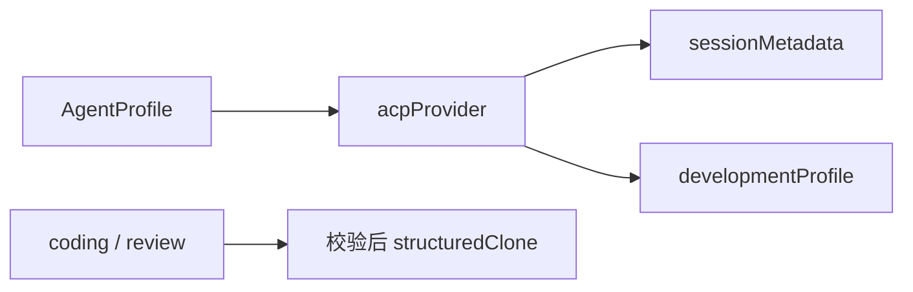

# ACP Provider 识别、会话隔离与开发配置冻结

该模块把统一的 AgentProfile 翻译成 provider 身份、ACP 会话元数据和开发执行配置，并在任务入队前校验、深拷贝 coding/review 配置，避免外部修改影响已创建任务。

来源：gpt-5.6-sol 分析，gpt-5.6-sol 独立复核；模型解释仍可被原始证据纠正。

## 统一配置如何识别 Provider

模块解决的是同一种 `AgentProfile` 面向 TraeX、Codex、Claude 三类 ACP 适配器时的差异化处理。`acpProvider` 先排除非 ACP transport，再优先采用显式 `acpProvider`；未声明时只取 `command` 的文件名、移除末尾 `.exe`，兼容 `traex`/`traecli`、`codex-acp` 与 `claude-agent-acp`。包装脚本因此应显式声明 provider，未知命令会得到 `null`。参考 [Provider 身份识别 ↗](../../../apps/server/src/agent-providers.ts#L4 "支持 ACP transport 门槛、显式 provider 优先级以及旧命令名兼容规则。")

身份判定由 `sessionMetadata` 和 `developmentProfile` 分别调用 `acpProvider` 来复用。参考 [会话元数据复用身份识别 ↗](../../../apps/server/src/agent-providers.ts#L15 "支持 sessionMetadata 调用 acpProvider 选择元数据分支。") [开发配置安全转换 ↗](../../../apps/server/src/agent-providers.ts#L43 "支持 developmentProfile 复用 acpProvider，以及 ACP 限制、Claude/Codex 参数约束、TraeX 参数清理和未知 provider 报错。")

`freezeDevelopmentProfiles` 则对 coding、review 两个角色分别调用 `developmentProfile` 做入队前校验，再深拷贝二者。参考 [配置校验与深拷贝 ↗](../../../apps/server/src/agent-providers.ts#L81 "支持 review 默认值、双角色校验、保留真实 profile 身份并深拷贝原始配置的结论。")

## 会话元数据按适配器隔离能力

`sessionMetadata` 为 Claude 返回 `claudeCode.options`：清空原生工具，只允许 `mcp__omem__*`，不读取设置源，启用严格 MCP 配置并禁用 hooks 与跳过权限；Codex 返回空对象，由其专属会话装配负责配置；其他情况保留旧式 Trae 元数据，只传 profile 的 skills，并把 MCP server 列表置空。参考 [会话元数据分支 ↗](../../../apps/server/src/agent-providers.ts#L17 "支持 Claude 的工具与设置隔离、Codex 空元数据及旧式 Trae 元数据结构。")

运行时创建 ACP 会话时把 `sessionMetadata(profile)` 放入 `newSession` 的 `_meta`。参考 [会话元数据注入 ↗](../../../apps/server/src/agents.ts#L331 "证明运行时把 sessionMetadata(profile) 的结果放入 newSession 请求的 _meta。")

同一 provider 判定还决定 Codex 是否需要专属环境准备，再用该环境启动进程；因此这套模块与调用点共同构成统一 profile 到具体适配器协议的翻译层。参考 [Codex 专属环境准备 ↗](../../../apps/server/src/agents.ts#L129 "证明运行时依据 provider 为 Codex 准备专属环境，并使用该环境启动进程。")

## 开发任务的只读参数与配置快照

`developmentProfile` 只接受 ACP。Claude、Codex 要求启动参数为空，因为模型和思考强度通过会话协商；TraeX 会移除 `--yolo` 及已有的 `sandbox_mode=...` 配置对，再在参数最前写入 `sandbox_mode="read-only"`，其他参数保持顺序。未知 provider 直接报错。参考 [开发配置安全转换 ↗](../../../apps/server/src/agent-providers.ts#L43 "支持 developmentProfile 复用 acpProvider，以及 ACP 限制、Claude/Codex 参数约束、TraeX 参数清理和未知 provider 报错。")

**教学示例**：输入 TraeX profile，参数为 `--yolo -c sandbox_mode="danger-full-access" acp serve`，转换结果保留身份及其他字段，参数变为 `-c sandbox_mode="read-only" acp serve`。这是执行配置；`freezeDevelopmentProfiles(coding, review)` 只用转换函数做合法性校验，随后深拷贝原始 profile，不保存上述改写结果。review 缺省时复用 coding，两个角色的真实身份不会被重命名。参考 [配置校验与深拷贝 ↗](../../../apps/server/src/agent-providers.ts#L81 "支持 review 默认值、双角色校验、保留真实 profile 身份并深拷贝原始配置的结论。")

开发队列在入队时冻结配置；运行任务时再次调用 `developmentProfile` 得到 coding/review 的实际安全配置，所以后续修改原对象不会改变快照，而只读改写发生在执行边界。参考 [入队前冻结配置 ↗](../../../apps/server/src/development/queue.ts#L182 "证明开发队列在创建任务时调用 freezeDevelopmentProfiles 生成角色配置快照。") [执行前生成有效配置 ↗](../../../apps/server/src/development/runner.ts#L304 "证明运行阶段保存缺省快照后，再分别调用 developmentProfile 生成 coding/review 执行配置。")
