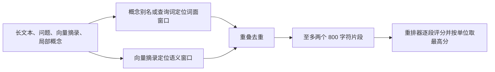

# 长代码单元的局部重排窗口

解释统一检索如何从长文本中保留向量命中与词面命中窗口，以中文概念别名连接英文代码操作，并把至多两个连续片段交给可选重排器评分。

来源：gpt-5.6-sol 分析，gpt-5.6-sol 独立复核；模型解释仍可被原始证据纠正。

## 为什么需要局部窗口

`rerankPassages` 解决的是**候选已经找对，但长代码后半段没有进入重排模型**的问题。它自身不计算相关性分数，只从一个检索单位中返回连续原文片段；不超过 800 字符时直接返回全文，较长文本才选窗口，而且完整检索单位仍可供后续阅读。参考 [窗口选择职责 ↗](../../../apps/server/src/retrieval/rerank-passages.ts#L3 "支持函数只为长单位选择局部片段、短文本直接返回全文且完整单位仍可阅读的说明。")

在生产链路中，统一检索先融合词面、向量和符号候选；只有配置了可选重排器且存在命中时，才从前 40 个候选调用本函数，并把片段加上最多 160 字符的单位背景送入模型。参考 [统一检索调用入口 ↗](../../../apps/server/src/retrieval/unified.ts#L544 "支持可选重排器的启用条件、前 40 个候选、概念行范围过滤和片段背景拼接。")

## 一条代表性调用怎样处理

以“怎样修改有效记忆，提案从什么入口写入？”为例：输入是一段很长的代码、一个位于开头的向量摘录，以及把中文概念“原子写入记忆或事项”绑定到 `applyTask`、`applyMemory` 的局部概念。查询先经中文分词和停用词过滤；显式代码符号会从普通查询词中移除，避免仅因函数签名出现就总选开头。参考 [查询词处理 ↗](../../../apps/server/src/retrieval/relevance.ts#L1 "说明中文分词、ASCII 词提取、停用词和短中文复合词的生成规则。") [符号与普通词分离 ↗](../../../apps/server/src/retrieval/rerank-passages.ts#L13 "支持显式代码符号从普通查询词中移除，避免方法名支配词面窗口的论断。")

概念只有在其标签或别名与查询词相交、且英文别名确实出现在正文时才成为锚点；否则退回普通查询词。词面窗口由 `bestSnippet` 选择覆盖查询词最多的位置。向量摘录则必须能在原文中精确找到，窗口会向前补最多 120 字符。参考 [概念别名锚点 ↗](../../../apps/server/src/retrieval/rerank-passages.ts#L17 "支持局部概念与查询相交后提取别名，并要求别名实际存在于正文。") [词面片段选择 ↗](../../../apps/server/src/retrieval/relevance.ts#L88 "解释 bestSnippet 如何枚举词项位置并选择覆盖查询词最多的连续窗口。")

两个窗口若对较短窗口的覆盖达到 75%，只保留一个；否则同时返回。统一检索随后按候选单位取最高片段分，将其作为展示摘录，并以 70% 重排分与 30% 原融合分组成新分数。参考 [窗口定位与去重 ↗](../../../apps/server/src/retrieval/rerank-passages.ts#L34 "支持向量摘录精确定位、向前补上下文、800 字符截取和 75% 重叠去重规则。") [逐单位最高分聚合 ↗](../../../apps/server/src/retrieval/unified.ts#L577 "支持片段分别评分、每个单位保留最高分，以及 70/30 分数融合和最佳摘录回填。")

## 边界与修改入口

这套选择最多读两个局部片段，并不等于理解整篇长文。`denseExcerpt` 不是原文的精确子串时会被忽略；没有可用概念锚点时依赖查询词，连查询词也为空则词面选择自然落到开头。短文本不会产生多窗口。正式概念还由调用方按当前原文行范围过滤，因此别处定义的别名不会自动影响这个单位。参考 [统一检索调用入口 ↗](../../../apps/server/src/retrieval/unified.ts#L544 "支持可选重排器的启用条件、前 40 个候选、概念行范围过滤和片段背景拼接。") [窗口定位与去重 ↗](../../../apps/server/src/retrieval/rerank-passages.ts#L34 "支持向量摘录精确定位、向前补上下文、800 字符截取和 75% 重叠去重规则。")

行为验证覆盖了两类实际结果：长方法尾部的 `commitReservation` 能进入模型输入并成为返回摘录；中文问题也能借局部概念找到远离通知文字的 `applyTask` / `applyMemory`。若要调整窗口长度、向量前置上下文或重叠阈值，修改本函数；若要调整候选数、模型输入背景、最低重排分或融合比例，则修改统一检索的调用与聚合逻辑。参考 [长方法尾部示例 ↗](../../../apps/server/tests/retrieval-unified.test.ts#L734 "验证长方法尾部的提交调用进入重排输入，并成为带固定完整行范围的返回结果。") [中文概念桥接示例 ↗](../../../apps/server/tests/retrieval-unified.test.ts#L794 "验证中文查询通过局部概念别名定位到远处英文写入操作。")
