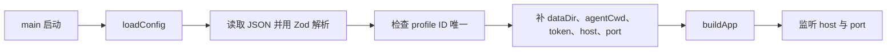

# 服务启动配置的校验与装配

说明 omem 如何把个人 JSON 配置与部署环境变量合并为统一运行时配置，并沿服务启动链分派给存储、检索、Agent、学习任务和网络监听。

来源：gpt-5.6-sol 分析，gpt-5.6-sol 独立复核；模型解释仍可被原始证据纠正。

## 统一配置边界解决什么问题

`config.ts` 是服务端的统一配置边界：把较稳定的产品能力放在 JSON 中，包括至少一个 Agent profile、通知策略、可选检索、允许采集的根目录、后台学习和飞书开关，并为多数可选项补默认值。顶层、学习、飞书和外部通知对象采用严格校验，能在启动早期拒绝未知字段；通知时间还限制为 `HH:mm` 和有效 IANA 时区。参考 [配置结构与默认值 ↗](../../../apps/server/src/config.ts#L6 "支持 JSON 配置覆盖的能力、默认值、严格对象校验以及通知时间和时区约束。")

Agent profile 的具体合同复用共享 `profileSchema`，其中约束传输方式、命令、模型、上下文上限和超时，而不是在服务配置里再维护一套格式。参考 [Agent 配置合同 ↗](../../../packages/contracts/src/index.ts#L158 "说明 profile 的传输方式、命令、模型、上下文和超时由共享合同定义。")

## 一条代表性的启动调用

以直接启动服务为例，输入是当前目录、JSON 文件和 `OMEM_*` 环境变量：

入口先调用 `loadConfig`，再把结果完整传给 `buildApp`，最后用其中的地址监听。参考 [服务启动入口 ↗](../../../apps/server/src/main.ts#L1 "证明 main 明确调用 loadConfig、将结果传给 buildApp，并使用 host 与 port 启动监听。") `loadConfig` 优先读取 `OMEM_CONFIG` 指向的文件，否则尝试 `omem.local.json`；候选文件不存在时改读示例配置，随后解析 JSON、应用 schema 默认值并拒绝重复的 profile ID。参考 [配置文件读取与唯一性检查 ↗](../../../apps/server/src/config.ts#L95 "支持候选配置文件选择、示例回退、JSON 与 schema 解析及 profile ID 去重流程。")

输出不是原始 JSON，而是可直接运行的 `Config`：函数创建数据目录，派生 Agent 工作目录，并叠加令牌、监听地址和端口。参考 [运行时字段装配 ↗](../../../apps/server/src/config.ts#L107 "支持数据目录创建、Agent 工作目录派生及令牌、地址、端口的环境变量覆盖与默认值。") `buildApp` 再把它分派给 Store、ACP 助理、检索工厂和学习管线；启用学习却找不到指定 profile 时，应用构建会终止。参考 [配置分派到运行组件 ↗](../../../apps/server/src/app.ts#L58 "支持配置被 Store、Agent、检索和学习管线消费，以及学习 profile 缺失时终止构建。")

## 默认降级与修改边界

检索配置缺省或 `enabled=false` 时，后续工厂明确返回关键词检索；开启后才创建语义检索，并按需加载重排器。因此修改 `retrieval` 改变的是检索实现选择，不是配置文件读取方式。参考 [检索实现选择 ↗](../../../apps/server/src/retrieval/factory.ts#L10 "说明检索配置关闭或缺省时使用关键词检索，开启时创建语义检索并可选重排器。")

部署相关值应通过环境变量修改：默认数据目录为 `.omem`、地址为 `127.0.0.1`、端口为 `4317`。非回环地址没有令牌时，`buildApp` 会拒绝启动。参考 [运行时字段装配 ↗](../../../apps/server/src/config.ts#L107 "支持数据目录创建、Agent 工作目录派生及令牌、地址、端口的环境变量覆盖与默认值。") [远程监听安全门槛 ↗](../../../apps/server/src/app.ts#L55 "支持非回环监听必须同时配置访问令牌这一启动约束。") 两个边界值得留意：显式指定但不存在的配置路径仍会回退到示例文件；`OMEM_PORT` 在这里仅经过 `Number(...)`，没有有限数或端口范围校验，错误值会继续交给监听层处理。JSON 语法错误、schema 不匹配和重复 profile ID 则会在返回配置前直接抛错。参考 [配置文件读取与唯一性检查 ↗](../../../apps/server/src/config.ts#L95 "支持候选配置文件选择、示例回退、JSON 与 schema 解析及 profile ID 去重流程。") [运行时字段装配 ↗](../../../apps/server/src/config.ts#L107 "支持数据目录创建、Agent 工作目录派生及令牌、地址、端口的环境变量覆盖与默认值。")
