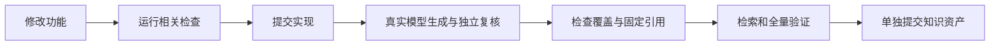

# omem 统一记忆与仓库知识实施约定

本文说明 omem 如何把个人记忆、可追溯问答、主动事项和仓库知识纳入同一证据体系，并规定知识生成、独立复核、检索验收、阅读交互及提交边界。文档同时强调：调研或计划不等于已实现，实际进展仍需结合状态文档和运行验证判断。

来源：gpt-5.6-sol 分析，gpt-5.6-sol 独立复核；模型解释仍可被原始证据纠正。

## 解决的问题与能力边界

omem 面向个人记忆与助理场景，希望统一承接文本、图片、链接及上下文信息，使问答、事项跟进和未来学习卡都能追溯到原始证据。代码分析需要 AST 特化，但仍属于统一知识体系，不能演变成独立的代码知识库；文档还特别提醒，调研方案不能直接写成已实现能力。参考 [统一记忆目标 ↗](../../../AGENTS.md#L3 "支持 omem 的目标、AST 特化仍归属统一知识体系，以及调研不等于实现的边界说明。")

系统采用 personal-first 取向，但架构需保留团队扩展空间。当前文档明确把 SQLite 与共享令牌方案界定为单用户实现，不能宣称已有租户隔离。原始修订与片段身份应保持稳定，派生答案不是新的独立证据；捕获更新进入队列也不代表复核结果已经成功应用。参考 [单用户与证据边界 ↗](../../../AGENTS.md#L8 "支持当前单用户实现、通用捕获输入、稳定修订及队列成功不等于应用成功等约束。")

## 从功能修改到知识验收

`.repo-review` 既是仓库知识应用，也是功能验收材料。涉及捕获、AST、知识生成、引用、检索或助理运行的修改，需要先验证并提交实现，再更新受影响的知识资产并单独提交，避免产品代码前进而仓库知识持续过期。参考 [仓库知识验收职责 ↗](../../../AGENTS.md#L16 "说明 repo-review 是实际应用和验收材料，并要求实现提交与知识资产提交分离。")

生成必须经过真实 ACP 模型调用并保留 verifier 与运行 trace；手写 seed、fixture 或单独 AST 同步不能替代模型验证。覆盖状态需区分 reviewed、stale、pending 和 failed，失败不得覆盖旧的有效历史。语义检索还要更新索引并通过真实 HTTP 查询检查中文问法是否回到当前原始材料。参考 [生成与验证流程 ↗](../../../AGENTS.md#L21 "支持真实 ACP 生成、独立复核、覆盖状态检查、语义检索及全量验证的阶段要求。")

## 统一运行时与发布边界

Code Wiki 被定义为统一 Capture→Source/Revision/Fragment 链上的派生视图，而不是第二套产品。通用知识处理复用既有 pipeline、角色运行网关和 jobs；repo-review 只承担仓库输入适配与验收配置，并把仓库材料和已复核文章幂等接入个人库。参考 [统一知识运行时 ↗](../../../AGENTS.md#L28 "支持 Code Wiki 作为统一证据链派生视图、复用通用处理流程以及 repo-review 的适配器定位。")

前端 DTO 必须把内部标识与人类可读标签分开：标识可用于路由和深链，却不能直接显示；缺失或过期目标应禁用操作并给出可读原因。数据库和临时产物留在忽略目录，明确生成的文章、覆盖记录与索引才可发布。当前还存在跨文件调用不解析、跨修订符号与片段身份不续接等限制，因此代码变化后需要重新同步定位。参考 [界面数据与同步限制 ↗](../../../AGENTS.md#L30 "支持内部标识不可见、发布数据边界，以及跨文件调用和跨修订身份续接尚未实现等限制。")

## 证据阅读、引用与关系表达

知识正文遵循“分析原始材料—独立复核—组织模块或主题”的流程，并要求引用紧贴所支持的论断。模型负责选择定位范围，宿主复制固定原文，独立角色再核对语义支持性；仅验证引用位置存在，并不等于论断已经获得语义证明。无法确认的事项应保留为有证据依据的调查项。参考 [知识复核与内联引用 ↗](../../../AGENTS.md#L40 "支持材料分析、独立复核、内联固定引用及不确定事项保留为调查项的流程。")

阅读体验以完整文章、功能目录和页内导航为主，原始 Markdown 连贯呈现，代码引用默认展示固定行并允许按需展开。关系状态明确区分 confirmed、candidate 与 missing；无法解析的目标必须记为 missing，历史知识虽可保留阅读，但缺失证据时应禁用引用并说明原因，不能计作当前复核通过。参考 [关系状态与阅读原则 ↗](../../../AGENTS.md#L47 "支持关系状态的严格表达，以及完整文章优先、缺失证据禁用引用和历史知识不计当前通过的规则。")
