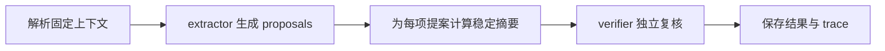

# 抽取与复核角色的真实模型冒烟流程

该脚本以固定上下文串联真实 ACP 模型选择、extractor 抽取和 verifier 独立复核，并保存结果与运行轨迹，用于验证角色运行链路能否端到端执行；它不负责应用提案，也没有业务级正确性断言。

来源：gpt-5.6-sol 分析，gpt-5.6-sol 独立复核；模型解释仍可被原始证据纠正。

## 验证真实角色链路能否运行

该脚本解决的是“角色协议通过单元测试后，真实 Agent CLI、配置和结构化输出能否协同工作”的问题。它加载服务配置，要求存在 `traex` profile，再读取并按合同解析固定示例上下文；配置缺失、上下文 JSON 无效或不符合 schema 时会直接失败。参考 [配置与上下文加载 ↗](../../../scripts/live-role-smoke.ts#L10 "支持脚本要求 traex 配置并按合同解析固定示例上下文的说明。")

它属于**在线冒烟检查**而非离线 fixture 测试：模型由 ACP 实际暴露的选项中选择，可用环境变量指定；请求模型不存在时明确报错。参考 [实时模型选择 ↗](../../../scripts/live-model.ts#L4 "说明脚本通过 ACP 探测可选模型，并拒绝不可用的显式模型请求。")

## 先抽取，再对提案独立复核

核心流程分为两阶段：

同一个 `RoleRuntimeGateway` 先以 `extractor` 运行；随后脚本复制原上下文，换用新的任务标识和 `verifier` 角色，并把抽取提案连同稳定摘要放入 `candidates`。摘要为复核对象提供确定性标识，但材料没有显示 verifier 如何判定内容真伪。参考 [抽取与复核串联 ↗](../../../scripts/live-role-smoke.ts#L22 "支持 extractor 先生成提案、脚本计算摘要并构造 verifier 上下文的流程。")

网关声明了提案、评估、知识与引用回答等输出 schema，并在运行轨迹中记录角色版本、上下文指纹、实际模型、推理强度、会话和修复次数，因此脚本保存的 trace 可用于追查一次真实运行采用了什么配置。参考 [网关输出与运行轨迹 ↗](../../../apps/server/src/agent-runtime/gateway.ts#L25 "说明网关支持的结构化输出类型及 trace 中记录的可追溯字段。")

## 产物、失败边界与未覆盖行为

运行完成后，脚本把抽取和复核的 `result`、`trace` 以及生成时间写入报告；默认位置为 `.omem/verification/live-role-smoke.json`，也可由环境变量覆盖。目录和文件分别使用受限权限创建，并把相同摘要输出到标准输出。参考 [冒烟报告写入 ↗](../../../scripts/live-role-smoke.ts#L48 "支持报告内容、默认路径、权限设置和标准输出行为的说明。")

该脚本没有断言提案数量、复核结论或语义质量，也没有把通过复核的内容交给 apply 流程；其成功标准仅是两次网关调用、结构解析和报告写入未抛错。因此它能证明真实链路“可运行”，不能单独证明抽取正确、复核可靠或变更已应用。参考 [脚本执行边界 ↗](../../../scripts/live-role-smoke.ts#L43 "完整后半段只保存并输出两阶段结果，没有语义断言或应用提案的步骤，支持对覆盖边界的判断。")
