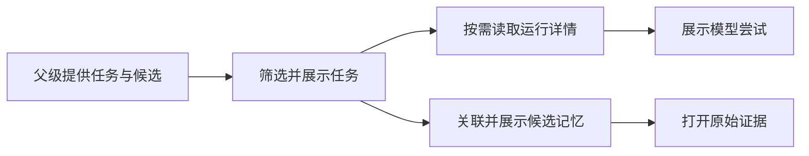

# 查看与控制材料处理任务

该页面把后台材料提炼任务转换为可读的状态、结果与操作入口：用户可以筛选任务、查看模型尝试和候选记忆、回到原始证据，并对可取消或可重试的任务发出控制请求。

来源：gpt-5.6-sol 分析，gpt-5.6-sol 独立复核；模型解释仍可被原始证据纠正。

## 解决什么问题

`LearningView` 是材料保存之后的处理观察页。它接收任务、候选记忆、来源列表以及后台处理开关状态，把内部任务种类和状态翻译为中文，帮助用户判断材料是否仍在排队、已经处理、需要人工判断或发生失败。页面也明确区分“原文已保存”和“模型已处理”，避免把尚无模型尝试的排队任务误认为完成。参考 [页面用途与处理状态 ↗](../../../apps/web/src/LearningView.vue#L81 "支持页面用于解释材料提炼流程、后台状态以及未启用自动处理时行为的论断。")

组件本身不负责提炼记忆：任务数据由父级通过 props 提供，刷新、打开证据和错误则通过事件交回上层处理；UI 控件来自共享组件库。参考 [组件输入与上层事件 ↗](../../../apps/web/src/LearningView.vue#L2 "说明任务等数据来自 props，刷新、证据打开和错误通过 emit 交给上层，并展示共享 UI 与 API 依赖。")

## 从任务列表到候选记忆

页面先按用户选择过滤任务，并默认只显示前 40 条；“显示更多”每次增加 40 条。每张任务卡根据材料标题、来源匹配或任务类型生成可读标题，再展示状态、结果摘要、错误和更新时间。参考 [筛选与任务摘要 ↗](../../../apps/web/src/LearningView.vue#L17 "支持任务筛选、标题回退、结果摘要和分页展示行为。")

展开“运行详情与尝试记录”时，页面才请求 `/jobs/{id}`，并按任务 ID 缓存详情。随后列出每次模型尝试的模型、effort、结果和错误；若没有尝试，会明确提示这不代表成功。任务关联的候选记忆通过 `origin.job_id` 匹配，展示状态、操作、影响数量、策略原因和原证据入口。参考 [详情请求与候选关联 ↗](../../../apps/web/src/LearningView.vue#L55 "支持按需获取任务详情，以及通过任务 ID 关联候选记忆的流程。")

参考 [尝试记录与证据入口 ↗](../../../apps/web/src/LearningView.vue#L110 "支持流程图中详情展开、模型尝试展示、候选记忆展示及打开原证据的关系。")

## 控制能力与边界

任务控制受状态约束：排队、已领取、运行中、等待重试或等待判断的任务可取消；失败或已取消的任务可重新处理。请求携带当前 `generation` 和随机 `requestId`，成功后通知父级刷新，失败则上报错误；`busy` 只记录一个任务 ID，因此界面一次只会把对应任务按钮显示为加载中。参考 [取消与重试控制 ↗](../../../apps/web/src/LearningView.vue#L169 "支持不同任务状态对应取消或重试操作，以及按钮加载状态的论断。")

页面不会自行启用自动处理，也不会在后台未运行时启动服务；即使自动处理关闭，原文保存与检索仍可继续。当前材料只能证明它调用统一的 `api` 客户端并依赖共享的 `Source` 类型，无法确认服务端如何校验 generation、实现幂等或限制任务总量。参考 [控制请求参数 ↗](../../../apps/web/src/LearningView.vue#L65 "支持控制请求携带 generation 和 requestId、成功刷新及失败上报错误的论断。")，延伸阅读：[来源类型合同 ↗](../../../apps/web/src/api.ts#L9 "补充说明页面依赖 API 模块提供的 Source 数据结构，但该片段未提供服务端控制语义。")
