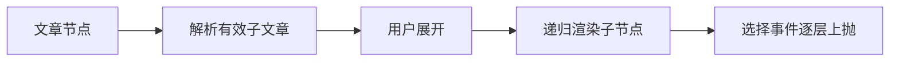

# 可展开的知识文章导航树

该组件把文章之间的 children 关系递归呈现为可展开导航树，支持当前文章高亮、待更新提示与循环关系防护，并将用户选择统一上抛给父级页面。

来源：gpt-5.6-sol 分析，gpt-5.6-sol 独立复核；模型解释仍可被原始证据纠正。

## 把文章关系变成可操作的目录

组件解决的是知识文章较多时的层级浏览问题：它接收当前节点、完整文章列表、已选文章以及祖先路径，再依据文章的 `children` 键找到可展示的子文章。节点本身不负责加载数据或切换页面，只提供导航交互；文章元数据中的标题、当前状态和子节点键构成了它的显示基础。参考 [树节点输入与子项解析 ↗](../../../apps/web/src/knowledge/KnowledgeTree.vue#L4 "支持组件依据当前文章、文章集合、选中项和祖先链解析有效子节点的说明。")，延伸阅读：[文章元数据结构 ↗](../../../apps/web/src/knowledge/api.ts#L2 "说明树组件依赖的 ArticleMeta 包含 children、标题和 current 等导航展示字段。")

## 展开、选择与递归渲染

有子节点时，行首显示带 `aria-expanded` 的展开按钮；展开后，组件为每个子文章递归渲染自身，并把当前节点加入 `ancestors`。子节点发出的 `select` 事件会逐层转发，最终只携带文章键交给外层处理。选中项通过 `aria-current="page"` 和样式高亮，非当前版本则显示“待更新”。参考 [节点展开与选中交互 ↗](../../../apps/web/src/knowledge/KnowledgeTree.vue#L23 "支持展开按钮的无障碍状态、文章选择事件、选中高亮语义和待更新提示。")

该流程对应组件的展开、递归和事件转发实现。参考 [递归渲染与事件转发 ↗](../../../apps/web/src/knowledge/KnowledgeTree.vue#L41 "支持展开后递归创建子节点、累积祖先路径并逐层转发选择事件的流程。")

## 循环防护与展示边界

子节点解析会排除当前文章自身以及祖先链中已经出现的键，因此能阻止直接自引用和沿当前递归路径形成的循环；找不到匹配文章元数据的键也会被忽略。这个保护只作用于当前渲染路径，并不负责修复底层关系数据。每个实例的展开状态独立且初始关闭；组件没有自动展开选中项、异步取数、错误提示或键盘方向键导航逻辑。样式侧重窄栏阅读：标题可换行、点击区域至少 44 像素，层级通过缩进和左边线表达。参考 [循环与缺失节点过滤 ↗](../../../apps/web/src/knowledge/KnowledgeTree.vue#L11 "支持自引用、祖先循环和无法匹配的子文章不会进入递归渲染的边界说明。")、[树形导航视觉规则 ↗](../../../apps/web/src/knowledge/KnowledgeTree.vue#L54 "支持点击区域尺寸、层级边线、长标题换行和选中项视觉反馈的说明。")
