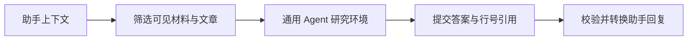

# 助手自主调查的可见性与证据闸门

该文件把通用 Agent 研究环境适配为日常助手可用的受控调查：先按会话可见性构造材料快照，再把 Agent 提交的行号引用还原为固定版本证据，同时约束事项操作与纯研究模式，最终产出带可追溯证据的助手回复。

来源：gpt-5.6-sol 分析，gpt-5.6-sol 独立复核；模型解释仍可被原始证据纠正。

## 为什么需要这一层

`prepareAssistantResearch` 位于助手运行时与通用研究环境之间。上层传入知识仓库、临时工作区、检索配置和本轮助手上下文；它先计算当前会话允许看见的材料，把可用材料按 key 建表，并连同已发布文章交给 `prepareAgentResearch`。因此，这一层不负责判断答案内容，而是规定 Agent **能研究哪些材料、提交结果后必须通过哪些助手规则**。无 fragment 的材料只在私有会话中纳入；有 fragment 的材料则要求全部 fragment 可见。参考 [可见材料与研究环境 ↗](../../../apps/server/src/assistant/research.ts#L45 "支持函数输入、默认可见性规则、材料全 fragment 过滤、文章列表及通用研究环境装配的说明。")

## 一条代表性调用如何得到可追溯回复

以“原来的评审时间是什么？”为说明性输入：上层把问题及会话可见性放入 `context`，本函数创建受控研究环境；Agent 可提交材料 key、可选历史 revision 和精确行范围。校验器先确认短引用编号不重复、材料属于本轮授权集合；若指定旧版，还要求它与当前材料同源且整版可见，再把行范围转换成 `AssistantEvidence`。参考 [提交引用的授权校验 ↗](../../../apps/server/src/assistant/research.ts#L97 "支持引用编号去重、授权 key 检查、历史版本同源与可见性检查，以及转换为证据对象的流程。")

行范围转换会拒绝越界或倒序范围，也会拒绝无法完全落在可见 fragment 中的引用；成功时记录固定 revision、材料 key、原文文本、source target，并选择覆盖该范围的最小章节标题。参考 [行范围证据转换 ↗](../../../apps/server/src/assistant/research.ts#L14 "支持范围合法性、fragment 可见性、最小覆盖章节和固定版本证据字段的说明。")

## 输出约束、边界与模块关系

提交结果先经过 `assistantReplySchema`。创建事项与更新事项不能同时出现；`reschedule` 必须同时携带真实截止时间及原时间表达，`snooze` 则要求检查时间等于延后时间且清空 `waiting_on`。这防止模型把“稍后提醒”和“修改截止日期”混为一谈。参考 [事项操作约束 ↗](../../../apps/server/src/assistant/research.ts#L75 "支持互斥事项操作以及 reschedule 与 snooze 的不同字段约束。")

正文中的每个短引用标记都必须能映射到已验证原文；纯 `research` 模式禁止携带事项操作。随后 `parseAssistantReply` 把临时引用编号换成内部证据定位，`researchedEvidence` 再按 citationId 去重后随回复返回。参考 [正文引用与研究模式输出 ↗](../../../apps/server/src/assistant/research.ts#L118 "支持正文引用必须有定位、研究模式禁止事项操作、回复转换及证据去重返回的说明。")

模块关系上，仓储负责当前与历史材料，`sourceAnchor` 和 `materialSections` 负责原文定位，`prepareAgentResearch` 提供通用快照与工具环境，助手合同及 `parseAssistantReply` 负责输入输出形状。这里的明确限制是**整份材料可见性门槛**：部分 fragment 可见不会让该材料进入研究集合；历史版本也不能仅凭 key 越过同源与可见性检查。参考 [可见材料与研究环境 ↗](../../../apps/server/src/assistant/research.ts#L45 "支持函数输入、默认可见性规则、材料全 fragment 过滤、文章列表及通用研究环境装配的说明。")、[提交引用的授权校验 ↗](../../../apps/server/src/assistant/research.ts#L97 "支持引用编号去重、授权 key 检查、历史版本同源与可见性检查，以及转换为证据对象的流程。")
