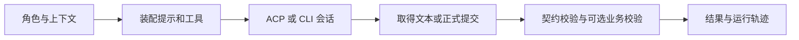

# 角色 Agent 的受控运行与结构化交付

RoleRuntimeGateway 是服务端角色执行的统一闸门：它装配角色包、上下文、技能和工具，选择 ACP 或 CLI 启动 Agent，并始终按角色输出契约解析结果；仅在适用身份字段存在时核对身份，调用方提供 validateOutput 时再执行引用等业务校验，成功后留下可追溯运行记录。

来源：gpt-5.6-sol 分析，gpt-5.6-sol 独立复核；模型解释仍可被原始证据纠正。

## 它解决什么问题

不同角色会产出知识、评审、提案或回答，调用方不能直接把一段模型文本当成有效结果。网关集中维护角色产物到 Zod schema 的映射，并以角色、运行配置和上下文作为统一执行输入；上层流水线最终接收同一种 `{ result, trace, bundle }`，不必分别处理各类 Agent 的传输细节。参考 [输出契约映射 ↗](../../../apps/server/src/agent-runtime/gateway.ts#L38 "说明网关集中维护不同角色产物对应的结构化校验 schema。") [统一运行输入 ↗](../../../apps/server/src/agent-runtime/gateway.ts#L291 "说明 run 接收角色、profile、上下文、工具、预算、可选业务校验和研究环境等统一输入。")

## 一次代表性调用如何完成

以知识写作者调用 `run({ roleId, profile, context, research })` 为例：网关加载角色包和预算，检查 profile、会话策略与受管工具，然后建立本次运行的独立工作区；自主研究模式还会准备研究环境，并把角色技能改为由原生环境加载。参考 [角色与研究环境装配 ↗](../../../apps/server/src/agent-runtime/gateway.ts#L307 "说明角色包加载、预算与能力检查、独立工作区以及自主研究环境的准备过程。")

每次尝试都会重新渲染提示并收集文本事件。ACP 可连接 MCP、技能和权限回调，CLI 接收拼接后的文本；自主研究则必须从研究环境取得正式提交。所有结果都会按角色 schema 解析；输出实际含有 `job_id` 或 `role_id` 时才核对相应身份，纠错提案另核对来源任务。只有调用方传入 `validateOutput` 时，才继续执行引用等业务校验。成功后网关生成包含模型、技能、工具、会话与指纹的 trace。参考 [会话执行分支 ↗](../../../apps/server/src/agent-runtime/gateway.ts#L391 "支持网关重新渲染提示，并按 profile 选择 ACP 或 CLI 执行会话。") [提交校验与运行轨迹 ↗](../../../apps/server/src/agent-runtime/gateway.ts#L477 "说明自主研究结果的取得、最终契约解析、可选 validateOutput 调用和成功 trace 的生成。") [契约与身份匹配 ↗](../../../apps/server/src/agent-runtime/gateway.ts#L254 "说明输出始终经过 schema 解析，而任务和角色身份只在相应字段存在时匹配，纠错提案另检查来源任务。")

## 可信指令与材料分层

`renderRolePrompt` 先确认上下文角色与角色包一致，把角色说明、内联技能、输出合同和筛选后的上下文索引组成可信区。文章、草稿、研究结果等派生内容不会拼入这部分，而是进入明确标为“不可信派生知识”的后续块；原始材料也逐项进入“不可信材料”块。这里实现的是提示结构与标签上的分层：材料被明确交给 Agent 作为待分析数据。图片还会检查 Base64、哈希、文件签名和总大小。参考 [可信提示构造 ↗](../../../apps/server/src/agent-runtime/gateway.ts#L134 "说明角色匹配、角色说明、内联技能、输出合同和可信上下文索引如何组成可信提示块。") [不可信材料块 ↗](../../../apps/server/src/agent-runtime/gateway.ts#L217 "支持派生知识与原始材料被放入单独标记的后续内容块，并说明图片及上下文预算检查。")

## 能力边界与失败处理

自主研究只支持 ACP；受管工具同样要求 ACP，CLI 遇到图片会拒绝。普通模式限制输入与输出预算，自主研究依赖 `submit_result` 完成交付。只有 `ROLE_OUTPUT_*`、JSON 语法或 Zod 校验错误会进入下一次修复尝试；中止及其他运行错误立即上抛。研究环境始终在 `finally` 中关闭，超过角色包规定的修复次数则以耗尽错误结束。参考 [传输与输出限制 ↗](../../../apps/server/src/agent-runtime/gateway.ts#L463 "说明 CLI 图片限制、自主研究正式提交要求和普通模式输出预算。") [修复重试与清理 ↗](../../../apps/server/src/agent-runtime/gateway.ts#L537 "说明可进入修复重试的错误范围、耗尽行为以及研究环境的最终关闭。")
