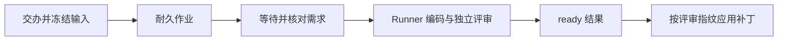

# 开发任务的持久编排与结果回流

DevelopmentQueue 把经过需求跟进的开发交办转成可恢复的后台作业，冻结项目、Agent 配置和外部输入，协调 DevelopmentRunner 完成编码与独立评审，并以评审指纹保护补丁应用。它也处理续办和需求变更重规划，并负责取消、结果捕获及负责人通知。

来源：gpt-5.6-sol 分析，gpt-5.6-sol 独立复核；模型解释仍可被原始证据纠正。

## 从需求交办建立可恢复任务

## 解决的问题

`DevelopmentQueue` 是需求跟进与编码运行器之间的持久编排层。调用方用需求 key、项目别名和操作者发起交办；队列先确认编码 Agent 已配置，项目和需求跟进页面也已登记，随后按请求 ID，或按同一需求与项目的活动任务去重。参考 [交办前置条件与去重 ↗](../../../apps/server/src/development/queue.ts#L200 "支持入队前验证 Agent、项目、需求跟进状态，并复用重复或活动任务的说明。")

入队时，它冻结项目配置和编码/评审 profile，整理会话与外部能力回执。读取失败的回执不作证据；读取成功的外部回执，队列会尝试将其捕获为材料。不支持的定位器、仅图片响应等情况导致捕获失败时，原始回执仍会保留，并记录 `materialError`。随后全部输入先导出到运行目录，再在同一数据库事务中创建耐久作业和开发任务记录。这样后台恢复时依赖的是已保存快照，不依赖临时聊天文件。参考 [输入冻结与事务入队 ↗](../../../apps/server/src/development/queue.ts#L224 "支持冻结配置、区分读取与捕获成功、保留捕获失败的原始回执，以及导出输入并原子创建作业和任务记录的流程。")

## 编码、评审与补丁应用

## 一次代表性调用

例如，`enqueue(requirementKey, "web", actor)` 返回任务记录后，周期处理器取得作业。执行器会等待需求文档具备当前版本和 requirement；已有运行则先核对需求基线。随后读取或创建 `DevelopmentRunner` 运行，把冻结的编码与评审 profile 交给 `execute`，同时传入续办指令和决策服务，并把过程消息写回任务表。运行结果为 `ready` 时，用户看到实现与独立评审摘要。参考 [需求等待与运行执行 ↗](../../../apps/server/src/development/queue.ts#L92 "支持 worker 等待有效需求、创建或恢复运行、调用编码与评审执行器并写回结果消息的说明。")

应用是单独的 `apply` 操作，必须同时具备 runId 和已评审指纹。运行器会按该指纹校验后应用；结果只保留为登记仓库中的未提交修改，不会推送或部署。参考 [评审指纹保护的应用 ↗](../../../apps/server/src/development/queue.ts#L77 "支持 apply 操作必须携带运行标识和评审指纹，以及只产生未提交修改的边界。")

## 续办、边界与生命周期

## 续办与变更收敛

续办只允许原任务的 principal 操作。任务仍在运行时，新指令会写入更新表，供后续协调器核对，但这不保证一定触发续办。已完成的补丁只有在 `ready` 状态且指纹一致时才能应用。普通续办会复用原有能力和交接资料，同时沿用 profile 与项目快照，并标记为重规划；补丁应用只尝试一次，避免文件系统失败后反复作用于可能已修改的仓库。参考 [续办与应用约束 ↗](../../../apps/server/src/development/queue.ts#L358 "支持操作者校验、活动任务暂存指令、指纹匹配、快照复用和应用单次尝试等续办规则。")

需求变更协调器只检查已经交办且可以继续的任务，跳过活动中、已取消、无运行或已应用的记录。它刷新知识仓库并比较需求修订；如果运行已是 `ready` 且没有真实需求变化，协调器会删除暂存更新，不调用 `continueTask`。其余情况下，只有检测到真实需求变化，或存在暂存指令且未落入前述分支，才会续办。单个旧需求出错只更新该任务消息，不阻塞其他任务。参考 [需求变更协调 ↗](../../../apps/server/src/development/queue.ts#L443 "支持候选任务筛选、需求修订比较、ready 且需求未变时清除暂存更新，以及其他分支中的自动或人工续办。")

取消会请求耐久 worker 停止活动作业，但保留现有代码和检查结果。轮询器每两秒至多处理一个作业。任务结束后，已有运行记录时才捕获开发结果；在此基础上，需求维护启用时才请求刷新需求页。无论是否建立运行记录，队列都会用 `notified` 条件更新保证结果只登记和通知一次。停止队列时会清理定时器、停止 worker，并等待正在执行的 promise 收尾。参考 [保留产物的取消 ↗](../../../apps/server/src/development/queue.ts#L511 "支持取消活动作业但保留已有代码与检查结果的行为。") [结果通知与队列启停 ↗](../../../apps/server/src/development/queue.ts#L524 "支持结果捕获及需求页刷新的条件、通知去重、两秒轮询、串行处理和停止时等待当前任务完成的说明。")
