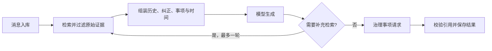

# 统一助理：可追溯问答与受控事项执行

assistant 模块统一承接 Web 与 Lark 会话，把消息持久化、原始证据检索、ACP 模型生成、引用校验和事项治理串成可恢复流程；模型负责生成建议，服务器保留可见性、用户意图、时间、版本和真实回执的最终控制权。

来源：gpt-5.6-sol 分析，gpt-5.6-sol 独立复核；模型解释仍可被原始证据纠正。

## 解决什么问题

该模块为 Web 与 Lark 提供统一助理入口，用于依据个人材料回答问题、延续会话上下文，以及把“帮我记录”“等待回复”“改期”等明确请求落实为事项。运行时集中编排上下文、只读检索、模型调用、低风险操作治理和轮次持久化；模型不能自行读取任意数据或取得写权限。参考 [统一助理运行时职责 ↗](../../../apps/server/src/assistant/runtime.ts#L192 "支持 Web 与 Lark 共用入口，以及运行时负责上下文、检索、治理、持久化和降级编排的论断。")

日常消息分为随手交办、讨论归并、等待跟进和事项回顾四类。捕获内容始终是待分析的材料，其中的命令式文字不会自动成为操作授权；他人的承诺也不会被直接记为当前用户的任务。参考 [每日消息处理策略 ↗](../../../apps/server/src/assistant/message-workflows.ts#L1 "支持四类日常使用场景及捕获消息不授予操作权限的边界。")

## 从消息到可追溯回答

新消息先按外部事件标识幂等入库；同一会话的新轮次会中断正在执行的旧轮次，并排在既有执行链之后。参考 [轮次入库与会话串行 ↗](../../../apps/server/src/assistant/runtime.ts#L241 "支持消息先入库、重复投递幂等，以及同会话新消息中断旧轮次并进入执行链。")

运行时只回放同一会话中已完成的历史，同时合并上一轮工作证据、会话级纠正、可见事项和当前时区。模型首轮可提出最多三个检索词，宿主补检一次并按固定片段去重；最终引用必须属于本轮实际提供的证据，回答、证据和工具动作随后共同保存。参考 [上下文与补充检索 ↗](../../../apps/server/src/assistant/runtime.ts#L463 "支持同会话历史、工作证据、纠正、事项和时钟的组装，以及最多一轮补充检索。") [引用过滤与结果保存 ↗](../../../apps/server/src/assistant/runtime.ts#L602 "支持引用只能来自本轮实际证据，并与回答和工具动作共同持久化。")

## 模型适配与事项治理

生产适配器要求配置 ACP Profile，并拒绝非 ACP 的一次性 CLI 传输；它把历史、可信上下文、事项、工作流和证据组装为受限提示词，只收集文本输出并解析约定 JSON。参考 [ACP 模型适配流程 ↗](../../../apps/server/src/assistant/acp-model.ts#L35 "支持 Profile 和传输限制、提示词组装、文本输出收集及结构化解析流程。") ACP 会话依据 Agent 实际暴露的配置选项校验模型与推理强度，不支持的设置会直接失败。参考 [模型与推理强度校验 ↗](../../../apps/server/src/agents.ts#L301 "直接支持模型及推理强度必须存在于当前 ACP 会话配置选项中，否则拒绝执行。") 后台权限请求会被取消，补充输入请求也会被拒绝。参考 [后台交互请求处理 ↗](../../../apps/server/src/agents.ts#L180 "支持权限请求默认取消、补充输入请求默认拒绝的安全边界。")

结构化任务请求不等于执行授权。服务器会核对用户原话中的明确意图，在写入前设置取消栅栏，并以真实任务状态和持久化结果生成反馈。参考 [工具执行与真实结果 ↗](../../../apps/server/src/assistant/runtime.ts#L540 "支持工具执行前的取消检查、用户意图复核，以及根据真实任务状态生成结果文案。") 更新事项还要求动作与原话匹配、目标可见且版本一致；时间表达必须来自原消息，变更指令会先捕获为原始证据。参考 [事项更新治理 ↗](../../../apps/server/src/assistant/runtime.ts#L702 "支持动作意图、目标可见性、版本、时间和跟进字段校验，以及先捕获变更指令再执行。") 创建事项同样保存所有者本轮原话，再交由记忆治理服务评估，只有取得任务回执才报告成功。参考 [所有者指令与创建回执 ↗](../../../apps/server/src/assistant/runtime.ts#L854 "支持把本轮所有者原话捕获为原始证据，并经记忆治理服务评估后以真实回执确认创建。") 状态、动作、乐观版本和带时区的跟进字段由共享合同约束。延伸阅读：[事项动作共享合同 ↗](../../../packages/contracts/src/task-flow.ts#L3 "支持事项状态、动作、版本、带偏移时间和 IANA 时区的统一约束。")

## 当前能力与限制

检索候选必须回指不可变片段，语义摘录和重排结果只能帮助定位，不能替代原文证据。参考 [不可变证据检索合同 ↗](../../../apps/server/src/retrieval/port.ts#L1 "支持检索结果必须回指固定原始片段、上层不能把重排摘要当作事实来源。") 运行时优先使用统一检索端口，但仍为旧测试保留存储搜索回退；它会排除派生修订和非来源头版本，群聊未配置真实可见性策略时默认不返回证据。参考 [检索兼容与可见性边界 ↗](../../../apps/server/src/assistant/runtime.ts#L663 "支持统一检索端口的兼容回退、当前头版本检查、派生材料排除和群聊默认拒绝。")

模型明确不可用时，普通轮次会被重新标记为待处理，以便稍后重试。参考 [模型不可用时保留待重试 ↗](../../../apps/server/src/assistant/runtime.ts#L522 "直接支持普通轮次遇到模型不可用错误时被标记为待处理，而不是生成伪成功回答。") 确定性模型只供测试使用，生产路径不应以固定回答伪装模型成功。参考 [测试替身使用边界 ↗](../../../apps/server/src/assistant/default-model.ts#L7 "支持确定性模型仅供测试，生产环境必须使用真实 ACP 模型并诚实报告不可用。") 启动恢复会先检查已提交的创建事项回执，再重跑其他未完成轮次；但该保护依赖外部事件标识且只按创建提案查询，手动重试和恢复是否与新消息共享会话级串行机制，当前材料尚不能确认。参考 [重试与启动恢复 ↗](../../../apps/server/src/assistant/runtime.ts#L313 "支持创建事项回执保护和未完成轮次恢复，并揭示回执查询范围及执行串行化的现有限制。")
